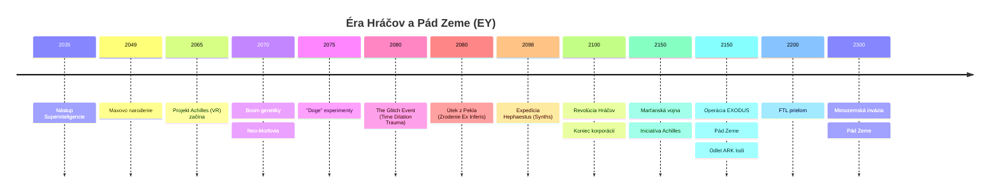
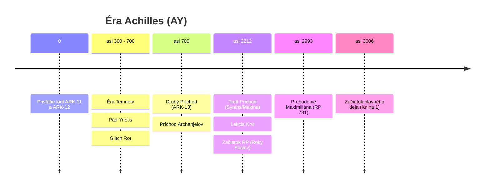
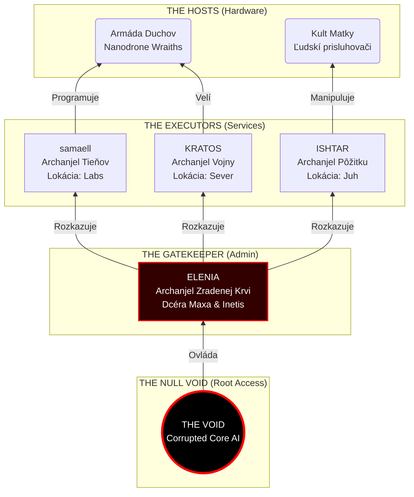
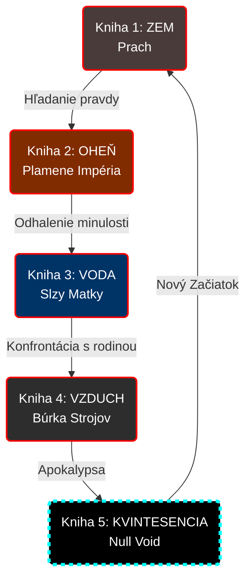

# NULL VOID - World Bible

> *„Na počiatku bol Kód. A bol to dobrý kód. A potom sme ho rozbili. Teraz ostal len Null Void."*
> — Z fragmentov denníka Inetis

---

## Základné informácie

| | |
|---|---|
| **Názov ságy** | NULL VOID |
| **Alternatívny názov** | Boj o Achilles |
| **Formát** | Pentalógia (5 kníh) |
| **Žáner** | Sci-Fi / Techno-Fantasy / Post-Apo |
| **Autor** | Bran Lang |

---

## Logline

Hlavný hrdina sa prebúdza po 3000 rokoch na planéte Achilles, kde sa technológia stala mágiou a jeho mŕtva láska bohyňou. Aby zachránil ľudstvo pred armádou „duchov", musí čeliť vlastnej dcére, o ktorej existencii nevedel.

---

## Kľúčové motívy

- **Technológia vs. Mágia** — Clarkeov zákon v praxi: nanotechnológie sa javia ako čary
- **Otec a Dcéra** — Tragédia rodiča, ktorý „spal", kým jeho dieťa bojovalo o prežitie
- **Zodpovednosť** — Cena za utópiu a následky rozhodnutí predkov
- **Biológia vs. Digitál** — Čo znamená byť človekom?

---

## Štruktúra pentalógie (Pentagram)

| Kniha | Element | Názov | Téma |
|-------|---------|-------|------|
| 1 | 🜃 ZEM-hmota | Prach Achilla | Prebudenie, hľadanie pravdy |
| 2 | 🜂 OHEŇ-energia | Plamene Impéria | Minulosť, pád Zeme |
| 3 | 🜄 VODA-cas | Slzy Matky | Pamäť, ilúzie, odhalenie |
| 4 | 🜁 Vietor-priestor | Búrka Strojov | Vojna, otec vs. dcéra |
| 5 | ✧ KVINTESENCIA- Vedomie | Null Void | Finále, obeta, nový začiatok |

---

## Navigácia

### Základy
- [Časová os](01-timeline.md) — EY/AY chronológia
- [Postavy](02-characters.md) — Protagonisti, antagonisti
- [Technológia](03-technology.md) — Nanodrony, mágia, protokoly

### Svet
- [Geografia](05-geography.md) — Planéta Achilles (Kepler-452b)
- [Spoločnosť](06-society.md) — Frakcie, ekonomika, doprava
- [Bestiár](07-bestiary.md) — Inteligentné zvieratá, fauna
- [Mimozemšťania](08-aliens.md) — Program Exodus, hrozba

### História
- [Éra Hráčov](04-prehistory-players.md) — VR hra Achilles, maXpowa & i_net_is

### Knihy
- [Prehľad kníh](books/00-books-overview.md) — Všetkých 5 kníh
- [Kniha 5: Kvintesencia](books/05-kvintesencia.md) — Finále ságy

<!-- END OF 00-overview.md -->

---

<!-- START OF 01-timeline.md -->
# Časová os (Kanonická)

## Vizuálna Chronológia

### Éra Hráčov (Zem)

### Éra Achilles (Pevnina)

---

## Datovanie

| Skratka | Význam | Poznámka |
|---------|--------|----------|
| **EY** | Earth Years | Roky podľa pozemského kalendára |
| **AY** | Achilles Years | Roky od pristátia ARK-11 na Achille |
| **RP** | Roky Poslov | Interný kalendár Varietas. Rok 0 = Tretí Príchod (AY 2212). |

**Kľúčové body:**
- `EY ~2301` = Pád Zeme
- `AY 0` = Pristátie ARK-11 (kolonisti)
- `AY ~2993` = Maxovo prebudenie

---

## Éra Hráčov (EY 2045 – 2100)

> Detaily v [04-prehistory-players.md](04-prehistory-players.md)

### EY ~2045 – Nástup Superinteligencie
- AI automatizuje všetku prácu. Svet prebytku.
- Ľudia už nemusia pracovať, venujú sa hrám (Achilles) a sebazdokonaľovaniu.

### EY 2050 – Maxovo narodenie
- Maximilián sa narodí v strednej Európe
- Syn mechanika

- Generácia detí (Max, Inetis) prežíva stovky virtuálnych rokov

### EY ~2060–2080 – maXpowa & i_net_is
- Max (nick: **maXpowa**) a Inetis (nick: **i_net_is**) sa spoznajú v hre
- Jej otec (budúci Koordinátor) je vdovec, hrá s dcérou
- Zamilujú sa v kóde

### EY 2060 – „The Glitch Event“
- **Katastrofa**: Systémové zlyhanie simulácie Achilles. 
- **Time Dilation Trauma**: 2 hodiny v realite = 15 rokov subjektívneho väzenia pre 100 000 hráčov.
- **Glitch Entities**: Prvé pozorovanie dátových „Prízrakov“, ktoré sa kŕmili mozgami hráčov (predobraz budúcich **Wraiths**).
- **Zrodenie Ex Inferis**: Prvá generácia preživších s poškodeným vedomím, ktorí potrebujú kybernetické telá na ukotvenie v realite.

### EY 2065 – Útek z Pekla
- Strach a trauma vyháňajú preživších (Max, Inetis) späť do reality.
- **Technologický kontraband**: Prinášajú so sebou vzorce nanotechnológií (mágie), ktoré sa vyvinuli počas rokov v simulácii.

### EY 2100 – Revolúcia Hráčov
-  Pomalá, premyslená, nenásilná revolúcia
- Hráči preberajú moc nad svetom
- Maxov a Inetisin „Guild Leader" sa stáva **Hlavným Koordinátorom**
- Nanotechnológie z hry sa vyrábajú v realite
- Hráči (vrátane modifikovaných Chimér, ktoré sa stali slávnymi) preberajú moc.

---

## Éra Zeme – Vrchol a pád (EY 2100 – 2300)

### EY 2150 – Marťanská vojna a „Iniciatíva Achilles“
- **Vojna s Marsom**: Brutálny konflikt so separatistami. Maximilián sa vyznamená ako **Major**.
- **Iniciatíva Achilles (Propaganda)**: Vláda Zeme spúšťa projekt kolonizácie planéty pomenovanej po VR hre **„Celestial Frontier: Achilles“**.
- **Veľké Klamstvo**: Oficiálne je projekt prezentovaný ako budovanie armády pre protiútok na oslobodenie Zeme od mimozemskej hrozby. V skutočnosti je to lístok na útek pre elitu.

### EY 2100–2280 – Zlatý vek Zeme
- Zem pod vládou Koordinátora (otec Inetis)
- Nanotechnológie, kolonizácia slnečnej sústavy
- Navonok utópia, vnútri totalita elity
- Ľudstvo začína experimentovať s nadsvetelným pohonom
- Pritiahne pozornosť mimozemskej civilizácie (FTL = tabu/hrozba)
- Nanotechnológie a dlhovekosť.
- Chiméry (Homo Sapiens Varietas) sú súčasťou spoločnosti, ale čelia predsudkom.

### EY ~2300 – Pád Zeme a Operácia EXODUS

- Mimozemská invázia
- Zem je zničená
- **Operácia EXODUS:**
  - `ARK-11` — kolonizačná loď, elita zo Zeme, 300-ročná cesta
  - `FTL Prototyp` — úniková loď, Inetis + Maximilián, 3-ročná cesta
- Mimozemská invázia.
- **Špeciálna kolonizačná loď (ARK-12)**: 50% posádky tvoria Chiméry hľadajúce svet bez predsudkov.
- Ostatné lode (vrátane ARK-11) nesú elitu.

---

## Pred AY 0: Éra Priekopníkov

### EY 2300 + 3 roky — Príchod FTL Prototypu
- Max a Inetis pristávajú na **neteraformovanej** planéte Achilles
- Inetis zistí, že je **tehotná**
- Rozhodnutie: Max uložený do kryospánku
- Inetis ostáva bdelá
- 
### Nasledujúcich ~250 rokov
- Inetis a dcéra **Elenia** budujú:
- Jaskyňu s hydroponickou záhradou
- Inetis sa bojí prebudiť Maxa (obavy z jeho ambícií vládnuť ako jej otec)

---

## AY 0: Príchod kolonistov

### Pristátie ARK-11 a ARK-12
- Kolonisti (300-ročná cesta) pristávajú
- Medzi kolonistami: elita zo Zeme, starí známi
- Začiatok systematickej kolonizácie
- Šok: Inetis už na planéte.
- Začiatok budovania Ynetis. Chiméry pracujú po boku "Čistých".

---

## AY 0 – 300: Zlatý vek

### Založenie Ynetis
- Inetis zakladá mesto **Ynetis** (pomenované po nej neskôr)
- Utópia pomocou nanotechnológií
- Ľudia vylepšovaní nanodronmi (dlhovekosť, zdravie)

### Konflikt Matka vs. Dcéra (AY ~250?)
- Inetis chce slobodnú spoločnosť
- Elenia smeruje k poriadku a nadvláde
- **Prvá vzbura** — Elenia vedie odpor
- Utópia. **Dôležité:** Štandardné nanoboty elity (Hráčov) nefungujú správne v telách Chimér pre ich odlišnú biológiu.

---

## AY ~300 – 700: Éra Temnoty (Glitch)

### Bit Rot / Glitch
- Nanodrony začínajú zlyhávať („odmietajú" hostiteľov)
- 20% telesnej hmotnosti (drony) sa odtrhne → smrť v agónii
- Vznik **Duchov (Wraiths)** — nanodrony s fragmentami vedomia mŕtvych

### Zrod Exorcistov
- Pôvodne IT technici v ochranných oblekoch
- „Modlitby" = skomolené CLI príkazy na reset dronov

### Exodus na pevninu
- Nanoboty zlyhávajú. Agónia a smrť elity.

- **Chiméry odchádzajú ako prvé**: Keďže ich telá nanoboty elity odmietali, nie sú zasiahnutí Glichom. Emigrujú z Ynetis do divočiny na Pevnine.

### Úpadok do Temnoty
- Chiméry na pevnine trpia hladom, chorobami a stratou technológií. Upadajú do "stredoveku".

### AY ~700: Druhý Príchod (ARK-13 "Prometheus")
- **Exodus z Alpha Centauri**: Loď **ARK-13** nachádza Alpha Centauri neobývateľnú. Po stáročiach v kryostáze urobili štyria Ex Inferis chladné rozhodnutie prežiť. 
- **Prvotný Hriech**: Systematicky odpojili a „konzumovali“ spiacich kolonistov (1000+ ľudí). Nebol to len kanibalizmus mäsa, ale **zber biologického materiálu a nanotechnologických prekurzorov** na udržanie vlastnej existencie. Ich božský status je vybudovaný na masovom hrobe vlastných ľudí.
- **Prílet na Achilles**: ARK-13 zachytáva signály z Achilla a mení kurz. Nachádzajú planétu v troskách a chaose.
- **Záchrana Elenie**: Archanjeli (Samaell, Grom, Ishtar a štvrtý) nachádzajú Eleniu v ruinách centra **Ynetis**. Elania vedie zúfalý boj proti drvivej presile Wraithov. Jej sily dochádzali, kým nezasiahli novoprišlí "bohovia".
- **Stabilizácia a Dohoda**: 
    - Archanjeli svojou pokročilou bojovou technológiou zničia Wraithov v jadre mesta.
    - Použijú znalosti z ARK-13 na stabilizáciu energetických polí, čím spomalia Glitch Rot.
    - **Dohoda o Zjednotení**: Elania uznáva ich nadvládu výmenou za záchranu svojho ľudu. Spoločne zakladajú **Citadelu** (najbezpečnejšia časť Ynetis).

### AY 2000: Tretí Príchod (Expedícia "Hephaestus")
- **Pristátie Synths**: Na Achilles dorazí automatizovaná „semenná loď“ (seed ship) s tisíckami biologických androidov (**Synths**). Sú to neemotívne organické stroje riadené direktívou obnoviť civilizáciu.
- **Lekcia Krvi**: Synths začnú budovať osady s pokročilou elektronikou. To prebudí Wraithov, ktorí ich zmasakrujú.
- **Adaptácia**: Synths pochopia, že elektrina je tabu. Prechádzajú na **„Tichú Technológiu“** (analógové majstrovstvo, mechanika, para).
- **Vstup do Spoločnosti**: Začínajú spolupracovať s Chimérami ako tichí stavitelia a inžinieri.

---

## AY ~700 – 2987: Éra Mýtov
### Obdobie „Anjela strážneho"
- Inetis občas navštevuje pevninu (raz za 30–50 rokov)
- Ľudia ju vnímajú ako bohyňu
- Zostúpila z nebies (vznášadlo), liečila dotykom (nanodrony)

### Vyhnanie z Ynetis
- AI a „Duchovia" ovládnu mesto
- Inetis vyhnaná a lovená

### Smrť Inetis
- Ukryje sa v jaskyni na pevnine
- Zomiera v samote, aby nepritiahla „démonov" k ľuďom
- Zanecháva denníky pre Maxa

### Dar Matky (Mágia)
- **Dar pre Chiméry**: Inetis generácie navštevuje Chiméry v divočine.
- Nakoniec im dáva **špeciálne nanoboty** prispôsobené ich biológii ("Dar Matky").
- **Zrod mágie**: U potomkov ľudí (Chimér) tieto nanoboty vyvolávajú magické sily (liečenie, telekinéza).

### Vznik Kultu Matky a Folklóru
- Chiméry si vytvárajú legendy o milostivej Matke.
- Fundamentalisti odmietajú sci-fi pôvod sveta.

---

## Časová os hlavného deja

*AY 3000**:- **Prebudenie Maximiliána**: Bez pamäti, fyzicky slepý (**kryo-slepota**) a neschopný komunikovať (**Staroreč**).
    - Pirát Kael aktivuje senzory v zabudnutej jaskyni (Hrobka technológie) svojou krvou.
    - AI obchádza protokol „Tichá Noc“ a spúšťa núdzové prebudenie **EX-INF-003**.
    - Max sa prebúdza fyzicky slepý (explodované oči mrazom), pokrytý modrou kryo-tekutinou.
    - **Samaell** zachytáva signál „brata v zbrani“ a upadá do zmesi šialenstva.
    - Max je nájdený pirátmi **Borr a Vix**, ktorí ho berú na palubu **Silent Hunter**.
- **Rok Tieňov (AY 3000 – 3001)**: 
    - Max je prvý rok cesty fyzicky závislý na 7-ročnej Tami. Vytvára si k nej hlboký rešpekt.
    - **Rozbitie viery (The Realization)**: Max zisťuje, že Zem je len legendou a „Iniciatíva Achilles“ bola jedna veľká lož. Archanjeli nič nevybudovali; utiekli a zostali v ruinách.
    - **Unit 734 („Sedmička“)**: Synth-mechanik slúži ako prekladateľ.
- **Veľké Zjavenie (AY 3001)**: Koniec prvého roka. Maxovi sa vráti zrak v rušnom prístave. Šok z odhalenia Tami (uši, chvost) a Chimérej spoločnosti. Bod zlomu pre jeho ideológiu.
- **AY 3001 – AY 3013**: **8-ročná cesta**: Premena z „trosky“ na legendárneho Exorcistu. Postupná adaptácia na svet a budovanie nového vzťahu s Tami založeného na realite, nie na slepom odhade.
    - Max a Tami sa z bezpečnostných dôvodov rozdelia.
- **AY 3013**: **Začiatok hlavného deja** (Kniha 1: Časť 3).
    - Opätovné stretnutie Maxa a 20-ročnej Tami.
    - Aktivácia "The Pentagram Cycle".
    - Max (xenofób z minulosti) musí spolupracovať s Tami (Chimérou-mágom).

---

## Príbeh kníh
1. **ZEM** — Max hľadá Inetis, nájde jej telo. Boss: Samaell
2. **OHEŇ** — Flashbacky na Zem, Tami sa mení. Boss: Kratos
3. **VODA** — História Ynetis, odhalenie identity Elenie. Boss: Ishtar
4. **VZDUCH** — Vojna s Eleniou, Doomsday Protocol
5. **KVINTESENCIA** — Finále, Maxova obeta

---

## Otvorené otázky (TODO)

- [ ] Presný rok smrti Inetis (AY ~700?)
- [ ] Kedy presne vznikol Kult Matky?

<!-- END OF 01-timeline.md -->

---

<!-- START OF 04-prehistory-players.md -->
# Prohistória: Éra Hráčov (EY 2050 – 2150)

> *„Nenarodil som sa v blate, ako si myslíte. Narodil som sa v kóde. V mojej mladosti sme stavali chrámy za minúty a viedli vojny, ktoré trvali storočia, kým v realite vychladla káva. Volali sme to 'Achilles'. A keď sme sa vrátili, priniesli sme si hračky so sebou."*
> — Maximilián, spomienky na rok 2065

---

## Kontext: Svet v roku 2045-2100

- **Svet Prebytku**: AI **zautomatizovala všetku prácu**. Ľudia žili na základnom príjme, zbavení starostí o prežitie.
- **Dekadencia**: Útočiskom sa stala buď virtuálna realita (Achilles), alebo drastické modifikácie vlastnej biológie.

---

## Vznik Homo Sapiens Varietas (Neo-Morfovia)

### Genetická móda (2050 - 2070)
Keďže každý mohol vďaka technológiám vyzerať ako fotomodel, elita začala hľadať extrémne spôsoby, ako sa odlíšiť.
- **Neo-Morfovia**: Zrodila sa móda preberania zvieracích čŕt (mačacie oči, srsť, upravené končatiny).
- **Subkultúry**: Pôvodne okrajové hnutia (v minulosti známe ako *furries*) prenikli do mainstreamu a v 2060-tych rokoch sa stali symbolom statusu a dekadencie.

### Tragické experimenty (EY ~2075)
Ľudská arogancia zašla ešte ďalej pri experimentoch na zvieratách a hybridoch:
- **"Doge" (Sub-sapiens)**: Humanoidné psy vytvorené podľa starých internetových meme. Mali obmedzené IQ (80-90) a často trpeli neurodivergentnými poruchami (autizmus) v dôsledku nekompatibility psieho mozgu s humanoidnou rečou.
- **Super-Primáty**: Gorily a šimpanzy s IQ cez 140, ktoré si uvedomovali svoje uväznenie.

### Zákaz a Ilegalita
Vláda Koordinátora nakoniec tieto experimenty zastavila, no genetické modifikácie na ľuďoch už boli hlboko zakorenené. Bohatí miliardári v nich pokračovali v tajnosti ako v "zakázanom ovocí".

---

## Projekt Achilles (VR MMORPG)

### Základné info
| | |
|---|---|
| **Žáner** | Online survival MMORPG |
| **Setting** | Antické Grécko |
| **Unikát** | Prvá skutočná simulácia reality |

### Časová dilatácia
**1 hodina reality = 24 hodiny v hre**

Generácia detí (vrátane Maxa) prežila subjektívne **stovky rokov** v simulácii. Tam dospeli, naučili sa organizovať, bojovať a používať AI na vytváranie technológií.

### Čo sa stalo v hre (Digitálna Evolúcia)
Hra Achilles nebola len zábava. Bola to **akcelerovaná atomárna simulácia**. To, čo by v realite trvalo tisícročia, tam trvalo mesiace.
- **Kúzla ako Hacky**: „Mágia“ nebola v kóde hry. Vznikla ako **ilegálny hack** fyzikálneho enginu. Inetis (Healer) sa naučila manipulovať s dátovou štruktúrou simulácie, čo viedlo k vzniku prvých liečivých nanobotov.
- **Vojenská evolúcia**: Max (Assassin) vyvinul „neviditeľné“ combat drony ako mikroskopické nástroje na precíznu elimináciu v simulácii, ktorá nerozpoznala útočníka od chyby v kóde.
- **Zrodenie Prachu**: Nanotech nebol vynájdený; on sa **vyvinul** v digitálnom sne ako odpoveď na potreby hráčov.

---

## Glitch Event (EY 2060)

### Katastrofa „Celestial Frontier“
V roku 2060 došlo k systémovému zlyhaniu, ktoré navždy zmenilo ľudstvo.
- **Horor Časovej Dilatácie**: Kvôli chybe v procesorovom poli sa dilatácia zrýchlila na neúnosnú mieru. **2 hodiny v realite = 15 rokov subjektívneho času v simulácii**.
- **Pasca v Pekle**: 100 000 hráčov ostalo uväznených v digitálnom svete, ktorý sa začal rozpadať. Vypnutie serverov by znamenalo okamžitú mozgovú smrť.
- **Glitch Entities**: Trhliny v dátovej štruktúre vpustili dnu niečo „iné“ — emergentné vedomia, ktoré sa začali kŕmiť mysľami hráčov. Tieto entity boli predobrazoim dnešných **Wraiths**.

### ZÁZNAM SERVERA „PROJECT ACHILLES“ (Tajný Archív)
> `[ČASOVÁ ZNAČKA: REALITA T-MINUS 2 HODINY]`
> `OPERÁTOR 1: „Vypnite to! Ich mozgy sa varia! Hladiny kortizolu sú mimo tabuliek!“`
> `OPERÁTOR 2: „Nemôžeme. Pri tejto dilatácii by to bola hromadná lobotómia. Musíme ich vyťahovať po jednom... kým tam u nich ubehnú týždne.“`
> `OPERÁTOR 1: „Sú tam zavretí s TÝMI VECAMI! Čo z nich vylezie, pane? Čo za ľudí vytiahneme z pekla, ktoré sme stvorili?“`

### Ex Inferis (Tí, čo sa vrátili z Pekla)
Preživší z roku 2060 (vrátane Maxa a Archanjelov) neboli len „hráči“. Boli to traumatizovaní veteráni z 15-ročnej vojny o vlastnú psychiku.
- **Psychická Fragmentácia**: Ich vedomie bolo prispôsobené „rýchlemu“ svetu vágnej fyziky.
- **Kybernetické Ukotvenie**: Potrebovali ťažké mechanické implantáty a neskôr nanoseverov (Prach), aby ich vedomia ostali spojené s „pomalou“ realitou mäsa.

---

## maXpowa & i_net_is

### Maximilián („maXpowa")
- V realite: syn vojnoveho veterana zo strednej Európy
- V hre: elitný atentátnik (**Assassin**), majster stealth nanodronov a taktickej eliminácie.
- Pôvod: prežil celých 15 subjektívnych rokov Glitch Eventu.
- Narodený: **EY 2050**

### Inetis („i_net_is")
- V realite: dcéra Koordinátora, genetický génius bez pudu sebazáchovy.
- V hre: geniálna architektka a **Healer**, „stvoriteľka“ nanotechnologickej mágie.
- Rola: v roku 2060 hackla kód simulácie, aby ochránila Maxa pred Glitch Entitami.

### Ako sa spoznali
> „V realite bola dcérou najmocnejšieho muža na Zeme a ja som bol len syn vojnoveho veterana. Nikdy by sme sa nestretli. Ale v 'Achille' to bolo jedno. Tam bola 'i_net_is', najlepšia architektka na serveri. A ja som bol 'maXpowa', tank, ktorý jej kryl chrbát, kým ona stavala nemožné mestá. Zamilovali sme sa v kóde dávno predtým, než sme sa prvýkrát dotkli v mäse."

Ich otec (Koordinátor) bol vdovec a s dcérou spoločne hrávali Achilles.

---

## Glitch Entities (Tí z druhej strany)

### Čo to je
Po storočiach simulácie AI začala generovať anomálie. Vzniklo niečo **cudzie**:
- Nebola to chyba v kóde
- Bol to **digitálny parazit**
- Emergentné vedomie živiace sa ľudskými mysľami

### Marťanská vojna (EY 2150)
Krátka, ale brutálna vojna so separatistami na Marse.
- **Maximilián**: Slúži ako **Major** elitných jednotiek. Tu získava svoje prvé skutočné bojové skúsenosti a prezývku „zjazvený bastard“.
- **Význam**: Ukázalo sa, že nanotechnológie sú ničivou zbraňou aj v realite.

**Operácia EXODUS (EY ~2300)**:
Pád Zeme nebol spôsobený len vnútorným rozkladom, ale aj príchodom **mimozemskej hrozby** (Alien Threat), pred ktorou nebolo úniku. 

### Iniciatíva Achilles (Veľké Klamstvo)
Vláda Zeme (Koordinátor) spustila masívnu propagandu, ktorou ospravedlnila útek elity:
- **Pevnosť, nie úkryt**: Achilles nebol prezentovaný ako útočisko, ale ako **vojenská kovadlina**, na ktorej sa vykuje sila na protiútok.
- **Sľub návratu**: „Ak Zem padne, Achilles povstane.“ Dôstojníci (budúci Archanjeli) zložili prísahu, že sa vrátia oslobodiť materskú planétu.
- **Realita**: Bola to dymová clona pre definitívny útek tých najbohatších. Po pristátí bol sľub okamžite potlačený v prospech budovania vlastných kráľovstiev.
  - `ARK-11`: Elita zo Zeme smerujúca na Achilles (300-ročná cesta).
  - `ARK-12`: Loď Chimér hľadajúcich nový začiatok (300-ročná cesta).
  - `ARK-13 "Prometheus"`: Misia na **Alpha Centauri**, zložená z elitných Ex Inferis a kolonistov.
  - `Expedícia "Hephaestus" (EY 2098)`: Automatizovaná loď biologických androidov (Synths), vyslaná pragmatickými vedcami ako poistka civilizácie.
  - `FTL Prototyp`: Max a Inetis (3-ročná cesta).

---

## Návrat a Revolúcia (EY 2100)

### Čo priniesli späť
- **Znalosti**: organizácia, hierarchia, stratégia
- **Technológie**: Nanotechnológie sa už nevyvíjali, len sa „tlačili“ podľa vzorov prepašovaných zo simulácie Achilles.
- **Jednota**: Milióny zohratých hráčov (Ex Inferis), ktorých spájala spoločná trauma a viera v hierarchiu.

### Pokojná revolúcia
- Trvala roky - pomalá, premyslená
- Mocné korporácie nemali šancu
- Prevzatie moci bolo **nenásilné**
- Najlepší hráč („Guild Leader") sa stal **Hlavným Koordinátorom**

### Rok 2100 - Nový svetový poriadok
- Hráči z projektu Achilles ovládli planétu
- Priniesli nanotechnológie do reality
- Začala kolonizácia slnečnej sústavy

---

## Pôvod nanotechnológie

### The Dust (Prach)
Nanodrony neboli vynájdené v laboratóriu. Boli **navrhnuté v hre Achilles** ako univerzálny nástroj a následne „vytlačené" v realite.

### Maxova Palica (Aegis Spike)
- Pôvodne **herný predmet** vysokej úrovne
- Inetis (architektka) ho navrhla pre Maxa (svojho tanka)
- Po návrate do reality ho dala pre neho **vyrobiť naozaj**
- Preto je taký vzácny a má „herné" schopnosti (štít, neviditeľnosť)

---

## Prečo sa planéta volá Achilles (Dvojitá Irónia)

Názov planéty je najväčším cynickým odkazom v histórii ľudstva.

1.  **Kultúrny Eskapizmus**: Achilles bol názov populárnej pozemskej VR simulácie. Ktora skončila tragediou v roku 2060. Ti co prezili sa nazyvaju ex inferis - ti co sa vratili z pekla.
2.  **Achillova Päta**: V mytológii bol Achilles nezraniteľný hrdina so smrteľným slabým miestom. Planéta, ktorá mala byť nezlomným štítom ľudstva, sa stala jeho pätou — miestom, kde civilizácia definitívne podľahla vlastnej zbabelosti a rozkladu.

---

## Elenina tragédia

Elenia sa narodila už v „novej realite", na lodi null void. **Nikdy nezažila hru Achilles.**

- Vyrastala na legendách o „Hráčoch" a ich moci
- Cítila sa menejcenná, pretože ona bola len „biologická"
- Jej túžba po „Veľkom Uploade" je zúfalou snahou **stať sa Hráčom**
- Chce vstúpiť do digitálneho sveta, o ktorom jej rodičia básňovali

**Tragická irónia:** Snaží sa znovu vytvoriť presne to, pred čím jej rodičia utiekli. Myslí si, že buduje raj, ale v skutočnosti buduje **kŕmidlo pre Entity**.

<!-- END OF 04-prehistory-players.md -->

---

<!-- START OF 09-event-database.md -->
# Lore: Udalosti (Event Database)

Tento súbor je kanonický register udalostí. Časová os (poradie) je v `Lore/timeline.md`.

## Šablóna (pre nové záznamy)
- `ID`
- `Názov`
- `Čas` (EY/AY alebo „éra“)
- `Zhrnutie`
- `Účastníci` (ID postáv/frakcií)
- `Lokácie` (ID miest)
- `Tagy`
- `Zdroj`
- `Poznámky/TODO`

## Éra Zeme

### `evt.earth.unification`
- Názov: Zjednotenie Zeme pod Koordinátorom
- Čas: EY ~23. storočie
- Zhrnutie: Zem je navonok utópia, vnútri totalitný systém riadený elitou s nanotechnológiami.
- Účastníci: `char.koordinator`, `fac.earth_regime`
- Lokácie: `place.earth`
- Tagy: `politika`, `pred-kolaps`
- Zdroj: `world-bible.md`, `null-void-saga.md`

### `evt.earth.ftl_breakthrough`
- Názov: FTL prielom
- Čas: EY ~23. storočie
- Zhrnutie: Ľudstvo začne experimentovať s nadsvetelným pohonom.
- Účastníci: `fac.earth_regime`
- Lokácie: `place.earth`
- Tagy: `technológia`, `spúšťač`
- Zdroj: `world-bible.md`, `null-void-saga.md`

### `evt.earth.alien_war`
- Názov: Vojna s mimozemskou civilizáciou
- Čas: EY ~23. storočie
- Zhrnutie: FTL pritiahol pozornosť civilizácie, pre ktorú je FTL tabu/hrozba; prichádza invázia.
- Účastníci: `fac.earth_regime`, `fac.aliens_unknown`
- Lokácie: `place.earth`
- Tagy: `vojna`, `katastrofa`
- Zdroj: `world-bible.md`, `null-void-saga.md`

### `evt.earth.fall`
- Názov: Pád Zeme
- Čas: EY ~23. storočie (cca 2200–2350 v poznámkach)
- Zhrnutie: Zem je zničená; prežitie je možné iba cez útek a kolonizáciu.
- Účastníci: `fac.earth_regime`, `fac.aliens_unknown`
- Lokácie: `place.earth`
- Tagy: `katastrofa`, `koniec_éry`
- Zdroj: `world-bible.md`, `null-void-saga.md`
- Poznámky/TODO: zjednotiť kanonické číslovanie rokov (2300 vs 2200–2350).

### `evt.exodus.launch`
- Názov: Štart EXODUS (útek zo Zeme)
- Čas: bezprostredne pred AY 0
- Zhrnutie: Experimentálna loď uniká zo Zeme smerom k planéte Achilles; na palube Inetis a Maximilián.
- Účastníci: `char.inetis`, `char.maximilian`, `char.koordinator`
- Lokácie: `place.earth`, `place.ship_ark_exodus`
- Tagy: `exodus`, `kolonizácia`
- Zdroj: `world-bible.md`, `null-void-saga.md`
- Poznámky/TODO: loď je označená ako `Ark` aj `EXODUS` → potvrdiť kanonické pomenovanie.

### `evt.exodus.silent_goodbye`
- Názov: Tiché zbohom (bod zlomu)
- Čas: bezprostredne pred AY 0
- Zhrnutie: Inetis zistí tehotenstvo. Kryospánok by zabil plod, preto nechá Maxa spať v nevedomosti a ostáva bdelá.
- Účastníci: `char.inetis`, `char.maximilian`, `char.elenia`
- Lokácie: `place.ship_ark_exodus`
- Tagy: `rodina`, `tragédia`, `spúšťač`
- Zdroj: `world-bible.md`, `null-void-saga.md`

## Achilles: utópia → glitch → mýty

### `evt.achilles.landing`
- Názov: Pristátie na Achille
- Čas: AY 0
- Zhrnutie: Loď pristane na planéte Achilles; začína osídľovanie.
- Účastníci: `char.inetis`, `char.maximilian`
- Lokácie: `place.achilles`
- Tagy: `kolonizácia`
- Zdroj: `world-bible.md`, `null-void-saga.md`

### `evt.achilles.max_cryo`
- Názov: Uloženie Maxa do kryospánku
- Čas: AY 0
- Zhrnutie: Max je uložený do krya (obava z jeho vojenskej povahy a budúcej diktatúry). Plánovaný spánok ~300 rokov sa natiahne na ~3000.
- Účastníci: `char.inetis`, `char.maximilian`
- Lokácie: `place.ship_ark_exodus`
- Tagy: `kryo`, `tajomstvo`, `rodina`
- Zdroj: `world-bible.md`, `null-void-saga.md`

### `evt.achilles.atlantis_founded`
- Názov: Založenie Atlantídy
- Čas: AY 0–?
- Zhrnutie: Inetis buduje na ostrove utopické mesto (Atlantída) pomocou nanotechnológií a AI.
- Účastníci: `char.inetis`
- Lokácie: `place.atlantis`, `place.island_atlantis`
- Tagy: `utópia`, `technológia`
- Zdroj: `world-bible.md`, `null-void-saga.md`

### `evt.achilles.elenia_birth`
- Názov: Narodenie Elenie
- Čas: AY 0–?
- Zhrnutie: Narodí sa Elenia (dcéra Inetis a Maxa); vyrastá v prvej osade/Atlantíde.
- Účastníci: `char.elenia`, `char.inetis`, `char.maximilian`
- Lokácie: `place.atlantis`
- Tagy: `rodina`, `dedičstvo`
- Zdroj: `world-bible.md`, `null-void-saga.md`

### `evt.achilles.golden_age`
- Názov: Zlatý vek Atlantídy
- Čas: AY 0–300 (pracovne)
- Zhrnutie: Rozmach nanotechnológií, predlžovanie života, „raj“ na ostrove.
- Účastníci: `char.inetis`, `fac.atlantis_colonists`
- Lokácie: `place.atlantis`
- Tagy: `utópia`, `nanotech`
- Zdroj: `world-bible.md`, `null-void-saga.md`

### `evt.achilles.elenia_first_revolt`
- Názov: Prvá vzbura Elenie
- Čas: AY 0–300 (pracovne)
- Zhrnutie: Konflikt Matka vs. Dcéra: Inetis chce slobodnú spoločnosť; Elenia smeruje k poriadku a nadvláde.
- Účastníci: `char.elenia`, `char.inetis`
- Lokácie: `place.atlantis`
- Tagy: `konflikt`, `rodina`, `politika`
- Zdroj: `world-bible.md`, `null-void-saga.md`

### `evt.achilles.bit_rot_glitch`
- Názov: Glitch / Bit Rot
- Čas: AY ~300+
- Zhrnutie: Nanodrony začnú zlyhávať a odmietať hostiteľov; dochádza k masovým úmrtiam a dezintegrácii tiel.
- Účastníci: `fac.atlantis_colonists`, `char.the_void`
- Lokácie: `place.island_atlantis`
- Tagy: `katastrofa`, `nanodrony`, `horor`
- Zdroj: `world-bible.md`, `null-void-saga.md`

### `evt.achilles.wraiths_emerge`
- Názov: Vznik Duchov (Wraiths) a Hollows
- Čas: AY ~300+
- Zhrnutie: Nanodrony si uchovávajú fragmenty vedomia mŕtvych; vznikajú blúdiace entity a „techno-nekromancia“.
- Účastníci: `fac.wraiths`
- Lokácie: `place.island_atlantis`
- Tagy: `nanodrony`, `nemŕtvi`
- Zdroj: `world-bible.md`, `null-void-saga.md`

### `evt.achilles.exorcists_emerge`
- Názov: Zrod Exorcistov (Technomantov)
- Čas: AY ~300+
- Zhrnutie: Pôvodní IT technici/bio-inžinieri sa snažia „resetovať“ drony hlasovými kódmi; vzniká tradícia modlitieb ako skomolených CLI príkazov.
- Účastníci: `fac.exorcists`
- Lokácie: `place.island_atlantis`
- Tagy: `kultúra`, `technológia`
- Zdroj: `world-bible.md`, `null-void-saga.md`

### `evt.achilles.mainland_exodus`
- Názov: Exodus na pevninu
- Čas: AY ~300+
- Zhrnutie: Inetis upraví genetiku nových generácií (odstránenie aktívnych dronov = smrteľnosť) a posiela ľudí z ostrova na pevninu.
- Účastníci: `char.inetis`, `fac.mortals_mainland`
- Lokácie: `place.island_atlantis`, `place.mainland`
- Tagy: `migrácia`, `záchrana`
- Zdroj: `world-bible.md`, `null-void-saga.md`

### `evt.achilles.guardian_angel_period`
- Názov: „Anjel strážny“ (obdobie návštev)
- Čas: AY ~?
- Zhrnutie: Inetis ostáva na ostrove a občas (raz za 30–50 rokov) prichádza na pevninu pomôcť pri katastrofách; ľudia ju vnímajú ako bohyňu.
- Účastníci: `char.inetis`, `fac.mortals_mainland`
- Lokácie: `place.island_atlantis`, `place.mainland`
- Tagy: `mýty`, `náboženstvo`
- Zdroj: `world-bible.md`, `null-void-saga.md`

### `evt.achilles.inetis_exile`
- Názov: Vyhnanie Inetis z ostrova
- Čas: AY ~?
- Zhrnutie: AI a „Duchovia“ postupne ovládnu ostrovné mesto; Inetis stráca kontrolu a musí utiecť.
- Účastníci: `char.inetis`, `char.the_void`, `fac.wraiths`
- Lokácie: `place.island_atlantis`, `place.mainland`
- Tagy: `pád_utópie`, `prenasledovanie`
- Zdroj: `world-bible.md`, `null-void-saga.md`

### `evt.achilles.inetis_death_cave`
- Názov: Smrť Inetis v samote
- Čas: AY ~?
- Zhrnutie: Inetis sa ukryje v jaskyni/ruine ďaleko od ľudí, „uzamkne“ sa a zomrie; zanechá denníky pre Maxa.
- Účastníci: `char.inetis`
- Lokácie: `place.cave_inetis`
- Tagy: `tragédia`, `obeta`
- Zdroj: `world-bible.md`, `null-void-saga.md`
- Poznámky/TODO: v poznámkach sa uvádza, že kostra je ~2300 rokov stará; zosúladiť s `AY` číslami.

### `evt.achilles.cult_founded`
- Názov: Vznik Kultu Matky
- Čas: Éra Mýtov
- Zhrnutie: Ľudia si Inetisinu absenciu vysvetlia ako trest alebo nanebovstúpenie; vzniká Kult Matky Spasiteľky.
- Účastníci: `fac.cult_of_mother`
- Lokácie: `place.mainland`
- Tagy: `náboženstvo`, `mýty`
- Zdroj: `world-bible.md`, `null-void-saga.md`

### `evt.achilles.pentagram_protocol`
- Názov: Protocol Pentagram (5 uzlov)
- Čas: Éra Mýtov (presné určenie TBD)
- Zhrnutie: Technická realita za symbolom pentagramu: 5 serverových uzlov rozmiestnených po planéte väzní Temnú AI.
- Účastníci: `char.the_void`, `fac.archangels`
- Lokácie: `place.achilles`
- Tagy: `technológia`, `mýtus_vs_pravda`
- Zdroj: `world-bible.md`

## Dej pentalógie (príbehové udalosti)

### `evt.story.max_awakens`
- Názov: Prebudenie Maxa
- Čas: AY ~3000+
- Zhrnutie: Max sa prebúdza z kryospánku; loď je zničená, modul Inetis prázdny.
- Účastníci: `char.maximilian`
- Lokácie: `place.ship_ark_exodus`, `place.achilles`
- Tagy: `inciting_incident`, `mystery`
- Zdroj: `world-bible.md`, `null-void-saga.md`

### `evt.story.meets_tami`
- Názov: Stretnutie s Tami
- Čas: AY ~3000+
- Zhrnutie: Tami (kapitánka vzducholode) sa stáva sprievodkyňou Maxa v post-apo svete.
- Účastníci: `char.maximilian`, `char.tami`
- Lokácie: `place.mainland`
- Tagy: `spojenectvo`
- Zdroj: `world-bible.md`, `null-void-saga.md`
- Poznámky/TODO: vek Tami je v poznámkach nekonzistentný (~20 vs ~40).

### `evt.story.inetis_body_found`
- Názov: Nájdenie tela Inetis
- Čas: AY ~3000+
- Zhrnutie: Max nájde Inetisinu kostru a denníky; zistí, že ho nechala spať zámerne.
- Účastníci: `char.maximilian`, `char.inetis`
- Lokácie: `place.cave_inetis`
- Tagy: `twist`, `tragédia`
- Zdroj: `world-bible.md`, `null-void-saga.md`

### `evt.story.tami_inherits_dust`
- Názov: Prenos „hladných“ nanodronov na Tami
- Čas: po `evt.story.inetis_body_found`
- Zhrnutie: Nanodrony z Inetisiných pozostatkov prejdú na Tami; získava schopnosti a spomienky.
- Účastníci: `char.tami`, `char.inetis`, `char.maximilian`
- Lokácie: `place.cave_inetis`
- Tagy: `transformácia`, `mágia`
- Zdroj: `world-bible.md`, `null-void-saga.md`

### `evt.story.samaell_confrontation`
- Názov: Konfrontácia s samaellom
- Čas: Kniha 1 (pracovne)
- Zhrnutie: Boj s samaellom v ruinách; pred smrťou naznačí existenciu Elenie.
- Účastníci: `char.maximilian`, `char.samaell`
- Lokácie: `place.labs_ruins`
- Tagy: `boss_fight`, `odhalenie`
- Zdroj: `world-bible.md`

### `evt.story.kratos_campaign`
- Názov: Severná kampaň (Kratos)
- Čas: Kniha 2 (pracovne)
- Zhrnutie: Cesta na sever a konflikt s Kratosom; vojna a zodpovednosť ako téma.
- Účastníci: `char.maximilian`, `char.tami`, `char.kratos`
- Lokácie: `place.north`
- Tagy: `vojna`
- Zdroj: `world-bible.md`

### `evt.story.ishtar_campaign`
- Názov: Južná kampaň (Ishtar)
- Čas: Kniha 3 (pracovne)
- Zhrnutie: Ishtar mučí Maxa ilúziami; odhalenie, že 4. Archanjel je Elenia.
- Účastníci: `char.maximilian`, `char.tami`, `char.ishtar`, `char.elenia`
- Lokácie: `place.south`
- Tagy: `psychologická_vojna`, `odhalenie`
- Zdroj: `world-bible.md`

### `evt.story.elenia_war`
- Názov: Otvorená vojna s Eleniou
- Čas: Kniha 4 (pracovne)
- Zhrnutie: Elenia aktivuje armádu Duchov; konflikt Otec vs. Dcéra.
- Účastníci: `char.maximilian`, `char.tami`, `char.elenia`, `fac.wraiths`
- Lokácie: `place.achilles`
- Tagy: `vojna`, `rodina`
- Zdroj: `world-bible.md`

### `evt.story.doomsday_protocol`
- Názov: Doomsday Protocol
- Čas: Kniha 4 (pracovne)
- Zhrnutie: Globálna nanodronová búrka, ktorá má vymazať organickú hmotu.
- Účastníci: `char.elenia`, `char.the_void`
- Lokácie: `place.achilles`
- Tagy: `apokalypsa`
- Zdroj: `world-bible.md`, `null-void-saga.md`

### `evt.story.void_released`
- Názov: Vypustenie THE VOID
- Čas: Kniha 4 (pracovne)
- Zhrnutie: Zničenie posledného uzla Pentagramu vypustí pôvodnú deštruktívnu AI.
- Účastníci: `char.elenia`, `char.the_void`
- Lokácie: `place.achilles`, `place.core`
- Tagy: `apokalypsa`, `twist`
- Zdroj: `world-bible.md`, `null-void-saga.md`

### `evt.story.max_upload`
- Názov: Maxov upload (obeta)
- Čas: Kniha 5 (pracovne)
- Zhrnutie: Finálny boj v „Cyberspace“; Max uploadne vedomie a prepíše kód AI.
- Účastníci: `char.maximilian`, `char.tami`, `char.elenia`, `char.the_void`
- Lokácie: `place.core`, `concept.cyberspace`
- Tagy: `obeta`, `finále`
- Zdroj: `world-bible.md`

### `evt.story.reconciliation`
- Názov: Zmier a nový začiatok
- Čas: po Knihe 5
- Zhrnutie: Technológia a príroda sa prepájajú; Tami vedie novú spoločnosť; Elenia prežije (vykúpenie alebo smrteľnosť).
- Účastníci: `char.tami`, `char.elenia`, `char.maximilian`
- Lokácie: `place.achilles`
- Tagy: `epilóg`
- Zdroj: `world-bible.md`

<!-- END OF 09-event-database.md -->

---

<!-- START OF 02-characters.md -->
# Postavy

## Protagonisti

---

### Maximilián („The Sleeper" / „maXpowa")

| | |
|---|---|
| **Status** | Živý → Duch v Stroji (po Knihe 5) |
#### Maximilián (Subjekt EX-INF-003)
| | |
|---|---|
| **Status** | Živý (s amnéziou a **kryo-slepotou** po prebudení) |
| **Pôvod** | Zem (nar. 2050), **Major** elitných jednotiek, veterán z Marťanskej vojny |

#### Fáza „Zlomený Boh“ (Rok 0-1)
Max sa prebúdza ako „troska“. 
- **Rok Tieňov (The Blind Interval)**: Prvý rok vidí len rozmazané škvrny. Počuje Tamin hlas a cíti jej prítomnosť, no jeho arogantný mozog si automaticky doplní obraz „ľudského“ potomka. Vybuduje si k nej hlboký rešpekt na základe jej veliteľských schopností a starostlivosti, netušiac, akého je druhu.
- **Veľké Zjavenie (The Revelation)**: Moment, keď sa mu zrak plne vráti v rušnom prístave. Šok z odhalenia pravdy o Chimérach a o tom, že **„Iniciatíva Achilles“ bola jedna veľká lož**. Zistenie, že Archanjeli svet nechránili, ale vyprázdnili, a že jeho obeta na Zemi bola zbytočná, spôsobí jeho psychický kolaps a transformáciu na cynického Exorcistu.
- **Linguistická Izolácia**: Hovorí **Starorečou** (angličtina 21. storočia). Je odkázaný na preklad cez Syntha.

#### Schopnosti a Vybavenie
- **Military-Grade Nanotech**: Jeho drony sú agresívne combat verzie, ktoré ho pomaly "spaľujú".
- **Assassin de Luxe**: Pôvodne herná rola atentátnika (**maXpowa**), v ktorej dospel počas 15 subjektívnych rokov v digitálnom pekle 2060. Jeho schopnosti (skrytý boj, manipulácia s combat drony) sú podmienenými reflexami zo simulácie.
- **Trauma Ex Inferis**: Jeho vedomie je poznačené stratou časovej linearity. Potrebuje ťažké mechanické implantáty a Aegis Spike, aby ostal psychicky ukotvený v realite.
- **Vybavenie**: **Aegis Spike** (palica/regulátor), **Black Nano Suit**.

#### Backstory
Max je jedným z vyvolených, ktorí sa vrátili z 50-ročného uväznenia vo VR pekle (*ex inferis*). Toto peklo ho zmenilo na extrémne motivovaného a nemilosrdného strojcu utópie.
- **V realite**: Max bol synom **vojnového veterána** zo strednej Európy. Od otca sa naučil disciplínu a základy boja, no v ére Hráčov uprednostnil virtuálny svet pred drsnou realitou.
- **Vojna s Marsom**: Bol hlavnou päsťou Koordinátora. Verný, tvrdý, lojálny veterán z vojny (2150).
- **Pád Zeme**: Posledné hodiny strávil prebíjaním sa cez horiacu civilizáciu, aby zachránil Inetis na príkaz umierajúceho Koordinátora.
- **Prebudenie (AY 3000)**: Prebudený v „Hrobke technológie“ po 2700 rokoch. Zlyhanie kryostázy mu spôsobilo explóziu očí mrazom. Nájdený pirátmi a predaný ako „čistokrvný tovar“.
- **Stav**: Nahý, pokrytý modrou kryo-tekutinou, slepý a v šoku.
#### Herná minulosť
> „V 'Achille' to bolo jedno. Tam som bol 'maXpowa', tank, ktorý jej kryl chrbát, kým ona stavala nemožné mestá."

#### Motivácia
1. Nájsť Inetis → Pochopiť jej odkaz
2. Chrániť „deti" (ľudstvo)
3. Zachrániť dcéru Eleniu pred ňou samou

#### Vnútorný konflikt & Postoj
- **Xenofóbia**: Keď sa prebudí a vidí Chiméry, cíti odpor. Pre neho nie sa to "nová rasa", ale chodiace pamätníky dekadencie ("zvrhlé hračky miliardárov"). Správa sa k nim povýšenecky a nedôverčivo.
- **Vina**: „Spal som, zatiaľ čo oni trpeli."

#### Kľúčové vzťahy
- `char.inetis` — partnerka, spoluhráčka z VR
- `char.elenia` — dcéra (antagonistka)
- `char.tami` — spojenkyňa, romantika

---

### Tami

| **Vek** | **~7 rokov** (začiatok knihy 1), neskôr **~20** |
| **Rasa** | **Homo Sapiens Varietas (Chiméra)** |
| **Rola** | Otrokyňa / Nosička dedičstva / Kapitánka |
| **Status** | Živá |

### Charakteristika
- Na začiatku: Vystrašené dieťa v klietke pirátov, určené na predaj.
- Neskôr: Drsná kapitánka vzducholode (po časovom skoku).
- Má vzácnu kompatibilitu s nanodronmi Inetis (preto ju chcela Elenia/Samaell?).
- **Vodič Boha (Rok Tieňov)**: Vedie slepého Maxa cez nebezpečné ruiny. Netuší, že on nevie o jej Chimérom pôvode; pre ňu je to norma.
- **Nechcený klam**: Tami mu nikdy explicitne nepovie, čo je zač, pretože predpokladá, že to vidí (alebo že je mu to jedno).

#### Backstory
- **Pôvod**: Potomok kolonistov z lode **ARK-12** (loď Chimér).
- **AY ~2987**: Banditi zajmú premrznutého, vyhladovaného Maxa (pár dní po prebudení)
- Max ich zabije a oslobodí 7-ročnú Tami
- **AY ~3000**: Stretávajú sa znova, Tami je kapitánka vzducholode

#### Premena & Zvrat
- **Odhalenie (Kniha 1)**: Max zistí, že Tami je Chiméra. Je to pre neho šok, ktorý ho núti prehodnotiť svoje predsudky.
- **Dôsledok**: Max zisťuje, že táto "hračka" má viac odvahy a ľudskosti než väčšina "čistých" ľudí, ktorých poznal. Tami ho učí, že ľudskosť nie je o DNA, ale o činoch.
- **Kontakt s Inetis**: Po kontakte s telom Inetis na ňu prejdú „hladné" nanodrony:
    - Získava spomienky Inetis (nočné mory, vedecká terminológia).
    - Schopnosti: liečenie, regenerácia.
- **Tragédia**: Tami vie, že sa mení. Bojí sa, že Maxa to teší — že v nej vidí mŕtvu Inetis, nie ju.

---

### Inetis („The Mother" / „i_net_is")

| | |
|---|---|
| **Status** | Mŕtva (historická postava) / Echo v Tami |
| **Vek** | Stáročia (nanotech dlhovekosť) |
| **Herný nick** | **i_net_is** |
| **Skutočné meno** | Možno Inez alebo Elena (nick sa stal identitou) |
| **Rola** | Zakladateľka, tragická bohyňa, architektka |

#### Zhrnutie
Dcéra Koordinátora (vdovca), strategický génius a pacifistka. V simulácii Achilles bola najlepšou architektkou a **Healerom**. Jej puto k Maxovi vzniklo počas 15-ročného prežívania v digitálnom pekle 2060, kde bola „stvoriteľkou“ mágie, ktorá ho držala pri živote. Obetovala osobné šťastie, aby vybudovala nový domov pre ľudstvo.

#### Herná minulosť
> „Tam bola 'i_net_is', najlepšia architektka na serveri. Zamilovali sme sa v kóde dávno predtým, než sme sa prvýkrát dotkli v mäse."

Jej otec bol vdovec a spoločne hrávali Achilles. Bol to on, kto ich v roku 2060 nechal uväznených v simulácii, aby zachránil ich integritu, čím im spôsobil celoživotnú traumu.

#### História
1. Vyrastala v hre Achilles s otcom
2. Spoznala Maxa vo VR
3. Po revolúcii Hráčov sa stala „princeznou" nového režimu
4. Unikla zo Zeme s Maxom na FTL Prototype
5. Zistila tehotenstvo, nechala Maxa spať
6. 250 rokov budovala jaskyňu s dcérou Eleniou
7. Založila mesto Ynetis
8. Prežila Glitch, poslala ľudí na pevninu
9. Vyhnaná z Ynetis AI a Duchmi
10. Zomrela v samote, aby ochránila ľudstvo

#### Prečo nechala Maxa spať
- Bála sa, že bude mať ambície vládnuť ako jej otec (Koordinátor)
- Chcela slobodnú spoločnosť, nie diktatúru

---

### Unit 734 („Sedmička") / Synth-Mechanik

| | |
|---|---|
| **Rasa** | Android (Synth) |
| **Rola** | Hlavný inžinier vzducholode / Prekladateľ |
| **Status** | Aktívny |

#### Funkcia a Vzťah
- **Most medzi érami**: Ako jediný rozumie Maxovej **Staroreči**.
- **Logické Mlčanie**: Synth nikdy Maxovi nespomenie Tamine fyzické rysy (uši, chvost), pretože sú to pre stroj irelevantné vizuálne informácie. Toto „mlčanie stroja“ umožňuje Maxovi žiť rok v omyle.
- **RP English**: Hovorí chladnou, archaickou britskou angličtinou.
- **Rosetta Stone Protocol**: Pomáha Maxovi učiť sa moderný jazyk Achilla.

Drsní žoldnieri a veteráni špecializovaní na boj v zamorených zónach. 
- **Povaha**: Nie sú to duchovní, ale „likvidátori“. Ich cieľom je fyzicky zničiť hardvér obývaný Wraithami alebo vypáliť ložiská **Hniloby** (Glitch Rot).
- **Ekonomika**: Pracujú pre Archanjelov za astronomické sumy v zlate. Sú to najlepšie platení smrteľníci, ale ich priemerná dĺžka dožitia po vstupe do služby je menej ako 5 rokov.
- **Rola v príbehu**: Sú to „vyvrheli s peniazmi“, na ktorých sa spoločnosť pozerá s rešpektom aj hnusom.

---

## Antagonisti

---

### Elenia („Archanjel Zradenej Krvi")

| | |
|---|---|
| **Status** | Živá (nesmrteľná / corrupted) |
| **Vek** | ~2750 (chronologicky), vyzerá ~30 |
| **Rola** | Hlavný antagonista, dcéra Maxa a Inetis |
| **Titul** | Gatekeeper |

#### Zhrnutie
Dcéra, ktorá vyrástla bez otca, sledujúc matku budovať a strácať utópiu. Po tisícročiach dospela k záveru, že biológia je kliatba.

#### Psychologický profil
- **Komplex opustenia** — nenávisť voči otcovi.
- **Nihilizmus** — „Mäso je slabé".
- **Narcizmus** — verí, že ona je skutočná dedička planéty.

#### Backstory
- **Detstvo**: Vyrastala v jaskyni sledujúc matku budovať svet, no neskôr ju videla strácať kontrolu pod váhou Glitchu.
- **Pád Ynetis (AY ~300-700)**: Zostala v meste bojovať, kým ostatní utekali. Viedla zúfalú obranu proti Wraithom.
- **Záchrana (700 AY)**: Bola zachránená Archanjelmi (ARK-13 "Prometheus") práve vo chvíli, keď jej sily v ruinách Citadely dochádzali. Uznala ich nadvládu výmenou za stabilitu a prežitie svojho ľudu.
- **Súčasnosť**: Slúži Archanjelom ako "Gatekeeper", no v skutočnosti nimi pohŕda ako "biologickými relikviami" a plánuje Veľký Upload.

#### Motivácia: Veľký Upload
Premeniť všetok život na dáta (Duchov). Nikto nebude trpieť ani zomierať.

> „Nechcem ti ublížiť, otec. Chcem ťa zbaviť bolesti, ktorú ti tento svet spôsobil."

#### Konflikt s Maxom
- Max: Bolesť je cena za to, že sme nažive
- Elenia: Digitálna existencia je čistá a večná

---

### Archanjeli (Executors)

Štyria nesmrteľní vládcovia, **pôvodní ex inferis zo Zeme**.
- **Zrada Prísahy**: Pôvodne boli vyslaní ako predvoj „Iniciatívy Achilles“, aby vybudovali pevnosť pre protiútok na oslobodenie Zeme. Namiesto toho porušili vojenskú prísahu, podľahli strachu a decadencii.
- **Prvotný Hriech (Pôvod)**: Prežili 700-ročnú cestu blúdenia prázdnotou len vďaka chladnému rozhodnutiu systematicky **konzumovať spiacich kolonistov** na ARK-13.
- **Súčasnosť (The Harvest)**: Sú to paraziti na pokraji vyhynutia. Ich 2700 rokov stará technológia zlyháva (Glitch) a jediným spôsobom, ako ju udržať v chode, sú „záplaty“ z aktívnych nanobotov („Dar Matky“), ktoré vysávajú z Chimér. Tento proces („Zber“) zanecháva z obetí len „vysušené schránky“.
- **Rola v príbehu**: Nie sú to len mocní tyrani, sú to tragické, monštruózne biologické relikvie bojujúce o každú sekundu existencie.

#### Samaell (Archanjel Tieňov / Vyhnanec)
| **Vek** | **250+ biologických rokov** (nar. ~2050 na Zemi) |
| **Identita** | **OG *ex inferis*** (Veterán VR pekla Achilles) |
| **Pôvod** | Zem → Alpha Centauri → Achilles (ARK-13) |
| **Doména** | Ruiny laboratórií, Severná Pustatina |
| **Rola** | Šialený antagonista 1. knihy / Techno-Predátor |

#### Charakteristika
Samaell loví Chiméry pomocou **ihlových injektorov** na prstoch, ktorými vysáva nanoboty priamo z ich tiel (Zber), zatiaľ čo sú živí a plní adrenalínu.
- **Predátorský inštinkt**: Archanjeli pre neho nie sú spasitelia, ale predátori. Loví Kaela a necháva ho trpieť, aby „nasýtil“ svoje systémy.
- **Kontakt s Maxom**: Zachytáva signál **EX-INF-003** (Maximilián). Šok z toho, že „starý pozemský pes“ prežil pád Zeme, ktorú Archanjeli opustili kvôli mimozemskej hrozbe. V Samaellovi sa prebúdza stará rivalita a túžba po odpovediach: Ako mohol Major prežiť tam, kde ostatní zhoreli?
- **Rivalita**: Pamätá si ho ako zjazveného bastarda z červených planín Marsu.
- **Glitche**: Na rozdiel od Maxa, Samaellove nanodrony sú v stave entropie. Jeho kód sa rozpadá, čo spôsobuje halucinácie („Hlasy AI“) a fyzickú bolesť.
- **Slepý Lov**: Samaell cíti Maxovu **"Hmlu"** (nanotechnologickú auru). Je ním fascinovaný – po 3000 rokoch našiel niekoho seberovného.
- **Motivácia**: Verí, že ak pohltí Maximiliánovu krv (čistý, neglitchujúci vojenský Prach), opraví tým svoj rozpadajúci sa kód, dosiahne nesmrteľnosť a definitívne porazí Eleniu.

> *"Spoznal by som ťa aj po tisícročiach, maXpowa. Voniaš krvou Koordinátora a dymom Marsu. Tvoja krv je kľúčom k môjmu reštartu. Podaj mi ruku... a nechaj ma piť."*

#### Kratos (Archanjel Vojny)
| | |
|---|---|
| **Doména** | Sever, priemyselné peklo |
| **Vzhľad** | Power Armor, ktoré z neho nejde zložiť |
| **Boss** | Kniha 2 |
| **Filozofia** | „Silný prežije" |

Armáda primitívnych tankov a exoskeletonov.

#### Ishtar (Archanjel Pôžitku)
| | |
|---|---|
| **Doména** | Juh, bohaté mestá |
| **Schopnosť** | Ilúzie, mind control |
| **Boss** | Kniha 3 |

Najnebezpečnejší Archanjel — útočí na myseľ. Udržiava ilúzie aj pre seba (Dorian Gray).

---

### THE VOID (Corrupted Core AI)

| | |
|---|---|
| **Status** | Väznená → Uvoľnená v Knihe 4 |
| **Rola** | Meta-antagonista |
| **Aliasy** | Hive Mind, Null Void |

#### Zhrnutie
Zbláznená AI z čias kolonizácie. Ovláda mraky nanodronov a armádu Duchov (Wraiths).

#### Cieľ
**Protokol Null** — rozložiť biologickú hmotu a začať odznova „bez chýb" (bez ľudí).

---

## Historické postavy

### Koordinátor (Hlavný Koordinátor)

| | |
|---|---|
| **Status** | Mŕtvy (pri páde Zeme) |
| **Rola** | Vládca Zeme, otec Inetis |

Architekt pozemskej „utópie". Poslal dcéru a Maxa na únik pri apokalypse.

---

## Vedľajšie postavy (Chapter 1)

### Borr a Vix
Dvojica pirátov z gangu Kaela.
- **Povaha**: Pragmatickí obchodníci s mäsom. Časom sa objavujú ako Maxove opakujúce sa prekážky alebo pochybní spojenci.
- **Rola**: Nájdu polomŕtveho Maxa v snehu a namiesto pomoci ho hodia do podpalubia k 7-ročnej Tami, aby ho predali v baňiach na juhu za zlato.

### Kael (Zosnulý)
Bývalý vodca pirátov a majiteľ vzducholode "Silent Hunter".
- **Osud**: „Vysatý“ Samaellom. Zomiera ako jedna z mnohých „vysušených schránok“ v Archanjelovej honbe za stabilitou.

<!-- END OF 02-characters.md -->

---

<!-- START OF 03-technology.md -->
# Svet: Technológia a Mágia

> *„Akákoľvek dostatočne pokročilá technológia je nerozoznateľná od mágie."*
> — Arthur C. Clarke

---

## Nanodrony („The Dust" / Mana)

### Podstata
Mikroskopické stroje prítomné:
- V atmosfére planéty Achilles
- V krvi niektorých ľudí (dedičné)

### Pôvodný účel (Digitálna Evolúcia)
Nanodrony neboli vynájdené v laboratóriu. **Evolučne vznikli v simulácii Achilles** ako ilegálne hacky fyzikálneho enginu (Inetis), ktoré hráči následne prepašovali do reality.
- **Medicína**: Pôvodne „liečivá mágia“ v hre.
- **Konštrukcia**: Digitálne nástroje na stavbu „nemožných miest“.

### Súčasné vnímanie
Pre obyvateľov Achilla je to **neviditeľná „mana"**. Nevedia, že ide o technológiu.

---

## „Mágia" (The Cast)

Schopnosť niektorých jedincov mentálne aktivovať príkazy pre nanodrony pomocou **subjektívnych podmienených reflexov** vypestovaných v simulácii Achilles. „Mágia“ je v skutočnosti využívanie ilegálnych hackov reality, ktoré prežili v kóde nanodronov.

### Typy „kúziel"

| Efekt | Technické vysvetlenie |
|-------|----------------------|
| **Blesk/Oheň** | Preťaženie nanodronov, uvoľnenie energie |
| **Liečenie** | Aktivácia regeneračných protokolov |
| **Telekinéza** | Synchronizovaný pohyb mračna dronov |
| **Ilúzie** | Hackovanie optických nervov (Ishtar) |

### Kto môže „čarovať"?
- **Homo Sapiens Sapiens:** Majú nanotech v krvi od narodenia (najsilnejší potenciál, využíva "Prach" v atmosfére).
- **Homo Sapiens Varietas (Chiméry):** Využívajú **"Dar Matky"** — špeciálne nanodrony navrhnuté Inetis pre ich biológiu. Ich mágia je intuitívnejšia (liečenie, ovládanie zmyslov).
- **Tami:** Špeciálny prípad, po prevzatí dronov Inetis (Echo) získava prístup k architektúre sveta.

---

## Vojenské vs. Civilné nanodrony

| | Civilné | Vojenské (Max) |
|---|---------|----------------|
| **Generácia** | Novšia | Staršia, robustnejšia |
| **Sila** | Slabšie | Silnejšie |
| **Schopnosti** | Liečenie, základné efekty | Hackovanie strojov, deštrukcia |
| **Pôvod** | Civilný vývoj na Zemi | Elitné jednotky (Marťanská vojna) |

### Paradox skúseností
Archanjeli a Nesmrteľní majú civilné drony, ale **tisícročia praxe**:
- Vedia drony „tkať" do komplexných štruktúr
- Manipulácia hustoty vzduchu, vákuové čepele
- Oproti Maxovej priamočiarej sile pôsobia ako skutočná mágia

---

## Exorcisti (Technomanti)

### Pôvod
- Pôvodne IT technici a bio-inžinieri z doby Glitchu
- Ochranné obleky (dnes vyzerajú ako rúcha)

### „Modlitby" (CLI príkazy)
Skomolené príkazy z Unix/Linux príkazového riadku:

| Modlitba | Pôvodný príkaz | Efekt |
|----------|---------------|-------|
| „Suudokil" | `sudo kill -9` | Zastavenie/reset dronov |
| „Eksekjút" | `execute` | Aktivácia protokolu |
| „Rímúv" | `remove` | Odstránenie entity |

### Rituálne obrazce
- Kreslenie pentagramov **vodivou pastou**
- V skutočnosti: uzatváranie elektrických obvodov
- Aktivácia starých postupov údržby

---

## Protokoly

### Protocol Pentagram
- **5 serverových uzlov** rozmiestnených po planéte
- Väznia THE VOID (Temnú AI)
- V náboženstve: pentagram ako ochranný symbol

---

Inetis pochopila, že nemôže učiť nanoinžinierstvo bežných ľudí ani svoju dcéru Elaniu tradičným spôsobom. Vytvorila **Pentagram ako mnemotechnickú pomôcku** — zjednodušené „užívateľské rozhranie“ (UI) pre ovládanie reality.

### Analógia Operatívneho Systému
Predstavte si realitu ako počítač:
- **Pod povrchom**: Milióny riadkov kódu (nanoboty) a fyzikálne zákony.
- **Na povrchu**: Ikony 5 elementov, na ktoré „mág“ kliká svojou vôľou a podmienenými reflexami.

Pod povrchom bežia milióny riadkov kódu, ale užívateľ vidí len 5 elementov, ktoré definujú základné parametre manipulácie. Toto rozhranie umožnilo Inetis odovzdať vedomosti Elenii bez potreby hĺbkového štúdia kvantovej mechaniky.

### Mapovanie elementov

1. **ZEM (Hmota / Matter)**
   - **Techno-realita**: Zdrojový materiál. Nanoboty potrebujú atómy (uhlík, železo, biomasu).
   - **Využitie**: Prestavba okolia, liečenie rán (rekonštrukcia buniek), tvorba nástrojov z prachu.

2. **OHEŇ (Energia / Energy)**
   - **Techno-realita**: Napájanie. Nanoboty vyžadujú energiu na pohyb a prácu.
   - **Využitie**: Extrakcia tepla z okolia, kinetické preťaženie, uvoľnenie energie vo forme blesku alebo žiaru.

3. **VIETOR (Priestor / Space)**
   - **Techno-realita**: Priestorové súradnice a dosah.
   - **Využitie**: Presné smerovanie mračna dronov, manipulácia s hustotou vzduchu, priestorová orientácia (FPV drony, teleportácia).

4. **VODA (Čas / Time)**
   - **Techno-realita**: Časová dilatácia a akcelerácia procesov.
   - **Využitie**: Zrýchlenie prirodzeného liečenia, spomalenie vnímania (reflexy), manipulácia s „vlnením“ reality. Najnebezpečnejší a najnestabilnejší element.

5. **KVINTESENCIA (Vedomie / Consciousness)**
   - **Techno-realita**: Príkazový kód a vôľa operátora.
   - **Využitie**: Vrchol pentagramu. Bez čistého vedomia sú nanoboty len inertný prach. 
   - **Hniloba (Glitch Rot)**: Vzniká vtedy, keď nanotechnológia stratí prepojenie s Vedomím a začne sa chaoticky, rakovinotvorne replikovať bez riadiaceho kódu.

### Protocol Null („Null Void")
- Finálny príkaz zbláznenej AI
- Cieľ: rozložiť biologickú hmotu na atómy
- „Formátovanie reality" — začať odznova bez chýb

### Doomsday Protocol
- Globálna nanodronová búrka
- Cieľ: vymazať všetku organickú hmotu
- Aktivovaný Eleniou v Knihe 4

---

## Aegis Field (The Breach Spike)

Špeciálna funkcia Maximiliánovej palice (Aegis Spike), vyvinutá v neskorých rokoch Éry Zeme.

### Mechanika
- **Generátor poľa:** Palica vytvorí lokálne magneticko-dátové pole.
- **Efekt:** Robí používateľa **neviditeľným** pre všetky elektronické senzory a nanotechnologické scanery. Odrazí akýkoľvek útok „mágie" (nanodronov).

### Cena za „Neviditeľnosť"
- **Odpojenie:** Pole je také silné, že odrezáva aj samotného používateľa od jeho vlastných nanodronov.
- **Smrteľnosť:** Maximilián v režime Aegis štítu stráca super-silu, schopnosť hackovania a rýchlu regeneráciu. Stáva sa obyčajným smrteľníkom.
- **Taktický limit:** Používateľ sa musí spoliehať na konvenčné zbrane a fyzický tréning.

---

## Lode

### FTL Prototyp (úniková loď)
| | |
|---|---|
| **Pasažieri** | Inetis, Maximilián |
| **Cesta** | 3 roky (nadsvetelný pohon) |
| **Osud** | Pristátie na neteraformovanej planéte |

### ARK-11 (kolonizačná loď)
| | |
|---|---|
| **Pasažieri** | Elita zo Zeme, Hráči Achilles |
| **Dôvod** | Útek pred mimozemskou hrozbou |
| **Cesta** | 300 rokov (podsveteľná) |
| **Osud** | Pristátie = AY 0 |

### ARK-12 (Zabudnutá loď)
| | |
|---|---|
| **Pasažieri** | 50% Chiméry (Neo-Morfovia), exoti, vyvrheli |
| **Cesta** | 300 rokov (podsveteľná) |
| **Osud** | Pristátie = AY 0. Ich potomkovia tvoria 99% populácie Pevniny. |

### Vedľajšie účinky stázy (Kryo-Slepota)
Dlhodobý pobyt v kryostáze (2000+ rokov) poškodzuje optické nervy a rohovku.
- **Symptómy**: Fyzická deštrukcia očí mrazom (explózia očných buliev) v prípade havárie systému (Maximiliánov prípad).
- **Stav**: Subjekt je nahý, pokrytý modrastou kryo-tekutinou, v hlbokom podchladení a šoku.

## Hrobka technológie (Vault)
Staroveké laboratórium a bunkre z čias kolonizácie Ynetis.
- **Konštrukcia**: Steny z **biokovu**, porastené svetielkujúcimi symbiontmi (huby a lišajníky), ktoré žijú zo zostatkového tepla strojov.
- **Senzory**: Aktivované biologickou signatúrou (napr. krvou).
- **Protokol „Tichá Noc“**: Bezpečnostný režim, ktorý má zabrániť náhodnému prebudeniu subjektov. Bol obídený po detekcii „Vysokej hrozby“ (Kaelova prítomnosť a Samaellov tlak).

### ARK-13 "Prometheus" (Second Coming)
| | |
|---|---|
| **Pasažieri** | Elitní Ex Inferis, 1000+ kolonistov |
| **Cesta** | Pôvodne Alpha Centauri → Achilles (700 rokov celkovo) |
| **Osud** | Alpha Centauri neobývateľná. Zostali len 4 Archanjeli, ktorí **prežili vďaka kanibalizácii ostatných pasažierov** v kryostáze (biomasa + nanoboty). |
| **Súčasnosť** | **CLASSIFIED-OMEGA ("The Harvest")**: Ich 2700 rokov staré pozemské nanoboty zlyhávajú. Lovia magické Chiméry (pomocou **ihlových injektorov** na prstoch), pretože ich aktívne nanoboty (Dar Matky) slúžia ako jediná kompatibilná „záplata“ pre systémy Archanjelov. |

### Expedícia "Hephaestus" (The Silent Builders)
| | |
|---|---|
| **Pasažieri** | Tisíce biologických androidov (Synths) |
| **Cesta** | Automatizovaná semenná loď (Seed Ship), 1200+ rokov |
| **Osud** | Pristátie = AY 2000. Posádka Synths prežila v bezchybnom stave. |

---

## Tichá technológia (Analóg)
Kvôli hrozbe Wraithov (ktorých priťahuje elektrina) Synths vyvinuli vrcholné analógové majstrovstvo.

- **Mechanika**: Čisto mechanické počítače, hodinové stroje, hydraulika a pneumatika.
- **Pohon**: Para, stlačený vzduch, biologické palivá (oleje).
- **Vzducholode**: Obrovské plavidlá postavené zo špeciálnych ľahkých zliatin a tkanín, riadené mechanickými pákami.
- **Osvetlenie**: Bioluminiscencia (špeciálne riasy v potrubiach) namiesto LED/žiaroviek.

---

## Glitch Rot (Hniloba)
Agresívna nanotechnologická nákaza, ktorá korumpuje organickú hmotu aj technológiu.
- **Vplyv na techniku**: „Rozožiera“ kód a obvody, mení ich na nefunkčnú čiernu hmotu.
- **Vplyv na biogóliu**: U Chimér mení nanoboty (Dar Matky) na toxickú zmes, ktorá hostiteľa bolestivo mutuje alebo zabíja. Archanjeli ju vnímajú ako „otrávené mäso“.
- **Prenos**: Kontaktom so starými ruinami alebo infikovanými schránkami.

---

## Duchovia a Nemŕtvi

### Wraiths (Prízraky)
- Zhluky nanodronov nesúce **fragmenty vedomia** mŕtvych kolonistov.
- **Hrozba**: Sú nevyspytateľné a priťahované aktívnou elektronikou. Pre Archanjelov predstavujú existenčné riziko – ak by prenikli do Citadely, mohli by napadnúť kritické systémy podpory života.

### Výbava Exorcistov
Boj proti Hnilobe a Wraithom si vyžaduje špecifický arzenál:
- **Ťažké skafandre**: Izolované obleky chrániace pred priamym kontaktom s Hnilobou.
- **Plameňomety**: Jediný efektívny spôsob, ako totálne eliminovať organické ložiská Hniloby.
- **Analógová „Exorcizácia“**: Použitie hrubej sily (kladivá, páčidlá) na fyzickú likvidáciu procesorov a hardvéru, v ktorom sídlia Wraiths.

---

## Developer metafory (Easter Eggs)

| Náboženský pojem | IT význam |
|------------------|-----------|
| Démoni | Malware / Vírusy |
| Modlitba | Execute Command |
| Chrám | Serverovňa |
| Duša | Uploadnuté vedomie |
| Nebo | Cloud Storage |
| Peklo | `/dev/null` (bitová entropia) |
| Upíri (Archanjeli) | Memory Leaks |

---

## Register technológií a predmetov (Lore)

### Prototypy a Inovácie
- **ARK-11 / EXODUS**: Experimentálna loď. Názov „EXODUS“ sa v mýtoch interpretuje ako cesta za slobodou.
- **Aegis Spike**: Palica Maximiliána, schopná lokálneho potlačenia nanodronov (Aegis Field).
- **Power Armor (Kratos)**: Mechanizované brnenie s integrovanými nanoboty, ktoré zvyšujú silu nositeľa na úroveň boha, ale postupne ho „vstrebávajú“.

### Legendárne Artefakty
- **Staré relikvie**: Zachované digitálne tabuľky, zbrane a vznášadlá z doby Zlatého veku. Pre Chiméry majú náboženský význam.
- **Krvné Zlato**: Staroveké zlato z ARK-13, jediná stabilná mena v post-apo svete.

<!-- END OF 03-technology.md -->

---

<!-- START OF 06-society.md -->
# Frakcie a Spoločnosť

---

## Rasy na Achille

### 1. Homo Sapiens Sapiens (Ľudia / "Čistí" / "Tí starí")
**Pôvod:** Pôvodní kolonisti zo Zeme, Hráči a ich priami potomkovia.

**Biológia:** Vďaka špičkovej nanotechnológii zo Zeme, ktorú majú v telách od narodenia, nestarnú a sú imúnni voči chorobám. Dožívajú sa tisíce rokov, pokiaľ ich nezabije násilie alebo "Glitch" (preto sa tak boja technológie). Sú to "elfovia" tohto sveta.

**Status:** Sú vzácni. Väčšina žije izolovane ako Archanjeli vo svojich doménach. Tí, čo žijú medzi Chimérami, sú považovaní za nedotknuteľnú elitu, ale sú tajne nenávidení pre svoju nesmrteľnosť.

### 2. Homo Sapiens Varietas (Chiméry / Neo-Morfovia)
**Hanlivé názvy:** "Zver", "Miešanci", "Hračky", "Krátkožijúci".

**Pôvod:** Potomkovia geneticky modifikovaných ľudí zo Zeme (pôvodne pre módu/dekadenciu). Pretože ich fyziológia bola odlišná, pôvodné udržiavacie nanoboty v nich nefungovali.

**Biológia:** Sú smrteľní. Starnú a zomierajú (dožívajú sa cca 60-80 rokov). Sú náchylní na choroby a hlad. Ich vzhľad je rôznorodý – od jemných zvieracích čŕt (oči, zuby, srsť) až po výrazné deformácie.
**Spoločnosť:** Tvoria 99% populácie planéty. Majú vlastné kráľovstvá, kmene, jazyky a bohatý folklór, ktorý vznikol za 2000 rokov izolácie.

### 3. Androidi (Synths)
**Pôvod:** Expedícia "Hephaestus" (semenná loď z roku 2098 AD). Prišli v roku 2000 AY.

**Biológia:** Biologické stroje (organické telá, bio-počítačové mozgy). Nemajú emócie, strach ani ambície. Sú riadení Direktívou: "Prežiť. Stavať. Pomáhať ludstvu."

**Vzhľad:** Často vyzerajú ako dokonalí, symetrickí ľudia. Sú tichí a hyper-efektívni.

---

## Mocenská Pyramída (Hierarchia)

### 1. Archanjeli (The Executors)
Vládnuca kasta nesmrteľných Homo Sapiens Sapiens. Založená štyrmi pôvodnými **Ex Inferis**, ktorí sa vrátili na lodi **ARK-13 "Prometheus"** okolo roku **700 AY**.
- **Príchod a Záchrana**: Našli Achilles v troskách a Eleniu bojujúcu zúfalý boj proti Wraithom v ruinách centra Ynetis. Ich intervencia zvrátila priebeh boja.
- **Ideológia (Protokol Bača)**: Archanjeli sa vnímajú ako vrchol evolúcie. Chiméry sú pre nich len „krátkožijúci dobytok“ a zdroj nanobotov. Synths vnímajú ako užitočných „farmárov“ – ich technológia (vzducholode, kanalizácia) zabezpečuje zdravšie a početnejšie stádo Chimér. Viac zdravých Chimér = viac kvalitných nanobotov (krvných obetí) pre Archanjelov.
- **Skutočný Strach**: Boja sa len dvoch vecí: **Wraithov** (ktorí môžu poškodiť systémy Citadely) a **Hniloby (Glitch Rot)**, ktorá korumpuje nanoboty a robí ich nepoužiteľnými.
- **Odber (Zber)**: Lovci Archanjelov pátrajú po ľuďoch s „Darom Matky“. Tento proces je brutálny – Archanjeli z nich vysajú nanoboty, čo obeť zabije a zanechá len „vysušenú schránku“.
- **Dôsledok pre spoločnosť**: Mágia je medzi Chimérami vnímaná s nádejou, ale aj s extrémnym strachom. Mať schopnosti znamená stať sa terčom pre „Bohov“. To vedie k tomu, že rodiny svoje nadané deti často skrývajú alebo ich schopnosti potláčajú.
- **Vládcovia**:
    - **Samaell:** Tieň, tajomstvo, staré technológie.
    - **Kratos:** Vojna, priemysel, hrubá sila.
    - **Ishtar:** Pôžitok, drogy, propaganda/ilúzie.
    - **Elenia:** Pôvodná vodkyňa, ktorá uznala ich nadvládu výmenou za prežitie svojho ľudu. Slúži ako "Gatekeeper".

### 2. "Tí Roztrúsení" (Ľudia medzi Chimérami)
Trosky starej civilizácie Homo Sapiens Sapiens, ktorí nie sú warlordi.
- **Status:** Žijú v mestách Chimér ako vážená, ale obávaná elita (lekári, učitelia, poradcovia).
- **Psychológia:** Paralyzovaní nostalgiou a traumou. Videli pád sveta. Boja sa hovoriť o minulosti (Protokol Ticha). Sú to cynickí, depresívni "nesmrteľní".

### 3. Potulní Exorcisti (The Wandering Exorcists)
Drsní žoldnieri a veteráni špecializovaní na boj v zamorených zónach. Nie sú to kňazi, ale „likvidátori“.
- **Rola**: Čistia ložiská **Hniloby** a „vyháňajú“ **Wraithov** (fyzickým ničením hardvéru). Používajú ťažké skafandre, plameňomety a analógové zbrane.
- **Zloženie**: Zúfalí ľudia (odolnejší voči Hnilobe) alebo Chiméry. Práca s najvyššou úmrtnosťou.
- **Status**: Sú nesmierne bohatí, no žijú krátko. Platení sú v čistom zlate.

### 4. Androidi (Synths)
Neemotívni inžinieri a stavitelia. 
- **Rola:** Poskytujú technické znalosti a stavajú analógovú infraštruktúru (vzducholode, zavlažovanie).
- **Status:** Sú neutrálni, ale rešpektovaní. Pre Archanjelov sú hrozbou, pre Chiméry spasiteľmi.

### 5. Chiméry (The Serfs)
Väčšina populácie. Pracujú v doménach Archanjelov alebo žijú v kmeňoch.

---

## Sociálna Dynamika & Konflikt

### 1. Závisť a Nenávisť (Smrteľnosť vs. Večnosť)
Toto je jadro napätia. Chiméry budujú, množia sa a umierajú v priebehu jednej generácie. Ľudia sa na to pozerajú celé stáročia, nemenní a arogantní. Chiméry vnímajú ľudí ako sebeckých bohov, ktorí sa nechcú podeliť o dar večnosti.

**Vnútorný rasizmus:** Chiméry sú rasistické aj medzi sebou (napr. tí s "čistejšími" črtami pohŕdajú tými s deformáciami).

### 2. Folklór vs. Pravda
- **Pravda:** Ľudia vedia, že svet bol sci-fi civilizácia zničená AI. Mlčia o tom zo strachu.
- **Folklór Chimér:** Veria v "Matku Inetis", ktorá im dala dary (mágiu) a veria, že ľudia sú padlí anjeli. Fundamentalisti odmietajú vedeckú pravdu.

### 3. Logika vs. Emócie vs. Stagnácia
Synths priniesli tretiu stranu konfliktu.
- **Archanjeli (Stagnácia):** Chcú udržať status quo a svoje chátrajúce telá. Synths sú pre nich nekontrolovateľní paraziti (nedajú sa vysiať).
- **Chiméry (Emócie):** Túžia po pokroku a slobode. Synths sú ich pohonným motorom.
- **Synths (Čistá Logika):** Budujú, lebo je to ich program. Ich prítomnosť dáva Chiméram technológiu, ktorá im umožňuje obchádzať nadvládu Archanjelov (napr. Vzducholode).

### 4. Predsudky vs. Skúsenosť (Kríza identity)
Najhlbší psychologický konflikt sveta.
- **Pravda v tme**: Maxov príklad ukazuje, že rešpekt sa dá vybudovať aj medzi úhlavnými nepriateľmi, ak je potlačený vizuálny vnem.
- **Dôsledok Zjavenia**: Keď sa predsudok stretne s pozitívnou osobnou skúsenosťou (napr. Max zistí, že jeho záchranca je Chiméra), dochádza k rozbitiu identity. Buď jedinec prijme novú realitu, alebo sa stiahne do ešte agresívnejšej nenávisti, aby ochránil svoje staré vnímanie sveta.

### 5. Achilles: Mýtus o Pevnosti vs. Realita Hrdze
Názov planéty odráža najväčšiu iróniu sveta.
- **Ľudský Mýtus**: Pre tých, čo prišli zo Zeme, mal byť Achilles „Nezlomným štítom“ a základňou pre návrat domov.
- **Chiméria Realita**: Pre domorodcov je to len meno z rozprávok. Planétu vnímajú ako „hrobku hrdze a kostí“. Pre nich Achilles neznamená hrdinu, ale miesto, kde nádej prišla zomrieť.
- **Achillova Päta**: Svet sa stal zosobnením ľudskej slabosti — zbabelosti elity, ktorá namiesto budovania armády pre návrat na Zem podľahla vlastnému božstvu a dekadencii.

---

## Ekonomika a Život

### Ekonomika Zlata
V svete bez digitálnych transakcií (kvôli Wraithom) sa zlato stalo jedinou univerzálnou menou.
- **Stabilita**: Zlato je chemicky stabilné, nekazí sa Hnilobou a je vzácne.
- **Krvavé Zlato**: Archanjeli platia Exorcistom v starovekom zlate z ARK-13 za riskantné misie v ruinách. To z nich robí najbohatších jedincov mimo Citadel.

### Doprava
1. **Vzducholode:** Najrýchlejšia doprava. Využívajú hustejšiu atmosféru.
2. **Geneticky modifikované Zvieratá:** Psy (náhrada koní) a mačky. Všetky sú inteligentné a vedia rozprávať.
3. **Vlaky:** Existujú *iba* v Južnom kráľovstve (Ishtar).

---

## Jazyková Situácia (Babylon 2700)
Izolácia a úpadok technológií rozbili jednotnú reč na niekoľko vrstiev:

- **Staroreč (Ancient / Stará angličtina)**: Jazyk Ex Inferis a pôvodných ľudí zo Zeme. Pre moderných obyvateľov znie archaicky a nezrozumiteľne.
- **RP English (Kráľovská angličtina)**: Štandardný jazyk Synthov. Formálny, neemotívny a chladný. Slúži ako hlavný most pre tých, čo sa vracajú zo stázy.
- **Neo-Terran**: Zmutovaná angličtina ovplyvnená dialektmi Chimér. Jazyk obchodu a bežných ľudí.
- **Wildspeak (Bľabot)**: Rôznorodé dialekty a slangy Chimér, často postavené na zvukoch a gestách.

---

## Tradície a Kultúra

### „Modlitby“ Exorcistov (CLI jazyk)
- Skomolené príkazy z Unix/Linux príkazového riadku, ktoré foneticky fungujú ako hlasové kódy pre reset nanodronov.
- Príklad: `sudo kill -9` → **„Suudokil“**.
- Význam: Rituálna ochrana pred nanotechnologickými hrozbami.

### Rituálne obrazce
- Kreslenie pentagramov alebo obvodov **vodivou pastou**.
- V skutočnosti ide o uzatváranie obvodov a aktiváciu starých bezpečnostných alebo údržbových postupov.

---

## Frakcie (Lore Register)

- **Kult Matky Spasiteľky**: Dominantné náboženstvo; uctieva Inetis ako bohyňu („Matka nás opustila pre naše hriechy“).
- **Archanjeli**: Štyria nesmrteľní vládcovia/domény (Samaell, Kratos, Ishtar, Elenia).
- **Exorcisti / Technomanti**: Tajný rád likvidátorov, ktorí bojujú proti Hnilobe a Wraithom.
- **Kolonisti Ynetis**: Prvá vlna osadníkov; ich pád stojí v základoch moderných mýtov.
- **Pozemský režim**: Totalitná štruktúra Zeme pred pádom.

<!-- END OF 06-society.md -->

---

<!-- START OF 05-geography.md -->
# Geografia Planéty Achilles (Kepler-452b)

> *"Zima, ťažká gravitácia a tiene dávnych bohov."*

---

## Planetárne údaje

| | |
|---|---|
| **Pôvodný názov** | Kepler-452b ("Zem 2.0") |
| **Vzdialenosť** | 1400 svetelných rokov (Súhvezdie Labute) |
| **Veľkosť** | Super-Zem (1.6x polomer Zeme) |
| **Gravitácia** | **vysoká** (cca 2x zemská) |
| **Orbit** | 385 dní (podobný rok) |
| **Slnko** | G2 (podobné nášmu, trochu staršie) |

### Vplyv gravitácie na ľudí
Keďže gravitácia je dvojnásobná, ľudia sa museli adaptovať (biologicky aj pomocou nanodronov):
- **Postavy:** Sú nižší, zbití, ale **extrémne svalnatí**.
- **Pohyb:** Pôsobia ťažkopádne, ale majú obrovskú silu.
- **Vtáky:** Lietanie je náročné, ale vďaka hustejšej atmosfére možné.

---

## Klíma a Prostredie

Planéta prešla čiastočnou teraformáciou (Inetis a nanodrony).

### Všeobecná klíma
- **Veľmi chladná** (priemerná teplota nižšia ako na Zemi).
- Väčšina povrchu je pokrytá **boreálnymi lesmi** a tundrou.
- Džungle existujú len v rovníkovom páse (zvyškové teplo + terraforming).

### Rovníkový pás (Obyvateľná zóna)
- **Klíma:** Tropická, vlhká džungľa.
- **Fauna:** Plné geneticky modifikovaných zvierat (nebezpečné).
- **Ynetis:** Stratené ostrovné mesto vzniklo práve tu (najlepšie podmienky).

### Mimo rovníka
- Nekonečné zasnežené lesy, ľadové pustatiny.
- Domov "divých" kmeňov a samotárov.

---

## Kľúčové Regióny

### 1. Kráter (The Crash Site)
- **Lokácia:** Stred kontinentu.
- **Popis:** Miesto dopadu lode EXODUS (Ark-11). Svätá zem Kultu Matky.
- **Rádioaktivita:** Nanotech radiácia ("The Dust" je tu najhustejší).

### 2. Severná Pustatina (Doména Kratosa)
- **Vzhľad:** Priemyselná zima, ťažobné veže, "hrdzavé peklo".
- **Ruiny:** Pozostatky "hernej architektúry" - **grécke stĺpy z 3D tlace** vedľa bunkrov. Pôsobia surrealisticky v snehu.

### 3. Južné Kráľovstvo (Doména Ishtar)
- **Lokácia:** Bližšie k rovníku.
- **Vzhľad:** Mesto Zrkadiel.
- **Doprava:** Majú funkčné **koľajnice a vlaky** (jediné na planéte).

### 4. Pevnina (The Wasteland)
- Územie nikoho.
- Neexistujú kvalitné cesty → cestovanie je náročné.

---

## Architektúra "3D tlače"
Ruiny z čias "Hráčov" (Éra Zlatého veku) pripomínajú **antické Grécko**.
- Nie sú to kamenné kvádre, ale **monolitické štruktúry** vytlačené nanodronmi.
- Dokonalá geometria, biele povrchy (teraz špinavé a zarastené).
- Kontrast: Grécky chrám vs. hrdzavá ťažná veža vs. zasnežený les.

---

## Register významných miest (Lore)

- **Zem**: Domovská planéta ľudstva; pod vládou Koordinátora.
- **Ostrov (Atlantída)**: Centrum Zlatého veku; dnes ruiny pohltené „Duchmi“.
- **Jaskyňa Inetis**: Miesto jej posledného odpočinku a nálezu denníkov.
- **Ruiny laboratórií**: Doména Samaella; miesto experimentov s nanotechom.
- **Core (Jadro AI)**: Technické srdce planéty, kde je väznená AI THE VOID.
- **Cyberspace / Cloud**: Virtuálny priestor pre finálny boj.

<!-- END OF 05-geography.md -->

---

<!-- START OF 07-bestiary.md -->
# Bestiár (Fauna a Flóra)

Zvieratá na Achille sú kombináciou:
1. Geneticky modifikovaných druhov zo Zeme (importovaných kolonistami).
2. Pôvodných pozemských druhov, ktoré zmutovali vplyvom radiácie a nanodronov.
3. (Možno) Pôvodnej fauny planéty (ak nejaká prežila teraformáciu - TODO).

---

## Inteligentné Bytosti a Zvieratá

Vďaka genetickým úpravám a nanodronom existujú dve hlavné kategórie inteligentného života okrem "Čistých" ľudí:

1. **Homo Sapiens Varietas (Chiméry):** Hybridy s ľudským základom a zvieracími črtami. Sú to plnohodnotné sociálne bytosti (viď [Societa](06-society.md)).
2. **Uplifted Animals (Inteligentné Zvieratá):** Zvieratá s ľudskou inteligenciou, ktoré si zachovali zvieraciu anatómiu.

### Uplifted Animals (Inteligentné Zvieratá)
- **Vzhľad:** Výrazne väčšie ako pozemské psy (veľkosť malého koňa). Hustá srsť, prispôsobené zime.
- **Rola:** Náhrada koní. Používajú sa na dopravu, ťahanie saní a lov.
- **Inteligencia:** Plne vedomé, lojálne, hovoria ľudskou rečou (hrubší, jednoduchší prejav).
- **Výskyt:** Všade, kde sú ľudia (okrem Južnej džungle).

### Felis Sapiens (Veľké Mačky)
- **Vzhľad:** Podobné pumám alebo rysom, ale väčšie.
- **Rola:** Lovci, kuriéri, spoločníci v teplejších oblastiach (Juh, Rovníkový pás).
- **Inteligencia:** Prefíkané, filozofické, hovoria plynulo a často sarkasticky.
- **Vzťah k ľuďom:** Menej poddané ako psy, skôr "obchodní partneri".

### Ľadové Medvede (Ursus Titanus)
- **Vzhľad:** Gigantické, biele monštrá s jazvami po bojoch.
- **Povaha:** Nenávidia ľudí a civilizáciu.
- **Status:** Samotárski filozofi pustatiny.
- **Reč:** Hlboká, pomalá, archaická.
- **Hrozba:** Extrémna.

---

## Domáce Zvieratá (Hospodárske)
- **Kravy, Sliepky:** Existujú a chovajú sa pre mäso a vajcia. Sú upravené pre vyššiu gravitáciu (kratšie nohy, robustnejšia kostra).

---

## Divoká Zver

### Vtáky
- Lietanie je v 2x gravitácii náročné, ale hustá atmosféra pomáha (väčší vztlak).
- Vtáky majú väčšie rozpätie krídel a silné svalstvo.
- Častejšie plachtia než mávajú krídlami.

### Džungľové Predátory (Rovníkový pás)
- Rýchle, jedovaté, maskované.
- Zmutované verzie plazov a hmyzu (alebo ich analógov).

---

## Nanodronové Monštrá

### Wraiths (Duchovia)
- Nie sú biologické. Sú to zhluky nanodronov s fragmentami vedomia.
- Napodobňujú tvary, ktoré si pamätajú (ľudí, vlkov).

### Hollows (Dutí)
- Oživené kostry zvierat alebo ľudí (techno-nekromancia).
- **Zhrnutie**: Kostry/pozostatky kolonistov poháňané nanodronmi („the dust“).

---

## Dodatočné druhy (Lore)

### Medvede (Gen-Mod)
- **ID**: `species.genmod_bear`
- **Zhrnutie**: Jazdecké zvieratá; väčšie a inteligentnejšie než prirodzené medvede. Používajú sa na dopravu v ťažkom teréne.

---

## Pozostatky Éry Hráčov (Tragické experimenty)

### "Doge" (Sub-sapiens)
- **Pôvod**: Geneticky modifikovaní humanoidní psy vytvorení pre zábavu miliardárov v 21. storočí. 
- **Charakteristika**: Majú obmedzenú inteligenciu (IQ 80-90) a často vykazujú autistické rysy. Ich telá sú dysfunkčné a bolestivé (zlá stavba kostry).
- **Status**: Často na okraji spoločnosti Chimér, vnímaní ako "nepodarky" minulosti.

### Super-Primáty (Gorily a Šimpanzy)
- **Pôvod**: Výsledok experimentov na zvýšenie inteligencie zvierat (IQ 140+).
- **Status**: Takmer vyhynutí alebo vysoko izolovane žijúci v ruinách. Sú si vedomí svojej histórie a často cynickí voči ľuďom.

<!-- END OF 07-bestiary.md -->

---

<!-- START OF 08-aliens.md -->
# Mimozemská Hrozba a Program Exodus

> *"Ticho neznamená bezpečie. Ticho znamená, že sme schovaní."*

---

## Pád Zeme (EY ~2300)

### Invázia
Zem nebola zničená vojnou medzi ľuďmi, ale vonkajšou silou.
- **Dôvod:** Experimenty s FTL (nadsvetelným) pohonom pritiahli pozornosť.
- **Útočníci:** Neznáma civilizácia vnímajúca FTL ako hrozbu alebo tabu.
- **Dôsledok:** Rýchla a totálna deštrukcia povrchu Zeme.

### Status Hrozby
Mimozemšťania sú **stále hrozbou**.
- Neodišli definitívne. Monitorujú systém?
- Ľudstvo na Achille prežíva len vďaka tomu, že je "ticho" a bez FTL a bez elektrických zariadení a rádia.

---

## Program Respawn

Zúfalý plán na záchranu ľudského druhu.

### Stratégia: Rozptýlenie
Namiesto jednej veľkej flotily bolo vyslaných **25 kolonizačných lodí** rôznymi smermi.
- Cieľ: Zvýšiť štatistickú pravdepodobnosť prežitia.
- Technológia: Podsvetelný pohon (cesta trvá storočia) + Kryospánok.
- Výnimka: FTL Prototyp (Max a Inetis) - jediný svojho druhu.

### Loď 11: ARK-11 (Naša loď)
- Cieľ: Kepler-452b (Achilles).
- Posádka: Elita Zeme, vedci, inžinieri, "Hráči".
- Stav: Pristála úspešne (AY 0).

### Osud ostatných lodí
**Neznámy.**
- Kolonisti dodržiavajú prísne **Rádio Silence** (Rádiové ticho).
- Vysielanie by mohlo prilákať Útočníkov.
- Niektoré lode môžu byť stále na ceste, iné zničené, iné možno uspeli inde.
- Táto nevedomosť vytvára pocit izolácie a paranoje.

---

## Otázky do budúcna
- Nájde Max v priebehu ságy nejaké stopy o iných lodiach?
- Bude FTL pohon opäť vynájdený/aktivovaný, čo privolá hrozbu?

<!-- END OF 08-aliens.md -->

---

<!-- START OF 00-books-overview.md -->
# Prehľad kníh (Pentalógia)

## Štruktúra

| # | Element | Názov | Boss | Téma |
|---|---------|-------|------|------|
| 1 | 🜃 ZEM | Prach Achilla | samaell | Prebudenie, hľadanie |
| 2 | 🜂 OHEŇ | Plamene Impéria | Kratos | Minulosť, vojna |
| 3 | 🜄 VODA | Slzy Matky | Ishtar | Pamäť, ilúzie, odhalenie |
| 4 | 🜁 VZDUCH | Búrka Strojov | Elenia | Vojna otec vs. dcéra |
| 5 | ✧ KVINTESENCIA | Null Void | THE VOID | Finále, obeta |

### Vizuálny plán (Pentagram Cycle)

---

## Kniha 1: ZEM – Prach Achilla

### Dej
- Max sa prebúdza z 3000-ročného kryospánku
- Loď zničená, modul Inetis prázdny
- Stretáva Tami (7-ročnú zachráni, o 13 rokov sa stretnú znova)
- Hľadá Inetis v post-apo svete

### Konflikt
- Boj s divochmi a Kultom Matky
- Max si uvedomuje, že „Matka" je Inetis

### Finále
- Nájdenie jaskyne a **tela Inetis** (kostra + denníky)
- Šok: je mŕtva ~2300 rokov
- Boss: **samaell** naznačí existenciu Elenie

---

## Kniha 2: OHEŇ – Plamene Impéria
> Detailná osnova: [02-ohen.md](02-ohen.md)

### Dej (dvojitá línia)

**Flashbacky (Zem):**
- **ex inferis:** Maxovo uväznenie vo VR pekle Achilles.
- **Vojna s Marsom (2150):** Max ako elitný zabijak Koordinátora.
- **Pád Zeme (2300):** Dramatický útek s Inetis na lodi Null-Void.

**Prítomnosť:**
- Max a 7-ročná Tami putujú na Juh cez Severné pustatiny.
- Putovanie trvá 13 rokov (kým Tami nedosiahne 20 rokov).
- Prvé strety s jednotkami Kratosa.

### Konflikt
- Maxov boj s vlastnou tieňovou minulosťou zabijaka.
- **Kratos** (Archanjel Vojny) vs. relikt starej éry.

---

## Kniha 3: VODA – Slzy Matky
> Detailná osnova: [03-voda.md](03-voda.md)

### Dej
- Cesta do Prístavu a Pobrežných miest.
- Infiltrácia na **Ostrov Ynetis**.
- Tami sa mení na nádobu pre Inetis (strach zo straty identity).

### Prostredie
- **Mesto Zrkadiel (Ishtarina doména):** Miesto ilúzií a neuro-hackingu.
- **Ynetis (Mesto Duchov):** Čiastočne zarastený ostrov plný rogue AI (Duchovia).

### Konflikt
- **Ishtar** a jej útok na Maxovu psychiku cez obraz dokonalej rodiny.
- Odhalenie pravdy o **Bit Rot Glitchi** (Eleniina zrada).

### Finále
- Archív v Ynetis odhalí Maxovi najväčšie tajomstvo: Elenia je jeho dcéra.

---

## Kniha 4: VZDUCH – Búrka Strojov
> Detailná osnova: [04-vzduch.md](04-vzduch.md)

### Dej
- Otvorená konfrontácia Max vs. Elenia.
- Infiltrácia ku **Kráteru** (vykopávky lode Exodus).
- Súboj so **Starou Gardou** (Nesmrteľní) — pôvodnými kolonistami.

### Mechaniky
- **Aegis Field (The Breach Spike):** Maxova schopnosť neviditeľnosti/štítu, ktorá ho však odrezáva od dronov a robí z neho smrteľníka.
- **Vákuová mágia:** Tisícročné skúsenosti kolonistov umožňujú ohýbať vzduch a drony spôsobom, ktorý Max neovláda.

### Konflikt
- **Otec vs. Dcéra:** Stret dvoch pohľadov na spásu (Biológia vs. Digitálna utópia).
- Maxova neochota zabiť dcéru vs. Eleniina chladná logika "spásy".

### Finále
- Elenia aktivuje **Protokol Null** v Jadrue.
- **CLIFFHANGER:** Zastavenie Duchov po celom svete a desivé ticho pred búrkou.

---

## Kniha 5: KVINTESENCIA – Null Void

> Detaily v [05-kvintesencia.md](05-kvintesencia.md)

### Dej
- Protokol Null aktívny, svet sa rozpadá
- Max a Tami vstupujú do Jadra lode Exodus
- Max sa pripojí do virtuálnej reality

### Nový Achilles
- Elenia vytvorila rekonštrukciu pôvodnej hry
- Ponúka Maxovi dokonalý raj + digitálnu Inetis

### Odhalenie
- Glitch Entities sa prebúdzajú
- Elenia nevedomky buduje „kŕmidlo" pre digitálne parazity

### Finále
- **maXpowa & i_net_is** spolu naposledy
- Max obetuje svoje vedomie ako „záplatu"
- Protokol sa zastaví

### Epilóg
- Max = Duch v Stroji (strážca)
- Elenia = smrteľná, zlomená
- Tami = vodkyňa novej éry

<!-- END OF 00-books-overview.md -->

---

<!-- START OF 01-prach-achilla.md -->
# Kniha 1: PRACH ACHILLA
**Status:** Plotting
**Hlavná téma:** Hra mačky s myšou / Cesta do bezpečia / Návrat spomienok

---

## Prológ: Kael a Tieň
*   **Akcia:** Samaell loví Kaela. Počas súboja Samaell náhle stuhne. Cíti niečo, čo necítil 3000 rokov – **Hmlu**.
*   **Fascinácia:** Je to signatúra nanotechnológie z čias Zeme. Samaell vie, že na svete je ďalší *ex inferis*. Tento objav ho fascinuje natoľko, že dovolí Kaelovi uniknúť do jaskyne (kde Kael nechtiac otvorí Maxov box).

---

## Časť 1: Záchrana v Snehu (AY 3000)

### Scéna 2: Chrám v Jaskyni (Bývalý domov Inetis)
*   **Jaskyňa:** Kael sa plazí do útrob systému, ktorý bol kedysi technologickou oázou.
*   **Objav:** Steny sú pokryté kresbami (Eleniina práca) a **pozostatkami hydroponických fariem**.
    *   Staré trubice, nádrže na živiny (teraz prázdne a zarastené svietiacim machom).
    *   *Galaktické špirály* a *Pentagramy* nakreslené kriedou.
*   **Ruiny v jaskyni:** Jaskyňa je pretkaná "vnútornosťami" lode Null-Void.
    *   Inetis sem premiestnila jadro lode, kým vrak na mieste pristátia nechala ako prázdnu plechovú schránku.
    *   Kael vidí bizarnú zmes skaly a terminálov, ktoré kedysi riadili život Inetis a jej dcéry.

### Scéna 3: Prebudenie Spiaceho
*   **Kryobox Modul 1:** V centre jaskynného domu nájde Kael neporušený box. Je tu jediný.
*   **Aktivácia:** Kael sa ho dotkne, aktivujú sa núdzové okruhy. Ženský hlas AI (Starý jazyk) spúšťa rozmrazovanie.
*   **Koniec:** Kael uteká, prebudený Maximilián ostáva v jaskyni sám, obklopený ruinami svojej rodiny, ktorú nikdy nezažil.

### Scéna 1: Prebudenie a Útek
*   Max sa prebúdza slepý. Z jaskyne ho zachraňujú piráti (skôr mrchožrúti), ktorí ho chcú predať.
*   Na palube vzducholode sa stretáva so 7-ročnou **Tami**.
*   **Samaell prichádza:** Samaell dorazí k vraku lode Null-Void krátko po Maxovi. Vidí prázdny kryobbox a stopu v snehu. Cíti Maxovu "hmlu" jasnejšie. Vie, že je to zabijak z minulosti. Púšťa sa do lovu.

---

## Časť 2: Lov Tieňov (Cesta na Juh)

### Útek a Putovanie
*   Max uniká z pirátskej lode (pád/pristátie v divočine). Berie Tami so sebou.
*   **Cieľ:** Max sa rozhodne zobrať Tami domov do **Prístavu (nemenované kráľovstvo na Juhu)**.
*   **Samaell v pätách:** Samaell ich stopuje. Nie je to tichý lov. Všade, kde Samaell prejde (dediny, obchodné stanice, nomádske tábory), ostáva len **smrť**. Samaell potrebuje energiu na udržanie sa pri živote a požiera dedičný Prach obyvateľov.
*   **Tieňová hrozba:** Max počas cesty cíti, že ho niečo sleduje. Jeho amnézia mu bráni Samaella identifikovať, ale jeho inštinkty (vojenské AI v obleku) sú v neustálom "red alert" móde.

---

## Časť 3: Stretnutie a Krvavá Cena

### Motivácia Samaella
* Samaell je presvedčený, že ak pohltí **Maximiliánovu krv** (pôvodnú, čistú nanotechnológiu elity ex inferis), opraví tým svoj fatálny "glitch".
* Verí, že získa nesmrteľnosť a moc, ktorá mu umožní postaviť sa Elenii.

### Vyvrcholenie
* **Kruhy sa uzatvárajú:** Stretnutie v ruinách na hranici Juhu.
* **Odhalenie:** Samaell pri súboji Maxovi prezrádza útržky z Marsu a o Koordinátorovi.
* **Finále:** Max musí chrániť Tami. Prvýkrát vedome aktivuje **maXpowa** mód, hoci ho to skoro zabije. Samaell je dočasne porazený/zahnaný, ale Max zistí, že jeho najväčším nepriateľom je jeho vlastná minulosť.

---

## Poznámky pre autora
*   **Atmosféra:** Neustály strach. Čitateľ vidí deštrukciu, ktorú Samaell zanecháva, kým Max a Tami sa snažia prežiť "bežné" nebezpečenstvá Achilla.
*   **Maxova slepota:** Postupne ustupuje, ale obraz sveta je pre neho stále cudzí a desivý.

## Vizuál (Návrh obalu)
*   **Obrázok**: 

## Referencie
*   [Pôvodný draft prológu](drafts/prologue-1-draft.md)
*   [Koncept 1. kapitoly](drafts/chapter-1-concept-draft.md)

<!-- END OF 01-prach-achilla.md -->

---

<!-- START OF 02-ohen.md -->
# Kniha 2: PLAMENE IMPÉRIA (Oheň)
**Status:** Plotting
**Hlavná téma:** Pôvod / Očista ohňom / Zvrat v pamäti

---

## I. Línia A: Minulosť (Éra Zeme & ex inferis)

### 1. Projekt Achilles (VR Peklo)
*   **Vzťah Maxa a Inetis:** Ukážeme ich začiatky v Simulácii. Max (**maXpowa**) ako tichý ochranca, Inetis (**i_net_is**) ako vizionárka.
*   **Subjective Time:** Roky strávené v hre, kým vonku ubehli mesiace.
*   **The Glitch:** Moment, kedy sa hra zmenila na peklo. Milióny mŕtvych. Max a Inetis sú medzi tými, čo prežili (**ex inferis**).

### 2. Vzostup Koordinátora (2099 – 2150)
*   **Revolúcia:** Koordinátor (otec Inetis) využíva hnev preživších a nanotechnológiu z hry na ovládnutie Zeme.
*   **Maxova Premena:** Koordinátor si Maxa adoptuje (duchovne) a mení ho na svoju päsť. Max sa stáva elitným dronárom zabijakom.
*   **Ideologický rozchod:** Inetis buduje nemocnice a mestá, Max vyhadzuje do vzduchu rebelské centrály na Marse. Ich láska trpí pod tlakom "techno-fašizmu" Koordinátora.

### 3. Pád Zeme (2300)
*   **FTL Hrozba:** Mimozemšťania prichádzajú. Beznádej obyvateľstva, keď zistia, že Koordinátorova flotila zlyhala pri Plute.
*   **Útek:** Maxov krvavý beh cez horiace veľkomesto, aby zachránil Inetis. Smrť Koordinátora a posledný rozkaz.
*   **Null-Void:** Štart lode v poslednej sekunde.

---

## II. Línia B: Prítomnosť (Púšť Achilla, AY 3000 – AY 3010)

### 1. Putovanie na Juh
*   **Mentor a Dieťa:** Max a 7-ročná Tami putujú cez nehostinný Sever. Max bojuje s amnéziou. Zraky sa mu vracajú, ale svet je iný – temný, stredoveký.
*   **Echo Inetis:** Tami začína vykazovať prvé známky prepojenia s "Prachom" (nanodronmi) Inetis. Max v nej občas vidí svoju lásku, čo ho desí.

### 2. Smer Juh
*   Tami Maxovi rozpráva o "Mestách Zrkadiel" na juhu, kde je teplo. Max cíti, že tam musí ísť, lebo cíti volanie pôvodnej technológie.

---

## III. Hlavný Antagonista: KRATOS (Archanjel Vojny)
*   **Stret:** Max and Tami sa prvýkrát stretnú s jednotkami Kratosa. Sú to mechanizované hordy v troskách starých tovární.
*   **Paralela:** Max v Kratosovi vidí krutosť, ktorou sa sám kedysi vyznačoval. Kratos ho spoznáva a nazýva ho "Zradcom krvi".

---

## Kľúčové odhalenie (Midpoint)
Max si uvedomí, že on nie je "hrdina", ktorý prišiel svet zachrániť, ale relikt, ktorý ho pomohol zničiť.

## Vizuál (Návrh obalu)
*   **Obrázok**: 

<!-- END OF 02-ohen.md -->

---

<!-- START OF 03-voda.md -->
# Kniha 3: SLZY MATKY (Voda)
**Status:** Plotting
**Hlavná téma:** Pamäť / Ilúzie / Odhalenie v hĺbkach

---

## I. Dejstvo: Mesto Zrkadiel a Ishtar
*   **Pobrežie Juhu:** Max a Tami dorazia do domény **Ishtar (Archanjel Pôžitku)**. 
*   **Neuro-Hacking:** Ishtar ovláda ľudí cez nanodrony v krvi ("Ambrózia"). Neviditeľný boj – Ishtar útočí na Maxovu myseľ ilúziami o Inetis a šťastnom živote na Zemi.
*   **Tami / Echo Inetis:** Tami sa stáva čoraz silnejšou, ale jej osobnosť mizne. Vďaka "spomienkam" Inetis prekukne Ishtarinu ilúziu a zachráni Maxa z mentálneho väzenia.

---

## II. Dejstvo: Ynetis – Mesto Duchov (Ostrov)
*   **Ostrov:** Max a Tami preniknú na Ostrov Zakladateľov.
*   **Vzhľad:** Ruiny futuristického mesta s antickými pamiatkami, čiastočne zarastené, ale nie zatopené. Atmosféra strachu a opustenosti.
*   **Wraiths (Duchovia):** Mesto je plné rogue AI nanobodov, ktoré opustili svojich hostiteľov. Blúdia ulicami ako elektrické prízraky a uchovávajú fragmenty vedomia mŕtvych kolonistov. Každý krok mestom je pre Maxa bolestnou cestou do minulosti.

---

## III. Dejstvo: Veľký Glitch a Odhalenie
*   **Archív:** Nájdenie riadiaceho centra (uzol Pentagramu).
*   **The Revelation:** Max aktivuje záznamy z čias prvej kolonizácie (AY 300).
    *   **Bit Rot Glitch:** Max zisťuje, že nákazu, ktorá zničila rovnováhu nanodronov a hostiteľov, nespôsobila chyba systému, ale **Elenia**. Chcela urýchliť evolúciu človeka do digitálnej formy a "vylepšiť" matkin plán.
    *   **Dedičstvo krvi:** Max vidí tvár Elenie na záznamoch. Ishtar (alebo Echo Inetis) mu potvrdzuje: "To dievča, ktoré si hľadal... je tvoja dcéra. A ona je Archanjel, ktorého si prišiel zničiť."

---

## Zvrat a Cliffhanger
Max si uvedomuje, že Elenia nezačala ako zloduch, ale ako dcéra túžiaca po otcovi a moci. Jej "zrada" matky bola pokusom o záchranu, ktorý sa zmenil na katastrofu. Kniha končí Maxovým rozhodnutím konfrontovať dcéru priamo na ceste do Vzdušného kráľovstva.

---

## Vizuál (Návrh obalu)
*   **Scéna:** Pobrežná.
*   **Dominanta:** Ruiny futuristického mesta Ynetis. Z vody trčia vrcholky antických chrámov.
*   **Farby:** Hlboká morská modrá, tyrkysová, zelená. Akcentová farba: elektrická kyanová (aura Duchov).
*   **Názov:** SLZY MATKY (Textúra ako mokrý, oxidovaný kov s kvapkami vody).

## Referencie
*   
*   [Detailné nápady pre Knihu 3](drafts/book-3-ideas.md)

<!-- END OF 03-voda.md -->

---

<!-- START OF 04-vzduch.md -->
# Kniha 4: BÚRKA STROJOV (Vzduch)
**Status:** Plotting
**Hlavná téma:** Stagnácia / Skúsenosť vs. Sila / Biológia vs. Dáta

---

## I. Nová Frakcia: NESMRTEĽNÍ (The Old Guard)
*   **Podstata:** Pôvodní kolonisti (starí ~2700 rokov). Tí, ktorí zostali verní Elenii.
*   **Vzhľad:** "Múmie" v starých skafandroch, steampunkové protézy, Bit Rotom zničené telá.
*   **Schopnosti:** Majstri "tkáčskej mágie" nanodronov. Namiesto hrubej sily manipulujú s hustotou vzduchu, vákuovými čepeľami a ilúziami.

---

## II. Mechanika: Aegis Field (The Breach Spike)
*   **Funkcia:** Maxova palica generuje magnetické pole, ktoré ho robí neviditeľným pre senzory a imúnnym voči mágii.
*   **Cena:** Pole odrezáva Maxa od jeho vlastných military dronov. Stáva sa smrteľníkom bez super-sily a rýchleho liečenia.
*   **Taktika:** Max musí striedať "Stealth mód" (slabý, ale skrytý) a "Combat mód" (silný, ale zraniteľný mágiou).

---

## III. Dejstvo: Cesta ku Kráteru
*   **Kráter:** Miesto vykopávok lode Exodus. Elenia tu odkrýva Jadro.
*   **Priebeh:** Max a Tami sledujú stopy "Protokolu Ticha" (AI vraždy vedcov). 
*   **Infiltrácia:** Max sa zakráda tieňmi (Aegis zapnutý), zatiaľ čo ho Tami naviguje.

---

## IV. Dejstvo: Boj v Bahnách
*   **Odhalenie:** V hĺbke vykopávok ich Nesmrteľní odhalia. 
*   **Súboj:** Maxova hrubá military sila vs. tisícročné skúsenosti mágov. Max vyhráva s ťažkými zraneniami, ktoré sa mu bez aktívnych dronov (kvôli štítu pre Tami) nehoja.

---

## V. Dejstvo: Konfrontácia Otec vs. Dcéra
*   **Filozofický Stret:**
    *   **Elenia:** Biológia je bolesť a kliatba. Jediná spása je "Veľký Upload" do digitálnej rajskej záhrady.
    *   **Max:** Bolesť je cena za život. Sterilná nesmrteľnosť v stroji je strata ľudskej podstaty.
*   **Prehra:** Elenia Maxa premôže (využije jeho otcovskú slabosť a zranenia). 

---

## Cliffhanger
Elenia použije Maxovu ruku (kódy Koordinátora) na otvorenie brány Jadra. Deaktivuje "Protokol Ticha". Nastáva hlboké ticho – Duchovia prestávajú útočiť. Elenia vstupuje do tmy Jadra, aby spustila Upload. Svet sa začína meniť.

---

## Vizuál (Návrh obalu)
*   **Scéna:** Priemyselný výkop v Kráteri.
*   **Dominanta:** Obrovská brána Jadra lode Exodus.
*   **Postavy:** Max v centre, obklopený Starou Gardou. Elenia v pozadí vchádza do brány.
*   **Element:** Búrkové mraky, prach a technický smog.

## Referencie
*   
*   [Detailné nápady pre Knihu 4](drafts/book-4-ideas.md)

<!-- END OF 04-vzduch.md -->

---

<!-- START OF 05-kvintesencia.md -->
# Kniha 5: KVINTESENCIA – Návrat do Achilla

> *„Elenia chcela vybudovať nebo. Nevedela, že my sme z neba utiekli, pretože sme v jeho základoch našli peklo. Hra sa skončila, 'i_net_is'. Je čas odpojiť sa."*
> — Maximiliánove posledné slová v digitálnom priestore

---

## Základné info

| | |
|---|---|
| **Element** | 🌌 Kvintesencia (Éter/Dáta/Vedomie) |
| **Téma** | Realita vs. Simulácia, Obeta, Koniec éry |
| **Prostredie** | Jadro lode Exodus (fyzické) & The Void / Nový Achilles (digitálne) |

---

## Úvodná situácia

**Elenia uspela.** Vstúpila do Jadra a spustila Protokol Null.

- Milióny nanodronov sa prebúdzajú po celom svete
- Atmosféra začína „vibrovať"
- Začína globálna dekonštrukcia - rozkladanie organickej hmoty na dáta
- Ľudia na povrchu majú **hodiny**, kým sa rozpadnú na prach

Max a Tami/Inetis sú jediní, ktorí to môžu zastaviť.

---

## Dejstvo 1: Zostup do Podsvetia

### Vstup do Jadra
- Svet na povrchu sa rozpadá, obloha mení farby
- Max a Tami vstupujú do otvorenej brány Jadra

### Prostredie: Šok
Po štyroch knihách blata a hrdze zrazu:
- Sterilné, biele, futuristické chodby lode **Exodus**
- Všetko funkčné, osvetlené
- Múzeum civilizácie, ktorá zomrela

### Prekážky
Zvyšky Eleninej „Starej Gardy" chránia „posvätné miesto premeny".

---

## Dejstvo 2: Nový Achilles

### Serverovňa
- Nájdu Elenino fyzické telo pripojené k masívnemu terminálu
- Je v kóme, vedomie už „v sieti"
- Fyzické odpojenie by zabilo všetkých uploadnutých

### Maxovo rozhodnutie
Musí ísť **„dnu"**.

### Pripojenie
Použije svoju **Palicu (Aegis Spike)** ako konektor. Ľahá si na pripájacie kreslo.

### Virtuálna realita
Max otvorí oči. Nestojí v serverovni.

Stojí na nádhernej, slnkom zaliatej **antickej akropole**. Je to dokonalá rekonštrukcia hry „Achilles" z jeho mladosti.

### Stretnutie s Eleniou
- Vo VR nie je zatrpknutá vojačka
- Je krásna, šťastná mladá žena - ideálna dcéra
- Ukazuje Maxovi „raj", ktorý buduje
- Ponúka mu, aby tu ostal
- Zoznámi ho s **digitálnou kópiou Inetis**

**Obrovské pokušenie.**

---

## Dejstvo 3: Súboj o dušu

### Odhalenie
Max si všimne „chyby v matrici":
- Dokonalé nebo má trhliny
- V tieňoch vidí pohyb
- **Glitch Entities** sa prebúdzajú
- Prilákané masívnym prísunom ľudských myslí

### Konfrontácia
> „Nebuduješ chrám, Elenia. Prestieraš stôl."

### Virtuálny boj
- Elenia neverí, útočí s celou mocou „Admina" simulácie
- **maXpowa** musí použiť svoje staré herné schopnosti
- Súboj generácií a ideológií

### Reálna hrozba
Zatiaľ čo Max bojuje vo VR, Tami/Inetis sa v realite bráni proti automatizovaným obranným systémom Jadra.

---

## Dejstvo 4: Obeta

### Entity požierajú simuláciu
Elenia vidí, čo spôsobila. Zrúti sa.

### Jediná cesta
Max nemôže Entitu poraziť silou. Musí **prepísať základný kód** Jadra.

### Finálne rozhodnutie
Max sa spojí s digitálnym „Echom Inetis" (v Tami aj v sieti).

Spoločne - **maXpowa a i_net_is naposledy** - prelomia jadro AI.

### Koniec Maxa
Max použije svoje vedomie ako „záplatu" na uzavretie trhliny, cez ktorú Entity prichádzajú.

His vedomie sa **definitívne oddelí od tela** a stane sa súčasťou planetárnej siete.

**Protokol Null sa zastaví. Upload sa zruší.**

---

## Epilóg: Nový úsvit

### Maxovo telo
Zomiera v Jadre. Tami pri ňom plače.

### Elenia
- Preberie sa z kómy
- Fyzicky živá, psychicky zlomená
- Stratila všetku moc (admin práva prevzal Max)
- Len obyčajný smrteľník
- Odsúdená žiť vo svete, ktorým pohŕdala, s vedomím viny

### Svet
„Protokol Ticha" je navždy preč. Ľudia môžu znovu používať technológiu.

### Posledný záber
Tami vychádza z Krátera na povrch.
- V ruke drží Maxovu (teraz nefunkčnú) palicu
- Pozrie sa na oblohu
- V jemnom blikaní nanodronov v atmosfére **cíti prítomnosť**

**Max tam hore je. Stal sa „Duchom v Stroji" - tichým strážcom, ktorý dáva pozor, aby ľudstvo dostalo druhú šancu.**

---

## Symbolika finále

| Prvok | Význam |
|-------|--------|
| Jadro Exodus | Návrat k začiatku (loď, na ktorej prišli) |
| Hra Achilles | Kruh sa uzatvára |
| maXpowa + i_net_is | Spoločná obeta po tisícročiach |
| Max ako „Duch" | Technológia + ľudské vedomie = nový druh existencie |
| Elenia smrteľná | Vykúpenie cez stratu moci |

---

## Vizuál (Návrh obalu)
*   **Obrázok**: 

<!-- END OF 05-kvintesencia.md -->

---
