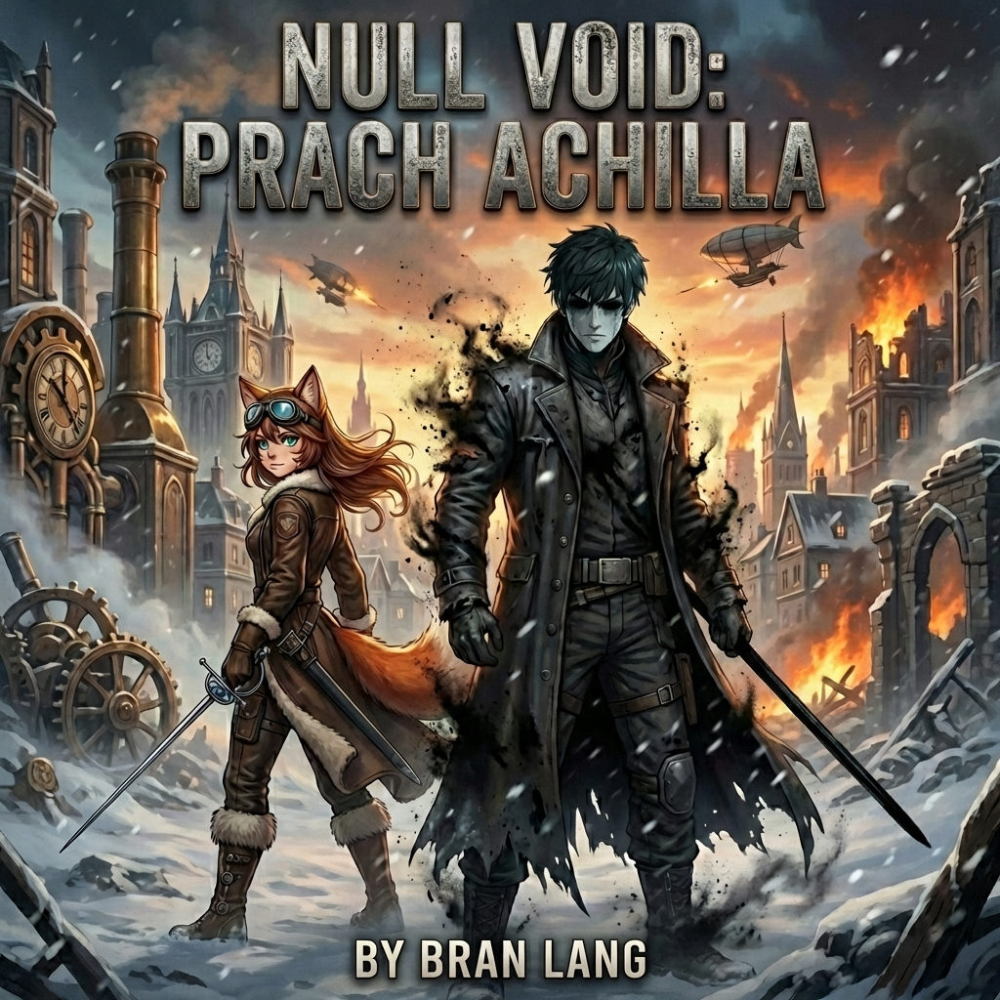
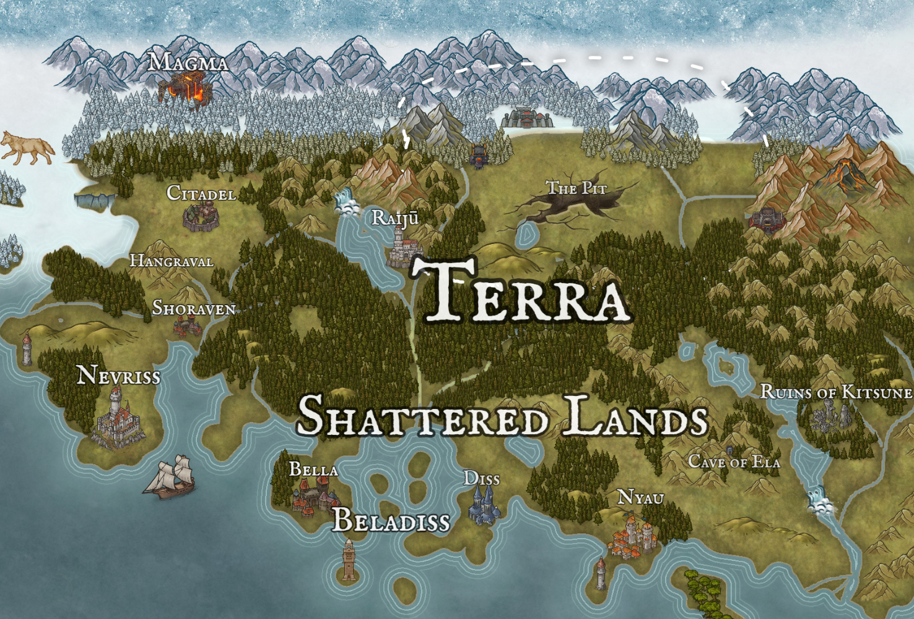
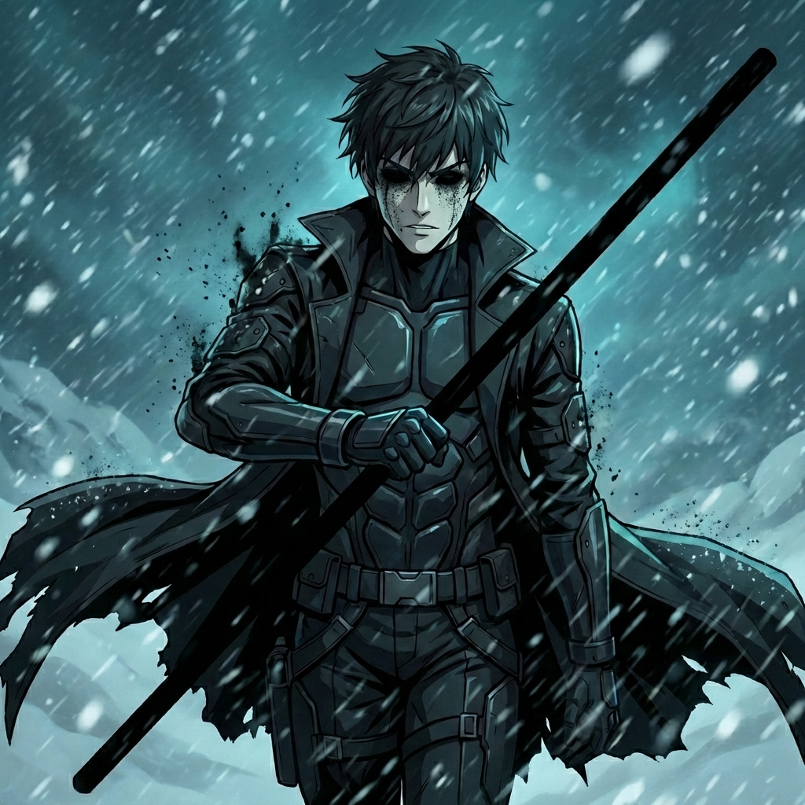
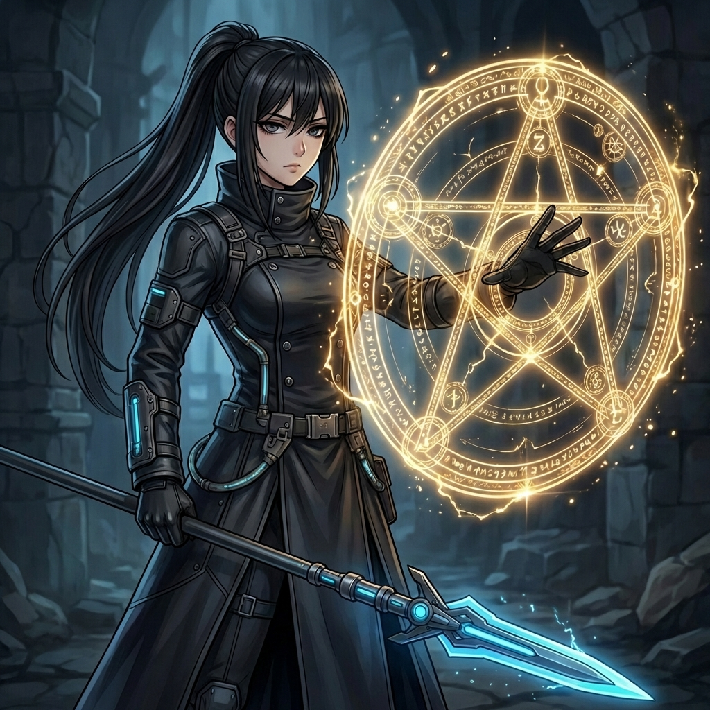
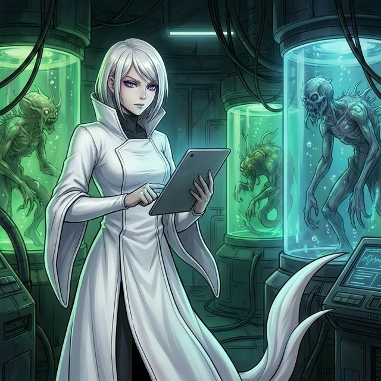
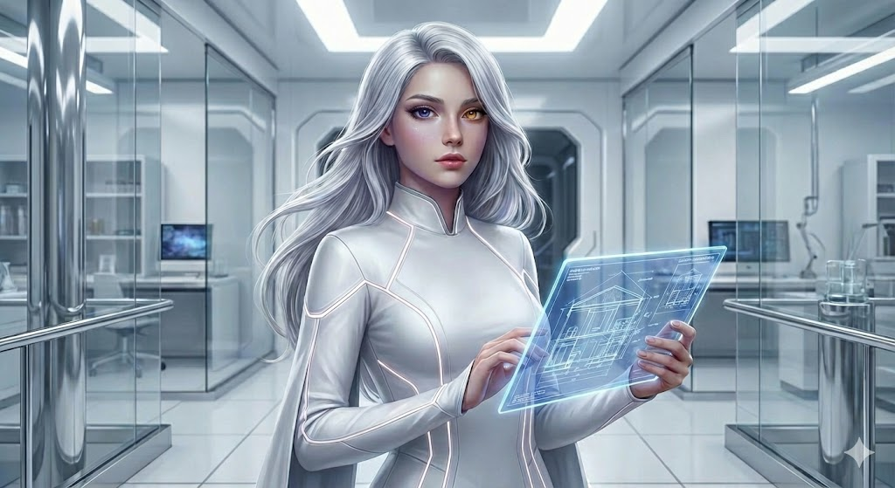

# NULL VOID

> *"Fire in the blood, steel in the hand, a prayer on the lips."*

<div align="center">



**An anime-dieselpunk grimdark light novel set on a super-Earth where nanotechnology is mistaken for magic, prayers are code, and ghosts are just nanobots that chose to survive.**

*Written in Slovak | by Bran Lang*

</div>

---

## The World

**Achilles** (Kepler-452b) is a super-Earth — a planet so vast that cities lie thousands of kilometers apart, separated by untamed wilderness. There are no roads, no railways. Civilization survives in isolated city-states connected only by airships and ocean convoys. Winters last five years. Summers last five. And the creatures that roam between the cities do not forgive trespassers.

<div align="center">


*The known world of Achilles — four continents, each hiding its own secrets.*

</div>

### The Continents

| Continent | Character | Secret |
|-----------|-----------|--------|
| **Terra** | The heartland. 80% of the world's population. Steampunk cities, eternal war between North and South, 20 fragmented kingdoms. | What they call "magic" is actually nanotech left behind by their forgotten creator. |
| **Neuropa** | The forbidden West. Sealed behind impenetrable barriers. No one enters, no one leaves. | Home to the original human colonists who never changed — and technology far beyond Terra's comprehension. |
| **Aprika** | The white spot on the map. No one knows what's there. Only legends and tavern gossip. | A hidden civilization of genetically engineered apes with hard-light shields and ancient technology. |
| **Ynetis** | The lost island city at the equator, swallowed by a hurricane of Wraiths. | Contains The Core — an AI prison holding an interdimensional entity. The place where everything began. |

### Terra — Where the Story Lives

<div align="center">



</div>

Terra is a world of contrasts:

- **Nevriss (South)** — Theocracy meets capitalism. They worship the Mother (Inetis) as a goddess of life. Colorful markets, bioluminescent alleys, white marble temples, airships. *"Whoever has the gold, makes the rules."*
- **Graw (North)** — Militant totalitarianism. They worship Grond, the Storm Father. Black stone fortresses, factories belching smoke, omnipresent pipes and gears. *"Strength, Order, Steel."*
- **The Shattered Lands** — A belt of territory between North and South where kingdoms rise and fall like tides. Every country started as a city-state — in the wilderness of a super-Earth, you couldn't survive without walls.

### The Big Lie

The inhabitants of Terra — the **Varietas** (humans with animal traits: fox ears, cat eyes, wolf fur) — believe they wield magic through prayer and pentagram rituals.

They don't.

What they call *Spira* is a nanotechnology ecosystem created 3,000 years ago by a woman they now worship as a goddess. The pentagrams are programming interfaces. The prayers are voice-activated scripts. The "demons" are corrupted nanodrone swarms. And the "divine relics" are pieces of a spaceship called **NULL VOID**.

Nobody knows this. Except one man who just woke up.

---

## The Story

### Book 1: *Prach Achilla* (Dust of Achilles)

<div align="center">


</div>

**Maximilian** wakes up in a cave after 3,000 years of cryosleep. No memories. No allies. Eyes replaced by stolen military nanodrones that see the world in data overlays. The woman who put him to sleep is dead — her skeleton still clutching a metal rod against his cryo-chamber.

He doesn't know she was the love of his life. He doesn't know the rod is the most powerful weapon on the planet. And he doesn't know she had a daughter — now a 2,750-year-old immortal who wants to upload all consciousness into a digital void.

**Tami** is a 20-year-old fox-girl pirate, smuggler, and treasure hunter. She carries two pistols, a rapier, and fragments of a dead goddess in her blood that she doesn't understand. She's been searching for Max for five years — she thinks it's because she loves him. It's actually because the dead goddess inside her is still trying to complete her final mission.

They reunite in **Shoraven** — a border city under siege — where they need to steal an ancient artifact from beneath the Church's cathedral before the northern army levels the city. Along the way, they pick up **Kito**, a cat-eared archaeologist whose wife is slowly turning to crystal, and encounter **Sera**, a terrifyingly powerful servant of someone they haven't met yet.

The heist goes wrong. The city falls. And what they pull from the rubble changes everything.

---

## Characters

<table>
<tr>
<td width="25%" align="center">



**Max**<br/>
*The Sleeper*<br/>
Human soldier. 3,000 years displaced. Eyes of black nanodust. Pragmatic, laconic, lethal.

</td>
<td width="25%" align="center">


**Tami**<br/>
*The Fox*<br/>
Varietas pirate. Captain of the airship Makita. Carries a dead goddess without knowing it.

</td>
<td width="25%" align="center">



**Sera**<br/>
*The Blade*<br/>
Ancient warrior. Three voices. Serves a master she'll never betray. The most dangerous person in any room.

</td>
<td width="25%" align="center">



**Elania**<br/>
*The Daughter*<br/>
Max's child he never knew. 2,750 years old. Wants to end biological suffering — by ending biology.

</td>
</tr>
</table>

---

## Series Overview

| Book | Title | Arc |
|------|-------|-----|
| 1 | **Prach Achilla** *(Dust of Achilles)* | The Heist. Shoraven falls. The Antenna is found. |
| 2 | **TBD** | The Journey. Crossing the Shattered Lands. |
| 3 | **TBD** | The War. North vs. South. Paladins from the unknown South. |
| 4 | **TBD** | The Return. Ynetis. The Core. The truth about the Shadows. |
| 5 | **TBD** | The Upload. Father vs. Daughter. The final choice. |

---

## Repository Structure

```
World-Bible/
  characters/       # Character profiles, backstories, voice guides
  regions/           # Geography, politics, cultures
  books/             # Drafts organized by book and arc
  assets/            # Maps, character art, cover art
  01-timeline.md     # Canonical chronology
  03-technology.md   # Spira, nanodrones, Pentagram system
  05-geography.md    # Detailed world geography
  10-inetis-chronicles.md  # The Mother's story
```

---

## Tech Stack (The World's)

| What They Call It | What It Actually Is |
|---|---|
| **Spira** (Magic) | v2.0 nanobots — hereditary nanotech ecosystem |
| **Pentagram** (Holy Symbol) | IDE — programming interface for nanodrones |
| **Prayers** | Voice-activated scripts |
| **Demons / Wraiths** | Corrupted v1.0 nanodrone swarms carrying dead consciousness |
| **The Mother's Blessing** | Genetic modification for nanobot compatibility |
| **Divine Relics** | Pieces of the FTL ship NULL VOID |
| **Glitch Rot** (Soul Decay) | Nanobot system failure — v1.0 rejecting hosts |
| **The Core** (Heaven) | AI simulation / prison for interdimensional entities |

---

## Genre DNA

NULL VOID lives at the intersection of four strands:

| Strand | What It Brings |
|--------|----------------|
| **Anime / Light Novel** | Short chapters with hooks, visual character design, tonal shifts between horror and humor |
| **Sci-Fi (Hard)** | Clarke's Third Law as plot engine — the entire "magic" system IS nanotechnology |
| **Dieselpunk** | Hydrogen airships, revolvers, art deco, steam engines — no electronics, no internet |
| **Grimdark** | Public burnings, body horror, no plot armor — consequences are permanent |

**If you like:** *Nausicaä of the Valley of the Wind* + *Fullmetal Alchemist* + *Saga of Tanya the Evil* — but with deeper lore and a father-daughter tragedy at its core.

---

## IDE as a Worldbuilding Tool

This project started as a game concept and evolved into a novel — but the tool never changed. The entire world is built and maintained in an IDE (Claude Code / Cursor / VS Code) with AI assistance.

Why it works:

- **Repository = World Bible** — Characters, geography, technology, timelines, drafts — all cross-referenced markdown files in a monorepo. Open a project after 6 months and everything is where you left it.
- **Git for stories** — Branching, diffing, history. See what changed, when, and why. Experiment with plot branches without losing the original.
- **AI agent with custom rules** — A `SKILL.md` file teaches the AI your world's rules, tone, and constraints. It becomes a writing partner that knows the lore.
- **Mermaid charts, mindmaps, architecture docs** — The same tools developers use for system design work for faction politics, magic systems, and character relationship maps.
- **ADHD-friendly** — The IDE holds context when you can't. Structure compensates for executive function. The world doesn't dissolve between sessions.

The irony: the Varietas in the story use a Pentagram IDE to "pray" — they think it's religion, but they're actually programming nanobots. The author uses an actual IDE to build the world those nanobots live in.

---

<div align="center">



*"Once, perhaps a few times in an existence, there comes a moment when the barriers fall and your mind touches the stars. In that moment there is no fear, no pain, only pure meaning. Everything makes sense. And then, in an instant, it's gone. And in your palm remains only a small seed. But that seed — you can plant it."*

**— Inetis, explaining the origin of the first nanotechnologies**

</div>

---

*Language: Slovak (SK) | Genre: Anime Sci-Fi Dieselpunk Grimdark | Format: Light Novel Pentalogy*
