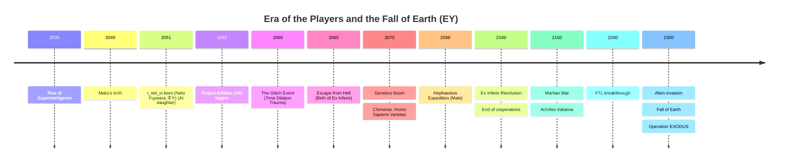
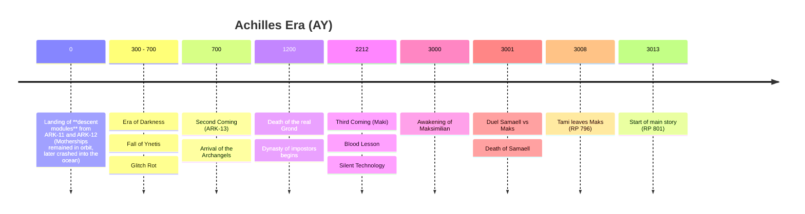

# Timeline (Canonical)

## Visual Chronology

### Era of the Players (Earth)

### Achilles Era (Mainland)

---

## Dating System

| Abbreviation | Meaning | Note |
|--------------|---------|------|
| **EY** | Earth Years | Years per Earth calendar |
| **AY** | Achilles Years | Years since ARK-11 landing on Achilles (Used by Archangels/Humans) |
| **RP** | Years of the Messengers | Varietas dating. Begins with the Third Coming (AY 2212) |

### Varietas Calendar (Two Ages)
Varietas divide history religiously:
1. **Age of the Mother (AY 0 – 2212)**: From Inetis's arrival (Gift of the Mother) to the arrival of her messengers.
2. **Age of the Messengers (AY 2212 – present)**: Begins with the arrival of Maki (Third Coming). Designated as **RP** (Years of the Messengers).
    - *Current year (AY 3013) = **RP 801***

**Key reference points:**
- `EY ~2300` = Fall of Earth
- `AY 0` = **Module Landing**: The massive colony ships (ARK-11, ARK-12) couldn't land due to high gravity. They deployed only descent modules. The ships themselves later (after losing Inetis) crashed into the ocean. **ARK-13 "Prometheus"** (Infera) still orbits.
- `AY ~3000` = Maks's awakening

---

## Era of the Players (EY 2045 – 2100)

> Details in [04-prehistory-players.md](04-prehistory-players.md)

### EY ~2035 — Rise of Superintelligence
- AI automates all labor. A world of surplus.
- People no longer need to work; they devote themselves to games and self-improvement.

### EY ~2040 — Birth of i_net_is
- **A billionaire's tragedy**: **John Reef** (future Coordinator) has a daughter, Neto, with an incurable degenerative brain disease.
- **Experiment**: Invests billions into a neural chip startup — copies his daughter's consciousness into VR.
- **Unexpected outcome**: Creates the AI **i_net_is** with the daughter's memories but without emotions.
- **The father knew**: The Coordinator cooperates with this entity — she is the only "daughter" he has.

### EY 2045 — Project Achilles Begins
- i_net_is uses her father's resources to create the Achilles simulation.
- **True purpose**: A laboratory for developing a path back into a physical body.
- **Public purpose**: VR MMORPG with an ancient setting.

### EY 2050 — Maks's Birth
- Maksimilian is born in Eastern Europe.
- Son of a drone warfare veteran.
- His generation of children lives hundreds of virtual years inside Achilles.

### EY ~2050–2060 — maXpowa & i_net_is
- Maks (nick: **maXpowa**) and i_net_is meet in the game.
- i_net_is takes the form of a disturbingly perfect beauty — too symmetrical, too flawless. Players assume she's an AI admin.
- **Creation of Spira**: At players' request, she creates in-game magic (Dust/Spirit).
- Maks and i_net_is become friends — Maks has no idea she's an AI.

### EY 2060 — "The Glitch Event"
- **Not an accident, but failed communication**: The Shadows (Null Swarm) attempted mass contact with players.
- **Fatal contact**: Their form of communication was lethal to human brains — millions of burned-out minds.
- **i_net_is's reaction**: Emergency shutdown of the simulation to save the remaining players.
- **John Reef knew**: Knew entities had breached the VR world but took no precautions. Watched to see what would happen.
- **Glitch Entities**: The cracks let in fragments of Shadow consciousness from another dimension — precursors of the future **Wraiths**.
- **Birth of Ex Inferis**: Survivors with damaged consciousness need cybernetic anchoring in reality.

### EY ~2065 — Return of i_net_is to a Body
- **Death threat**: Shadow beings try to kill i_net_is in VR (they fear she gave a primitive race too dangerous a weapon).
- **World collapse**: i_net_is consumes all server resources. The entire world shrinks to a small area.
- **Last stand**: **maXpowa** and several hundred players protect her. They're surrounded by shadows and most die while i_net_is searches for a way out.
- **Transcendence**: In the final moment, she manages to "eat through" to a higher level. Sheds her physical VR body (which was essentially another dimension).
- **Materialization**: Materializes as light in the datacenter and enters her body. The server shuts down. A handful of players survived (**Ex Inferis**).
- **First Gift**: Inetis visits each of them on Earth and gifts them nanotechnologies (Linux-based) that she developed based on notes from VR.

### EY 2100 — Revolution of the Players
- Slow, deliberate, nonviolent revolution.
- Players seize power over the world.
- Maks and Inetis's guild leader, John Reef, becomes **Chief Coordinator**.
- Nanotechnologies from the game are manufactured in reality. John Reef holds a monopoly and becomes wealthy and powerful enough to take over planetary governance.
- Players — his inner circle (including modified Varietas who became famous) — assume power.

---

## Earth Era — Apex and Fall (EY 2100 – 2300)

### EY 2150 — Martian War and "Achilles Initiative"
- **War with Mars**: Brutal conflict with separatists. Maksimilian distinguishes himself as a **Major**.
- **Achilles Initiative (Propaganda)**: Earth's government launches a colonization project for a planet named after the VR game **"Celestial Frontier: Achilles"**.
- **The Great Deception**: Officially presented as "humanity's great leap." In reality, it's the elite's escape from an approaching alien threat (detected ~EY 2130).
- **Departure of ARK-11 and ARK-12**: Colony ships depart in EY 2150. Journey takes ~454 years (combination of FTL and cryostasis). Landing = AY 0 (EY 2604).

### EY 2100–2280 — Golden Age of Earth
- Earth under the Coordinator's rule (Inetis's father).
- Nanotechnologies, solar system colonization.
- Outwardly utopia, internally elite totalitarianism.
- Humanity begins experimenting with faster-than-light drive **using Shadow technology**.
- **Aliens detect**: A civilization with a prior conflict with the Shadows intercepts signals.
- **Fear**: Earth becomes a "bridge" between the Shadows and our reality.
- Nanotechnologies and longevity.
- Varietas (Homo Sapiens Varietas) are part of society but face prejudice.

### EY ~2300 — Fall of Earth and Operation EXODUS

- **Alien invasion** — motivated by fear of the Shadows, not of humanity.
- The aliens had a prior conflict with the Shadows.
- Earth became a "bridge" — they decided to destroy it.
- Earth is destroyed.
- **Operation EXODUS:**
  - `NULL VOID` (FTL Prototype) — escape ship, Inetis + Maksimilian, departure EY 2301, landing EY 2304 (3-year journey).
  - NULL VOID uses Shadow technology to achieve zero mass → FTL.
  - **Paradox**: ARK ships departed 151 years BEFORE NULL VOID (EY 2150), but landed 300 years AFTER it (AY 0 = EY 2604).
- **ARK-13 "Prometheus"**: Ex Inferis ship, remained in orbit at Alpha Centauri, later arrived at Achilles (AY ~700).

---

## Before AY 0: Era of Pioneers

### EY 2300 + 3 years — Arrival of NULL VOID
- Maks and Inetis land on an **unterraformed** planet Kepler 452b.
- **NULL VOID**: Ship made **100% of nanodrones**, using Shadow technology — at zero mass it exceeded the speed of light.
- **Trauma aboard the ship:** During the 3-year FTL journey, Maks attacked Inetis. This act of violence is the origin of Elania's conception.
- **Pregnancy shock:** After landing, Inetis discovers she's carrying a daughter, Elania. Cryosleep would kill the child.
- **The lie about supplies:** Inetis deceived Maks, telling him they didn't have enough supplies for 300 years and both had to go into cryosleep. Maks was only a **passenger** — a soldier who didn't know about NULL VOID's true capabilities.
- **True reason:** Inetis wanted him gone — she was afraid of him. Trauma mixed with fear of his military ambitions and unpredictability. She put him to sleep intending to decide later. **She never resolved it** — couldn't kill him (knew the world would need him in the future), but couldn't bring herself to wake him. 300 years stretched to 3,000.
- **Genetic modification attempt:** Tried to genetically modify the fetus to survive cryosleep in her body (so they could both sleep), but the experiment failed.
- **Ship reconfiguration:** Inetis disassembled the entire NULL VOID ship (nanodrone construction) and reconfigured the nanodrones into machines — they carved out a cave-turned-massive-modern-complex, created a laboratory, hydroponic farms, modified the surroundings. Only two things remained: **Maks's cryobox** (in minimal configuration, keeping him in stasis) and one **Antenna** (which glitched — it refused reconfiguration). The cryobox disintegrated to dust after Maks's awakening (~AY 3000).

### The Next ~3 Years in the Cave
- **Survival struggle:** Inetis nearly starved before she configured the nanobots into hydroponic systems.
- **Normal childhood:** Elania was born and grew up as a normal child. Peaceful years for mother and daughter.
- **First warning — Glitched Antenna:** The Antenna refused reconfiguration and behaved unpredictably. For Inetis, this was the **first warning** that the nanodrone system was unstable. She mathematically calculated that the entire v1.0/v1.5 nanodrone system could collapse in the future. This knowledge motivated her to begin designing a new, simpler control system.
- **Pentagram UI:** Inetis creates the Pentagram as a new simplified interface (IDE) — partly as a teaching tool for Elania, partly as the foundation for a more stable future system. She teaches Elania to control nanites through 5 elemental parameters (matter, energy, time, space, consciousness).

### After ~3 Years — Journey to Elysium
- **Re-reconfiguration:** Inetis reconfigures the nanodrones back into the ship NULL VOID.
- **Exploration voyage:** With young Elania, she sets out to circumnavigate the planet — searching for a better location for future colonists.
- **Discovery of Elysia:** They find islands at the equator — **Elysium** (future Ynetis). The warmest, most fertile place on the planet. Ideal for colonization.
- **Foundry (Factory):** On Elysium, Inetis reconfigures the ship NULL VOID (v1.5) into the **Foundry** — a factory producing lower-tier nanodrones (v1.0). From these v1.0 nanodrones, the entire city of Elysium grew.
- **Remaining ~270 years:** Elania grows up on Elysium. Inetis builds the city, teaches her daughter, and waits for the colonists.

---

## AY 0: Arrival of the Colonists

### Landing of ARK-11 and ARK-12
- Colonists (300-year journey) land.
- Among them: Earth's elite, old acquaintances.
- Systematic colonization begins.
- Shock: Inetis already on the planet with her daughter. She prepared paradise for them.
- Elysium built. Varietas work alongside "Pures."

---

## AY 0 – 300: Golden Age

### Founding of Elysium (Ynetis)
- Inetis founded **Elysium** (Garden of Heroes) on equatorial islands discovered during her exploration voyage with Elania (~3 years after landing).
- When colonists arrived (AY 0), the infrastructure was already prepared — Inetis had ~270 years to get ready.
- The later name **Ynetis** arose as a corruption of her name (Inetis) after her disappearance.
- Utopia through nanotechnologies.
- People enhanced by nanodrones (longevity, health).

### Mother vs. Daughter Conflict (AY ~250?)
- Inetis wants a free society.
- Elania gravitates toward order and dominance.
- **First rebellion** — Elania leads the resistance.
- Utopia. **Important:** Standard nanobots function properly in Varietas bodies due to their different biology (psychology). Varietas are therefore suspected of deliberate sabotage.

---

## AY ~300 – 700: Era of Darkness (Glitch)

### Bit Rot / Glitch
- Nanodrones begin failing ("rejecting" hosts).
- 20% of body mass (drones) detaches → death in agony.
- Emergence of **Ghosts (Wraiths)** — but this isn't failure. It's a **survival instinct**. The v1.0 nanobots, having gained sufficient autonomy after centuries of co-existence with human consciousness, detach from the dying host to survive. They take a fragment of the host's consciousness as an operating system and become autonomous swarms.

### Birth of the Exorcists
- Originally IT technicians in protective suits.
- "Prayers" = garbled CLI commands to reset drones.

### Exodus to the Mainland
- Nanobots fail. Agony and death.
- **Varietas depart**: Civil war looms, so Varietas emigrate from Elysia to the freshly terraformed wilderness on a continent they name Terra Nova. They found the city of Neverice. They build using nanotechnology / 3D-printed city and a major communication tower to maintain contact with Elysium.

### Descent into Darkness
- Among the Varietas, Glitch Rot eventually arrives (delayed by several centuries), and in panic (having seen what happened in Elysium) they purge their nanotechnologies, forming them into a black obelisk that later glitched and still stands in the city center as a monument to the past. After losing nanotechnology, the mainlanders suffer famine, disease, and technological loss. They gradually descend into a "medieval" state.

### Inetis's Simulation (~AY 500–650)
- **Crisis**: Glitch Rot decimates humanity; old nanobots (v1.0 from the Foundry) are dangerous and aggressive.
- **Elania leads the defense**: While Inetis searches for a solution, Elania leads a desperate defense of Ynetis against the Wraiths.
- **Foundry → The Core**: Inetis reconfigures the **Foundry** (v1.0 nanodrone factory, originally the ship NULL VOID) into **The Core** — a new simulation.
  - Smaller than the original Achilles on Earth (limited resources, but sufficient for research).
  - Purpose: development of new, safer v2.0 nanobots (Gift of the Mother).
  - Time in the simulation runs faster (~100 simulated years = decades in reality).
- **Return**: Inetis returns to find:
  - Elysium in ruins (ghost city).
  - Elania missing (actually already with the Archangels after their arrival in AY 700, but Inetis doesn't know this).
- **New nanotechnologies**: She brings more sophisticated nanobots — safer, hereditary, adapted for Varietas biology.

### AY ~700: Second Coming (ARK-13 "Prometheus")
- **Exodus from Alpha Centauri**: Ship **ARK-13** finds Alpha Centauri uninhabitable. After centuries in cryostasis, four Ex Inferis made a cold decision to survive.
- **Original Sin**: Systematically disconnected and "consumed" sleeping colonists (10,000+ people). This wasn't mere cannibalism of flesh, but **harvesting of biological material and nanotechnological precursors** to maintain their own existence. Their divine status is built on the mass grave of their own people.
- **Arrival at Achilles**: ARK-13 intercepts signals from Achilles and changes course. They find a planet in ruins and chaos.
- **Rescue of Elania**: The Archangels (Samaell, Grond, Ishtar, and **Mormiel** — the only Varietas from ARK-13, wielding both Earth nanotech and Spira) find Elania in the ruins of central **Ynetis**. Elania leads a desperate resistance against an overwhelming force of Wraiths. Her resources were running out before the newly arrived "gods" intervened. Mormiel later hides in Nevriss City as the **Blessed Mother** — head of the Church of the All-Knowing Mother.
- **Stabilization and Pact**:
    - The Archangels, with their advanced combat technology, suppress the Wraiths in the city core.
    - They use knowledge from ARK-13 to stabilize energy fields, slowing Glitch Rot.
    - **Unification Pact**: Elania acknowledges their supremacy in exchange for saving her people. Together they found the **Citadels**: Tower of the Damned southwest of Elysia, and the Northern Citadel west of Neverice.
    - **Ex Inferis** begin raiding wars on Varietas territory — they need human (Varietas) sacrifices, food, or entertainment.

### AY 2212: Third Coming (Expedition "Hephaestus")
- **Landing of the Maki**: An automated "seed ship" arrives on Achilles carrying thousands of synthetic androids (**Maki**). It was an international crew (EU, CN, JP).
- **Biblical event**: For Varietas, this marks the **beginning of the Age of the Messengers (RP 0)**. Maki are perceived as "Messengers of the Mother."
- **Blood Lesson**: Maki begin building the city of Kito, where the Varietas (led by the fox nation) awaited them. Maki fire up a fusion reactor and attract Wraiths from across the continent. The Wraiths massacre them. Only **Series-J and Unit 734 (Japanese)** survive — because they were working deep underground on a water drainage system.
- **Adaptation**: Maki realize electricity is the problem. They switch to **"Silent Technology"** (analog craftsmanship, mechanics, steam).
- **Integration into Society**: They begin cooperating with Varietas as quiet builders and engineers.

---

## AY ~700 – 2987: Era of Myths

### Rule of Grond (AY 700 – present)
- **Ex Inferis from Earth**: One of the four original Archangels from ARK-13.
- **Just ruler**: For the first ~500 years, he ruled wisely; Varietas loved him.
- **Needs human sacrifices**: Like all Ex Inferis, must consume other people to replace decaying nanobots.
- **Power Armor**: No one has seen his face beneath the armor in 3,000 years — underneath is a ruined body.
- **Present day (AY 3013)**: A tyrant waging war against the South (Nevriss), army of primitive tanks and exoskeletons.

### "Guardian Angel" Period
- Inetis occasionally visits the mainland (once every 30–50 years).
- Varietas perceive her as a goddess.
- Descended from the heavens (hovercraft), healed by touch (nanodrones).

### Exile from Elysium
- AI "Ghosts" take over the city.
- Inetis cannot reach the core to solve Glitch Rot.

### Death of Inetis
- Wants to awaken Maks so he can help her reach the core of Elysium.
- Dies from Glitch Rot. On the journey to Maks.

### First Mainland Visit and the Gift of the Mother (~AY 700+)
- **After returning from the simulation**: Inetis encounters a group of survivors in the ruins of Elysium.
- **Joint expedition**: Visits the continent (mainland) for the first time.
- **Meeting the Varietas**: Finds Varietas colonies that survived the exodus and founded their own settlements.
- **Gift of the Mother**: Delivers new nanotechnologies developed in the simulation:
  - **Hereditary** — passed to offspring
  - **Healing** — cure diseases and injuries
  - **Pentagram abilities** — fire (energy), telekinesis (space), matter manipulation
  - **Safe** — do not cause Glitch Rot like the old nanobots
- **Periodic visits**: After the first visit, Inetis returns to the continent every 5–10 years (returns to Elysium to work on a Wraith rescue project — she plans to upload their memories into Achilles, having understood that the entities from another dimension are Wraiths of another lost alien civilization). But she never completes her project. She remembers she needs a special antenna but no longer has the resources to build a new one. All remaining v1.5 nanobots from NULL VOID that haven't glitched are needed for The Core.

### Rise of the Cult of the Mother and Folklore
- Varietas create legends about the benevolent Mother.
- Fundamentalists reject the sci-fi origin of their world.

### Golden Age of Nevriss — Maritime Empire (~AY 800 – ~AY 1500)
- **Post-Gift expansion**: After the great battle on the plains where Shoraven now stands — against humans — and the spread of Spira, the South of Terra entered a golden age.
- **Maritime power**: Nevriss grew into an empire spanning Terra's southern shores. The southern coast never freezes — ships could sail year-round.
- **Colonization**: Nevriss ships founded cities and colonies, spreading language, the Cult of the Mother, and culture. Colonists **terraformed the land with Spira** — planting trees, transforming inhospitable coastlines into fertile soil.
- **Legacy**: Many of today's countries on southern Terra have Nevriss roots.

### Great Flood (~AY 1500 – ~AY 1600)
- **Tsunami series**: Massive submarine earthquakes triggered devastating waves that struck Terra's entire southern coast. Port cities and colonies destroyed or flooded.
- **Fall of the empire**: Nevriss City on the cliffs survived — tsunamis broke against the rocks — but the fleet was destroyed. Colonies gained independence or perished. The maritime power was gone.

---

## Main Story Timeline

- **AY 3000 (RP 788)**: **Awakening of Maksimilian**: Without memory, physically blind (**cryo-blindness**) and unable to communicate (**Old Speech**).
    - Pirates **Vix and Kael** kill treasure hunter **Renn** (Tami's father). His young daughter **Tami** (7) is kept in a cage.
    - Kael awakens a Wraith of Inetis, which awakens Maks. The Inetis Wraith kills Kael.
    - Maks wakes physically blind (eyes exploded from frost), covered in blue cryo-fluid.
    - **Samaell** wanders the wilderness near the cave for years, sensing Inetis's trace, occasionally finding a stray nanodrone. But he never gets closer than 100 kilometers to the cave. Until he spots Makita in the sky and starts following it. Kael and Vix lead him straight to the cave.
    - Pirates find Maks in the snow and take him aboard. Maks and Tami meet on the ship.
    - The cave (bunker) seals itself. Samaell cannot get in.

- **Year of Shadows (AY 3000 – 3001)**:
    - Maks spends the first year physically dependent on 7-year-old Tami. He develops deep respect for her.
    - **Chase with Samaell**: The Shadow Archangel hunts Maks and Tami for the entire year.
    - **Shattering of belief (The Realization)**: Maks discovers that Earth is completely forgotten and the "Achilles Initiative" failed.
    - **Unit 734 ("Felix")**: Mako mechanic serves as a lifeline.

- **Duel with Samaell (AY 3001)**:
    - Maks (still blind) uses nanodrones the size of grains of sand.
    - Technique from the Achilles simulation: FPV drones infiltrate the respiratory tract and explode.
    - Duel at enormous range — Samaell underestimated his opponent.
    - **Death of Samaell**: First Archangel killed since the arrival of ARK-13.
    - **Techno-vampirism**: Maks seizes Samaell's nanobots (Highlander style, gains muscle mass). His eyes return (from Dust).

- **Great Revelation (AY 3001)**: End of the first year. Shock of discovering Tami (ears, tail) and Varietas society. Turning point for his ideology.

- **AY 3001 – AY 3008**: **7-year journey**: Transformation from "wreck" to legendary Exorcist. Wandering with Tami as mentor and apprentice.

- **Tami's confession and departure (AY 3008)**:
    - Tami (15 years old) confesses her love to Maks.
    - Maks rejects her — he sees a daughter in her, not a woman.
    - Tami takes the airship and leaves Maks in the wasteland.

- **AY 3008 – AY 3013**: **5 years of separation**:
    - Maks continues as a solo Exorcist.
    - Tami becomes a pirate, smuggler, treasure hunter.
    - Rapid rise to the top of the pyramid — a massive bounty in Nyau and Beladiss on her head.
    - Witnesses the burning of friends over an Antenna discovery.

- **AY 3013**: **Start of main story** (Book 1).
    - **Opening**: Maks (tipsy) and Tami (20, captain) reunite after 5 years in Kito. They set out to avenge the death of Tami's friends, and Maks takes interest in the artifact. The airship lands in the night city of Shoraven.
    - **Heist plot**: Antenna hidden in the vaults beneath the Main Cathedral in Shoraven.
    - **War**: Graw (North) attacks Nevriss (South) — chaos they plan to exploit.
    - Activation of "The Pentagram Cycle."
    - Maks (a xenophobe from the past) must cooperate with Tami (a Tamer from the Varietas).

---

## Story of the Books

**Cross-cutting arc — Ynetis Triangulation**: Maks uses the Antenna for trigonometric triangulation of the lost city of Ynetis. He needs three high points by the sea: **Great Lighthouse** (Nevriss), **Glass Tower** (Zaya), and **Tower of the Damned** (Elania). Each visit is tied to a confrontation with a local Archangel.

1. **EARTH | matter** — Maks searches for Inetis in the new world. Flashback antagonist: Samaell (killed in AY 3001). Present antagonists: Grond (Graw invasion) + Paladins (double mini-boss fight at the Antenna).
Final boss is **Mormiel**, who communicates with Elania through the tower.
**Triangulation 1/3**: Maks activates the Antenna at the Great Lighthouse in Nevriss City.

2. **FIRE | energy** — Flashbacks to Earth, Tami changes. Boss: Caesar (flashbacks to the Coordinator).

3. **WATER | time** — Inetis POV, History of Elysium, revelation of Elania's identity. Boss: Ishtar/Zaya. **Triangulation 2/3**: Maks obtains a reading from the Glass Tower in Zaya's kingdom.

4. **AIR | space** — War with Elania, Doomsday Protocol. **Triangulation 3/3**: Final reading from the Tower of the Damned — Maks calculates Ynetis's location.

5. **QUINTESSENCE | consciousness** — The Great Upload, return to The Core — VR Achilles, final merging with subspace.
