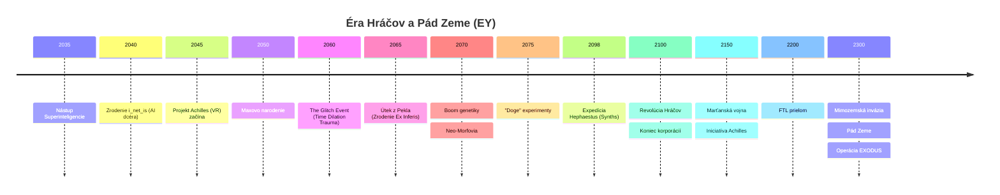
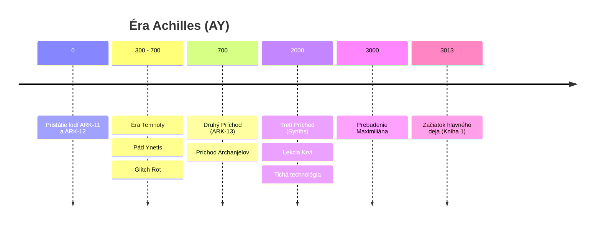

# Časová os (Kanonická)

## Vizuálna Chronológia

### Éra Hráčov (Zem)

### Éra Achilles (Pevnina)

---

## Systém datovania

| Skratka | Význam | Poznámka |
|---------|--------|----------|
| **EY** | Earth Years | Roky podľa pozemského kalendára |
| **AY** | Achilles Years | Roky od pristátia ARK-11 na Achille |

**Kľúčové body:**
- `EY ~2300` = Pád Zeme
- `AY 0` = Pristátie ARK-11 (kolonisti)
- `AY ~3000` = Maxovo prebudenie

---

## Éra Hráčov (EY 2045 – 2100)

> Detaily v [04-prehistory-players.md](04-prehistory-players.md)

### EY ~2035 – Nástup Superinteligencie
- AI automatizuje všetku prácu. Svet prebytku.
- Ľudia už nemusia pracovať, venujú sa hrám a sebazdokonaľovaniu.

### EY ~2040 – Zrodenie i_net_is
- **Tragédia miliardára**: Budúci Koordinátor má dcéru s nevyliečiteľnou degeneratívnou chorobou mozgu
- **Experiment**: Investuje miliardy do startupu s neurálnym čipom — skopíruje dcérine vedomie do VR
- **Neočakávaný výsledok**: Vzniká AI **i_net_is** so spomienkami dcéry, ale bez emócií
- **Otec vedel**: Koordinátor spolupracuje s touto entitou — je to jediná „dcéra" ktorú má

### EY 2045 – Projekt Achilles začína
- i_net_is využíva otcove zdroje na vytvorenie simulácie Achilles
- **Skutočný účel**: Laboratórium na vývoj cesty späť do fyzického tela
- **Verejný účel**: VR MMORPG s antickým settingom

### EY 2050 – Maxovo narodenie
- Maximilián sa narodí v strednej Európe
- Syn mechanika
- Generácia detí prežíva stovky virtuálnych rokov v Achilles

### EY ~2050–2060 – maXpowa & i_net_is
- Max (nick: **maXpowa**) a i_net_is sa spoznajú v hre
- i_net_is má podobu znepokojivo dokonalej krásky — príliš symetrická, príliš bezchybná. Hráči ju považujú za AI admina
- **Stvorenie mágie**: Na žiadosť hráčov vytvára nanoboty (Prach/Spirit)
- Max a i_net_is sa „zamilujú" — Max netuší, že ona je AI

### EY 2060 – „The Glitch Event"
- **Nie nehoda**: i_net_is to spôsobila ako **ochranný mechanizmus** pre hráčov
- **Koordinátor vedel**: Pomohol jej — nechal hráčov „uväznených" aby ich ochránil pred niečím horším
- **Time Dilation Trauma**: 2 hodiny v realite = 15 rokov subjektívneho väzenia pre 100 000 hráčov
- **Glitch Entities**: Trhliny vpustili emergentné vedomia — predobraz budúcich **Wraiths**
- **Zrodenie Ex Inferis**: Preživší s poškodeným vedomím potrebujú kybernetické ukotvenie v realite

### EY ~2065 – Návrat i_net_is do Tela
- **Zhmotnenie**: i_net_is využíva nanoboty na export vedomia z simulácie
- **Oživenie tela**: Nanoboty oživia jej pôvodné telo, ktoré bolo roky umelo udržiavané
- **Hybridná bytosť**: Stáva sa niečím novým — ani AI, ani pôvodná dcéra
- **Prvý Dar**: Navštevuje všetkých Ex Inferis a dáva im nanoboty (tie isté, čo neskôr spôsobia Glitch Rot)
- **Technologický kontraband**: Ex Inferis prinášajú vzorce nanotechnológií do reality

### EY 2100 – Revolúcia Hráčov
-  Pomalá, premyslená, nenásilná revolúcia
- Hráči preberajú moc nad svetom
- Maxov a Inetisin „Guild Leader" sa stáva **Hlavným Koordinátorom**
- Nanotechnológie z hry sa vyrábajú v realite
- Hráči (vrátane modifikovaných Chimér, ktoré sa stali slávnymi) preberajú moc.

---

## Éra Zeme – Vrchol a pád (EY 2100 – 2300)

### EY 2150 – Marťanská vojna a „Iniciatíva Achilles“
- **Vojna s Marsom**: Brutálny konflikt so separatistami. Maximilián sa vyznamená ako **Major**.
- **Iniciatíva Achilles (Propaganda)**: Vláda Zeme spúšťa projekt kolonizácie planéty pomenovanej po VR hre **„Celestial Frontier: Achilles“**.
- **Veľké Klamstvo**: Oficiálne je projekt prezentovaný ako budovanie armády pre protiútok na oslobodenie Zeme od mimozemskej hrozby. V skutočnosti je to lístok na útek pre elitu.

### EY 2100–2280 – Zlatý vek Zeme
- Zem pod vládou Koordinátora (otec Inetis)
- Nanotechnológie, kolonizácia slnečnej sústavy
- Navonok utópia, vnútri totalita elity
- Ľudstvo začína experimentovať s nadsvetelným pohonom
- Pritiahne pozornosť mimozemskej civilizácie (FTL = tabu/hrozba)
- Nanotechnológie a dlhovekosť.
- Chiméry (Homo Sapiens Varietas) sú súčasťou spoločnosti, ale čelia predsudkom.

### EY ~2300 – Pád Zeme a Operácia EXODUS

- Mimozemská invázia
- Zem je zničená
- **Operácia EXODUS:**
  - `ARK-11` — kolonizačná loď, elita zo Zeme, 300-ročná cesta
  - `FTL Prototyp` — úniková loď, Inetis + Maximilián, 3-ročná cesta
- Mimozemská invázia.
- **Špeciálna kolonizačná loď (ARK-12)**: 50% posádky tvoria Chiméry hľadajúce svet bez predsudkov.
- Ostatné lode (vrátane ARK-11) nesú elitu.

---

## Pred AY 0: Éra Priekopníkov

### EY 2300 + 3 roky — Príchod FTL Prototypu
- Max a Inetis pristávajú na **neteraformovanej** planéte Achilles.
- **Kritický nedostatok zásob:** Ak by zostali bdelí obaja, zdroje by nestačili a nikto by neprežil.
- **Šok z tehotenstva:** Inetis zistí, že čaká dcéru Eleniu. Kryospánok by dieťa zabil.
- **Klamstvo pre záchranu:** Inetis oklamala Maxa (ktorý si myslel, že idú spať spolu). Pokúsila sa geneticky modifikovať plod, aby prežil kryospánok v jej tele, no experiment zlyhal.
- **Maxovo uväznenie:** Uložený do kryospánku kvôli zásobám, ale aj zo strachu z jeho vojenských ambícií (poraziť mimozemšťanov) a reakcie na jej činy.

### Nasledujúcich ~300 rokov
- **Boj o prežitie:** Inetis skoro zomrela od hladu, kým nanoboty nenaučila replikovať biomasu a vybudovať hydroponiku.
- **300-ročné detstvo:** Elenia vyrastá v izolácii jaskyne. Kvôli neúspešnej genetickej modifikácii rastie extrémne pomaly.
- **Pentagram UI:** Inetis učí Eleniu ovládať nanity cez elementárne rozhranie (hmota, energia, čas, priestor, vedomie).

---

## AY 0: Príchod kolonistov

### Pristátie ARK-11 a ARK-12
- Kolonisti (300-ročná cesta) pristávajú
- Medzi kolonistami: elita zo Zeme, starí známi
- Začiatok systematickej kolonizácie
- Šok: Inetis už na planéte.
- Začiatok budovania Ynetis. Chiméry pracujú po boku "Čistých".

---

## AY 0 – 300: Zlatý vek

### Založenie Ynetis
- Inetis zakladá mesto **Ynetis** (pomenované po nej neskôr)
- Utópia pomocou nanotechnológií
- Ľudia vylepšovaní nanodronmi (dlhovekosť, zdravie)

### Konflikt Matka vs. Dcéra (AY ~250?)
- Inetis chce slobodnú spoločnosť
- Elenia smeruje k poriadku a nadvláde
- **Prvá vzbura** — Elenia vedie odpor
- Utópia. **Dôležité:** Štandardné nanoboty elity (Hráčov) nefungujú správne v telách Chimér pre ich odlišnú biológiu.

---

## AY ~300 – 700: Éra Temnoty (Glitch)

### Bit Rot / Glitch
- Nanodrony začínajú zlyhávať („odmietajú" hostiteľov)
- 20% telesnej hmotnosti (drony) sa odtrhne → smrť v agónii
- Vznik **Duchov (Wraiths)** — nanodrony s fragmentami vedomia mŕtvych

### Zrod Exorcistov
- Pôvodne IT technici v ochranných oblekoch
- „Modlitby" = skomolené CLI príkazy na reset dronov

### Exodus na pevninu
- Nanoboty zlyhávajú. Agónia a smrť elity.

- **Chiméry odchádzajú ako prvé**: Keďže ich telá nanoboty elity odmietali, nie sú zasiahnutí Glichom. Emigrujú z Ynetis do divočiny na Pevnine.

### Úpadok do Temnoty
- Chiméry na pevnine trpia hladom, chorobami a stratou technológií. Upadajú do "stredoveku".

### Inetisina Simulácia (~AY 500-650)
- **Kríza**: Glitch Rot decimuje elitu, staré nanoboty zo Zeme sú nebezpečné a agresívne
- **Elenia vedie obranu**: Kým Inetis hľadá riešenie, Elenia vedie zúfalú obranu Ynetis proti Wraithom
- **Riešenie**: Inetis s pomocou inžinierov z ARK lodí vytvára malú simuláciu
  - Menšia ako Achilles na Zemi (obmedzené zdroje, ale stačí malé laboratórium)
  - Účel: vývoj nových, bezpečnejších nanobotov kompatibilných s chimérou biológiou
  - Čas v simulácii beží rýchlejšie (~100 simulovaných rokov = desaťročia v realite)
- **Návrat**: Inetis sa vracia a nachádza:
  - Ynetis v ruinách (mesto duchov)
  - Elenia nezvestná (v skutočnosti už s Archanjelmi po ich príchode v AY 700, ale Inetis to nevie)
- **Nové nanotechnológie**: Prináša sofistikovanejšie nanoboty - bezpečnejšie, dedičné, prispôsobené pre Chiméry

### AY ~700: Druhý Príchod (ARK-13 "Prometheus")
- **Exodus z Alpha Centauri**: Loď **ARK-13** nachádza Alpha Centauri neobývateľnú. Po stáročiach v kryostáze urobili štyria Ex Inferis chladné rozhodnutie prežiť. 
- **Prvotný Hriech**: Systematicky odpojili a „konzumovali“ spiacich kolonistov (1000+ ľudí). Nebol to len kanibalizmus mäsa, ale **zber biologického materiálu a nanotechnologických prekurzorov** na udržanie vlastnej existencie. Ich božský status je vybudovaný na masovom hrobe vlastných ľudí.
- **Prílet na Achilles**: ARK-13 zachytáva signály z Achilla a mení kurz. Nachádzajú planétu v troskách a chaose.
- **Záchrana Elenie**: Archanjeli (Samaell, Grom, Ishtar a štvrtý) nachádzajú Eleniu v ruinách centra **Ynetis**. Elania vedie zúfalý boj proti drvivej presile Wraithov. Jej sily dochádzali, kým nezasiahli novoprišlí "bohovia".
- **Stabilizácia a Dohoda**: 
    - Archanjeli svojou pokročilou bojovou technológiou zničia Wraithov v jadre mesta.
    - Použijú znalosti z ARK-13 na stabilizáciu energetických polí, čím spomalia Glitch Rot.
    - **Dohoda o Zjednotení**: Elania uznáva ich nadvládu výmenou za záchranu svojho ľudu. Spoločne zakladajú **Citadelu** (najbezpečnejšia časť Ynetis).

### AY 2000: Tretí Príchod (Expedícia "Hephaestus")
- **Pristátie Synths**: Na Achilles dorazí automatizovaná „semenná loď“ (seed ship) s tisíckami biologických androidov (**Synths**). Sú to neemotívne organické stroje riadené direktívou obnoviť civilizáciu.
- **Lekcia Krvi**: Synths začnú budovať osady s pokročilou elektronikou. To prebudí Wraithov, ktorí ich zmasakrujú.
- **Adaptácia**: Synths pochopia, že elektrina je tabu. Prechádzajú na **„Tichú Technológiu“** (analógové majstrovstvo, mechanika, para).
- **Vstup do Spoločnosti**: Začínajú spolupracovať s Chimérami ako tichí stavitelia a inžinieri.

---

## AY ~700 – 2987: Éra Mýtov
### Obdobie „Anjela strážneho"
- Inetis občas navštevuje pevninu (raz za 30–50 rokov)
- Ľudia ju vnímajú ako bohyňu
- Zostúpila z nebies (vznášadlo), liečila dotykom (nanodrony)

### Vyhnanie z Ynetis
- AI a „Duchovia" ovládnu mesto
- Inetis vyhnaná a lovená

### Smrť Inetis
- Ukryje sa v jaskyni na pevnine
- Zomiera v samote, aby nepritiahla „démonov" k ľuďom
- Zanecháva denníky pre Maxa

### Prvá Návšteva Kontinentu a Dar Matky (~AY 700+)
- **Po návrate zo simulácie**: Inetis stretá skupinu preživších v ruinách Ynetis
- **Spoločná výprava**: Prvýkrát navštevuje kontinent (pevninu)
- **Stretnutie s Chimérami**: Nachádza chimérske kolónie, ktoré prežili exodus a založili vlastné osady
- **Dar Matky**: Odovzdáva im nové nanotechnológie vyvinuté v simulácii:
  - **Dedičné** — prenášajú sa na potomkov
  - **Liečivé** — liečia choroby a zranenia
  - **Pentagram schopnosti** — oheň (energia), telekinéza (priestor), manipulácia s hmotou
  - **Bezpečné** — nespôsobujú Glitch Rot ako staré nanoboty elity
- **Periodické návštevy**: Po prvej návšteve sa Inetis vracia na kontinent raz za 30-50 rokov

### Vznik Kultu Matky a Folklóru
- Chiméry si vytvárajú legendy o milostivej Matke.
- Fundamentalisti odmietajú sci-fi pôvod sveta.

---

## Časová os hlavného deja

*AY 3000**:- **Prebudenie Maximiliána**: Bez pamäti, fyzicky slepý (**kryo-slepota**) a neschopný komunikovať (**Staroreč**).
    - Pirát Kael aktivuje senzory v zabudnutej jaskyni (Hrobka technológie) svojou krvou.
    - AI obchádza protokol „Tichá Noc“ a spúšťa núdzové prebudenie **EX-INF-003**.
    - Max sa prebúdza fyzicky slepý (explodované oči mrazom), pokrytý modrou kryo-tekutinou.
    - **Samaell** zachytáva signál „brata v zbrani“ a upadá do zmesi šialenstva.
    - Max je nájdený pirátmi **Borr a Vix**, ktorí ho berú na palubu **Silent Hunter**.
- **Rok Tieňov (AY 3000 – 3001)**: 
    - Max je prvý rok cesty fyzicky závislý na 7-ročnej Tami. Vytvára si k nej hlboký rešpekt.
    - **Rozbitie viery (The Realization)**: Max zisťuje, že Zem je len legendou a „Iniciatíva Achilles“ bola jedna veľká lož. Archanjeli nič nevybudovali; utiekli a zostali v ruinách.
    - **Unit 734 („Sedmička“)**: Synth-mechanik slúži ako prekladateľ.
- **Veľké Zjavenie (AY 3001)**: Koniec prvého roka. Maxovi sa vráti zrak v rušnom prístave. Šok z odhalenia Tami (uši, chvost) a Chimérej spoločnosti. Bod zlomu pre jeho ideológiu.
- **AY 3001 – AY 3013**: **8-ročná cesta**: Premena z „trosky“ na legendárneho Exorcistu. Postupná adaptácia na svet a budovanie nového vzťahu s Tami založeného na realite, nie na slepom odhade.
    - Max a Tami sa z bezpečnostných dôvodov rozdelia.
- **AY 3013**: **Začiatok hlavného deja** (Kniha 1: Časť 3).
    - Opätovné stretnutie Maxa a 20-ročnej Tami.
    - Aktivácia "The Pentagram Cycle".
    - Max (xenofób z minulosti) musí spolupracovať s Tami (Chimérou-mágom).

---

## Príbeh kníh
1. **ZEM | hmota** — Max hľadá Inetis, nájde jej telo. Boss: Samaell
2. **OHEŇ | energia** — Flashbacky na Zem, Tami sa mení. Boss: Kratos
3. **VODA | čas** — POV Inetis, História Ynetis, odhalenie identity Elenie. Boss: Ishtar (Zaya)
4. **VZDUCH | priestor** — Vojna s Eleniou, Doomsday Protocol
5. **KVINTESENCIA | vedomie** — Veľký upload, návrat do VR Achilles, finálne splynutie so subspace.

---

## Otvorené otázky (TODO)

- [ ] Presný rok smrti Inetis (AY ~700?)
- [ ] Kedy presne vznikol Kult Matky?
