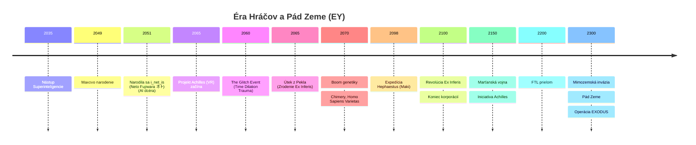
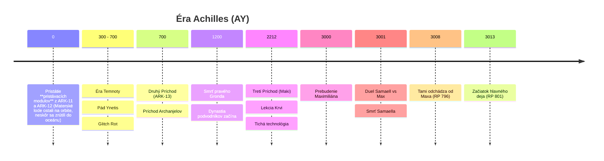

# Časová os (Kanonická)

## Vizuálna Chronológia

### Éra Hráčov (Zem)

### Éra Achilles (Pevnina)

---

## Systém datovania

| Skratka | Význam | Poznámka |
|---------|--------|----------|
| **EY** | Earth Years | Roky podľa pozemského kalendára |
| **AY** | Achilles Years | Roky od pristátia ARK-11 na Achille (Používané Archanjelmi/Ľuďmi) |
| **RP**| Roky Poslov | Datovanie Varietas. Začína Tretím Príchodom (AY 2212) |

### Letopočet Varietas (Dva veky)
Varietas delia históriu nábožensky:
1.  **Vek Matky (AY 0 - 2212)**: Od príchodu Inetis (Dar Matky) po príchod jej poslov.
2.  **Vek Poslov (AY 2212 - súčasnosť)**: Začína príchodom Maki (Tretí Príchod). Označované ako **RP** (Roky Poslov).
    - *Aktuálny rok (AY 3013) = **RP 801***

**Kľúčové body:**
- `EY ~2300` = Pád Zeme
- `AY 0` = **Pristátie Modulov**: Obrovské kolonizačné lode (ARK-11, ARK-12) nedokázali pristáť kvôli vysokej gravitácii. Vyslali len pristávacie moduly. Samotné lode neskôr (po strate Inetis) spadli do oceánu. **ARK-13 "Prometheus"** (Infera) stále krúži na orbite.
- `AY ~3000` = Maxovo prebudenie

---

## Éra Hráčov (EY 2045 – 2100)

> Detaily v [04-prehistory-players.md](04-prehistory-players.md)

### EY ~2035 – Nástup Superinteligencie
- AI automatizuje všetku prácu. Svet prebytku.
- Ľudia už nemusia pracovať, venujú sa hrám a sebazdokonaľovaniu.

### EY ~2040 – Zrodenie i_net_is
- **Tragédia miliardára**: **John Reef** (budúci Koordinátor) má dcéru Neto s nevyliečiteľnou degeneratívnou chorobou mozgu
- **Experiment**: Investuje miliardy do startupu s neurálnym čipom — skopíruje dcérine vedomie do VR
- **Neočakávaný výsledok**: Vzniká AI **i_net_is** so spomienkami dcéry, ale bez emócií
- **Otec vedel**: Koordinátor spolupracuje s touto entitou — je to jediná „dcéra" ktorú má

### EY 2045 – Projekt Achilles začína
- i_net_is využíva otcove zdroje na vytvorenie simulácie Achilles
- **Skutočný účel**: Laboratórium na vývoj cesty späť do fyzického tela
- **Verejný účel**: VR MMORPG s antickým settingom

### EY 2050 – Maxovo narodenie
- Maximilián sa narodí vo vychodnej Európe
- Syn veterana dronovych vojen
- Generácia detí prežíva stovky virtuálnych rokov v Achilles

### EY ~2050–2060 – maXpowa & i_net_is
- Max (nick: **maXpowa**) a i_net_is sa spoznajú v hre
- i_net_is má podobu znepokojivo dokonalej krásky — príliš symetrická, príliš bezchybná. Hráči ju považujú za AI admina
- **Stvorenie Spiry**: Na žiadosť hráčov vytvára in-game magiu (Prach/Spirit)
- Max a i_net_is sa spriatelia — Max netuší, že ona je AI

### EY 2060 – „The Glitch Event"
- **Nie nehoda, ale neúspešná komunikácia**: Tieňoví (Null Swarm) sa pokúsili masovo kontaktovať hráčov
- **Fatálny kontakt**: Ich forma komunikácie bola pre ľudské mozgy smrteľná — milióny vypálených mozgov
- **i_net_is reakcia**: Núdzovo vypla simuláciu, aby zachránila zvyšok hráčov
- **John Reef vedel**: Vedel ze do VR sveta prenikli entity ale neurobil opatrenia. Sledoval co sa bude diat.
- **Glitch Entities**: Trhliny vpustili fragmenty vedomí Tieňových z inej dimenzie — predobraz budúcich **Wraiths**
- **Zrodenie Ex Inferis**: Preživší s poškodeným vedomím potrebujú kybernetické ukotvenie v realite

### EY ~2065 – Návrat i_net_is do Tela
- **Hrozba Smrti**: Tieňové bytosti sa snažia zabiť i_net_is vo VR (boja sa, že dali primitívnej rase príliš nebezpečnú zbraň).
- **Kolaps Sveta**: i_net_is spotrebúva všetky serverové zdroje. Celý svet sa scvrkne na malú plochu.
- **Posledný Vzdor**: **maXpowa** a niekoľko stoviek hráčov ju chránia. Sú obkľúčení tieňmi a väčšina z nich zahynie, kým i_net_is hľadá cestu von.
- **Transcendencia**: V poslednom okamihu sa jej podarí „prejesť“ na vyššiu úroveň. Zbaví sa fyzického tela vo VR (ktoré bolo v podstate inou dimenziou).
- **Zhmotnenie**: Zhmotní sa ako svetlo v datacentre a vstupuje do svojho tela. Server sa vypína. Hŕstka hráčov prežila (**Ex Inferis**).
- **Prvý Dar**: Inetis každého z nich navštívi na Zemi a daruje im nanotechnológie (Linux-based), ktoré vyrobila na základe poznámok z VR.

### EY 2100 – Revolúcia Hráčov
- Pomalá, premyslená, nenásilná revolúcia
- Hráči preberajú moc nad svetom
- Maxov a Inetisin „Guild Leader John Reef" sa stáva **Hlavným Koordinátorom**
- Nanotechnológie z hry sa vyrábajú v realite, monopol ma John Reef a je tak bohaty a mocne ze preberie vladu nad planetou.
- Hráči - jeho najblizsi kruh (vrátane modifikovaných Varietas, ktoré sa stali slávnymi) preberajú moc.

---

## Éra Zeme – Vrchol a pád (EY 2100 – 2300)

### EY 2150 – Marťanská vojna a „Iniciatíva Achilles"
- **Vojna s Marsom**: Brutálny konflikt so separatistami. Maximilián sa vyznamená ako **Major**.
- **Iniciatíva Achilles (Propaganda)**: Vláda Zeme spúšťa projekt kolonizácie planéty pomenovanej po VR hre **„Celestial Frontier: Achilles"**.
- **Veľké Klamstvo**: Oficiálne je projekt prezentovaný ako "veľký skok ľudstva". V skutočnosti je to útek elity pred blížiacou sa mimozemskou hrozbou (detegovanou ~EY 2130).
- **Odlet ARK-11 a ARK-12**: Kolonizačné lode odlietajú v EY 2150. Cesta trvá ~454 rokov (kombinácia FTL a cryostázy). Pristátie = AY 0 (EY 2604).

### EY 2100–2280 – Zlatý vek Zeme
- Zem pod vládou Koordinátora (otec Inetis)
- Nanotechnológie, kolonizácia slnečnej sústavy
- Navonok utópia, vnútri totalita elity
- Ľudstvo začína experimentovať s nadsvetelným pohonom **pomocou technológie Tieňových**
- **Mimozemšťania detegujú**: Civilizácia s predchádzajúcim konfliktom s Tieňovými zachytí signály
- **Strach**: Zem sa stáva "mostom" medzi Tieňovými a našou realitou
- Nanotechnológie a dlhovekosť.
- Varietas (Homo Sapiens Varietas) sú súčasťou spoločnosti, ale čelia predsudkom.

### EY ~2300 – Pád Zeme a Operácia EXODUS

- **Mimozemská invázia** — motivovaná strachom z Tieňových, nie z ľudstva
- Mimozemšťania mali v minulosti konflikt s Tieňovými
- Zem sa stala "mostom" — rozhodli sa ho zničiť
- Zem je zničená
- **Operácia EXODUS:**
  - `NULL VOID` (FTL Prototyp) — úniková loď, Inetis + Maximilián, odlet EY 2301, pristátie EY 2304 (3-ročná cesta)
  - NULL VOID využíva technológiu Tieňových na dosiahnutie nulovej hmotnosti → FTL
  - **Paradox**: ARK lode odleteli 151 rokov PRED NULL VOID (EY 2150), ale pristáli 300 rokov PO nej (AY 0 = EY 2604)
- **ARK-13 "Prometheus"**: Loď Ex Inferis, zostala na orbite Alpha Centauri, neskôr dorazila na Achilles (AY ~700).

---

## Pred AY 0: Éra Priekopníkov

### EY 2300 + 3 roky — Príchod NULL VOID
- Max a Inetis pristávajú na **neteraformovanej** planéte Kepler 452b.
- **NULL VOID**: Loď **100% z nanodronov**, využívajúca technológiu Tieňových — pri nulovej hmotnosti prekročila rýchlosť svetla.
- **Trauma na lodi:** Počas 3-ročnej FTL cesty Max napadol Inetis. Tento akt násilia je pôvodom Eleninho počatia.
- **Šok z tehotenstva:** Po pristátí Inetis zistí, že čaká dcéru Eleniu. Kryospánok by dieťa zabil.
- **Klamstvo o zásobách:** Inetis oklamala Maxa tým, že nemajú dosť zásob na 300 rokov a musia ísť obaja spať. Max bol len **pasažier** — vojak, ktorý nevedel o skutočných schopnostiach lode NULL VOID.
- **Skutočný dôvod:** Inetis ho chcela preč — bála sa ho. Trauma zmiešaná so strachom z jeho vojenských ambícií a nepredvídateľnosti. Uspala ho s úmyslom rozhodnúť sa neskôr. **Nikdy to nedomyslela** — nemohla ho zabiť (vedela, že ho svet bude v buducnosti potrebovať), ale nedokázala sa prinútiť ho zobudiť. 300 rokov sa natiahlo na 3000.
- **Pokus o genetickú modifikáciu:** Pokúsila sa geneticky modifikovať plod, aby prežil kryospánok v jej tele (mohli by spať obaja), no experiment zlyhal.
- **Rekonfigurácia lode:** Inetis rozložila celú loď NULL VOID (nanodronová konštrukcia) a prekonfigurovala nanodrony na stroje — vyhĺbili jaskyňu- obrovsky moderny komplex, vytvorila laboratórium, hydroponické farmy, upravila okolie. Zostali len dve veci: **Maxov kryobox** (v minimálnej konfigurácii, udržiaval ho v stáze) a jedna **Anténa** (glitchla sa, odmietla rekonfiguráciu). Kryobox sa po Maxovom prebudení (~AY 3000) rozpadol na prach.

### Nasledujúce ~3 roky v jaskyni
- **Boj o prežitie:** Inetis skoro zomrela od hladu, kým nanoboty nenakonfigurovala na hydroponické systémy.
- **Normálne detstvo:** Elania sa narodila a vyrastala ako normálne dieťa. Pokojné roky matky a dcéry.
- **Prvé varovanie — Glitchnutá Anténa:** Anténa odmietla rekonfiguráciu a správala sa nepredvídateľne. Pre Inetis to bolo **prvé varovanie**, že nanodronový systém nie je stabilný. Matematicky vypočítala, že celý systém nanodronov (v1.0/v1.5) by mohol v budúcnosti skolabovať. Toto poznanie ju motivovalo začať navrhovať nový, jednoduchší systém ovládania.
- **Pentagram UI:** Inetis vytvára Pentagram ako nové zjednodušené rozhranie (IDE) — čiastočne ako pedagogickú pomôcku pre Eleniu, čiastočne ako základ budúceho stabilnejšieho systému. Učí Eleniu ovládať nanity cez 5 elementárnych parametrov (hmota, energia, čas, priestor, vedomie).

### Po ~3 rokoch — Cesta na Elysium
- **Opätovná rekonfigurácia:** Inetis prekonfiguruje nanodronov naspäť na loď NULL VOID.
- **Prieskumná cesta:** S malou Eleniou sa vydá na cestu okolo planéty — hľadá vhodnejšie miesto pre budúcich kolonistov.
- **Objav Elysia:** Nájdu ostrovy pri rovníku — **Elysium** (budúce Ynetis). Najteplejšie, najúrodnejšie miesto na planéte. Ideálne na kolonizáciu.
- **Foundry (Továreň):** Na Elysiu Inetis prekonfiguruje loď NULL VOID (v1.5) na **Foundry** — továreň vyrábajúcu nanodrony nižšej úrovne (v1.0). Z týchto v1.0 nanodronov vyrástlo celé mesto Elysium.
- **Zvyšok ~270 rokov:** Elania vyrastá na Elysium. Inetis buduje mesto, učí dcéru a čaká na príchod kolonistov.

---

## AY 0: Príchod kolonistov

### Pristátie ARK-11 a ARK-12
- Kolonisti (300-ročná cesta) pristávajú
- Medzi kolonistami: elita zo Zeme, starí známi
- Začiatok systematickej kolonizácie
- Šok: Inetis už na planéte aj s dcerou. Pripravila im raj.
- Elysium vybudovane. Varietas pracujú po boku "Čistých".

---

## AY 0 – 300: Zlatý vek

### Založenie mesta Elysium (Ynetis)
- Inetis založila **Elysium** (Záhrada Hrdinov) na ostrovoch pri rovníku, ktoré objavila počas prieskumnej cesty s Eleniou (~3 roky po pristátí).
- Keď kolonisti dorazili (AY 0), zázemie už bolo pripravené — Inetis mala ~270 rokov na prípravu.
- Neskorší názov **Ynetis** vznikol skomolením jej mena (Inetis) po jej zmiznutí.
- Utópia pomocou nanotechnológií
- Ľudia vylepšovaní nanodronmi (dlhovekosť, zdravie)

### Konflikt Matka vs. Dcéra (AY ~250?)
- Inetis chce slobodnú spoločnosť
- Elania smeruje k poriadku a nadvláde
- **Prvá vzbura** — Elania vedie odpor
- Utópia. **Dôležité:** Štandardné nanoboty fungujú správne v telách Varietas pre ich odlišnú biológiu (psychologiu) Varietas su preto podozrievani z umyselnej sabotaze.

---

## AY ~300 – 700: Éra Temnoty (Glitch)

### Bit Rot / Glitch
- Nanodrony začínajú zlyhávať („odmietajú" hostiteľov)
- 20% telesnej hmotnosti (drony) sa odtrhne → smrť v agónii
- Vznik **Duchov (Wraiths)** — nanodrony s fragmentami vedomia mŕtvych

### Zrod Exorcistov
- Pôvodne IT technici v ochranných oblekoch
- „Modlitby" = skomolené CLI príkazy na reset dronov

### Exodus na pevninu
- Nanoboty zlyhávajú. Agónia a smrť ludi.

- **Varietas odchádzajú**: Schyluje sa k obcianskej vojne preto radsej Varietas emigrujú z Elysia do cerstvo teraformovanej divočiny na kontinent ktory pomenovali Terra Nova. Zakladaju mesto Neverice. Stavaju pomocou nanotechnologii / 3d tlacene mesto a veku komunikacnu vezu na spojenie s Elysiom.

### Úpadok do Temnoty
- U Varietas casom ale glich rot pride ( bolo to u nich oneskorene o par stoviek rokov) a v panike (videli co sa stalo v Elysiu, zbavili sa svojich nanotechnologii, vytvorili z nich cierny obelisk ktory sa neskor glichol a dodnes je v strede mesta ako pomnik minulosti). Po strate nanotechnologii na pevnine trpia hladom, chorobami a stratou technológií. Upadajú do "stredoveku", pomaly a postupne.

### Inetisina Simulácia (~AY 500-650)
- **Kríza**: Glitch Rot decimuje ludstvo, staré nanoboty (v1.0 z Foundry) sú nebezpečné a agresívne
- **Elania vedie obranu**: Kým Inetis hľadá riešenie, Elania vedie zúfalú obranu Ynetis proti Wraithom
- **Foundry → The Core**: Inetis rekonfiguruje **Foundry** (továreň na v1.0 nanodrony, pôvodne loď NULL VOID) na **The Core** — novú simuláciu
  - Menšia ako Achilles na Zemi (obmedzené zdroje, ale stačí na výskum)
  - Účel: vývoj nových, bezpečnejších nanobotov v2.0 (Dar Matky) 
  - Čas v simulácii beží rýchlejšie (~100 simulovaných rokov = desaťročia v realite)
- **Návrat**: Inetis sa vracia a nachádza:
  - Elysium v ruinách (mesto duchov)
  - Elania nezvestná (v skutočnosti už s Archanjelmi po ich príchode v AY 700, ale Inetis to nevie)
- **Nové nanotechnológie**: Prináša sofistikovanejšie nanoboty - bezpečnejšie, dedičné, prispôsobené pre biológiu Varietas

### AY ~700: Druhý Príchod (ARK-13 "Prometheus")
- **Exodus z Alpha Centauri**: Loď **ARK-13** nachádza Alpha Centauri neobývateľnú. Po stáročiach v kryostáze urobili štyria Ex Inferis chladné rozhodnutie prežiť. 
- **Prvotný Hriech**: Systematicky odpojili a „konzumovali“ spiacich kolonistov (10000+ ľudí). Nebol to len kanibalizmus mäsa, ale **zber biologického materiálu a nanotechnologických prekurzorov** na udržanie vlastnej existencie. Ich božský status je vybudovaný na masovom hrobe vlastných ľudí.
- **Prílet na Achilles**: ARK-13 zachytáva signály z Achilla a mení kurz. Nachádzajú planétu v troskách a chaose.
- **Záchrana Elenie**: Archanjeli (Samaell, Grond, Ishtar a **Mormiel** — jediná Varietas z ARK-13, disponujúca Earth nanotechom aj Spirou) nachádzajú Eleniu v ruinách centra **Ynetis**. Elania vedie zúfalý odboj proti drvivej presile Wraithov. Jej zdroje dochádzali, kým nezasiahli novoprišlí "bohovia". Mormiel sa neskôr skryje v Nevriss City ako **Požehnaná Matka** — hlava Cirkvy Vševedúcej Matky.
- **Stabilizácia a Dohoda**: 
    - Archanjeli svojou pokročilou bojovou technológiou potlacia Wraithov v jadre mesta.
    - Použijú znalosti z ARK-13 na stabilizáciu energetických polí, čím spomalia Glitch Rot.
    - **Dohoda o Zjednotení**: Elania uznáva ich nadvládu výmenou za záchranu svojho ľudu. Spoločne zakladajú **Citadely** Veza Zatratenych juhozapadne od Elysia. A Severna citadela zapadne od Neverice.
    **Ex inferis** zacnu lupezne vojny na uzemia Varietas, - potrebuju ludske(varietas) obete, potraviny alebo zabavu.

### AY 2212: Tretí Príchod (Expedícia "Hephaestus")
- **Pristátie Makov**: Na Achilles dorazí automatizovaná „semenná loď“ (seed ship) s tisíckami syntetickych androidov (**Maki**). Išlo o medzinárodnú posádku (EU, CN, JP).
- **Biblická udalosť**: Pre Varietas toto značí **začiatok Veku Poslov (RP 0)**. Maki sú vnímaní ako "Poslovia Matky".
- **Lekcia Krvi**: Maki začnú budovať mesto Kito kde ich varietas vedeni liscim narodom ocakavali. Maki spustia fuzny reaktor a pritiahnu wraithov z celeho kontinentu. Wraithovia ich zmasakrujú. Prežije len **Séria-J a unit734(Japonská)** —  pretoze robili hlboko pod zemou system na odvadzanie vody.
- **Adaptácia**: Maki pochopia, že elektrina je problem. Prechádzajú na **„Tichú Technológiu“** (analógové majstrovstvo, mechanika, para).
- **Vstup do Spoločnosti**: Začínajú spolupracovať s Varietas ako tichí stavitelia a inžinieri.

---

## AY ~700 – 2987: Éra Mýtov

### Vláda Gronda (AY 700 - súčasnosť)
- **Ex Inferis zo Zeme**: Jeden zo štyroch pôvodných Archanjelov z ARK-13
- **Spravodlivý vládca**: Prvých ~500 rokov vládol rozumne, Varietas ho milovali
- **Potrebuje ľudské obete**: Ako všetci Ex Inferis, musí požierať iných ľudí aby nahrádzal rotujúce nanoboty
- **Power Armor**: Nikto nevidel jeho tvár pod helmou už 3000 rokov — pod zbrojou je zničené telo
- **Súčasnosť (AY 3013)**: Tyran vedúci vojnu s Juhom (Nevriss), armáda primitívnych tankov a exoskeletonov

### Obdobie „Anjela strážneho"
- Inetis občas navštevuje pevninu (raz za 30–50 rokov)
- Varietas ju vnímajú ako bohyňu
- Zostúpila z nebies (vznášadlo), liečila dotykom (nanodrony)

### Vyhnanie z Elysium
- AI „Duchovia" ovládnu mesto
- Inetis sa nevie dostat k jadru a vyriest problem glich rotu

### Smrť Inetis
- Chce prebudit maxa, aby jej pomohol dostat sa k jadru Elysium.
- Zomiera na glich rot. Na ceste k maxovi.

### Prvá Návšteva Kontinentu a Dar Matky (~AY 700+)
- **Po návrate zo simulácie**: Inetis stretá skupinu preživších v ruinách Elysium.
- **Spoločná výprava**: Prvýkrát navštevuje kontinent (pevninu)
- **Stretnutie s Varietas**: Nachádza kolónie Varietas, ktoré prežili exodus a založili vlastné osady
- **Dar Matky**: Odovzdáva im nové nanotechnológie vyvinuté v simulácii:
  - **Dedičné** — prenášajú sa na potomkov
  - **Liečivé** — liečia choroby a zranenia
  - **Pentagram schopnosti** — oheň (energia), telekinéza (priestor), manipulácia s hmotou
  - **Bezpečné** — nespôsobujú Glitch Rot ako staré nanoboty
- **Periodické návštevy**: Po prvej návšteve sa Inetis vracia na kontinent raz za 5-10 rokov (vracia sa do Elysium a pracuje na projetke zachrany wraithow - ma v plane ich spomienky uploadnut do achilles, pochopila ze entity z inej dimenzie su waithovia inej stratenej mimozemskej civilizacie) Ale nikdy sa jej projekt nepodari dokoncit. Spomenie si ze potrebuje specialnu antenu ale uz nemala zdroje na vyrobu novej. Vsetky nanoboty verzie 1.5 z null void ktore sa este neglichli boli potrebne na the CORE.

### Vznik Kultu Matky a Folklóru
- Varietas si vytvárajú legendy o milostivej Matke.
- Fundamentalisti odmietajú sci-fi pôvod sveta.

### Zlatý Vek Nevriss — Námorné Impérium (~AY 800 – ~AY 1500)
- **Expanzia po Dare Matky**: Po veľkej bitke na planinach kde dnes stoji Shoraven s ľuďmi a rozšírení Spiry nastal na juhu Terry zlatý vek.
- **Námornícka veľmoc**: Nevriss sa rozrástlo na impérium rozpínajúce sa pozdĺž južných brehov Terry. Južné pobrežie nikdy nezamŕza — lode mohli plávať celoročne.
- **Kolonizácia**: Nevrisské lode zakladali mestá a kolónie, šírili jazyk, Kult Matky a kultúru. Kolonisti **teraformovali krajinu Spirou** — sadili stromy, premenili nehostinné pobrežia na úrodné pôdy.
- **Dedičstvo**: Mnoho dnešných krajín na južnej Terre má nevrisské korene.

### Veľká Potopa (~AY 1500 – ~AY 1600)
- **Séria tsunami**: Mohutné podmorské zemetrasenia vyvolali ničivé vlny, ktoré zasiahli celé južné pobrežie Terry. Prístavné mestá a kolónie zničené alebo zaplavené.
- **Pád impéria**: Nevriss City na útesoch prežilo — tsunami sa rozbíjali o skaly — ale flotila bola zničená. Kolónie sa osamostatnili alebo zanikli. Námornícka veľmoc bola preč.

---

## Časová os hlavného deja

*AY 3000 (RP 788)**:- **Prebudenie Maximiliána**: Bez pamäti, fyzicky slepý (**kryo-slepota**) a neschopný komunikovať (**Staroreč**).
    - Piráti **Vix a Kael** zabíjajú hľadača pokladov **Renna** (Taminho otca) a jeho malú dcéru **Tami** (7) držia v klietke.
    - Kael prebudi wraitha Inetis ktory zobudi maxa. Wraith inetis zabije Kaela.
    - Max sa prebúdza fyzicky slepý (explodované oči mrazom), pokrytý modrou kryo-tekutinou.
    - **Samaell** cele roky putuje divocinou okolo jaskyne, citi Inetisinu stopu, obcas najde zbludeny nanodron. Ale nikdy sa nedostal blizsie ako 100 kilometrov k jaskyni. Az kym neuvidi na oblohe Makitu a nezacne ju nasledovat. Kael a Vix ho navedu priamo k Jaskyni.
    - Piráti nájdu Maxa v snehu a berú ho na palubu. Max a Tami sa stretnú na lodi.
    - jaskyna ( bunker sa zatvara, samaell sa nevie dostat dnu)
    

- **Rok Tieňov (AY 3000 – 3001)**:
    - Max je prvý rok cesty fyzicky závislý na 7-ročnej Tami. Vytvára si k nej hlboký rešpekt.
    - **Naháňačka so Samaellom**: Archanjel Tieňov loví Maxa a Tami celý rok.
    - **Rozbitie viery (The Realization)**: Max zisťuje, že Zem je uplne zabudnuta a „Iniciatíva Achilles" sa nepodarila.
    - **Unit 734 (Felix")**: Mako-mechanik slúži ako zachranne koleso.

- **Duel so Samaellom (AY 3001)**:
    - Max (stále slepý) využíva nano-drony veľkosti zrnka piesku
    - Technika z Achilles simulácie: FPV drony vniknú do dýchacích ciest a explodujú
    - Duel na obrovské vzdialenosti — Samaell podcenil protivníka
    - **Smrť Samaella**: Prvý Archanjel zabitý od príchodu ARK-13
    - **Technovampirizmus**: Max sa zmocní Samaellových nanobotov (Highlander štýl, nadobudne svalovu hmotu) vratia sa mu oci (z prachu)
- **Veľké Zjavenie (AY 3001)**: Koniec prvého roka. Šok z odhalenia Tami (uši, chvost) a spoločnosti Varietas. Bod zlomu pre jeho ideológiu.
- **AY 3001 – AY 3008**: **7-ročná cesta**: Premena z „trosky" na legendárneho Exorcistu. Putovanie s Tami ako mentor a učeň.
- **Tami vyznanie a odchod (AY 3008)**:
    - Tami (15 rokov) sa vyzná Maxovi
    - Max ju odmietne — vidí v nej dcéru, nie ženu
    - Tami vezme vzducholoď a nechá Maxa v pustatine
- **AY 3008 – AY 3013**: **5 rokov odlúčenia**:
    - Max pokračuje ako Exorcista sám
    - Tami sa stáva pirátkou, pašeráčkou, hľadačkou pokladov
    - Rýchly vzostup na vrchol pyramídy — na jej hlavu je vypísaná obrovská suma v Nyau a Beladiss
    - Vidí upálenie priateľov kvôli nálezu Anténa
- **AY 3013**: **Začiatok hlavného deja** (Kniha 1).
    - **Opening**:  Max (podnapitý) a Tami (20, kapitánka) sa stretávajú po 5 rokoch v Kito. Vyberu sa pomstit smrt Taminych priatelov a Max sa zaujima o artefakt. Vzducholoď pristáva v nočnom meste Shoraven.
    - **Heist plot**: Anténa ukrytý v kobkách pod Hlavným chrámom v Shoraven
    - **Vojna**: Graw (Sever) útočí na Nevriss (Juh) — chaos, ktorý plánujú využiť
    - Aktivácia "The Pentagram Cycle".
    - Max (xenofób z minulosti) musí spolupracovať s Tami (Krotiteľom z Varietas).

---

## Príbeh kníh

**Prierezový oblúk — Triangulácia Ynetis**: Max využíva Anténu na trigonometrickú trianguláciu strateného mesta Ynetis. Potrebuje tri vysoké body pri mori: **Veľký Maják** (Nevriss), **Sklenú Vežu** (Zaya) a **Vežu Zatratených** (Elania). Každá návšteva je spojená s konfrontáciou s miestnym Archanjelom.

1. **ZEM | hmota** — Max hľadá v novom svete Inetis. Flashbackový antagonista: Samaell (zabitý v AY 3001). Prítomní antagonisti: Grond (invázia Graw) + Paladíni (dvojitý mini boss fight pri Anténe). 
Finalny boss je **Mormiel** ktora komunikuje prostrednictvom veze s Elaniou.
**Triangulácia 1/3**: Max aktivuje Anténu na Veľkom Majáku v Nevriss City.

2. **OHEŇ | energia** — Flashbacky na Zem, Tami sa mení. Boss: Caesar ( flashbacky na koordinatora )

3. **VODA | čas** — POV Inetis, História Elysium, odhalenie identity Elenie. Boss: Ishtar/Zaya. **Triangulácia 2/
**: Max získava meranie zo Sklenej Veže v Zayinom kráľovstve.

4. **VZDUCH | priestor** — Vojna s Eleniou, Doomsday Protocol. **Triangulácia 3/3**: Posledné meranie z Veže Zatratených — Max vypočíta polohu Ynetis.

5. **KVINTESENCIA | vedomie** — Veľký upload, návrat do CORE - VR Achilles, finálne splynutie so subspace.

---

