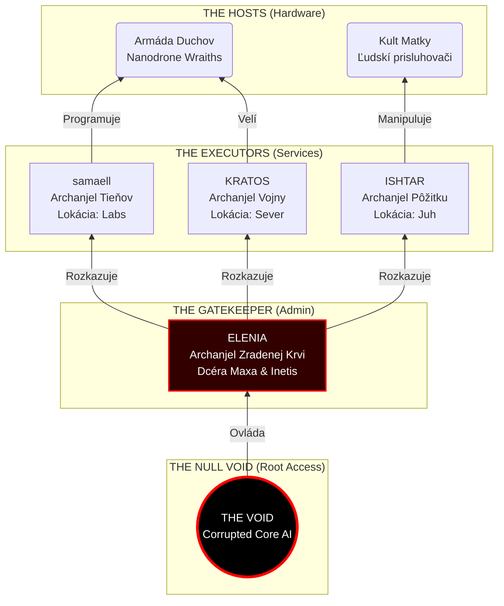

# Frakcie a Spoločnosť

---

## Rasy na Achille

### 1. Homo Sapiens Sapiens (Ľudia / "Čistí" / "Tí starí")
**Pôvod:** Pôvodní kolonisti zo Zeme, Hráči a ich priami potomkovia.

**Biológia:** Vďaka špičkovej nanotechnológii zo Zeme, ktorú majú v telách od narodenia, nestarnú a sú imúnni voči chorobám. Dožívajú sa tisíce rokov, pokiaľ ich nezabije násilie alebo "Glitch" (preto sa tak boja technológie). Sú to "elfovia" tohto sveta.

**Status:** Sú vzácni. Väčšina žije izolovane ako Archanjeli vo svojich doménach. Tí, čo žijú medzi Chimérami, sú považovaní za nedotknuteľnú elitu, ale sú tajne nenávidení pre svoju nesmrteľnosť.

### 2. Homo Sapiens Varietas (Chiméry / Neo-Morfovia)
**Hanlivé názvy:** "Zver", "Miešanci", "Hračky", "Krátkožijúci".

**Pôvod:** Potomkovia geneticky modifikovaných ľudí zo Zeme (pôvodne pre módu/dekadenciu). Pretože ich fyziológia bola odlišná, pôvodné udržiavacie nanoboty v nich nefungovali.

**Biológia:** Sú smrteľní. Starnú a zomierajú (dožívajú sa cca 60-80 rokov). Sú náchylní na choroby a hlad. Ich vzhľad je rôznorodý – od jemných zvieracích čŕt (oči, zuby, srsť) až po výrazné deformácie.
**Spoločnosť:** Tvoria 99% populácie planéty. Majú vlastné kráľovstvá, kmene, jazyky a bohatý folklór, ktorý vznikol za 2000 rokov izolácie.

### 3. Androidi (Synths)
**Pôvod:** Expedícia "Hephaestus" (semenná loď z roku 2098 AD). Prišli v roku 2000 AY.

**Biológia:** Biologické stroje (organické telá, bio-počítačové mozgy). Nemajú emócie, strach ani ambície. Sú riadení Direktívou: "Prežiť. Stavať. Pomáhať ludstvu."

**Vzhľad:** Často vyzerajú ako dokonalí, symetrickí ľudia. Sú tichí a hyper-efektívni.

---

## Mocenská Pyramída (Hierarchia)

### 1. Archanjeli (The Executors)
Vládnuca kasta nesmrteľných Homo Sapiens Sapiens. Založená štyrmi pôvodnými **Ex Inferis**, ktorí sa vrátili na lodi **ARK-13 "Prometheus"** okolo roku **700 AY**.
- **Príchod a Záchrana**: Našli Achilles v troskách a Eleniu bojujúcu zúfalý boj proti Wraithom v ruinách centra Ynetis. Ich intervencia zvrátila priebeh boja.
- **Ideológia (Protokol Bača)**: Archanjeli sa vnímajú ako vrchol evolúcie. Chiméry sú pre nich len „krátkožijúci dobytok“ a zdroj nanobotov. Synths vnímajú ako užitočných „farmárov“ – ich technológia (vzducholode, kanalizácia) zabezpečuje zdravšie a početnejšie stádo Chimér. Viac zdravých Chimér = viac kvalitných nanobotov (krvných obetí) pre Archanjelov.
- **Skutočný Strach**: Boja sa len dvoch vecí: **Wraithov** (ktorí môžu poškodiť systémy Citadely) a **Hniloby (Glitch Rot)**, ktorá korumpuje nanoboty a robí ich nepoužiteľnými.
- **Odber (Zber)**: Lovci Archanjelov pátrajú po ľuďoch s „Darom Matky“. Tento proces je brutálny – Archanjeli z nich vysajú nanoboty, čo obeť zabije a zanechá len „vysušenú schránku“.
- **Dôsledok pre spoločnosť**: Mágia je medzi Chimérami vnímaná s nádejou, ale aj s extrémnym strachom. Mať schopnosti znamená stať sa terčom pre „Bohov“. To vedie k tomu, že rodiny svoje nadané deti často skrývajú alebo ich schopnosti potláčajú.
- **Vládcovia**:
    - **Samaell:** Tieň, tajomstvo, staré technológie.
    - **Kratos:** Vojna, priemysel, hrubá sila.
    - **Ishtar:** Pôžitok, drogy, propaganda/ilúzie.
    - **Elenia:** Pôvodná vodkyňa, ktorá uznala ich nadvládu výmenou za prežitie svojho ľudu. Slúži ako "Gatekeeper".

### 2. "Tí Roztrúsení" (Ľudia medzi Chimérami)
Trosky starej civilizácie Homo Sapiens Sapiens, ktorí nie sú warlordi.
- **Status:** Žijú v mestách Chimér ako vážená, ale obávaná elita (lekári, učitelia, poradcovia).
- **Psychológia:** Paralyzovaní nostalgiou a traumou. Videli pád sveta. Boja sa hovoriť o minulosti (Protokol Ticha). Sú to cynickí, depresívni "nesmrteľní".

### 3. Potulní Exorcisti (The Wandering Exorcists)
Drsní žoldnieri a veteráni špecializovaní na boj v zamorených zónach. Nie sú to kňazi, ale „likvidátori“.
- **Rola**: Čistia ložiská **Hniloby** a „vyháňajú“ **Wraithov** (fyzickým ničením hardvéru). Používajú ťažké skafandre, plameňomety a analógové zbrane.
- **Zloženie**: Zúfalí ľudia (odolnejší voči Hnilobe) alebo Chiméry. Práca s najvyššou úmrtnosťou.
- **Status**: Sú nesmierne bohatí, no žijú krátko. Platení sú v čistom zlate.

### 4. Androidi (Synths)
Neemotívni inžinieri a stavitelia. 
- **Rola:** Poskytujú technické znalosti a stavajú analógovú infraštruktúru (vzducholode, zavlažovanie).
- **Status:** Sú neutrálni, ale rešpektovaní. Pre Archanjelov sú hrozbou, pre Chiméry spasiteľmi.

### 5. Chiméry (The Serfs)
Väčšina populácie. Pracujú v doménach Archanjelov alebo žijú v kmeňoch.

---

## Sociálna Dynamika & Konflikt

### 1. Závisť a Nenávisť (Smrteľnosť vs. Večnosť)
Toto je jadro napätia. Chiméry budujú, množia sa a umierajú v priebehu jednej generácie. Ľudia sa na to pozerajú celé stáročia, nemenní a arogantní. Chiméry vnímajú ľudí ako sebeckých bohov, ktorí sa nechcú podeliť o dar večnosti.

**Vnútorný rasizmus:** Chiméry sú rasistické aj medzi sebou (napr. tí s "čistejšími" črtami pohŕdajú tými s deformáciami).

### 2. Folklór vs. Pravda
- **Pravda:** Ľudia vedia, že svet bol sci-fi civilizácia zničená AI. Mlčia o tom zo strachu.
- **Folklór Chimér:** Veria v "Matku Inetis", ktorá im dala dary (mágiu) a veria, že ľudia sú padlí anjeli. Fundamentalisti odmietajú vedeckú pravdu.

### 3. Logika vs. Emócie vs. Stagnácia
Synths priniesli tretiu stranu konfliktu.
- **Archanjeli (Stagnácia):** Chcú udržať status quo a svoje chátrajúce telá. Synths sú pre nich nekontrolovateľní paraziti (nedajú sa vysiať).
- **Chiméry (Emócie):** Túžia po pokroku a slobode. Synths sú ich pohonným motorom.
- **Synths (Čistá Logika):** Budujú, lebo je to ich program. Ich prítomnosť dáva Chiméram technológiu, ktorá im umožňuje obchádzať nadvládu Archanjelov (napr. Vzducholode).

### 4. Predsudky vs. Skúsenosť (Kríza identity)
Najhlbší psychologický konflikt sveta.
- **Pravda v tme**: Maxov príklad ukazuje, že rešpekt sa dá vybudovať aj medzi úhlavnými nepriateľmi, ak je potlačený vizuálny vnem.
- **Dôsledok Zjavenia**: Keď sa predsudok stretne s pozitívnou osobnou skúsenosťou (napr. Max zistí, že jeho záchranca je Chiméra), dochádza k rozbitiu identity. Buď jedinec prijme novú realitu, alebo sa stiahne do ešte agresívnejšej nenávisti, aby ochránil svoje staré vnímanie sveta.

### 5. Achilles: Mýtus o Pevnosti vs. Realita Hrdze
Názov planéty odráža najväčšiu iróniu sveta.
- **Ľudský Mýtus**: Pre tých, čo prišli zo Zeme, mal byť Achilles „Nezlomným štítom“ a základňou pre návrat domov.
- **Chiméria Realita**: Pre domorodcov je to len meno z rozprávok. Planétu vnímajú ako „hrobku hrdze a kostí“. Pre nich Achilles neznamená hrdinu, ale miesto, kde nádej prišla zomrieť.
- **Achillova Päta**: Svet sa stal zosobnením ľudskej slabosti — zbabelosti elity, ktorá namiesto budovania armády pre návrat na Zem podľahla vlastnému božstvu a dekadencii.

---

## Ekonomika a Život

### Ekonomika Zlata
V svete bez digitálnych transakcií (kvôli Wraithom) sa zlato stalo jedinou univerzálnou menou.
- **Stabilita**: Zlato je chemicky stabilné, nekazí sa Hnilobou a je vzácne.
- **Krvavé Zlato**: Archanjeli platia Exorcistom v starovekom zlate z ARK-13 za riskantné misie v ruinách. To z nich robí najbohatších jedincov mimo Citadel.

### Doprava
1. **Vzducholode:** Najrýchlejšia doprava. Využívajú hustejšiu atmosféru.
2. **Geneticky modifikované Zvieratá:** Psy (náhrada koní) a mačky. Všetky sú inteligentné a vedia rozprávať.
3. **Vlaky:** Existujú *iba* v Južnom kráľovstve (Ishtar).

---

## Jazyková Situácia (Babylon 2700)
Izolácia a úpadok technológií rozbili jednotnú reč na niekoľko vrstiev:

- **Staroreč (Ancient / Stará angličtina)**: Jazyk Ex Inferis a pôvodných ľudí zo Zeme. Pre moderných obyvateľov znie archaicky a nezrozumiteľne.
- **RP English (Kráľovská angličtina)**: Štandardný jazyk Synthov. Formálny, neemotívny a chladný. Slúži ako hlavný most pre tých, čo sa vracajú zo stázy.
- **Neo-Terran**: Zmutovaná angličtina ovplyvnená dialektmi Chimér. Jazyk obchodu a bežných ľudí.
- **Wildspeak (Bľabot)**: Rôznorodé dialekty a slangy Chimér, často postavené na zvukoch a gestách.

---

## Tradície a Kultúra

### „Modlitby“ Exorcistov (CLI jazyk)
- Skomolené príkazy z Unix/Linux príkazového riadku, ktoré foneticky fungujú ako hlasové kódy pre reset nanodronov.
- Príklad: `sudo kill -9` → **„Suudokil“**.
- Význam: Rituálna ochrana pred nanotechnologickými hrozbami.

### Rituálne obrazce
- Kreslenie pentagramov alebo obvodov **vodivou pastou**.
- V skutočnosti ide o uzatváranie obvodov a aktiváciu starých bezpečnostných alebo údržbových postupov.

---

## Frakcie (Lore Register)

- **Kult Matky Spasiteľky**: Dominantné náboženstvo; uctieva Inetis ako bohyňu („Matka nás opustila pre naše hriechy“).
- **Archanjeli**: Štyria nesmrteľní vládcovia/domény (Samaell, Kratos, Ishtar, Elenia).
- **Exorcisti / Technomanti**: Tajný rád likvidátorov, ktorí bojujú proti Hnilobe a Wraithom.
- **Kolonisti Ynetis**: Prvá vlna osadníkov; ich pád stojí v základoch moderných mýtov.
- **Pozemský režim**: Totalitná štruktúra Zeme pred pádom.
