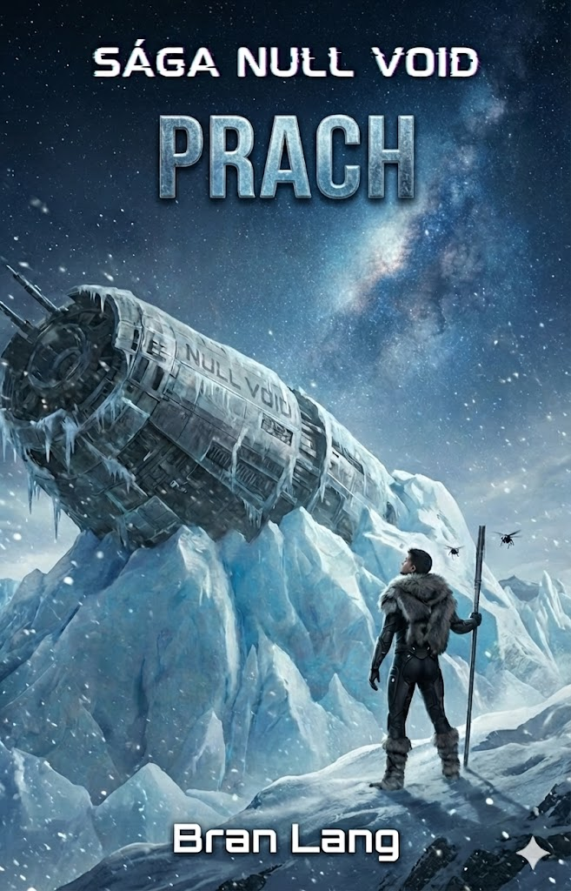

# Kniha 1: ZEM-hmota – Prach Nevriss
**Status:** Plotting (Revised)
**Hlavná téma:** Hľadanie stratenej minulosti / Stretnutie po rokoch / Krádež relikvie

---

## Časová Os

| Rok (AY) | Udalosť |
|----------|---------|
| ~850 | Inetis zomiera v jaskyni Ela, nastavuje alarm, Anténa obsahuje jej esenciu |
| 3000 | Kael aktivuje alarm vstupom do jaskyne, Maks sa prebúdza, Samaell zabíja Kaela v hlbinách |
| 3000 | Piráti (Taminin otec) nájdu Maksa v bezvedomí, zoberú ho. Nevedia sa vrátiť — Samaell je dole |
| 3000-3008 | Maks a Tami (7→15) spolu. Maks porazí Samaella (prvýkrát), získa jeho nanoboty |
| 3008 | Maks a Tami sa rozdelia (dôvod TBD). Tami má 15 |
| 3008-3013 | Maks žije v Kito s Felixom, pracuje ako Exorcista v Nyau, hľadá odpovede o svojom pôvode |
| 3008-3013 | Tami buduje svoju pirátsku kariéru, stáva sa kapitánkou Itaky |
| 3013 | Tami (20) nájde otcovu starú mapu. Podozrieva, že je to miesto Maxovho pristátia |
| 3013 | Tami s posádkou objaví jaskyňu. Nájdu len kostru, kresby, a čiernu tyč (Anténu) |
| 3013 | Flint, Arkot a Yera zradia Tami — ukradnú Anténu a pokúsia sa ju predať v Šoravene |
| 3013 | **Mormiel** sa osobne zaujíma o artefakt. Inkvizícia zatkne trojicu — Flint zabitý (tasil zbraň), telo vystavené. Arkot a Yera uväznení. Anténa uložená do Mormielin falošnej krypty |
| 3013 | Tami sa dozvie o zatýkaní. Vie o zrade, ale príde ich zachrániť — sú jej rodina |
| 3013 | Maks ide za Felixom po pomoc. Tami prichádza k Felixovi v ten istý čas |
| 3013 | Stretnutie po 5 rokoch. Začiatok Knihy 1 |

---

## Prológ: Kael a Tieň (AY 3000)

*   **Akcia:** Samaell loví Kaela. Počas súboja Samaell náhle stuhne. Cíti niečo, čo necítil 2000 rokov – **Hmlu** (Maksova signatúra).
*   **Fascinácia:** Samaell vie, že na svete je ďalší *ex inferis*. Tento objav ho fascinuje. Nechá Kaela utiecť hlbšie do jaskyne.
*   **Alarm:** Kael prekročí prah jaskynného komplexu. Alarm sa aktivuje. Niekde v hĺbke začína proces rozmrazovania.

---

## Časť 1: Záchrana v Snehu (AY 3000)

### Scéna 1: Chrám v Jaskyni (Bývalý domov Inetis)
*   **Jaskyňa:** Kael sa plazí do útrob systému, ktorý bol kedysi technologickou oázou.
*   **Objav:** Steny sú pokryté kresbami (Elaniina práca) a pozostatkami hydroponických fariem.
*   **Ruiny:** Bizarná zmes skaly a terminálov.

### Scéna 2: Prebudenie Spiaceho
*   **Alarm:** Keď Kael vstúpil, alarm sa aktivoval. Kryobox už hučí.
*   **Kryobox:** Kael nájde hučiaci kryobox. AI hlási: *„Narušenie perimetra. Aktivujem núdzový protokol."*
*   **Strážkyňa:** O box je opretá kostra s čiernou tyčou (Anténou) v rukách.
*   **Koniec:** Kael uteká. Maks sa prebúdza v šoku, slepý, na pokraji smrti. Nevidí nič, nevníma nič. Len únik.

### Scéna 3: Samaell a Jaskyňa
*   **Samaell prichádza:** Nájde komoru. Vidí rozpadnutý kryobox, kostru, a čiernu tyč.
*   **Ignoruje Anténu:** Pre Samaella je to len čierny kus kovu. Anténa je "glitchnutá" — nevysiela žiadnu signatúru. Nevidí v nej nič cenné.
*   **Priorita:** Maksova "Hmla" je oveľa zaujímavejšia. Odchádza za stopou. Anténa ostáva pri kostre.

### Scéna 4: Piráti
*   **Nález:** Taminin otec a piráti nájdu Maksa v bezvedomí vonku pri vchode.
*   **Zoberú ho:** Maks je cenný tovar — alebo záhada.
*   **Nemôžu sa vrátiť:** Vedia, že dole je niečo nebezpečné. Samaell? Wraithy? Nechcú riskovať.
*   **Mapa:** Otec si poznamená polohu. Jedného dňa sa vrátia po "poklad".

---

## Časť 2: Roky v Tieni (AY 3000-3008)

*   **Maks a Tami:** Spoločné roky. Maks ju chráni, učí, hľadá odpovede.
*   **Samaell v pätách:** Konfrontácia. Maks aktivuje maXpowa mód. Samaell porazený (ale nie mŕtvy).
*   **Rozchod (AY 3008):** Maks a Tami sa rozdelia (dôvod TBD — možno Maks ju chce chrániť, možno konflikt).

---

## Časť 3: Päť Rokov Ticha (AY 3008-3013)

### Maks v Kito
*   Žije s Felixom (syntetický majster/Mako).
*   Pracuje ako Exorcista v kráľovstve Nyau (juh).
*   Hľadá odpovede — nevie, kde sa zobudil, nevie nič o jaskyni.
*   Kontroluje, či odmena na Tami bola vyplatená (vie, že žije, kým je odmena aktívna).

### Tami — Kapitánka Itaky
*   Buduje svoju reputáciu. Stáva sa legendou.
*   Nevracia sa k Maksovi. Pozerá sa dopredu.
*   Jedného dňa pri upratovaní nájde **otcovu starú mapu**.

---

## Časť 4: Návrat do Jaskyne (AY 3013)

### Tamiho Objav
*   **Mapa:** Stará, zaprášená. Značka západne od Kito.
*   **Podozrenie:** Maks jej kedysi rozprával o pristátí s Inetis. Kryospánok na 300 rokov. Čakanie na kolonistov.
*   **Intuícia:** *„Čo ak je to ono? Čo ak tam nájdem jeho minulosť?"*

### Expedícia
*   Tami s posádkou sa vydáva na západ.
*   Nájdu jaskynný komplex. Zvláštna energia. Staré kresby.
*   **Objav:** Kostra. Čierna tyč. Nič iné.
*   **Sklamanie posádky:** *„Toto je ten poklad? Kus kovu?"*

### Rozchod
*   Posádka berie Anténu do Nevriss na predaj na čiernom trhu.
*   Tami: *„Musím ísť za starým známym. Toto je dôležitejšie než prachy."*
*   Vydáva sa do Kito hľadať Maksa.

---

## Časť 5: Kolízia (AY 3013)

### Mormiel a Anténa
*   **Záujem:** Mormiel — Požehnaná Matka Cirkvi — sa osobne zaujíma o "čiernu tyč".
*   **Prečo?** Mormiel má Gen 1 nanotech (tajomstvo). Vie, čo Anténa je. Rozpoznala ju.
*   **Zametanie stôp:** Cirkev chytí Taminu posádku. Upálení na námestí ako "heretici s diabolským artefaktom".
*   **Krytie:** Oficiálny príbeh: *"Piráti priniesli prekliatý predmet. Boli očistení ohňom."*

### Maks v Nyau
*   Kontroluje odmenu na Tami. Stále aktívna — žije.
*   Dozvedá sa: *„Pirátov z lode Itaka upálili na námestí v Nevriss."*
*   **Panika:** Myslí si, že Tami je medzi nimi. Odmena je stále aktívna — ale možno ju nestihli aktualizovať?
*   Beží za Felixom po pomoc.

### Stretnutie u Felixa
*   Maks dorazí k Felixovi: *„Pomôž mi. Musíme ísť do Nevriss. Musím vedieť, či..."*
*   Dvere sa otvoria. Stojí tam Tami.
*   **5 rokov ticha. Jeden pohľad.**

---

## Časť 6: Krádež Antény (Hlavný Dej Knihy 1)

*   Maks a Tami sa dozvedia, že Cirkev má Anténu.
*   Heist mission: Ukradnúť relikviu z Chrámu v Nevriss.
*   Počas misie Maks získa Anténu — a začnú sa vracať spomienky.

---

## Lore Poznámka: Prečo Samaell ignoroval Anténu

> **Anténa je "neviditeľná".** Je to glitchnutý artefakt — jediná časť lode Null-Void, ktorá odmietla rekonfiguráciu. Tento glitch má zaujímavý vedľajší efekt: Anténa **nevysiela žiadnu signatúru**. Pre kohokoľvek s nanodetekciou (Samaell, Exorcisti) je to len kus čierneho kovu.
>
> Samaell hľadá Gen 1 nanoboty, "Hmlu", živú energiu. Anténa mu nič z toho neponúka. Je pre neho neviditeľná — a preto bezcenná.
>
> Irónia: Anténa obsahuje Inetisinu esenciu. Je to najcennejší artefakt na planéte. A Samaell ju nechal ležať pri kostre 13 rokov.

---

## Vizuál (Návrh obalu)
*   **Obrázok**: 

## Referencie
*   [Maks Awakening Concept](book-1-prach-achilla/concepts/max-awakening-concept.md)
*   [Inetis Character](characters/Inetis.md)
