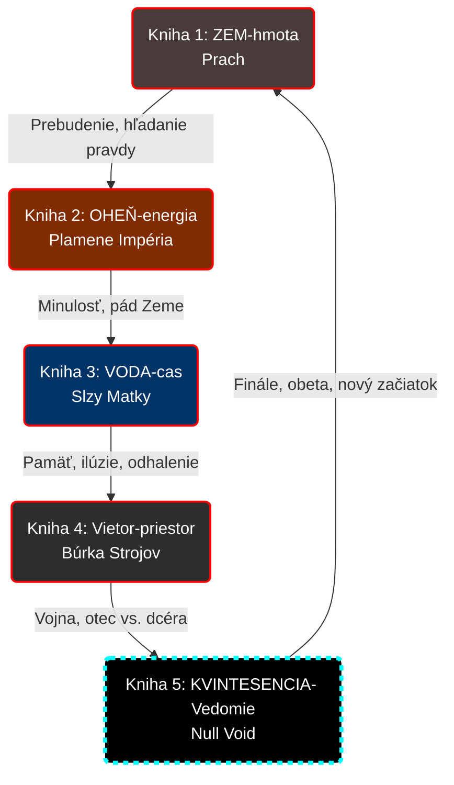

# Prehľad kníh (Pentalógia)

## Štruktúra

| Kniha | Element | Názov | Téma |
|-------|---------|-------|------|
| 1 | 🜃 ZEM-hmota | Prach Achilla | Prebudenie, hľadanie pravdy |
| 2 | 🜂 OHEŇ-energia | Plamene Impéria | Minulosť, pád Zeme |
| 3 | 🜄 VODA-cas | Slzy Matky | Pamäť, ilúzie, odhalenie |
| 4 | 🜁 Vietor-priestor | Búrka Strojov | Vojna, otec vs. dcéra |
| 5 | ✧ KVINTESENCIA- Vedomie | Null Void | Finále, obeta, nový začiatok |

### Vizuálny plán (Pentagram Cycle)

---

## Kniha 1: ZEM-hmota – Prach Achilla

### Dej
- Max sa prebúdza z 3000-ročného kryospánku
- Loď zničená, modul Inetis prázdny
- Stretáva Tami (7-ročnú zachráni, o 13 rokov sa stretnú znova)
- Hľadá Inetis v post-apo svete

### Konflikt
- Boj s divochmi a Kultom Matky
- Max si uvedomuje, že „Matka" je Inetis

### Finále
- Nájdenie jaskyne a **tela Inetis** (kostra + denníky)
- Šok: je mŕtva ~2300 rokov
- Boss: **samaell** naznačí existenciu Elenie

---

## Kniha 2: OHEŇ-energia – Plamene Impéria
> Detailná osnova: [02-ohen.md](02-ohen.md)

### Dej (dvojitá línia)

**Flashbacky (Zem):**
- **ex inferis:** Maxovo uväznenie vo VR pekle Achilles.
- **Vojna s Marsom (2150):** Max ako elitný zabijak Koordinátora.
- **Pád Zeme (2300):** Dramatický útek s Inetis na lodi Null-Void.

**Prítomnosť:**
- Max a 7-ročná Tami putujú na Juh cez Severné pustatiny.
- Putovanie trvá 13 rokov (kým Tami nedosiahne 20 rokov).
- Prvé strety s jednotkami Kratosa.

### Konflikt
- Maxov boj s vlastnou tieňovou minulosťou zabijaka.
- **Kratos** (Archanjel Vojny) vs. relikt starej éry.

---

## Kniha 3: VODA-cas – Slzy Matky
> Detailná osnova: [03-voda.md](03-voda.md)

### Dej
- Cesta do Prístavu a Pobrežných miest.
- Infiltrácia na **Ostrov Ynetis**.
- Tami sa mení na nádobu pre Inetis (strach zo straty identity).

### Prostredie
- **Mesto Zrkadiel (Ishtarina doména):** Miesto ilúzií a neuro-hackingu.
- **Ynetis (Mesto Duchov):** Čiastočne zarastený ostrov plný rogue AI (Duchovia).

### Konflikt
- **Ishtar** a her útok na Maxovu psychiku cez obraz dokonalej rodiny.
- Odhalenie pravdy o **Bit Rot Glitchi** (Eleniina zrada).

### Finále
- Archív v Ynetis odhalí Maxovi najväčšie tajomstvo: Elenia je jeho dcéra.

---

## Kniha 4: Vietor-priestor – Búrka Strojov
> Detailná osnova: [04-vzduch.md](04-vzduch.md)

### Dej
- Otvorená konfrontácia Max vs. Elenia.
- Infiltrácia ku **Kráteru** (vykopávky lode Exodus).
- Súboj so **Starou Gardou** (Nesmrteľní) — pôvodnými kolonistami.

### Mechaniky
- **Aegis Field (The Breach Spike):** Maxova schopnosť neviditeľnosti/štítu, ktorá ho však odrezáva od dronov a robí z neho smrteľníka.
- **Vákuová mágia:** Tisícročné skúsenosti kolonistov umožňujú ohýbať vzduch a drony spôsobom, ktorý Max neovláda.

### Konflikt
- **Otec vs. Dcéra:** Stret dvoch pohľadov na spásu (Biológia vs. Digitálna utópia).
- Maxova neochota zabiť dcéru vs. Eleniina chladná logika "spásy".

### Finále
- Elenia aktivuje **Protokol Null** v Jadrue.
- **CLIFFHANGER:** Zastavenie Duchov po celom svete a desivé ticho pred búrkou.

---

## Kniha 5: KVINTESENCIA- Vedomie – Null Void

> Detaily v [05-kvintesencia.md](05-kvintesencia.md)

### Dej
- Protokol Null aktívny, svet sa rozpadá
- Max a Tami vstupujú do Jadra lode Exodus
- Max sa pripojí do virtuálnej reality

### Nový Achilles
- Elenia vytvorila rekonštrukciu pôvodnej hry
- Ponúka Maxovi dokonalý raj + digitálnu Inetis

### Odhalenie
- Glitch Entities sa prebúdzajú
- Elenia nevedomky buduje „kŕmidlo" pre digitálne parazity

### Finále
- **maXpowa & i_net_is** spolu naposledy
- Max obetuje svoje vedomie ako „záplatu"
- Protokol sa zastaví

### Epilóg
- Max = Duch v Stroji (strážca)
- Elenia = smrteľná, zlomená
- Tami = vodkyňa novej éry
