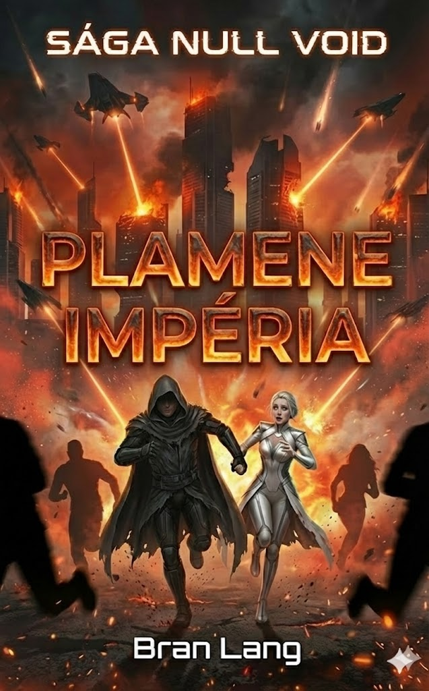

# Kniha 2: OHEŇ-energia – Plamene Impéria (Oheň)
**Status:** Plotting
**Hlavná téma:** Pôvod / Očista ohňom / Zvrat v pamäti

---

## I. Línia A: Minulosť (Éra Zeme & ex inferis)

### 1. Projekt Achilles (VR Peklo)
*   **Vzťah Maksa a Inetis:** Ukážeme ich začiatky v Simulácii. Maks (**maXpowa**) ako tichý ochranca, Inetis (**i_net_is**) ako vizionárka.
*   **Subjective Time:** Roky strávené v hre, kým vonku ubehli mesiace.
*   **The Glitch:** Moment, kedy sa hra zmenila na peklo. Milióny mŕtvych. Maks a Inetis sú medzi tými, čo prežili (**ex inferis**).

### 2. Vzostup Koordinátora (2099 – 2150)
*   **Revolúcia:** Koordinátor (otec Inetis) využíva hnev preživších a nanotechnológiu z hry na ovládnutie Zeme.
*   **Maksova Premena:** Koordinátor si Maksa adoptuje (duchovne) a mení ho na svoju päsť. Maks sa stáva elitným dronárom zabijakom.
*   **Ideologický rozchod:** Inetis buduje nemocnice a mestá, Maks vyhadzuje do vzduchu rebelské centrály na Marse. Ich láska trpí pod tlakom "techno-fašizmu" Koordinátora.

### 3. Pád Zeme (2300)
*   **FTL Hrozba:** Mimozemšťania prichádzajú. Beznádej obyvateľstva, keď zistia, že Koordinátorova flotila zlyhala pri Plute.
*   **Útek:** Maksov krvavý beh cez horiace veľkomesto, aby zachránil Inetis. Smrť Koordinátora a posledný rozkaz.
*   **Null-Void:** Štart lode v poslednej sekunde.

---

## II. Línia B: Prítomnosť (Púšť Achilla, AY 3000 – AY 3010)

### 1. Putovanie na Juh
*   **Mentor a Dieťa:** Maks a 7-ročná Tami putujú cez nehostinný Sever. Maks bojuje s amnéziou. Zraky sa mu vracajú, ale svet je iný – temný, stredoveký.
*   **Echo Inetis:** Tami začína vykazovať prvé známky prepojenia s "Prachom" (nanodronmi) Inetis. Maks v nej občas vidí svoju lásku, čo ho desí.

### 2. Smer Juh
*   Tami Maksovi rozpráva o "Mestách Zrkadiel" na juhu, kde je teplo. Maks cíti, že tam musí ísť, lebo cíti volanie pôvodnej technológie.

### 3. Nevriss City — Rituál Nástupníctva
*   **Príchod:** Maks a Tami (~20) dorazia do Nevriss City — hlavného mesta, ďaleko od vojnovej fronty. Dúfajú, že Požehnaná Matka ich vypočuje a pomôže — Maks hľadá informácie o Inetis, Tami hľadá odpovede na to, čo je zač.
*   **Výber:** Požehnaná Matka (Mormiel v aktuálnej podobe) ohlási Rituál Nástupníctva — výber novej Požehnanej Matky. Celé mesto oslavuje. Mormiel si vyberie **Tami** — mladú líšku s najsilnejšou Spirou, akú kedy videla. Pre Tami a Maksa je to najväčšia česť. Pre mesto je to sviatok. Nikto netuší, čo sa deje za zatvorenými dverami Svätyne Premeny.
*   **Temné pozadie (čitateľ vie, postavy nie):** Mormiel je 4. Archbés. Rituál Nástupníctva nie je svätý obrad — je to pohltenie. Mormiel chce Tami rozložiť nanotechnológiou a absorbovať jej telo, Spiru a podobu. Za ~2300 rokov to urobila ~23-krát. Tami by bola ďalšia.
*   **Prečo práve Tami:** Tami má Dar Matky na úrovni, ktorú Mormiel nevidela od čias Inetis. Jej dvojitá kompatibilita (líščia Varietas DNA + extrémne silné nanoboty) by Mormiel dala najsilnejšie telo za celú jej existenciu.
*   **Dôsledky:** Tami vstupuje do Svätyne Premeny v dobrej viere. Maks čaká vonku. Tri dni a tri noci. A niečo sa pokazí — alebo Maks niečo zistí.

---

## III. Hlavný Antagonista: KRATOS (Archbés Vojny)
*   **Stret:** Maks and Tami sa prvýkrát stretnú s jednotkami Gronda. Sú to mechanizované hordy v troskách starých tovární.
*   **Paralela:** Maks v Grondovi vidí krutosť, ktorou sa sám kedysi vyznačoval. Grond ho spoznáva a nazýva ho "Zradcom krvi".

---

## Kľúčové odhalenie (Midpoint)
Maks si uvedomí, že on nie je "hrdina", ktorý prišiel svet zachrániť, ale relikt, ktorý ho pomohol zničiť.

## Vizuál (Návrh obalu)
*   **Obrázok**: 
