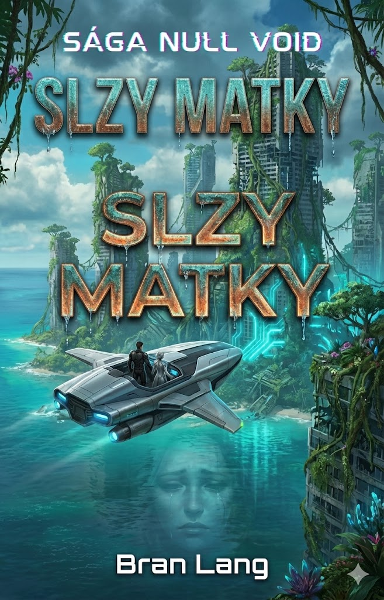

# Kniha 3: VODA-čas – Slzy Matky (Voda)
**Status:** Plotting
**Hlavná téma:** Pamäť / Ilúzie / Odhalenie v hĺbkach

---

## I. Dejstvo: Mesto Zrkadiel a Ishtar
*   **Pobrežie Juhu:** Maks a Tami dorazia do domény **Ishtar (Archbés Pôžitku)**. 
*   **Neuro-Hacking:** Ishtar ovláda ľudí cez nanodrony v krvi ("Ambrózia"). Neviditeľný boj – Ishtar útočí na Maksovu myseľ ilúziami o Inetis a šťastnom živote na Zemi.
*   **Tami / Echo Inetis:** Tami sa stáva čoraz silnejšou, ale jej osobnosť mizne. Vďaka "spomienkam" Inetis prekukne Ishtarinu ilúziu a zachráni Maksa z mentálneho väzenia.

---

## II. Dejstvo: Ynetis – Mesto Duchov (Ostrov)
*   **Ostrov:** Maks a Tami preniknú na Ostrov Zakladateľov.
*   **Vzhľad:** Ruiny futuristického mesta s antickými pamiatkami, čiastočne zarastené, ale nie zatopené. Atmosféra strachu a opustenosti.
*   **Wraiths (Duchovia):** Mesto je plné rogue AI nanobodov, ktoré opustili svojich hostiteľov. Blúdia ulicami ako elektrické prízraky a uchovávajú fragmenty vedomia mŕtvych kolonistov. Každý krok mestom je pre Maksa bolestnou cestou do minulosti.

---

## III. Dejstvo: Veľký Glitch a Odhalenie
*   **Archív:** Nájdenie riadiaceho centra (uzol Glyfu).
*   **The Revelation:** Maks aktivuje záznamy z čias prvej kolonizácie (AY 300).
    *   **Bit Rot Glitch:** Maks zisťuje, že nákazu, ktorá zničila rovnováhu nanodronov a hostiteľov, nespôsobila chyba systému, ale **Elania**. Chcela urýchliť evolúciu človeka do digitálnej formy a "vylepšiť" matkin plán.
    *   **Dedičstvo krvi:** Maks vidí tvár Elenie na záznamoch. Ishtar (alebo Echo Inetis) mu potvrdzuje: "To dievča, ktoré si hľadal... je tvoja dcéra. A ona je Archbés, ktorého si prišiel zničiť."

---

## Zvrat a Cliffhanger
Maks si uvedomuje, že Elania nezačala ako zloduch, ale ako dcéra túžiaca po otcovi a moci. Jej "zrada" matky bola pokusom o záchranu, ktorý sa zmenil na katastrofu. Kniha končí Maxovým rozhodnutím konfrontovať dcéru priamo na ceste do Vzdušného kráľovstva.

---

## Vizuál (Návrh obalu)
*   **Scéna:** Pobrežná.
*   **Dominanta:** Ruiny futuristického mesta Ynetis. Z vody trčia vrcholky antických chrámov.
*   **Farby:** Hlboká morská modrá, tyrkysová, zelená. Akcentová farba: elektrická kyanová (aura Duchov).
*   **Názov:** SLZY MATKY (Textúra ako mokrý, oxidovaný kov s kvapkami vody).

## Referencie
*   
*   [Detailné nápady pre Knihu 3](drafts/book-3-ideas.md)
