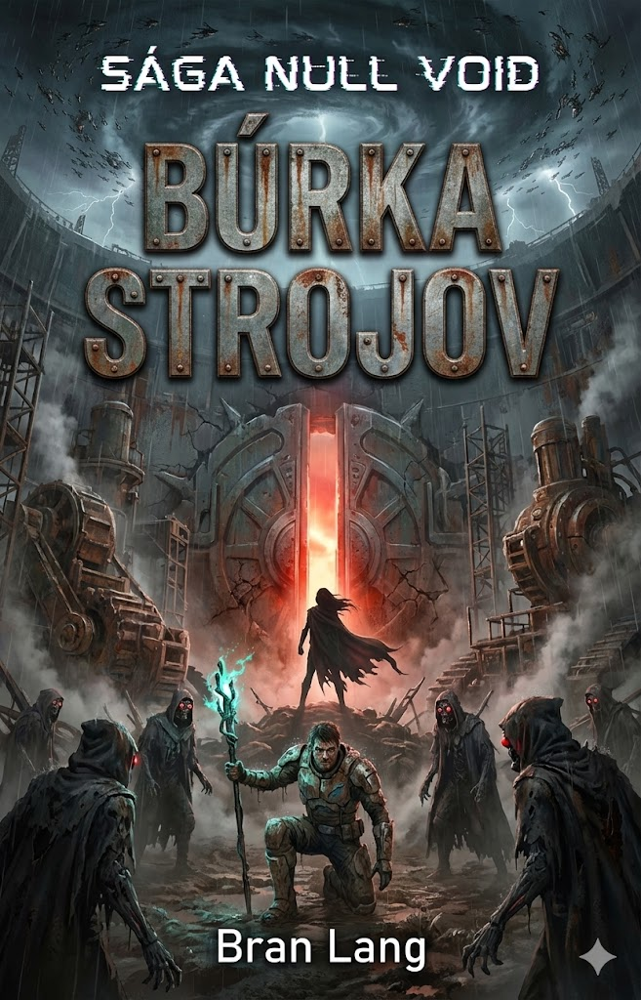

# Kniha 4: Vietor-priestor – Búrka StrojovTROJOV (Vzduch)
**Status:** Plotting
**Hlavná téma:** Stagnácia / Skúsenosť vs. Sila / Biológia vs. Dáta

---

## I. Nová Frakcia: NESMRTEĽNÍ (The Old Guard)
*   **Podstata:** Pôvodní kolonisti (starí ~2700 rokov). Tí, ktorí zostali verní Elenii.
*   **Vzhľad:** "Múmie" v starých skafandroch, steampunkové protézy, Bit Rotom zničené telá.
*   **Schopnosti:** Majstri "tkáčskej Spiry" nanodronov. Namiesto hrubej sily manipulujú s hustotou vzduchu, vákuovými čepeľami a ilúziami.

---

## II. Mechanika: Signálové pole (The Breach Spike)
*   **Funkcia:** Maxova palica generuje magnetické pole, ktoré ho robí neviditeľným pre senzory a imúnnym voči Spire.
*   **Cena:** Pole odrezáva Maxa od jeho vlastných military dronov. Stáva sa smrteľníkom bez super-sily a rýchleho liečenia.
*   **Taktika:** Max musí striedať "Stealth mód" (slabý, ale skrytý) a "Combat mód" (silný, ale zraniteľný Spirou).

---

## III. Dejstvo: Cesta ku Kráteru
*   **Kráter:** Miesto vykopávok lode Exodus. Elania tu odkrýva Jadro.
*   **Priebeh:** Max a Tami sledujú stopy "Protokolu Ticha" (AI vraždy vedcov). 
*   **Infiltrácia:** Max sa zakráda tieňmi (Anténa zapnutý), zatiaľ čo ho Tami naviguje.

---

## IV. Dejstvo: Boj v Bahnách
*   **Odhalenie:** V hĺbke vykopávok ich Nesmrteľní odhalia. 
*   **Súboj:** Maxova hrubá military sila vs. tisícročné skúsenosti Krotiteľov. Max vyhráva s ťažkými zraneniami, ktoré sa mu bez aktívnych dronov (kvôli štítu pre Tami) nehoja.

---

## V. Dejstvo: Konfrontácia Otec vs. Dcéra
*   **Filozofický Stret:**
    *   **Elania:** Biológia je bolesť a kliatba. Jediná spása je "Veľký Upload" do digitálnej rajskej záhrady.
    *   **Max:** Bolesť je cena za život. Sterilná nesmrteľnosť v stroji je strata ľudskej podstaty.
*   **Prehra:** Elania Maxa premôže (využije jeho otcovskú slabosť a zranenia). 

---

## Cliffhanger
Elania použije Maxovu ruku (kódy Koordinátora) na otvorenie brány Jadra. Deaktivuje "Protokol Ticha". Nastáva hlboké ticho – Duchovia prestávajú útočiť. Elania vstupuje do tmy Jadra, aby spustila Upload. Svet sa začína meniť.

---

## Vizuál (Návrh obalu)
*   **Scéna:** Priemyselný výkop v Kráteri.
*   **Dominanta:** Obrovská brána Jadra lode Exodus.
*   **Postavy:** Max v centre, obklopený Starou Gardou. Elania v pozadí vchádza do brány.
*   **Element:** Búrkové mraky, prach a technický smog.

## Referencie
*   
*   [Detailné nápady pre Knihu 4](drafts/book-4-ideas.md)
