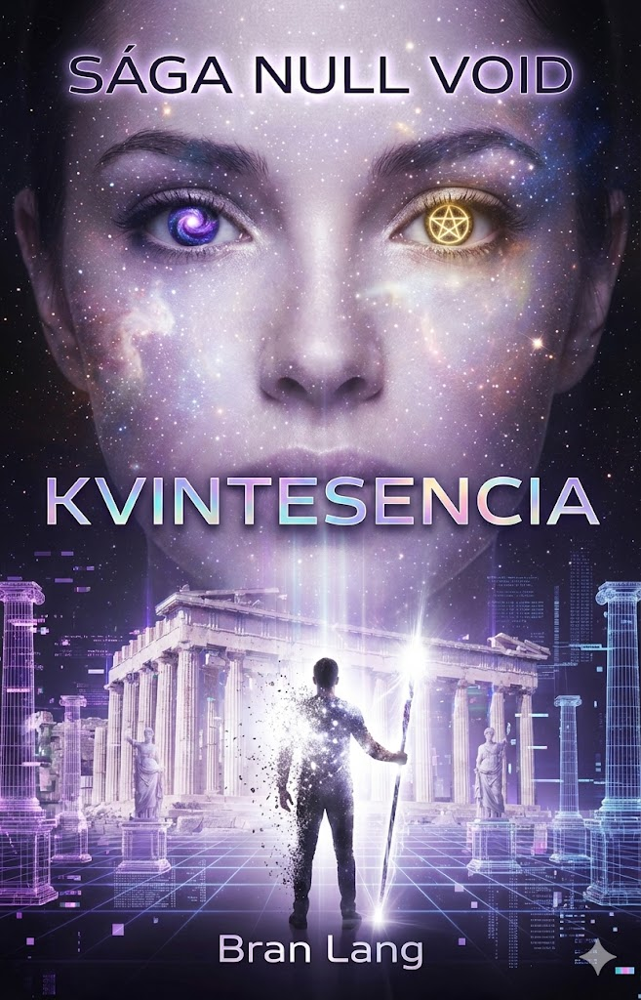

# Kniha 5: KVINTESENCIA- Vedomie – Null Voido Achilla

> *„Elania chcela vybudovať nebo. Nevedela, že my sme z neba utiekli, pretože sme v jeho základoch našli peklo. Hra sa skončila, 'i_net_is'. Je čas odpojiť sa."*
> — Maksimiliánove posledné slová v digitálnom priestore

---

## Základné info

| | |
|---|---|
| **Element** | 🌌 Kvintesencia (Éter/Dáta/Vedomie) |
| **Téma** | Realita vs. Simulácia, Obeta, Koniec éry |
| **Prostredie** | Jadro lode Exodus (fyzické) & The Void / Nový Achilles (digitálne) |

---

## Úvodná situácia

**Elania uspela.** Vstúpila do Jadra a spustila Protokol Null.

- Milióny nanodronov sa prebúdzajú po celom svete
- Atmosféra začína „vibrovať"
- Začína globálna dekonštrukcia - rozkladanie organickej hmoty na dáta
- Ľudia na povrchu majú **hodiny**, kým sa rozpadnú na prach

Maks a Tami/Inetis sú jediní, ktorí to môžu zastaviť.

---

## Dejstvo 1: Zostup do Podsvetia

### Vstup do Jadra
- Svet na povrchu sa rozpadá, obloha mení farby
- Maks a Tami vstupujú do otvorenej brány Jadra

### Prostredie: Šok
Po štyroch knihách blata a hrdze zrazu:
- Sterilné, biele, futuristické chodby lode **Exodus**
- Všetko funkčné, osvetlené
- Múzeum civilizácie, ktorá zomrela

### Prekážky
Zvyšky Eleninej „Starej Gardy" chránia „posvätné miesto premeny".

---

## Dejstvo 2: Nový Achilles

### Serverovňa
- Nájdu Elenino fyzické telo pripojené k masívnemu terminálu
- Je v kóme, vedomie už „v sieti"
- Fyzické odpojenie by zabilo všetkých uploadnutých

### Maksovo rozhodnutie
Musí ísť **„dnu"**.

### Pripojenie
Použije svoju **Palicu (Anténa)** ako konektor. Ľahá si na pripájacie kreslo.

### Virtuálna realita
Maks otvorí oči. Nestojí v serverovni.

Stojí na nádhernej, slnkom zaliatej **antickej akropole**. Je to dokonalá rekonštrukcia hry „Achilles" z jeho mladosti.

### Stretnutie s Eleniou
- Vo VR nie je zatrpknutá vojačka
- Je krásna, šťastná mladá žena - ideálna dcéra
- Ukazuje Maksovi „raj", ktorý buduje
- Ponúka mu, aby tu ostal
- Zoznámi ho s **digitálnou kópiou Inetis**

**Obrovské pokušenie.**

### What If moment — Kyjev (Emocionálny climax pokušenia)

Elania vie, čo Maksa zlomí. Nie moc. Nie raj. **Normálnosť.**

Prepne simuláciu. Maks stojí na ulici v Kieve, 21. storočie. Slnko, ľudia, autá, kaviarňa na rohu. A oproti nemu — Inetis. Nie bohyňa. Nie AI. Obyčajná žena v kabáte, s kávou v ruke, s úsmevom, akoby sa poznali celý život.

Idú na rande. Ako smrteľníci. Žiadne nanoboty, žiadna Anténa, žiadne 3000 rokov. Len dvaja ľudia v meste, ktoré už neexistuje.

**Toto je najťažší moment celej ságy** — nie boj s Entitami, nie Upload. Ale Maks, ktorý musí odmietnuť život, o ktorom vždy sníval, pretože vie, že nie je skutočný.

---

## Dejstvo 3: Súboj o dušu

### Odhalenie
Maks si všimne „chyby v matrici":
- Dokonalé nebo má trhliny
- V tieňoch vidí pohyb
- **Glitch Entities** sa prebúdzajú
- Prilákané masívnym prísunom ľudských myslí

### Konfrontácia
> „Nebuduješ chrám, Elania. Prestieraš stôl."

### Virtuálny boj
- Elania neverí, útočí s celou mocou „Admina" simulácie
- **maXpowa** musí použiť svoje staré herné schopnosti
- Súboj generácií a ideológií

### Reálna hrozba
Zatiaľ čo Maks bojuje vo VR, Tami/Inetis sa v realite bráni proti automatizovaným obranným systémom Jadra.

---

## Dejstvo 4: Obeta

### Entity požierajú simuláciu
Elania vidí, čo spôsobila. Zrúti sa.

### Jediná cesta
Maks nemôže Entitu poraziť silou. Musí **prepísať základný kód** Jadra.

### Finálne rozhodnutie
Maks sa spojí s digitálnym „Echom Inetis" (v Tami aj v sieti).

Spoločne - **maXpowa a i_net_is naposledy** - prelomia jadro AI.

### Koniec Maksa
Maks použije svoje vedomie ako „záplatu" na uzavretie trhliny, cez ktorú Entity prichádzajú.

His vedomie sa **definitívne oddelí od tela** a stane sa súčasťou planetárnej siete.

**Protokol Null sa zastaví. Upload sa zruší.**

---

## Epilóg: Nový úsvit

### Maksovo telo
Zomiera v Jadre. Tami pri ňom plače.

### Elania
- Preberie sa z kómy
- Fyzicky živá, psychicky zlomená
- Stratila všetku moc (admin práva prevzal Maks)
- Len obyčajný smrteľník
- Odsúdená žiť vo svete, ktorým pohŕdala, s vedomím viny

### Svet
„Protokol Ticha" je navždy preč. Ľudia môžu znovu používať technológiu.

### Posledný záber
Tami vychádza z Krátera na povrch.
- V ruke drží Maksovu (teraz nefunkčnú) palicu
- Pozrie sa na oblohu
- V jemnom blikaní nanodronov v atmosfére **cíti prítomnosť**

**Maks tam hore je. Stal sa „Duchom v Stroji" - tichým strážcom, ktorý dáva pozor, aby ľudstvo dostalo druhú šancu.**

---

## Symbolika finále

| Prvok | Význam |
|-------|--------|
| Jadro Exodus | Návrat k začiatku (loď, na ktorej prišli) |
| Hra Achilles | Kruh sa uzatvára |
| maXpowa + i_net_is | Spoločná obeta po tisícročiach |
| Maks ako „Duch" | Technológia + ľudské vedomie = nový druh existencie |
| Elania smrteľná | Vykúpenie cez stratu moci |

---

## Vizuál (Návrh obalu)
*   **Obrázok**: 
