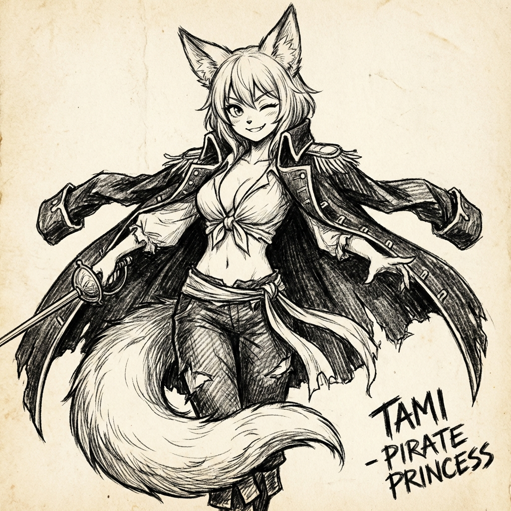

# Kapitola 5: Desolácia

## Časť I: Chladná Realita

Ľadový most mizol za chrbtom. Pred Linksom sa týčili útesy Terry.

Neboli zelené ako Neuropa, ani biele ako Vlčie Ostrovy. Boli sivé. Ostré. A páchli.

Links zacítil ten pach ešte skôr, než uvidel prvé obydlia. Bol to ťažký, mastný zápach. Pach spáleného uhlia, starého rybieho tuku a... niečoho sladkastého, čo nevedel identifikovať. Choroby.

Vznášadlo *Icarus* kleslo. Gravitačné cievky zapišťali, keď narazili na "hustejšiu" atmosféru. Alebo to bola len Linksova predstavivosť? Vzduch tu bol ťažší. Dym sa držal pri zemi ako mokrá deka.

Pristál na štrkovitú pláž pod útesmi. Motor zhasol s posledným zavytím.

Ticho. Ale iné ticho než v Luduse. Tam bolo ticho pokojné. Tu bolo ticho... vyčerpané.

Links si prehodil **Solárny Plášť** cez hlavu. Látka jemne žiarila v šere zimného podvečera – absorbovala posledné lúče slnka. Vyzeral ako duch. Alebo ako boh.

Vydal sa k osade, ktorú videl z výšky.

Nebolo to mesto. Bol to zhluk chatrčí postavených z naplaveného dreva, hrdzavých plechov a kostí veľrýb. Žiadna 3D tlač. Žiadna biela architektúra. Len blato a hrdza.

Keď vošiel do osady, prvé, čo si všimol, boli oči.

V tieni chatrčí sedeli postavy. Boli zabalené v kožušinách a handrách. Keď ho zbadali – žiariacu postavu v bielom plášti – stíchli aj psy.

Links čakal útok. V knihách čítal o barbaroch z Terry. O zlodejoch, pirátoch, vrahoch. Položil ruku na puzdro pri páse. Nebol bojovník — jeho výcvik v Observatóriu bol zameraný na sebaobranu, nie na vojnu — ale nebol ani idiot. V puzdre mal keramickú pištoľ *Vigilant*, ľahkú, presnú a smrtiacu. A pod sedadlom vznášadla ležala zabalená útočná puška. Neuropa bola možno "slniečkárska" utópia, ale jej obyvatelia vedeli, že svet za hranicami taký nie je.

Ale nikto nezaútočil.

Z chatrče vyšla žena. Alebo to bolo dieťa? Bola taká vychudnutá, že sa to nedalo určiť. Tvár mala špinavú od sadzí. V rukách držala misku.

„Pane?" zašepkala. Hlas mala chrapľavý. „Máte...?"

Links sa zastavil. Pozrel sa na ňu. A potom na ostatných.

Videl to. Vpadnuté líca. Nafúknuté bruchá detí. Oči, ktoré boli príliš veľké pre tie malé lebky.

Neboli to banditi. Boli to kostry potiahnuté kožou.

Žena natiahla ruku s miskou. Vnútri bola kaša. Sivá, hrudkovitá hmota. Piliny zmiešané s vodou a rybím tukom.

„Chlieb pilín," povedal Links. Čítal o tom v historických záznamoch z Veľkej Vojny. Myslel si, že je to mýtus. Že civilizácia už dávno prekonala hlad.

„My... nemáme viac," povedala žena a myslela si, že Links je vyberač daní. Alebo vojak. „Armáda vzala všetko. Graw potrebuje jedlo pre front."

Links ustúpil, akoby ho udrela.

*Armáda vzala všetko.*

V mysli sa mu premietol obraz Ludusu. Robotické agro-kombajny na zlatých poliach.Nekonečné konvoje vznášadiel, ktoré odvážali zrno na Juh.

Links si vždy myslel, že to ide do skladov pre prípad katastrofy. To im tvrdili v škole.

Ale teraz, pri pohľade na tie nafúknuté bruchá, mu to došlo. Tá matematická rovnica nesedela. Sklady by boli plné už pred storočiami.

*Juh.*

Južná Pustatina. Elaniin "Park".

Všetko to obilie... všetka tá nadprodukcia... nešla do skladov. Išla **im**.
Kŕmili ním tie monštrá. Chiméry. Mega-faunu, ktorú Prastarí chovali pre zábavu.

*My kŕmime dinosaurov,* preblesklo mu hlavou a cítil žlč v hrdle. *Kŕmime genetické omyly, zatiaľ čo títo ľudia jedia hlinu.*

Tá nespravodlivosť nebola len pasívna. Bola to aktívna, byrokratická krutosť.

„Prečo?" vydýchol Links.

Žena nechápala otázku. Myslela si, že odmieta jej dar. Sklonila hlavu.

Links siahol do vaku. Prsty sa mu triasli. Vytiahol balíček. **Nutričná Tyčinka (Ludus Standard Ration)**. Bola to koncentrovaná zmes proteínov, vitamínov a stimulantov. Jedna tyčinka stačila dospelému mužovi na celý deň plnej aktivity. V Luduse to bola "núdzová strava", ktorú jedli, keď sa im nechcelo variť.

Podal ju žene.

„Tu," povedal. „Zjedzte to. Je to... jedlo."

Žena na to pozrela nedôverčivo. Potom opatrne odhryzla. Oči sa jej rozšírili. Cukor. Tuk. Energia.

V momente, ako prehltla, sa atmosféra v osade zmenila. Ostatné tiene sa pohli. Vstali.

„Jedlo!"

„On má jedlo!"

Obkľúčili ho. Nie s hnevom, ale so zúfalstvom. Desiatky rúk. Špinavých, chudých rúk. Ťahali ho za plášť.

„Pane! Prosím!"

„Moja dcéra..."

„Dajte mi, pane! Dám čokoľvek!"

Links cúvol. Siahol do vaku a vytiahol ďalšie tyčinky. Dve. Tri. Päť. Rozdal ich.

Ale rúk bolo viac. Bolo ich tridsať. Päťdesiat.

„Nemám viac!" zakričal Links. „Došlo mi to! Nemám!"

Dav stíchol. Ale oči... tie oči zostali. Sklamanie v nich bolo horšie ako nenávisť.

Links sa pretlačil cez dav a utiekol. Bežal späť k pláži, k svojmu vznášadlu. Dych ho pálil v pľúcach. Alebo to bol ten dym?

Zastavil sa až pri *Icarusovi*. Oprel sa o studený kov a zvracal.

Zvracal zo šoku. Zvracal z tej tyčinky, ktorú ráno zjedl v teple svojho domova.

Pozrel sa na sever. Tam, za ľadom a hmlou, ležala Neuropa. Zelená. Sýta. Dokonalá.

*„Prečo?"* opýtal sa vetra. *„Prečo im nepomôžeme? Máme lode. Máme stroje. Mohli by sme ich nakŕmiť všetkých. Prečo nás Elania necháva hniť v luxuse, kým oni jedia hlinu?"*

Potom si spomenul na ženine slová. *Armáda vzala všetko. Graw potrebuje jedlo pre front.*

*Vojna na juhu.* Grawská invázia do Šoravenu.

Links si vždy myslel, že vojna je o ideológii. O viere. O moci. Tak to učili v Observatóriu.

Ale pri pohľade na tie nafúknuté bruchá to pochopil.

Graw neútočí na Šoraven, lebo nenávidí juh.
Graw útočí, lebo je **hladný**.
Je to vojna o prežitie.

A Neuropa... Neuropa sa na to pozerá. Ako diváci v koloseu.

Links si pomaly stiahol **Solárny Plášť**. Vypol jeho žiarenie. Látka stmavla, stala sa sivou, obyčajnou. Už nechcel svietiť. Už nechcel byť "bohom".

Prikryl vznášadlo starou rybárskou sieťou, ktorú našiel na pláži. Skryl svoju technológiu. Svoj pôvod.

„Už nie som Scholaris," povedal ticho. Pozrel sa na svoje čisté ruky a potom ich zaboril do čierneho, mastného piesku Terry. Ušpinil ich.

„Som nikto. A idem zistiť, prečo tento svet musí trpieť."

Vykročil smerom na juh. Pešo. Do dymu. Do vojny.

---

## Časť II: Mesto Zlomených Hrdinov

Cesta na juh bola rozmazanou škvrnou sadzí a únavy. Dni splývali do nocí. Links videl len spálené dediny, prázdne polia a zástupy utečencov smerujúcich... nikam.

Keď konečne dorazil do Šoravenu, vojna už skončila. Ale mier neprišiel.

Šoraven neoslavoval. Šoraven krvácal.

Links to čakal inak. V historických hologramoch v Observatóriu boli víťazstvá vždy sprevádzané hudbou, vlajkami a svetlom. Ale keď vstúpil do dokov, privítalo ho ticho.

Bolo to dva týždne po tom, čo Grawská armáda ustúpila. Dva týždne po "zázraku", o ktorom si šepkali rybári na pobreží.

Links prechádzal ulicami dolného mesta. Blato mu čvachtalo pod čižmami. Všade bol pach vápna.

Videl ich. Hroby. Dlhé, plytké ryhy vykopané tesne za hradbami, kde zem ešte nebola zamrznutá. Telá nasypané jedno na druhom. Niektoré mali sivé uniformy Grawu. Iné mali civilné šaty Šoravenu.

Smrť nerobila rozdiely.

„Pozor!" zakričal niekto.

Links uskočil, práve keď okolo prešiel voz ťahaný volmi. Bol plný trosiek. Kusy kovu, dreva, a... bol to kus parného kotla?

Mesto bolo v ruinách. Prístavná štvrť bola z polovice spálená. Domy nemali strechy. V oknách nebolo sklo, len handry.

Ale najhorší boli ľudia.

Links videl skupinu detí hrať sa pri kráteri po granáte. Jedno z nich, dievčatko s veľkými očami, nemalo ruku. Rukáv kabáta malo prázdny, prišpendlený k hrudi. Smiala sa, keď kopla do kameňa, ale ten smiech... ten smiech bol prázdny.

*Toto je cena za víťazstvo,* pomyslel si Links a cítil, ako sa mu zviera žalúdok.

Vošiel do poľnej nemocnice, ktorú zriadili v sklade rýb. Pach dezinfekcie sa bil s pachom hnijúceho mäsa. Exorcisti v bielych plášťoch – nie vedci ako on, ale poľní medici – behali medzi nosidlami.

Links videl muža, ktorému práve amputovali nohu. Videl ženu s popáleninami na polovici tváre.

Siahol do vaku. Mal tam **Medi-Gel**. Drahocenný nanotech z Ludusu.

Podišiel k lekárovi, ktorý sa snažil zastaviť krvácanie mladého chlapca.

„Nechajte ma," povedal Links a vytiahol tubu. „Toto pomôže."

Lekár naňho pozrel kalnými očami. „Čo ste zač? Čarodej?"

„Inžinier," povedal Links a aplikoval gél na rany. Nanoboty okamžite začali pracovať. Krvácanie sa zastavilo. Rana sa zatiahla ružovým tkanivom.

Lekár vydýchol. „Matka milosrdná... máte toho viac?"

Links sa pozrel na tubu. Bola prázdna. A v nemocnici boli stovky zranených.

„Nie," zašepkal. „Prepáčte."

Vyšiel von na čerstvý vzduch. Chcelo sa mu kričať. Mal technológiu, ktorá dokázala robiť zázraky. Ale nemal *škálu*. Nemohol zachrániť všetkých.

*Potrebujem informácie,* pomyslel si. *Potrebujem vedieť, kto to tu vedie. Kto zachránil toto mesto, ak nie Exorcisti?*

Zamieril k jedinej budove, ktorá vyzerala, že má celú strechu a odkiaľ vychádzalo svetlo. Krčma **"U Slepej Morskej Panny"**.

***

Vnútri bolo teplo, dym a pach lacného piva. Vojaci so zaviazanými hlavami a rukami v dlahách sedeli pri stoloch. Neboli tu víťazné piesne. Len tiché šepkanie.

Links si sadol do rohu a objednal si vodu. Barman naňho pozrel ako na blázna, ale podal mu ju.

„Hovorím ti, nebola to mágia," hovoril jeden z vojakov pri vedľajšom stole. Mal jazvu cez celé líce. „Bola to Líška. Videl som ju. Mala chvost z čistého ohňa."

„Kecy," odpovedal druhý. „Bol to ten chlap. Exorcista. Rozbil bránu holými rukami."

„Ale hovno," pridal sa tretí. „Exorcisti sú mnísi. Toto bol... démon. Ale náš démon."

Links spozornel. **Líška. Exorcista.** Tieto slová sa opakovali.

„Hej, ty," zavolal naňho barman. Všimol si jeho záujem. „Ak ťa zaujíma tá Líška... pozri sa na toto."

Hodil na stôl kus papiera. Bol to obyčajný, mastný papier z balenia rýb, ale to, čo bolo na ňom, Linksovi vyrazilo dych.

Kresba. Uhlík.

Ale nie hocijaká. Štýl bol... provokatívny. Dynamický. Postava Líšky mala veľké, iskrivé oči, ale jej póza... jej póza bola *drzá*. Kostým mala mierne rozhalený, odhaľujúci krivky, ktoré biológia Varietas bežne nedovoľovala, ale tu vyzerali *dokonale*. A ten chvost. Bol obrovský, nadýchaný, zaberal polovicu stránky a vyzeral tak mäkko, že človek mal chuť sa ho dotknúť.

Links cítil, ako sa mu do líc hrnie červeň. V Neurope bolo takéto zobrazenie... neslýchané. Funkčné, sterilné, abstraktné — to bolo umenie. Toto bolo... *Fan Service*.

„To je ona?" spýtal sa. Hlas sa mu zlomil. Nemohol odtrhnúť zrak. Bolo to vulgárne? Možno. Ale bolo to nakreslené s takou technickou precíznosťou, s takým citom pre anatómiu a svetlo, že to nemohol považovať za nič iné ako majstrovské dielo.

„Vraj hej," odfrkol barman. „Nechala to tu jedna ženská. Sedela tam v rohu, pila mlieko—vravím ti, *mlieko* v námorníckej krčme—a čmárala si. Usmievala sa pri tom ako diabol."

Links prešiel prstom po papieri. V rohu bol malý podpis. Len jeden znak, ktorý vyzeral ako mačka. Alebo smajlík.

*Kto si?* pomyslel si Links, zatiaľ čo rýchlo — až príliš rýchlo — skladal papier, aby ho nikto iný nevidel. *A prečo kreslíš najnebezpečnejšieho bojovníka kontinentu ako... waifu?*

Vložil si kresbu do vnútorného vrecka, priamo na srdce. Cítil, ako ho papier páli cez látku. Nie vedecký záujem. *Vina. A fascinácia.*

Podišiel k ich stolu. „Prepáčte," povedal. „Som tu nový. Hľadám... opravára. Niekto, kto rozumie technike."

Vojaci sa naňho pozreli.

„Opravára?" zasmial sa ten s jazvou. „Chlapče, pozri sa okolo. Celé mesto je na sračky. Jediný, kto tu niečo opravuje, je kováč, a ten má dosť práce s pluhmi."

„Myslím skutočnú techniku," naliehal Links. „Elektroniku. Staré veci."

Vojaci stíchli. Vymenili si pohľady.

„Jeden taký by tu bol," povedal barman, ktorý utieral pohár špinavou handrou. „Ten Synth. Žije v tej starej dielni na okraji. Volajú ho Sensei."

„Synth?" Links bol prekvapený. V Neurope neboli Synthi.

„Má vlastnú dielňu. Vlastnú hlavu. Prežil tu od čias, čo pamätá môj starý otec. Ak niekto vie opraviť tvoje hračky, je to on. Ak otvoríš dielňu, je otvorená."

***

Dielňa J-Sevena bola starý kamenný dom na okraji mesta. Okolo boli ruiny, ale táto budova stála pevne. Zrejme ju poznačila vojna — časť strechy bola čerstvo opravená, na stenách boli stopy po požiari.

Ale keď Links vošiel dnu, ocitol sa v inom svete.

Všade boli káble. Monitory. Staré súčiastky zoradené podľa veľkosti a typu. Na policiach staré hodinky, kompasy, mechanické hračky. Vôňa oleja a horúceho spájkovania.

V strede miestnosti sedel Maki. J-Seven.

Jeho kovové telo bolo staré, poškrabané, zoxidované soľou. Na ľavom ramene mal čerstvú opravu — nový panel, ktorý sa neleskol ako zvyšok. Zranenie z bitky? Ale jeho oči – modré optické senzory – svietili jasne.

Keď Links vošiel, J-Seven sa len mierne otočil. Bez prekvapenia.

„Scholaris Links," povedal Synth syntetickým hlasom. Nie otázka. Konštatovanie.

Links stuhol. „Ako vieš, kto som?"

J-Seven neodpovedal. Natiahol ruku. „Daj mi to."

Links nevedel prečo, ale poslúchol. Vytiahol z vaku **Prastarý Laptop**, ktorý mu dala Sera. Mŕtvu tehlu z roku 2065.

J-Seven ho vzal. Jeho kovové prsty sa pohybovali pomaly, skoro nežne. Odšrauboval zadný kryt. Vytrhol starú, vytečenú batériu.

Potom sa Synth načiahol pod pracovný stôl a vytiahol malú krabičku. Otvoril ju.

Vo vnútri, na zamati, ležala **batéria**. Nie hocijaká. Presne rovnaký tvar, veľkosť a konektor ako originál. Ale v priezračnom púzdre svietil malý, brúsený **Spira kryštál**.

Links stuhol.

„Počkaj," povedal. „To je... to je presne ten model. Presne tento typ. Kde si—"

J-Seven vložil batériu do laptopu. Zaklapol kryt.

*Cvak.*

Laptop zabzučal. Obrazovka preblikla. Logo **NULL VOID** sa rozsvietilo v zelenej farbe.

„Boot sequence kompletná," oznámil J-Seven. „OS integrity 98%."

Links stál s ústami otvorenými. „Ale... ako? Táto batéria neexistuje. Posledná bola vyrobená pred 2000 rokmi. Ako ju máš? Ako si vedel, že prídem práve s *týmto* laptopom?"

J-Seven sa pomaly otočil. Jeho optiky sa stretli s Linksovými očami.

A potom sa usmial.

Bol to zvláštny pohyb — kovové líce sa mierne zdvihli, optiky sa jemne prižmúrili. Syntetický úsmev, ktorý sa naučil od ľudí za tisíce rokov.

Nepovedal nič.

Len mu podal laptop späť.

Links vedel, že sa viac nepýta. Chcel. Ale tie tiché modré oči mu hovorili: *Niektoré odpovede nie sú pre teba. Ešte nie.*

„Kam mám ísť?" opýtal sa namiesto toho.

J-Seven ukázal kovovým prstom von z okna. Na kopec nad mestom, kde stála osamelá budova s čiastočne prepadnutou strechou. Niečo, čo kedysi bolo obchod. Antikvariát.

„Kito," povedal J-Seven. „Knihy. Odpovede. Potreba."

„Potreba?" Links nechápavo naklonil hlavu.

„On potrebuje *teba*," upresnil Synth. A vrátil sa k svojej práci.

***

Links vyšiel z dielne do studenej noci. V rukách držal funkčný počítač z čias mýtov. V hlave mal viac otázok než odpovedí.

Kto pripravil tú batériu?
Kto vedel, že príde?
A prečo?

Pozrel sa na kopec. V okne Antikvariátu svietilo slabé, žlté svetlo.

*Líška. Kito. Spira.*

Links si pritisol laptop k hrudi a vykročil do kopca.
