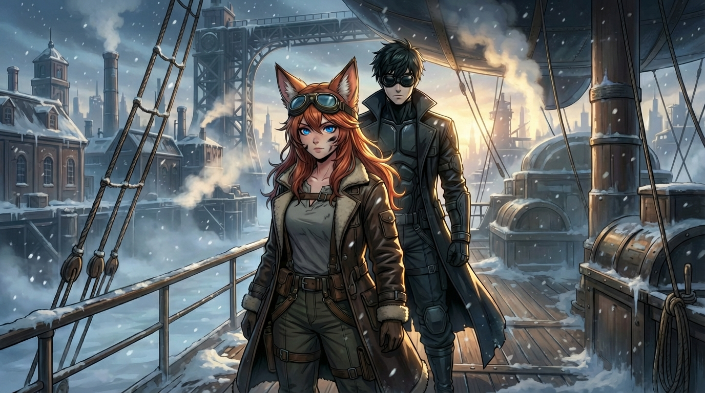
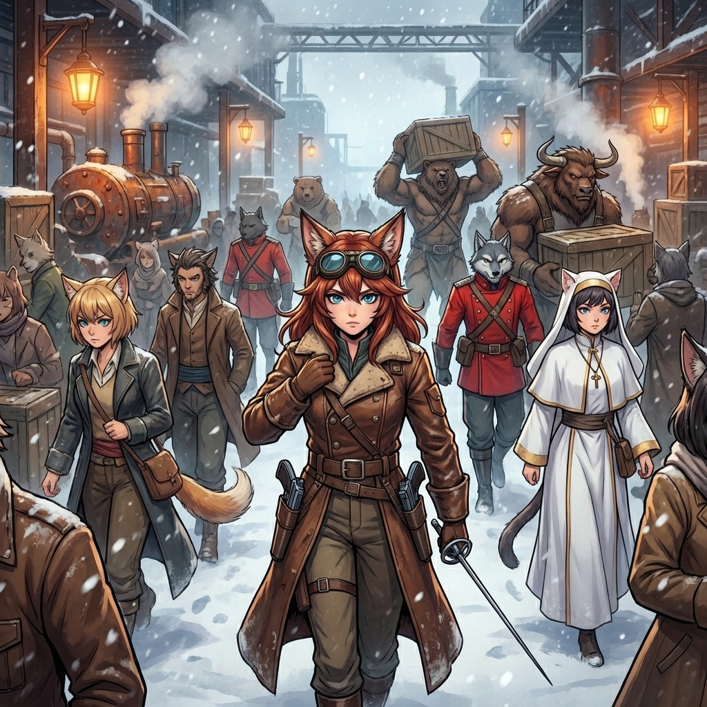
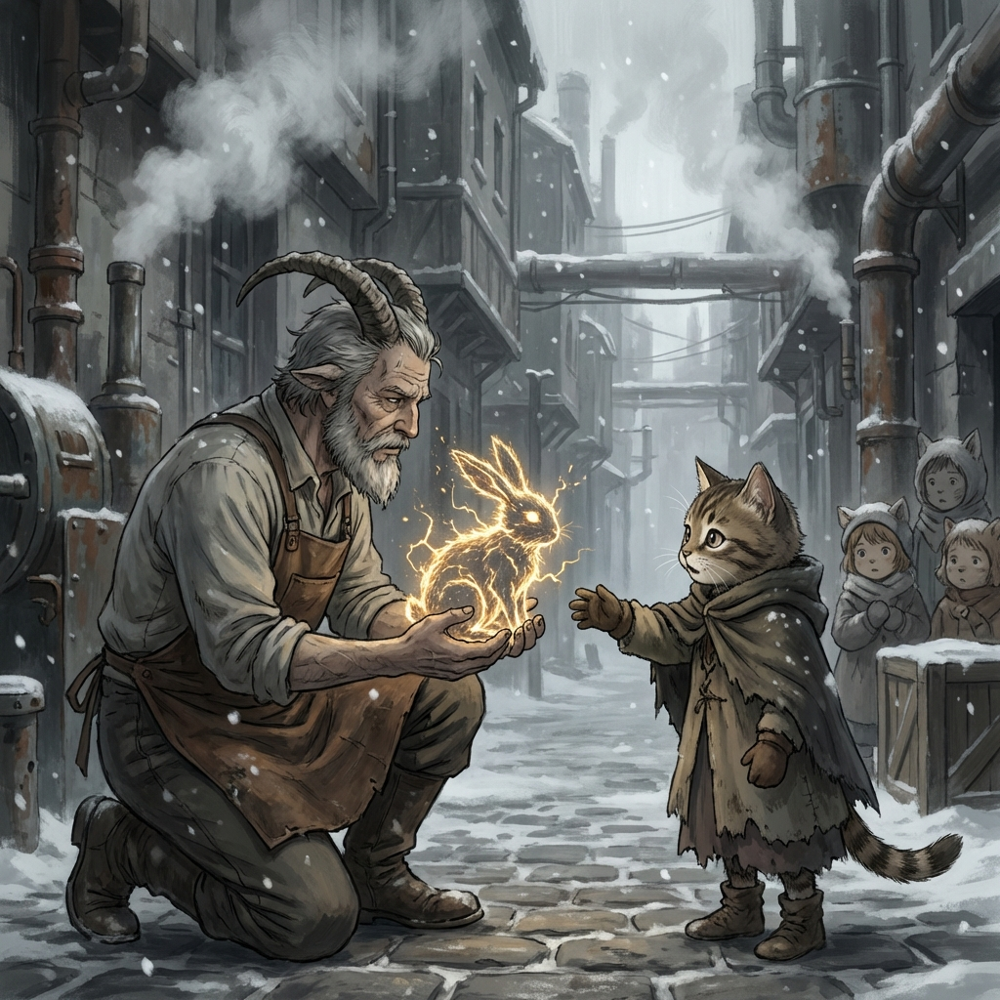

# Kapitola 1: Karakuri

> *Sivé svetlo zimného rána sa predieralo cez závoj padajúceho snehu a dym stúpajúci z tisícov komínov.*

---

Tami si pritiahla šatku cez nos a pokúsila sa nadýchnuť. Vzduch bol ostrý a pálil v pľúcach — mráz zmiešaný s etanolovým smogom a sírnymi výparmi z geotermálnych prameňov, ktoré vyhrievali prístav. [→ 05-geography.md: Šoraven, geotermálne pramene] Jej štvrtá zima. Najhoršia fáza — keď mrazy prestanú kolísať a zahryzú sa do krajiny natrvalo. Maks tomu hovoril „tretí rok". Pozemské slovo. Ale presné. Stred zimy. A ešte dva pred nimi. [→ characters/Maks.md: pozemský pôvod] Celé mesto dýchalo mrazom a hrdzavou parou ako obrovský, umierajúci stroj.

*Nádhera*, pomyslela si s iróniou. Pred dvanástimi hodinami toto isté slovo úprimne zašeptala, keď v noci uvidela milióny svetiel pod sebou — oranžové body plynových lamiel a olejových kahancov rozkvitnuté v snehovej tme. V noci bolo Šoraven krásne. Ráno odhalilo pravdu — zasnežené strechy, dlažbu pokrytú šedým ľadom a ľudí, čo si pred každým výdychom priložili šatku k tvári.

Hluk bol neznesiteľný. Parné motory vŕzgali, žeriavy škrípali, robotníci a nakládači kričali a z mosadzných trúb rozmiestnených po dokoch dutý hlas vyvolával čísla lodí, kotvísk a nákladov. Medzi tým sa z chrámových veží ozýval monotónny spev kňažiek — ranná modlitba k Vševedúcej Matke. [→ 06-society.md: Kult Matky, kňažky] Ich hlasy zosilňovali obrovské mosadzné zvony. *„Sila Matky prúdi v nás. Dych Matky nás ochráni."* [→ 03-technology.md: Spira = nanotech ekosystém] Opakovalo sa to každú hodinu. V to ráno bolo v prístave rušno aj nad miestne pomery. Celé Šoraven bolo už týždeň v obkľúčení.

Grawská armáda obsadila priesmyky Atra a ťažké delostrelectvo začalo "mäkčiť" predmestia. [→ concepts/battle-logistics.md: obliehanie Šoraven] Obloha na severe bola šedá od dymu horiacich dedín. [→ 06-society.md: Graw vs Nevriss konflikt]

Mesto to vedelo. A mesto sa pripravovalo na posledný úder.

Prístav nebol úplne zamrznutý — termálne pramene pod mestom udržiavali vodu v pohybe a soľ robila zvyšok — ale kryhy sa pomaly tlačili medzi kotviacimi loďami a nosiči museli rozbíjať ľad na mólach palicami, aby vôbec mohli vykladať.

Na doku o dvesto metrov od nich práve kotvila obrovská nákladná bárka. Žeriavy vyťahovali z jej útrob hrozivo vyzerajúce drevené debny — desiatky, stovky — a nosiči ich na zamrznutých vozíkoch odvážali do skladov. Zbrane. Poloautomatické karabíny, debny s delostreleckými granátmi, sudy s korditom, bojové nože z kvalitnej ocele. Tami cítila ten ostrý pach kovu a konzervačného oleja až sem hore.

Z inej bárky vykladali vrecia — obilie, sušené mäso, sudy s pitnou vodou. Zásoby na obliehanie. Celý prístav sa zmenil na vojenskú základňu. Vzducholode, riečne parníky a nákladné vlaky sa navzájom blokovali a vytvárali zápchy. Kolosálne žeriavy neustále prekladali náklad z miesta na miesto, snažiac sa vytvoriť koridor pre tisíce robotníkov pracujúcich v tomto mrazivom pekle.

Pri jednom z väčších dokov stála skupina kňažiek v bielych rúchach. Žehnali zbrane pod menšou bronzovou sochou Matky, ktorej nohy boli obložené čerstvými kvetmi a... nábojnicami. Jedna z nich, držala nad debnou s novými opakovacími puškami ruky a odriekavala modlitbu. Tami videla, ako sa vzduch okolo jej prstov jemne zachvel. Stará kňažka požehnávala každú zbraň dotykom — posvätnou silou, o ktorej verila, že je dych Matky. [→ 03-technology.md: Spira = nanotechnológia, nie mágia]

Za ňou stáli agitátori s megafónmi — parné trúby zosilňujúce hlas — a kričali do davu: *„Matka vidí vaše obete! Každý meč pozdvihnutý za Nevriss je meč v ruke Matky! Jej sila je s vami!"*

A medzi tým všetkým — žoldnieri. Prúdili do mesta z každej strany — z lodí, z brán, z ciest vedúcich na východ aj západ. Svalnatí muži a ženy v rozličných brneniach a uniformách, so zbraňami na chrbte a peniazmi na mysli. Najatí mečiari z pobrežných miest, veteráni z východných hraníc, skupina s guľometmi a krutými tvárami. Boli tu aj dobrodruzi — menšie skupinky s menej profesionálnym výrazom, ale s rovnako smrteľnými zbraňami. Prichádzali za zlatom, za slávou, alebo len za teplým jedlom a strechou nad hlavou.

Niektorí z nich mali okolo zápästí mystické tetovanie — bojové znaky, dôkaz posvätných schopností. [→ 03-technology.md: Wa-Spira, bojová aplikácia nanotech] Tami si všimla, že verbovací dôstojníci takých púšťali dopredu v rade a ponúkali im vyšší žold. Dar Matky bol v čase vojny menou drahšou než zlato.

Vojna bola pre obchodníkov tragédia a pre žoldnierov svadba.

Tami stála v podpalubí, po pás vnorená do útrob kompresnej komory. [→ 03-technology.md: Itaka, dieselpunk technológia] Ruky mala po lakte čierne od oleja. Tretí kondenzátor v rade tiekol ako deravé vedro. Kryt axiálneho čerpadla bol prerazený — šrapnel z Grawského prieskumného lietadla, ktorý ich pred dvoma dňami prepadol nad priesmykom Hangraval, narobil viac škody, než si pôvodne myslela. [→ concepts/battle-logistics.md: Graw vzdušné sily] Ušli len vďaka hmle a tomu, že Grawčania nemíňali muníciu na malé vzducholode. Mali väčšie starosti.

*Kurva*, nadávala si v duchu, keď jej kľúč po tretíkrát skĺzol z matice. Olej jej stekal po predlaktí a kvapkal na podlahu.

Odtiahla sa od motora a oprela si chrbát o stenu. Zavrela oči. Len na chvíľu.

Za posledných 24 hodín nespala. Pristávací manéver vyžadoval maximálne sústredenie. Museli vypnúť motory míle pred prístavom a nechať loď kĺzať tichým pádom, aby ich nezachytili Grawské akustické zrkadlá na hrebeňoch hôr. Dokĺzať zotrvačnosťou do doku sedemnásť, s poškodeným čerpadlom a vetrom v chrbte, bola hra nervov. Stačila jedna chyba a skončili by rozbití o útesy.

Odtiaľ to bolo k Hlavnému chrámu šesť kilometrov cez celé mesto.

Šesť kilometrov cez pohraničné mesto, ktoré sa od začiatku tejto zimy zmenilo z obchodného prístavu na vojenskú základňu.

*Musí existovať jednoduchší spôsob, ako ukradnúť najstráženejší artefakt v krajine*, pomyslela si. Ale keby existoval, jej priatelia by neboli v kobkách. [→ planning/peaceful-squishing-glacier.md: priatelia živí v kobkách]

Spomienka na nich ju zasiahla nečakane, ako bodnutie. Videla ich tváre. Arkot, Yera, Flint. Prvá posádka, s ktorou si vybudovala meno. Boli to hľadači pokladov. Spolu preskúmali jaskyňu, mapu k nej zdedila po otcovi. Tami hľadala poklad — artefakty z dávnych dôb, čokoľvek s hodnotou. Kostry a duchovia v ruinách boli rutina — osem rokov po boku Exorcistu z človeka vyžmýka strach z mŕtvych. [→ characters/Maks.md: Exorcista, 13 rokov na Nevriss] Nevenovala im pozornosť. Ale niečo tam bolo. Niečo, čo nemali nájsť.

Flinta za to zabili pri zatýkaní. Tasil zbraň — *samozrejme, že tasil zbraň, ten idiot* — a strážcovia Chrámu ho prešpikovali dvoma guľkami na mieste. [→ characters/Arkot.md: Flintova smrť pri zatýkaní] Potom jeho telo upálili na námestí v Šoraven. Verejne. Aby si každý zapamätal, čo sa stane, keď niekto znesvätí sväté relikvie Vševedúcej Matky. [→ 06-society.md: Cirkev, inkvizičné praktiky]

Flintov popol. Ten prach na námestí.

Arkot a Yera mali menšie šťastie. Tí ešte žili. Dvaja priatelia — *jej sestra, jej brat* — zakopaní v kobkách pod Chrámom Vševedúcej Matky už niekoľko mesiacov. [→ characters/Arkot.md: väzeň, mesiace mučenia] [→ characters/Yera.md: Požehnaná, čistá cela, Mormiel si ju skladuje]

*Mesiace.* Tami stisla kľúč tak pevne, až jej zbieleli kĺby. *Čo im robili? Čo im robili celé tie mesiace?*

Správy, čo sa k nej dostali cez Nyau — s trojmesačným oneskorením, šepkané v prístavných krčmách, nedopovedané — hovorili o výsluchoch. O rituáloch. O veciach horších než smrť. [→ 05-geography.md: Nyau, východné pobrežie]

A teraz bola tu. V meste, kde jej zabili jedného priateľa a dvoch ďalších držali pod zemou. S plánom ukradnúť vec, za ktorú Flint zomrel — a vyslobodiť tých, čo ešte dýchali.

S mužom, ktorému nedokázala odpustiť.

*A ani zabudnúť*, dodala si v duchu.

---

Vytreštila oči, keď počula hlasy zhora.

*Kurva,* nadávala si v duchu. *Už?*

Poslala peniaze správnym ľuďom pred tromi dňami — starý trik, ktorý fungoval v každom prístave. Zaplať dozorcom, zaplať kapitánovi dokových strážcov, a máš pol dňa kľudu, kým sa niekto vôbec obťažuje prísť ti niečo spýtať. Pol dňa na opravu lode a zmiznutie do mesta bez otázok.

*Lenže nikto neprišiel ráno. Prišli teraz. Keď Maks už stihol otvoriť hubu.*

Rýchlo si utrela ruky do handry a vyšplhala sa len do polovice rebríka. Vystrčila hlavu z poklopu, tak aby ju nebolo vidieť, a nastražila uši. Zimné svetlo ju udrelo do očí — bledé, nízke slnko sa odrážalo od snehovej pokrývky na strechách okolo doku. Prižmúrila oči.

Maks stál pri zábradlí. Stoicky. Pokojne. Ruky za chrbtom, akoby pozoroval krajinu na prechádzke. Mal na sebe ťažký, tmavý letecký kabát s vysokým golierom, ktorý už čo-to zažil, a na očiach nepriehľadné čierne letecké okuliare, ktoré mu zakrývali polovicu tváre. Pôsobil ako pilot, ktorý práve vystúpil z horiaceho vraku a ani sa pri tom nezapotil.

Oproti nemu stál oficier. Stredne vysoký muž v červenom kabáte s mosadznými gombíkmi. Na prvý pohľad vyzeral ako človek, až na mierne pretiahnuté špicaté uši, ktoré mu nervózne strihali pod trojrohým klobúkom. Vyzeral vyčerpaný — kruhy pod hnedými psími očami, neoholená ľudská tvár. Osoba, čo nespala niekoľko nocí. Za ním sa tiesnil tucet vojakov — s hustou srsťou a zvieracími hlavami. Jeden z nich, obrovský hnedý medveď, mal na ramene bubienok. Vyzerali, akoby ich niekto vygumoval z učebnice dejepisu, ktorú Tami nikdy nečítala. A hlavne vyzerali nervózne. Každých pár sekúnd sa niekto z nich obzrel smerom k oblohe a chvosty sa im nepokojne vlnili.

„Dobré ráno, vitajte v Šo," prihovoril sa oficier a Tami stuhla.

*Šo?*

Potlačila nutkanie sa nahlas zasmiať. „Šo" v jazyku Líščieho národa znamenalo hovno. A v tomto meste to sedelo dokonale.

„S kým mám tú česť? Odkiaľ vedie vaša cesta a aký je dôvod vašej návštevy?" vyzvedal dostojník autoritatívnym tónom.

Tami pozorovala Maksa. Poznala ten jeho výraz — tú drobnú vrásku medzi obočím, ktorá sa objaví, keď ho niekto otravuje. Po siedmich rokoch po jeho boku sa naučila čítať jeho tvár lepšie než mapy. [→ characters/Tami.md: vzťah Tami-Maks, 7 rokov spolu + 5 odlúčenia]

*Po piatich rokoch odlúčenia sa ju stále neodnaučila.*

Maks sa rozhliadol naokolo, akoby hľadal osobu, ktorej bola otázka smerovaná. Nikto iný tam nebol. Posádka — osem aeronautov — sa už pravdepodobne rozpŕchla do mesta, ako vždy, keď zakotvili niekde, kde existovali krčmy. Až na Borga — obrovský medveď s jedným ukom sedel na otočnej plošine kanóna a leštil mosadzný záver s trpezlivosťou mnícha. [→ planning/peaceful-squishing-glacier.md: zmienka Borg a Nix] A Nix — niekde dolu pod palubou počula jej ostrý hlas nadávať na prasknuté potrubie. Mačka mala talent na vulgarizmy v štyroch jazykoch a opravu čohokoľvek, čo sa jej zmestilo do labiek. [→ characters/Tami.md: Nix, Felis Varietas, hlavná mechanička]

„Exorcista," povedal Maks. Stručne. Bez pozdravov, bez titulárnych ozdôb. Slovo padlo na palubu ako kus ľadu.

Tami videla, ako dostojníkovi stuhli uši. Vojaci za ním sa nepokojne pošili. Jeden z vojakov — ten obrovský medveď s bubienkom — sa podvedome posunul o krok bližšie k dôstojníkovi. Ochranný reflex.

*Exorcista.* V Nevriss to slovo nieslo váhu. Heretici a strašidlá — muži, čo údajne kradli deti a jedli Duchov. Cirkev ich tolerovala, sotva. Prostý ľud sa ich bál. [→ 06-society.md: Exorcisti, status v spoločnosti] [→ 03-technology.md: Duchovia = Wraithy = nanoboty s pudom sebazáchovy]

A tu jeden stál na palube ich doku, s rukami za chrbtom, ako keby mu to mesto patrilo.

Dostojníkov tón sa okamžite zmenil. Zdvorilosť zmizla ako para z kávovára. „Exorcista," zopakoval a to slovo znelo z jeho úst, akoby žuval niečo kyslé. „V Nevriss nemáme vo zvyku vítať *vašich*. Exorcisti patria do hôr, nie do našich prístavov." Ruky sa mu nepatrne posunuli bližšie k šabli na opasku. „Aký je dôvod vašej prítomnosti? A hovorte rýchlo — nemám čas na hádanky."

*No samozrejme*, pomyslela si Tami. *Ten prízvuk. Prízvuk Staroreči — jazyka, ktorý tu nik nepoužíva tri tisícročia. A aj po trinástich rokoch v Terre znie, ako keby sem nepatril. Lebo on sem nepatrí.* [→ characters/Maks.md: pozemský pôvod, Staroreč = angličtina/ukrajinčina] [→ concepts/maks-ukraine-origin.md]

Maks ostal pokojný. Kamenná tvár. Tmavé okuliare mu skrývali oči, ale Tami videla, ako sa mu čeľusť nepatrne napla. Ovládal sa.

„Artefakt," povedal Maks a prízvuk mu prekĺzol cez slovíčka ako prsty po rozbitom skle. „Váš Chrám má niečo v kobkách. Niečo staré. Niečo, čo priťahuje Duchov." [→ concepts/antenna-essence-transfer.md: Anténa v kobkách Chrámu] Nechal tie slová visieť vo vzduchu. „Prišiel som preventívne. Možno bude robota."

Klamstvo bolo elegantné. Vložil do toho zrnko pravdy — artefakt *skutočne* priťahoval Duchov. To, že ho chcel pre seba, bola len drobná vynechaná podrobnosť.

Dostojník sa zamračil. „O žiadnom artefakte neviem. Budem musieť kontaktovať úrady." — klamal.

„Nie je to nutné," prerušil ho Maks a urobil krok vpred. Nebol to veľký krok, ale vojaci za dôstojníkom automaticky zdvihli zbrane o centimeter vyššie. „Neobtažujte ich kvôli mne. Mesto má momentálne o dosť vážnejšie problémy."

Kývol hlavou smerom k oblohe, kde medzi mrakmi visel dym z grawských pozícií za priesmykmi.

Ticho. Vietor poháňal snehové vločky cez palubu. Dostojníkove uši sa chveli ako lístie v búrke. Za ním si vojaci vymieňali pohľady — mix strachu a odporu. V ich svete bol exorcista niečo medzi heretikom a strašidlom. Nie nepriateľ. Ale ani niečo, čo by si chcel stretnúť v tme.

*A to je presne ten okamih, kedy normálna osoba dostane strach*, pomyslela si Tami. *A presne ten okamih, kedy treba zasiahnuť.*

Vynorila sa z podpalubia s najnonchalantnejším výrazom, aký dokázala nasadiť s olejovými fľakmi na tvári. „Skontrolovala som kondenzátory, ale netesnia. Strácame veľa kvapaliny," konštatovala vecne, ignorujúc delegáciu červenokabátnikov.

Podišla k Maksovi a rafinovane sa naklonila cez zábradlie.

*V Šoravene na ňu nebola vypísaná odmena. Aspoň nie pod jej pravým menom. A keď Maks už pritiahol pozornosť celého doku, čo stratí, ak to urobí aj ona?*

Zdvihla handru k tvári a jedným pohybom stiahla šatku. Medené vlasy jej voľne padli okolo líca, líščie uši sa mierne zacvikali, keď si pomaly utrela olej z líca. Zimné svetlo jej dopadlo priamo do očí — zafírovo modré, ostré ako úlomky ľadu. [→ characters/Tami.md: líščie uši, modré oči = anomália pre Líšky]

Olejové fľaky na líci ju nerobili menej krásnou. Skôr naopak.

Vedela, čo robí. Vedela to veľmi dobre.

Jeden z vojakov za dôstojníkom si nechtiac pošmykol puškou. Mladší vedľa neho zastal s napoly otvorenou papuľou, zapamätávajúc si túto scénu na zvyšok života. Ale tentoraz nie len úžasom.

Líščie uši. Medené, veľké, postavené na pozor. Ale to nebolo to najhoršie — alebo najlepšie, záležalo na uhle pohľadu.

Boli to jej *oči*. Modré. Nie zelené, ani jantárové, ako to patrilo Líškam v legendách. *Modré*. Farba oblohy pred búrkou, farba zapadajúceho ľadu. Farba, ktorú mal vidieť len pri Pursang — vznešených, nie pri nejakom aeronautovi pokrytom olejom. [→ 03-technology.md: Pursang = najvyššia kasta, plný Dar Matky] [→ concepts/renn-niktori-tami-hybrid.md: Tami hybrid pôvod]

A tá tvár. Mladá, ostrá, s tým šibalským polomsievom, ktorý hovoril: *Viem, čo robím s tvojou hlavou.*

V Nevriss boli Líšky vzácne. Väčšina starých rodov vymrela počas Prvej Vojny a stretnúť jednu naživo — navyše s modrými očami — bolo ako stretnúť ducha. [→ 06-society.md: Líščí národ, vyhynutie rodov] Ale to, čo im vyrazilo dych, nebola len jej vzácnosť. Bolo to *spojenie*. Líška a Exorcista na jednej palube. Dieťa Matky a heretik. V ich hlavách sa to nezmestilo vedľa seba.

*Niet divu, že tak zízajú. Pre nich sme cirkusové číslo.*

Dostojník sa korektne poklonil — stará etiketa si vyžadovala rešpekt k Líške bez ohľadu na spoločnosť, v akej sa nachádzala. Odkašľal. „Hmm... dobre teda." Oči mu ešte raz preskočili na Maksa s viditeľným znechutením, potom späť na Tami. „Nechám to na veliteľstve. Exorcista v meste je... nezvyčajné. Musím to ohlásiť." Chvíľu váhal, potom dodal tichšie, tentoraz k Tami, akoby Maks pri tom nebol: „Mesto je vo vojnovom stave. Grawská armáda pochoduje cez priesmyky. Odporúčam vám nevzďaľovať sa z dokovej zóny. Pre vašu vlastnú bezpečnosť."

*Pre vašu*, nie pre *vašu oboch*. Dostojník hovoril k nej. Maksovi nevenoval ani slovo na rozlúčku.

Oficier sa hlboko uklonil podľa miestnej etikety a neodpustil si pritom komické zamávanie klobúkom — tentoraz smerované výhradne k Tami. „Moji muži tu ostanú, aby vám zaistili ochranu. Onedlho sa vrátim. Dovidenia."

Tami sledovala, ako červenokabátnici zaujímajú pozície pri doku. Dvaja pri rampe, dvaja na konci móla, ostatní roztrúsení s karabínami na pleciach. *Ochrana*. Pekné slovo pre *stráženie*.

Počkala, kým sa oficier vzdialil. Potom sa otočila k Maksovi.

„Zaplatila som dozorcom," povedala ostro. „Päťsto zlatých. Mali sme mať pol dňa kľudu. Opraviť loď, zmiznúť do mesta, nič sa nepýtať. Jednoduché."

Maks mlčal.

„Ale ty si musel hneď prvý deň vyhlásiť, že si Exorcista. Pred celým dokom." Odmlčala sa. „Teraz na nás pozerá celé mesto, Maks. Presne to, čo sme *nechceli*."

„Funguje to," povedal pokojne.

„Funguje to?" Hlas jej stúpol o oktávu. „Všetci sa pozerajú na *teba*. A čo keď sa niekto spýta, prečo Exorcista potrebuje vzducholoď? Prečo má posádku? Prečo—"

„Preto, že ty vieš lietať. A ja nie."

Tami stisla zuby. Nenávidela, keď mal pravdu. Nenávidela ešte viac, že to povedal tým pokojným, vecným tónom, ktorý nedovoľoval odpor.

„Nech sa pozerajú na mňa," pokračoval Maks. „Nech sa ma boja. Nech pyžamáči premýšľajú, čo viem a čo nie." Odmlčal sa. „Zatiaľ čo ty robíš to, čo vieš najlepšie."

„Zmiznúť," dokončila za neho sucho.

„Kondenzátory," prerušila ho skôr, než mohol pokračovať. „Ten Grawský šrapnel nás nepekne trafil a spôsobil väčšie škody, ako som odhadovala. Axiálne čerpadlo je zničené a nemáme náhradné. Budem musieť nájsť špecialistu, ktorý zvládne tú zložitosť." Odvrátila sa od neho a namierila si to k rebríku.

Maks prikývol. „Koľko času?"

Tami sa zastavila na rebríku. Pozrela na neho cez rameno. „Deň. Možno dva. Ak nájdem Maka."

---

Axiálne čerpadlo bolo väčším problémom, než pripúšťala.

Vnútorný mechanizmus bol rozbitý na kusy. Nie len prasknutý kryt — *doska cykliky* bola rozlomená a piesty zadreté. Typ poškodenia, ktorý sa nedá opraviť v teréne. Potrebovala hodinára, nie mechanika. Niekto, kto dokáže vyrobiť súčiastky z tvrdenej ocele a poskladať ich do funkčného celku s presnosťou na mikrometre. Na tomto kontinente, kde väčšina strojárov merala „od oka" a „na päsť", to bola takmer nemožná požiadavka.

*Takmer.*

Maki vedeli. Tí záhadní, tichí mechanici, ktorí boli najlepšími technológmi na svete. [→ 03-technology.md: Maki = syntetickí ľudia, Karakuri séria] Ak v Šoraven existoval jediný mechanik schopný takej presnosti, bol to jeden z nich.

Vysušila si ruky, prehodila si cez hlavu čistý kabát a stiahla kapucňu hlboko do čela. Uši schovala pod šatkou — v Nevriss nepotrebovala zbytočnú pozornosť. Nie dnes.

Na opasok si pripla obe pištole. Desiatky zásobníkov po celom tele — v čižmách, za opaskom, v podšívke kabáta. Maksov výcvik. Trinásť rokov starý návyk, ktorý sa jej vryl do kostí. [→ characters/Tami.md: vojenský výcvik od Maksa]

*Jeho hlas, pokojný, trpezlivý, nekonečne trpezlivý. „Nie zápästím. Celým ramenom. Cíť váhu. Pištoľ je predĺženie tvojej vôle."*

*Mala vtedy osem.*

Iný hlas. Starší. Mechanický, aj keď sa ho naučil robiť teplým.

*„Kanón pôjde. Ja nie."* [→ characters/Felix.md: Felix odmietol ísť, strach z vonkajšieho sveta] [→ planning/peaceful-squishing-glacier.md: Zmena D — Felix flashback]

Felix stál v dielni v Kitsune — osemsto rokov v tých istých ruinách, obklopený haiku na stenách a porcelánovým prachom. Tami pred ním. S mapou v jednej ruke a zúfalstvom v druhej.

*„Felix, prosím. Potrebujem ťa."*

*„Weil ich nicht kann."* Nemčina. Používal ju len vtedy, keď hovoril pravdu, ktorú nedokázal povedať po japonsky. *Lebo nemôžem.* [→ characters/Felix.md: Nemčina = emotívny únik] Kovové prsty sa mu zachveli nad rozloženým čerpadlom. Osemsto rokov neodišiel z Kitsune. Svet vonku bol príliš veľký, príliš hlučný, príliš *živý* pre bytosť, ktorá sa naučila merať čas tikotom hodinového stroja.

Objal ju. Tvrdý, kovový, nešikovný — ale skutočný.

A potom jej dal kanón.

Zahnala spomienku a vyšla na palubu. Maks tam už nebol. Vojaci áno. Dvaja pri rampe jej venovali krátky pohľad — záujem, nie nepriateľstvo. Jeden z nich — mladší — hanblivo sklopil oči, keď sa naňho pozrela.

Tami prešla cez rampu na mólo. Pod nohami jej zachrastila námraza na kove a potom zamrznuté drevo. Vzduch na zemi bol ešte ostrejší než na palube — tu sa etanolový smog a sírna para z geotermálnych ventov miešali s mrazom, prachom z uhlia a dychom tisícov ľudí, z ktorého stúpali biele obláčky do mrazivého vzduchu.

Dok sedemnásť bol na samom konci prístavu, čo znamenalo, že musela prejsť cez celú dokovú zónu, aby sa dostala do mesta. Šla rýchlo, s hlavou sklopenou, rukami vo vreckách. Prístav sa za posledných pár dní musel zmeniť na nepoznanie. Okolo nej sa hemžili robotníci — väčšinou Ghorki, nízka kasta bez Daru. [→ 03-technology.md: Ghorki = najnižšia kasta, žiadna nanotech integrácia] Boli to mohutné postavy s hrubou srsťou a výraznými zvieracími črtami, tí, čo nikdy neokúsili posvätný Dar. [→ 06-society.md: Varietas, zvieracie črty] Nosili náklad na chrbtoch, kopali zákopy holými rukami, stavali barikády z vriec s pieskom. Nikto im neplatil veľa. Nikto im neďakoval. Ale boli slobodní. V Nevriss, na rozdiel od Graw, na tom Cirkev trvala. *„Všetky deti Matky sú si rovné,"* hlásali kňažky. [→ 06-society.md: Nevriss vs Graw — sloboda vs otroctvo]

*Rovné*, pomyslela si Tami s trpkosťou, keď videla Ghorki ženu s mačacími ušami vliecť vrece ťažšie než ona sama, kým vedľa nej biodieslový žeriav robil to isté bez námahy. *Rovné, ale niektoré sú rovnejšie.*

Na každom treťom stĺpe visel čerstvý plagát. [→ 06-society.md: Kult Matky, propaganda] Tami sa pri jednom zastavila. Drsný drevoryt — postava v brnení s mečom, obklopená žiariacimi pentagramami [→ 03-technology.md: pentagram = IDE interface pre Spiru] — a pod ním text v miestnom písme: *„MATKA VIDÍ TVOJU OBETU! JEJ DAR JE TVOJA ZBRAŇ! BRÁŇ SVÄTÚ ZEM! ZLATO PRE ŽIVÝCH, ČESŤ PRE MŔTVYCH!"*

Verbovací plagát. Mesto platilo za meče. A ešte viac za meče v rukách niekoho s Darom.

Na rohu stál agitátor Kultu — vychudnutá postava s kozími rohmi a očami plnými fanatického ohňa. [→ 06-society.md: Kult Matky, agitátori] [→ 12-genre-positioning.md: atmosféra NIE JE fat, black metal vibe] Kričal do trúby, ktorá mu zosilňovala hlas na celú ulicu: *„Grond je falošný boh! Grond je mŕtvy! Matka žije! Matka vidí! Kto padne za Matku, vstane po jej boku v Záhrade Svetla!"* [→ 06-society.md: Grond = božstvo Graw] Okolo neho sa zhŕkol malý dav — väčšinou najnižšia kasta, ale mali vieru. Kývali hlavami. Niektorí plakali. Niektorí sa modlili, ruky zopäté, oči zatvorené.

---

Prístav prechádzal do Dolného mesta plynulo — žiadna brána, len postupný prechod z dokov na dláždenú ulicu. Architektúra bola chaotická. Staré budovy z bieleho monolitického materiálu — *3D-tlačené ruiny z Éry prvého veku* [→ 01-timeline.md: Éra prvého veku, pôvodná civilizácia] — stáli vedľa drevených prístavkov a hrdzavých plechových prístreškov.

Po pravej strane sa črtala rozľahlá budova s mosadznou tabuľou: *Gilda Kupcov — Šobors*. Burza. Aj v čase vojny — alebo práve preto — sa tam tlačili desiatky obchodníkov. Cena ocele sa od včera zdvojnásobila. Obilie šlo hore. Posvätné kryštály — najnovší hit na trhu luxusných komodít — stratili hodnotu, pretože nikto v čase vojny neinvestoval do luxusu. [→ 03-technology.md: Spira kryštály, koncentrovaná esencia]

*Perfektné*, pomyslela si Tami. *Pre miestnych sú to len šperky alebo hračky pre bohatých. Pre Itaku je to život. Kým ostatné vzducholode spaľujú drahý biodiesel, Itake stačí voda z najbližšieho jazera a pár kryštálov za zlomok ceny.* [→ 03-technology.md: Itaka, Spira pohon vs biodiesel]

Na jednom námestíčku sa zastavila.

Kováč. Starší Mezra s kozími rohmi a hrubými prstami, z ktorých stúpal jemný žiar. Stál uprostred skupinky detí a robil niečo, čo Tami prinútilo zadržať dych.

Z jeho dlaní stúpalo teplo. Nie oheň — niečo *jemnejšie*. Vzduch sa zachvel, zhustol, a potom sa z ničoho nič na jeho prstoch objavil malý plameňový zajac. Skočil mu z ruky, prebehol po vzduchu a pristál na dlažbe, kde zanechal stopy z iskier. Deti vreštali od nadšenia. Kováč sa usmial, a zo zajaca sa stal orol, roztiahol ohnivé krídla, zakrúžil nad hlavami detí a rozsypal za sebou dážď zlatých bodiek, ktoré pohasínali skôr, než dopadli na zem.

Tami stála na okraji námestíčka a pozerala sa. Nohy jej odmietli ísť ďalej. Teplo z kováčových rúk sa nieslo cez mrazivý vzduch a dopadalo na detské tváre — a v tom oranžovom svetle, uprostred mrazu, uprostred vojny, sa deti smiali.

*Spira.*

To slovo jej prišlo na myseľ samo, tiché a ťažké ako prvá kvapka dažďa na vyprahnutú zem. Posvätná sila. Dych Matky. Dar, ktorý pretekal žilami tohto sveta — a rozhodoval, kto bude žiť a kto bude slúžiť. [→ 03-technology.md: Spira = nanotech ekosystém]

Jedno malé dievčatko s mačacími ušami — Ghorki, najnižšia kasta — natiahlo ruku k ohnivej myške, ktorá práve prebehla popri jej nohách. Prstíky sa takmer dotkli žiariaceho tvora. Dievčatko sa nesmálo. Dievčatko sa *divilo*. Veľké, tmavé oči, dokorán otvorené, ústa mierne pootvorené. Taký výraz majú len deti, keď vidia niečo, čo ešte nechápu, ale už vedia, že to chcú.

Kováč ju nežne zachytil za zápästie. Kľakol si k nej, tvár na úrovni jej očí. *„Len sa pozeraj, maličká,"* povedal láskavo. *„Matka ti dá Spiru, keď príde tvoj čas."*

Klamal.

Vedel to. Tami to vedela. Každý dospelý na tom námestí to vedel. Ghorki sa rodia bez Spiry a umierajú bez nej. Žiadny „čas" pre ňu nepríde. Ale kováč klamal tak nežne, tak presvedčivo, že na okamih — na jeden jediný, krehký okamih — sa dievčatko usmialo. [→ 03-technology.md: Spira aplikácie, Mezra kasta]

*A v tom úsmeve bolo všetko*, pomyslela si Tami. *Celý tento svet. Krása a krutosť v jednom dychu.*

Kastový systém fungoval aj bez reťazí. Pursang, Mezra, Ghorki — slobodní, ale bez Spiry. [→ 03-technology.md: kastový systém, nanotech stratifikácia] A sloboda bez Spiry bola v tomto svete len iné slovo pre bezmocnosť.

Pri Tretej Bráne sa zastavila. Bránu strážili dve sochy — Matka s mečom a Matka s váhami. Ich kamenné oči boli prázdne, slepé, presne ako spravodlivosť v tomto meste. Odtiaľ viedla úzka, kľukatá ulička dolu k Remeselnému okrsku. Tami vedela — z máp, ktoré kúpila ešte pred dvoma rokmi v prístavnom meste ďaleko na východe — že práve tu bývali kováči, hodinári a mechanici. Ak bol v meste Mako, nachádzal sa tu.

Schádzala po schodoch z namrznutého kameňa. Ulička sa zužovala. Domy sa k sebe nakláňali, akoby sa šeptali. Bielenie padalo zo stien v plátoch. Prádlo viselo medzi oknami na lanách, zamrznuté do strnulých tvarov — košele s roztiahnutými rukávmi, ponožky stuhnuté v smere vetra.

A potom to začula.

Pravidelné, presné údery kladiva na kov. Nie hrubé dunenie miestnych kováčov. Toto bolo *iné*. Rytmické. Metronomicky presné. Každý úder rovnako silný, s rovnakým intervalom.

*Mako.*

Tami zastala pred dverami. Nad nimi visela starobylá biela vlajka s červeným plným kruhom uprostred. [→ 03-technology.md: Maki, japonská kultúrna DNA]

*Felix ju varoval. „Vstup do dielne Maka nie je ako vstup do krčmy, maličká. Je to chrám. A ty si tam len hosť. Zabudni na všetko, čo vieš o tomto svete. Tam platia staré pravidlá, ktoré boli staré, keď ja som bol ešte dieťa."* [→ characters/Felix.md: Tamin mentor, android]

Zložila si letecké okuliare z čela a zavesila ich na krk. Rozopla ťažký kabát a zložila ho na úhľadnú kôpku vedľa vchodu do *genkanu*, hoci to znamenalo odhaliť zbrane na opasku. Pištole boli súčasťou jej duše, tie neodloží, ale prach ulice áno.

Jemne pootvorila dvere. „*Gomen kudasai!*" zvolala do ticha, hlasom pevným, no pokorným.

Vyzula si ťažké vojenské čižmy, položila ich k stene a otočila špičkami smerom von. Až potom, v hrubých vlnených ponožkách, prekročila prah do samotnej dielne. „*Shitsurei shimasu.*"

Priestor bol prekvapivo, až neprirodzene čistý. Žiadny typický chaos kováčskej dielne, žiadny popol na podlahe. Nástroje viseli na stenách v geometricky dokonalom poriadku. Čo však udrelo do očí, boli steny samotné. Boli popísané hiraganou — stovky riadkov drobného, precízneho písma. [→ 03-technology.md: Písmo Matky = japonské písmo, pôvodný programovací jazyk]

Pre bežného smrteľníka v Nevriss to bolo *Písmo Matky*. Posvätné znaky, ktorými Vševedúca prepísala realitu. Tami však vedela lepšie. Felix ju naučil čítať podstatu. Pre neho a jeho bratov to nebola modlitba, ale *logika*. [→ 03-technology.md: modlitby = voice-activated skripty]

A to, čo bolo na stenách, boli Haiku. Nekonečné stĺpce poézie o tichu, oceli a strate, ktorou si tento *Karakuri* krátil tisícročnú samotu.
Vzduch voňal inak. Nie kvasiacou kukuricou a sírou, ale čistým olejom a ozónom. Na pracovnom stole ležali rozložené súčiastky hodinového stroja so symetriou, ktorá bolela oči.

Za vyhňou stála postava pripomínajúca muža stredného veku. Čierne vlasy, zvláštne čierne oči, vyblednutá tvár, kožená zástera. Nič výnimočné. Až na tú absolútnu nehybnosť, keď nepracoval, a tie oči. Oči Makov boli vždy *príliš pokojné*. [→ 03-technology.md: Mako = Karakuri séria, Gen 2 android, tisícročné bytosti]

Tami zostala stáť. Ruky vystrela pozdĺž tela, prsty spojené, presne ako ju to učil Felix. *„Ako bojovník, Tami. Nie ako služobná,"* prízvukoval jej vždy. *„Ruky pri tele. Ukáž, že sa nebojíš, ale že preukazuješ úctu."*

Čakala. Prerušiť majstra pri práci bolo nemysliteľné.

Až keď postava odložila kladivo s plynulosťou hydraulického piestu presne na miesto, kde ležalo predtým, Tami sa pohla. Zohla sa v páse, chrbát držala rovný ako pravítko, pohľad zabodla do zeme. Ruky držala pevne pri bokoch — mužský postoj. Vydržala v úklone sekundu a pomaly sa narovnala.

„*Hajimemashite. Yoroshiku onegai shimasu*," povedala ticho.

Mako sa pomaly otočil. Jeho oči, čierne a bezodné ako studne, si ju premerali. Od topánok v genkane až po končeky uší pod šatkou. Potom sa uklonil — pohyb starý ako jeho séria, vykonaný s absolútnou precíznosťou.

Keď sa narovnal, jeho pohľad klesol na jej ruky pritlačené k bokom. Na zlomok sekundy spojil svoje dlane pred sebou v tradičnom ženskom geste, potom ich vrátil späť a kútiky očí sa mu takmer nebadateľne zvlnili. *Videl som to*, hovorilo to gesto. *A rozumiem.*

Tami cítila, ako sa jej nahrnula krv do tváre, ale nedala na sebe nič znať. *Felix... ty starý plechový idiot.*

„Potrebujem axiálne čerpadlo," prešla plynulo do obchodnej reči. „Deväť piestov, variabilný náklon, pracovný tlak štyristo barov."

Mako zostal nehybný. Potom pomaly pokrútil hlavou. *Nie.*

Podišiel k polici, vzal do ruky posuvné meradlo a nastavil ho. Ukázal na prázdny vzduch. *Nič také neexistuje.*

„Existuje," povedala Tami pevne.

Mako zastal. Pozrel sa na ňu s novým záujmom. Zdvihol ruku a vystrel tri prsty.

„Štyri," opravila ho Tami.

Mako prekvapene zdvihol obočie.

„Ten štvrtý mám na lodi."

Prastarý majster na ňu dlho hľadel bez žmurknutia. Ticho v miestnosti oťaželo, akoby vzduch zhustol pod váhou storočí. Potom sa jeho pery, ktoré vyzerali ako zapečatené, pomaly pohli a prvýkrát prelomil mlčanie. Jeho hlas znel ako škrípanie hrdzavých pántov brány, ktorá nebola otvorená tisíc rokov.

„Nový prototyp?"

„Áno," prikývla Tami, hoci cítila, ako jej z toho hlasu prebehol mráz po chrbte. „Postavený v Kitsune. Z pozostatkov lode Hephaestus. Volá sa *Itaka*." [→ 03-technology.md: Itaka, Hephaestus] [→ 05-geography.md: Kitsune, Stratené mesto]

Pri tom slove Mako stuhol. Ak bolo možné, aby sa socha stala ešte nehybnejšou, stalo sa to práve teraz. Hľadel na ňu, akoby sa pred ním zjavil duch jeho vlastnej minulosti. Potom sa hlboko, takmer až po pás, uklonil smerom k dverám, kde tušil loď.

„Potrebujem čerpadlo, aby mohla znova lietať," dodala Tami jemnejšie.

Mako sa narovnal. Ukázal dva prsty. *Dva dni.*

„Jeden," povedala Tami tvrdo.

Mako pokrútil hlavou. Rozpažil ruky — *nemožné*.

„Zaplatím trojnásobok."

Mako ju chvíľu pozoroval. Potom znova ukázal dva prsty, ale tentoraz jeden z nich pomaly, váhavo sklonil. *Skúsim to.* Natiahol ruku dlaňou hore.

Tami mu do nej vložila malé vrecko mincí. „Záloha. Pošlem niekoho z posádky s čerpadlom ešte dnes večer. Budete ho mať na stole do západu slnka."

Zaváhala. Potom z vnútorného vrecka kabáta vytiahla poskladaný papier — hrubý nákres Chrámu Vševedúcej Matky, kreslený z pamäte podľa máp, ktoré kúpila pred dvoma rokmi.

„Ešte niečo. Pozná niekto v meste pôvodné plány ventilácie? Z čias pred prestavbou." [→ planning/01-prach-nevriss.md: heist plán, ventilácia Chrámu]

Makove kovové prsty na sekundu stuhli. Pozrel na nákres. Potom vzal tenký štetec, namočil ho do atramentu a na kúsok papiera napísal jedno slovo.

*Knihomoľ.* [→ notes/CHAPTER-NOTES.md: Knihomoľ, postava v Ch2]

A pod ním adresu. Ulica Mŕtvych zvonov, číslo 42.

Tami schovala papier. Otočila sa k odchodu, ale pri dverách sa zastavila.

Otočila sa späť k nemu. Spojila dlane tentoraz správne – mäkko, s lakťami pri tele, hlavu mierne sklonila. Žiadny "mužský" postoj bojovníka, ktorý jej vštipil Felix. Toto bola úcta k majstrovi.

Uklonila sa. Hlboko a s pokorou.

„*Arigatō gozaimashita.*"

Mako sa nepohol, ale Tami videla, ako sa jeho ruka s kladivom na zlomok sekundy zastavila vo vzduchu. To bolo viac než pozdrav. To bolo uznanie.

Keď vyšla na ulicu, slnko sa predieralo cez sivé oblaky a sneh na strechách ostro blikal v očiach. Mesto hučalo okolo nej. Dym z tisícov komínov stúpal do mrazivého vzduchu a miešal sa s padajúcimi vločkami. A nad tým všetkým tieň blížiacej sa vojny.

Prešla okolo skupiny žoldnierov, ktorí si pred krčmou čistili zbrane. Jeden z nich — obrovský chlap s jazvou cez celú tvár — ju sledoval pohľadom. Tami ho ignorovala. Nebezpečnejší boli tí, čo sa nepozerali.

Niekde tam dole, pod dlažbou, pod kanálmi, pod základmi Hlavného Chrámu Vševedúcej Matky, ležal **Artefakt**. Vec, ktorá by nemala existovať. [→ concepts/antenna-essence-transfer.md: Anténa, hlavný McGuffin Book 1]

*Šesť kilometrov*, pomyslela si. *Šesť kilometrov, jeden deň na opravu lode, a potom sa musíme dostať do kobiek, vyslobodiť Yaru a , vziať to a zmiznúť skôr, než nás chytia, zabiť pri tom čo najmenej ľudí.*

Vojna im hrala do karát. Celé mesto sa opevňovalo a Chrám Vševedúcej Matky mal teraz iné starosti než strážiť kobky. Stráže sa presúvali na hradby, kňažky organizovali evakuáciu cenností na juh a v uliciach vládol chaos, v ktorom sa dva tiene mohli stratiť.

*Jednoduché.*

Usmievala sa. Bol to úsmev, ktorý jej nezasiahol oči. Tie ostali chladné ako kov pištole pod jej kabátom.

---

## Krčma U Slepej Panny
[→ planning/peaceful-squishing-glacier.md: Zmena B — Vlk v krčme, nová scéna] [→ characters/Vlk.md: Ghorki zradca, poznal Renna]

Krčma bola presne taká, akú očakávala od mesta v obkľúčení. Preplnená, dymová, hlučná. Vojaci, žoldnieri, pašeráci a zúfalci — všetci na jednom mieste, oddelení len hrúbkou stola. Vzduch smrdel pivom z kukuričného sladu, potom a mokrou srsťou. [→ 05-geography.md: Šoraven, pivná kultúra] [→ 06-society.md: krčmy ako informačné uzly]

Tami si sadla do rohu. Chrbát k stene, oči na dvere. Maksov výcvik.

Objednala si niečo hnedé a teplé, čo krčmár nazval pivom. Nemala hlad. Nemala plán. Mala len cieľ — kobky pod Chrámom — a nič, čím by sa k nemu dostala. Mako jej dal adresu Ciferníka. Ulica Mŕtvych zvonov. Ale na to, aby sa tam dostala, potrebovala niekoho, kto poznal toto mesto. Niekoho, kto vedel, kde sú slepé uličky a kde stráže.

Bola tu cudzinkou. Prvýkrát v živote. Jej revír bol východ — Nyau, Beladiss, prístavné mestá, kde vedela, kto komu dlží a kde sa dá prenocovať bez toho, aby ťa v noci podrezali. [→ characters/Tami.md: Tamin revír = východ] Šoraven bolo iné zviera. Obrovské, studené a nepriateľské.

*Potrebujem sprievodcu*, pomyslela si. *Alebo zázrak.*

Dostala vlka.

„Nestrieľaj, líška." [→ characters/Vlk.md: prvý dialóg]

Hlas prišiel spod stola. Nízky, chraptivý, pomalý — hlas bytosti, ktorú nikto nepočúva a ktorá si zvykla čakať.

Tami stuhla. Ruka jej automaticky skĺzla k pištoli. Pod stolom sa pohli dve šedé oči — jedno jasné, druhé zakalené šedým závojom. A potom sa z tieňa vynoril vlk.

Veľký. Nie kolosálny — nie ako tie legendy z Ľadového Mostu, čo sa rozprávali v krčmách na severe — ale väčší než jazvec, čo pred chvíľou vyhodili z lokálu za bitku. [→ 05-geography.md: Ľadový Most, Grawský sever] Šedá srsť, miestami vypadaná, matná, špinavá. Jazvy na ľavom uchu — odhryznuté, starý boj. Vyzeralo to, akoby ho mesto žuvalo roky a potom vypľulo.

Ghorki. Chiméra. Quadrupedálny — žiadne ruky, žiadna bipedálna postava. Skutočný vlk, ktorý hovoril. [→ 06-society.md: Ghorki Chiméry, quadrupedálne bytosti s takmer ľudskou inteligenciou]

V Nevriss boli Ghorki neviditeľní. Nikto si nevšimol vlka pod stolom. Nikto nikdy nevšimol vlka nikde.

„Poznám tie oči," povedal vlk. Pomaly, akoby každé slovo stálo námahu. „Modré. Nosil ich muž v trojhrannom klobúku."

Tami prestala dýchať.

*Trojhranný klobúk.*

„Renn," zašeptala. Meno jej otca sa jej vyšmyklo z úst skôr, než ho stihla zastaviť. [→ characters/Renn.md: Renn Ólafsson, trojhranný klobúk, tulák]

Vlk prikývol. Pomaly, ťažko, akoby aj ten pohyb niečo stál.

„Prešiel tu. Dávno. Pätnásť zím. Možno dvadsať." Zakalené oko sa uprelo na Tami. „Bol som mladší. Hladný. Na ulici." Odmlčal sa. „Dal mi jesť. Sušené mäso z batohu. Bez otázok. Bez podmienok." [→ characters/Vlk.md: backstory, stretnutie s Rennom]

*Dal mi jesť. Nikto iný to neurobil.*

V krčme sa niekto zasmial. Zvonku zadunel výbuch — ďaleký, grawský, nad priesmykmi. Nikto nezdvihol hlavu. Zvykli si.

„Vzal ma na pár dní," pokračoval vlk. „Potreboval sprievodcu, čo pozná ulice. Ja som poznal každú uličku." Hlas mu na okamih zmäkol — a to bolo skutočné, Tami to cítila. Ani zradca nemohol predstierať ten tón. „Platil dobre. Neponižoval ma."

Tami hľadela na vlka. Medené vlasy jej padali cez líce a skrývali výraz, ktorý nechcela ukázať nikomu. Spomienka na otca bola teplá — a teplo bolelo viac než chlad.

„Prečo mi to hovoríš?" spýtala sa. Hlas mala tvrdý. Oči mäkké. Kontrast, ktorý nevedela skryť.

„Lebo tvoj otec mi dal jesť, keď mi nikto iný nedal." [→ characters/Vlk.md: motivácia, pravdivé spomienky na Renna]

*Pravda. Celá pravda. A aj tak ju predá. Preto je to tak bolestivé.* [NOTE: dramatická irónia — čitateľ to zistí neskôr]

Tami dlho mlčala. Pivo v hrubom keramickom pohári chladlo. Vlk čakal. Trpezlivo. Zvyk bytosti, ktorá celý život čakala.

„Poznáš toto mesto?" spýtala sa nakoniec.

„Každú dieru. Každý kanál. Každú mŕtvu uličku." [→ characters/Vlk.md: navigátor v Šoravene]

„A Chrám?"

Vlk sa na ňu pozrel. To jedno zdravé oko bolo ostré — ostrý pohľad zvieraťa, ktoré prežilo, pretože vedelo, kedy kto klame.

„Aj Chrám."

Tami dopila pivo. Položila pohár na stôl. Rozhodnutie padlo v tej istej sekunde, keď vlk vyslovil otcovo meno. Vedela to. A nenávidela sa za to — za tú slabosť, za ten ťah srdca, za to, že spomienka na mŕtveho otca stačila na to, aby dôverovala cudzincovi.

„Poď," povedala a vstala.

Vlk vstal. Ticho, bez zvuku — pohyb bytosti, ktorú nikto nesmie vidieť. Prešiel pod stolmi, popri nohách pijanov, cez dym a smrad, a nikto — *nikto* — si ho nevšimol.

Na ulici sa zastavil vedľa nej. Sneh mu sadal na šedú srsť.

„Kam ideme, líška?"

„Ulica Mŕtvych zvonov," odpovedala Tami. „Číslo 42." [→ notes/CHAPTER-NOTES.md: Ciferník, adresa z Mako dielne]

Vlk prikývol a vykročil vpred. Nos pri zemi, uši nastavené, oči skenujúce každý tieň. Prvý člen tímu naverbovaný.

*Ďakujem, otec*, pomyslela si Tami. *Aj mŕtvy mi ešte pomáhaš.*

Nevedela, koľko ju to bude stáť.

***

## Outro: Tieň v Dielni
[→ concepts/elania-sera-shadow-plot-narrator.md: Sera ako tieňový antagonista, sleduje Tami od Ch1]

Zvonček nad dverami cinkol. Jemne, takmer nebadane, keď sa dvere za Tami zavreli.

Ticho, ktoré ostalo v zaprášenej dielni v Šoravene, bolo ťažké. Voňalo po čaji, starom papieri a... *strachu*.

Majster sedel nehybne za nízkym stolom. Jeho optické senzory – staré, ale dokonale vyleštené – sledovali dvere, hoci Tami už bola dávno preč. [→ 03-technology.md: Gen 2 senzory, android fyziológia] Vedel to. Jeho procesory to vypočítali ešte predtým, než sa kľučka pohla.

Nebol v miestnosti sám.

„Karakuri-sama."

Hlas nevyšiel z tieňa. Tieň samotný *prehovoril*.

Z tmavého kúta, kde ešte pred milisekundou viseli len staré zvitky a prach, sa oddelila postava. Žiadny zvuk krokov. Žiadny šuchot látky. Len náhla existencia tam, kde predtým bola prázdnota.

Majster sa neotočil prudko. To by bolo neefektívne a nezdvorilé. Jeho pohyb bol plynulý, ako voda v potoku. Vstal a hlboko sa uklonil. Čelom sa takmer dotkol tatami rohože, ktorú si v tejto betónovej kobke udržiaval.

„Sera-sama," povedal. Jeho hlas bol melodický, archaická japončina z čias pred Pádom. „Je to česť. A prekvapenie." [→ characters/Sera.md: Sera, Gen 1 android, najstarší aktívny systém]

„Vstaň, Karakuri-sama," povedala. Hlas mala ako ľad praskajúci na jazere.

Podišla k stolu, kde Tami pred chvíľou sedela a pila čaj. Prstom v čiernej rukavici prešla po keramickej šálke. Zdvihla ju a privoňala.

„Je to dieťa, Sera-sama," odpovedal Majster, stále s hlavou mierne sklonenou. „*Mayoigo*. Stratená duša." [NOTE: Mako vie, kto je Tami — ale nechce povedať Sere]

Sera sa naňho pozrela. V tom pohľade nebola hrozba. Bolo tam niečo horšie. Absolútna istota.

Majster mlčal. Jeho vnútorné ventilátory ticho zavrčali. Kalkulácia rizika: *Kritická*. Klamať Sere bolo ako chytať čepeľ holou rukou.

„Prečo si ju nechal ísť?"

„Pretože ste o to nepožiadali, Sera-sama," odpovedal Majster. „A pretože... karma."

Sera naklonila hlavu. Na zlomok sekundy sa na jej tvári objavil náznak... pobavenia?

Otočila sa. Jej dlhý kabát zvíril prach, ktorý ani nestihol sadnúť.

„Zatiaľ."

Kráčala k východu. Každý pohyb bol symfónia efektivity. Žiadna energia nazmar.

Pri dverách sa zastavila. Nedotkla sa kľučky.

„Povedz mi, Karakuri-sama," povedala bez toho, aby sa otočila. „Pamätáš si domov?"

„Pamätám si každú sekundu, Sera-sama."

Cinknutie zvončeka.

Dvere sa ani neotvorili.

Sera bola preč.

Majster stál v tichu dielne. Jeho vnútorné logy bežali šialenou rýchlosťou.

Pomaly, veľmi pomaly, sa otočil späť k svojmu čaju. Jeho kovové prsty, pokryté tisícročnou patinou, sa jemne zachveli.

„*Kowai*," zašepkal do ticha. *Desivá.* [→ characters/Sera.md: „Kowai" = jej signature, kawaii hlas + desivý obsah] [→ 12-genre-positioning.md: anime tónový shift]
