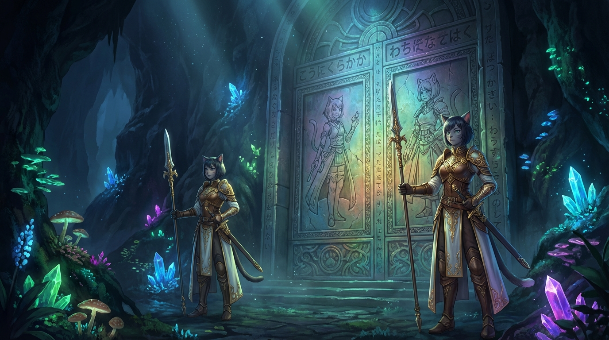
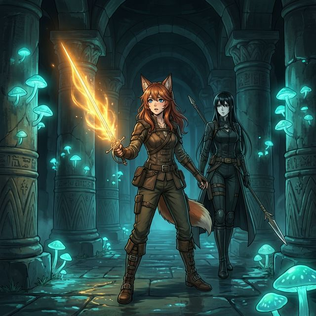

# Kapitola 4: Elaniina Čepeľ

Tami bežala.

Tunely pod Šoravenom boli tma, voda a ozvena — nič iné. Puška strážnika jej bila o bok, Nadel v pošve o stehno, a vlhký vzduch bol taký hustý, že sa dýchal skoro ako tekutina. Voda po členky. Niekde nad ňou — dunenie. Grawská artiléria. Ďaleko, hlúpo, nevyhnutne.

*Maks je sám.*

To bolo jediné, na čom záležalo. Nie Arkot, nie Yera — tí boli v bezpečí. Kito ich vyviedol. Ale Maks bol niekde dole, v tme, za závalom, a nasledoval dve veci, čo vyzerali ako obri a pohybovali sa ako smrť.

Bežala rýchlejšie.

Tunely sa kľukatili. Bočné priechody, slepé uličky, kanalizačné šachty plné čiernej vody — poznala ich len z inštinktu, čo nikdy nevedela pomenovať. *Hore. Dole. Rovno. Vľavo.* Nohy rozhodovali skôr, než hlava stihla povedať nie.

---

Zvuk.

Škrabanie. Mokré. Organické. Spred nej — za rohom, odkiaľ prúdila voda a páchol hnis. Tami sa zastavila. Puška hore. Dýchanie pod kontrolou. *Počúvaj.*

Spoza rohu vyšla vec, čo bola kedysi Varietas.

Experiment. Jeden. Sám — odrezaný od ostatných, stratený v tuneloch, zlákaný zvukom jej krokov. Telo mačky — nie. *Telo, čo si pamätalo, že bolo mačkou.* Koža nahradená fialovými kryštálovými výrastkami, oči — príliš veľa očí — rozložené po hlave ako kvety. Z papule mu kvapkala tekutina, čo sa leptala do podlahy. Jedna predná labka — väčšia, než mala byť — sa zdvihla a zavesila vo vzduchu. [NOTE: Experiment z Ch3 — mutovaný Varietas, produkt zakázaného výskumu. Tami ich zabíjala v Ch3 s triaškami. Teraz nie.] [→ 03-tunnels.md: Experimenty — Dren, Yara, tretia — Kitovi priatelia]

Tami nedvihla pušku.

V tuneloch, keď zabíjala Experimenty s Maksom — triasla sa. Lebo to boli *oni*. Dren. Yara. Kitovi priatelia. *Jej* ľudia. Triasla sa a svetielko neprichádza, keď sa trasieš. Roky tréningu, tisíce žabiek na jazere — a nič z toho nefunguje, keď tvoja ruka nevie, či chce zabiť alebo plakať.

Teraz vedela.

Hlava bola čistá. Prázdna. Jediné, čo v nej bolo — *Maks je sám* — a to stačilo. Žiadny Dren, žiadna Yara, žiadne mená. Len cieľ. Len ruka. Len tréning, čo čakal roky na moment, keď mu telo konečne dovolí.

*Žabky.*

Slovo, čo nemalo v tuneli plnom krvi čo robiť — a predsa prišlo. Jasné. Čisté. Zo dňa tak dávneho, že ho takmer nezažila, len si ho *pamätala*.

*Mala desať. Jazero za ruinami Kitsune — ranné hmly, hladina ako sklo. Maks vedľa nej, usmievajúci sa — vtedy sa ešte usmieval. Kľačal pri vode a hádzal kamene.*

*Žabky. Ploché kamienky, čo sa odrážali od hladiny — raz, dva, tri — a každým dotykom kreslili kruhy na vode. Maks ich hádzal s lenivou presnosťou a Tami sa snažila napočítať odrazy.*

*„Skús ich trafiť,“ povedal.*

*„Čím?“*

*Ukázal na jej predlaktie. Tam, kde pod kožou bežali prvé, tenké línie tetovaní — dar matky, najmenšia možná Spira.*

*„Svetielko. Malé. Ploché. Rýchle.“ Medzi jeho prstami sa zjavila zlatá iskra — demonštrácia. Blikla, zarotovala a zmizla. „Kameň bude skákať po vode. Ty ho trafíš, kým letí.“*

*„To sa nedá.“*

*„Skús.“*

*Hodil žabku. Kameň sa odrazil — raz, dva — a Tami stlačila predlaktie. Zlatá iskra vyletela z jej prstov. Nerovná, roztrasená, príliš pomalá. Kameň sa odrazil tretíkrát a zmizol pod hladinou. Iskra trafila vodu. Kruh.*

*„Ešte raz.“*

*„Nechcem.“*

*„Ešte. Raz.“*

*Druhý kameň. Odraz — raz, dva — a iskra vyletela rýchlejšie. Trafila kameň medzi druhým a tretím odrazom. Drobný *tink* nad hladinou. Žabka sa rozpadla na dva kusy a oba sa potopili.*

*Maks prikývol. „Lepšie.“*

*Robili to celé ráno. Prvé minúty netrafila nič. Potom každý druhý. Potom každý. Maks nemusel hovoriť viac.* [NOTE: Flashback — Maks a Tami, jazero za ruinami Kitsune. Tami sa učí ovládať Spiru cez hru. Maks hádzal žabky a Tami ich triafala svetielkami — miniaturizované Spira drony. Tréning presnosti a rýchlosti maskovaný ako hra. Tami mala 10. Maks sa vtedy ešte usmieval — pred niečím, čo ten úsmev zničilo.]

Experiment zavrčal. Fialové oči — všetkých šesť — sa upreli na ňu. Labka sa spustila.

Tami stlačila predlaktie.

Zlatá iskra vyletela z jej prstov — malá, plochá, rotujúca — a letela. Rýchla. Presná. Tichá. Nie žabka — ale to, čo žabky triafalo.

Trafila hlavu.

Žiadna explózia. Žiadny záblesk. Žiadny zvuk. Telo jednoducho prestalo stáť — labky povolili, fialové oči sa zavreli a vec, čo bola kedysi mačkou, sa zosunula do vody. Ticho. Kruhy na hladine. [NOTE: Tami zabíja Spira dronom — zlatý disk, miniaturizovaný, rýchly. Roky tréningu od detstva. Prečo nepoužila svetielko v Ch3? Svetielko je ťažká technika — vyžaduje čistú hlavu, roky praxe, absolútnu kontrolu. V Ch3 sa triasla (Kitovi priatelia, emócie), triasúce ruky = žiadne svetielko. Teraz beží zachrániť Maksa — hlava je prázdna, čistá, jeden cieľ — a telo si konečne spomína na to, čo roky trénovalo.]

Ruka sa jej netriasla.

Prvýkrát v boji — netriasla sa. Roky tréningu a tisíce žabiek a *teraz* to prišlo — nie keď chcela, nie keď skúšala, ale keď v hlave nezostalo nič okrem cieľa.

*Maks je sám.*

Bežala ďalej.

---

A potom sa niečo pohnulo.

Nie pred ňou. Nie za ňou. *Vedľa.* V tieni pri stene, kde nemalo nič byť — ani potkan, ani prievan — sa tma *zhustila*.

Tami sa zastavila. Pravá ruka na Nadeli. Ľavá na puške. Oči hľadali tvar, líniu, čokoľvek, čo dávalo zmysel.

Nič. Len tma.

A potom z tej tmy vykročila žena.

Vysoká. *Príliš* vysoká — akosi neprirodzene symetrická, ako socha, nie osoba. Čierne vlasy zviazané dozadu. Tvár — krásna, ale nesprávne. Dokonalá. Žiadna vráska, žiadna asymetria, žiadna známka toho, že ten tvar bol niekedy *živý*. A oči — čierne. Hlboké. Oči, čo vyzerali ako studne, do ktorých sa hodili stáročia a nikdy sa neozval dopad.

Tma na jej koži — nie šaty, nie pancier — sa stiahla. Rozplynula. Ako keby sa tieň rozhodol pustiť, čo držal. [NOTE: Čierny Prach kamufláž — Sera ho používa na optický stealth. Tami vidí len „tmu, čo sa stiahla“ — nechápe mechanizmus. Pre Tami je to mágia.]

Tami nestrelila. Nadel zostala v pošve. Puška na boku.

Nevedela prečo.

---

Žena sa na ňu pozerala. Ticho. Dlho. Tie čierne oči — nehybné, nečitateľné — prešli po Taminej tvári, ušiach, očiach. Zastavili sa na očiach.

*[Modré oči. Rennove oči.]*

Niečo sa v tých čiernych hĺbkach zachvelo. Len na okamih — ako kameň hodený do studne, jeden kruh na hladine, a potom zas nič.

*[Dcéra.]*

„Kto si?“ povedala Tami. Hlas kontrolovaný. Pokojný. *Líška nekričí, keď cíti predátora — líška čaká.*

Žena naklonila hlavu. Pomaly. Zvieracie gesto — posudzovanie.

„Čepeľ Elánie.“

Dva slová. Hlas hlboký — nesmierne hlboký, príliš hlboký na tú štíhlu postavu. Starý. Studený. Hlas z hrdla, čo hovorilo tisícročia a nikdy nezvýšilo tón. [NOTE: Sera sa predstavuje titulom, nie menom. Titul stačí. Meno je zbytočné — nikomu tu nič nehovorí. „Čepeľ Elánie“ = zbraň dcéry Inetis.] [→ characters/Sera.md: Sera = Elániina Čepeľ, bodyguard a spoločníčka]

Tami ju nepoznala. Nič v tých dvoch slovách sa nespojilo s ničím, čo vedela — žiadna referencia, žiadne echo. *Elánie. Kto?*

„A čo tu robíš?“ *V tuneloch. Uprostred vojny. V tme, kde by nemal byť nikto okrem krýs a nás.*

*[Líška. Presne ako otec — rovnaké opatrné oči, rovnaká tichá odvaha. A úplne rovnaká tvrdohlavosť.]*

„Pomáham.“

Jedno slovo. Žiadne vysvetlenie.

---

Natiahla ruku k Tami.

Gesto, ktoré bolo absurdne dievčenské. Jemné. Takmer *rozkošné* — ako dievča z anime, čo ponúka priateľstvo, nie ako bytosť s očami, v ktorých zomreli celé civilizácie. Prsty rozprestené, dlaň hore, hlava mierne naklonená nabok. [NOTE: Sera testuje — sladký gesto je úmyselný kontrast. 3000 rokov social engineering. Chce vidieť, ako Tami zareaguje. Kto cúvne, kto nie. Manipulácia? Áno. Ale aj — niečo úprimnejšie, staršie, čo Sera sama nedokáže pomenovať.] 

*[Testovať reakciu. Kto cúvne, kto nie.]*

Tami sa zachvela.

Nie strachom. Nie chladom. Niečím starším — inštinktom, čo hovoril, že tá ruka nie je nevinná. Že nič na tejto žene nie je nevinné. Že tá ruka — tá jemná, elegantná, absurdne roztomilá ruka — zabila viac ľudí, než Tami kedy stretla.

Nevzala ju.

Sera stiahla ruku. Prikývla. Pomaly. Bez urážky, bez prekvapenia. Len — *potvrdenie*.

*[Pochopiteľné. Ale škoda.]*

---

„Môj priateľ je sám,“ povedala Tami. „Dole. Nasleduje Paladínov.“

Sera sa ani nepohla. Ale niečo v tých čiernych očiach sa zmenilo — záblesk. Nie prekvapenie. *Výpočet.*

*[Ten muž. Živý. Bližšie, než som čakala.]*

„Viem, kde je,“ povedala Sera. Hlas rovný. Pokojný. Ako keby fakt, že vie o Maksovej polohe v labyrinte tunelov pod obliehaným mestom, bol tak samozrejmý ako dýchanie.

„Ukáž mi cestu,“ povedala Tami.

„Nie.“ Sera vykročila. „Poď.“

Tami na ňu pozerala. Dlho. Tvrdo.

*Veríš jej?*

Nie. Ani náhodou. Nič na tejto žene nevzbudzovalo dôveru — nie tá tvár, nie ten hlas, nie tie oči, nie tá absurdná istota. Bola ako tma, čo sa naučila chodiť, a Tami jej neverila ani na centimeter.

Ale Maks bol sám.

„Dobre,“ povedala Tami.

 Sera sa otočila. Čierny Prach na jej koži sa zachvel — a vykročila do tmy. Tami za ňou. [NOTE: Tami + Sera — dvojica sa formuje v tuneloch. Kito tu NIE JE — ešte vyvádza Arkota a Yeru. Dobehne neskôr — až v Časti III, pri čiernej bráne. Sera vedie. Tami jej nedôveruje, ale nemá na výber. Bridge do Časti I — Hlbina, kde sa pripoja k Maksovi v krypte.]

---

Maks ich stopoval do hlbiny.

Od kolapsu tunela sledoval modré svetlo na ich chrbte — bludné ohníky, odrážajúce sa v mokrých stenách ako svietidlá, čo viedli namiesto nich. Neponáhľali sa. Neschovávali sa. Kráčali s istotou bytostí, ktoré nemali dôvod sa báť čohokoľvek pod zemou. [→ 03-tunnels.md: Rau a Kira, prvý kontakt v Časti IV]

Tunely sa skončili pri schodisku.

Točité. Kamenné. Vytesané do skaly tak dávno, že hrany schodov boli zaoblené miliónmi krokov — alebo tisícročiami vody. Voda sa tu valila po schodoch dolu, tenká vrstva, čo sa leskla v modrastom svetle Paladínov ako hadia koža. Schody viedli dole — hlbšie, než tunely, hlbšie, než kobky, hlbšie, než čokoľvek, čo Chrám Matky kedy priznal.

Vzduch sa menil s každým otočením schodiska. Chladnejší. Suchší. *Starší* — akoby tu dole čas zdochol a nikto si neprišiel po telo. Dunenie artilérie z povrchu sem doliehalo len ako vzdialený pulz — tupý, rytmický, bezvýznamný. Iná vojna. Iný svet.

Maks počítal otočky. Pätnásť. Dvadsať. Tridsaťdva. Hlbšie než základy Chrámu. Hlbšie než kanalizácia. Niekde pod hlavným námestím Šoravenu — pod kamennými dlaždicami, pod kostami, pod všetkým, čo toto mesto považovalo za *dno*.

Schody sa skončili.

---

Maks vykročil do priestoru, ktorý nemal čo existovať pod mestom.

Jaskyňa. Nie komora, nie sála — *jaskyňa*. Strop sa strácal v tme desiatky stôp nad jeho hlavou. Steny sa rozbiehali do strán tak ďaleko, že ich videl len ako hmlisté obrysy v slabom svetle. Priestor tak veľký, že v ňom Chrám Matky mohol stáť celý — i s vežou, i s kupolou — a ešte by zostalo miesto na námestie okolo neho. [NOTE: Podzemná jaskyňa epických rozmerov — predchádzajúca Chrám, predchádzajúca mesto. Šoraven bolo posvätné miesto, kde Inetis ukončila vojnu Varietas a Archanjelov. Jaskyňa slúžila ako útočisko pred zimou v pradávnych časoch.] [→ 09-event-database.md: Šoraven — miesto mieru, kde Inetis uzavrela prímerie]

A svietilo to.

Nie lampy. Nie ohne. *Život.* Modré svetlo — tlmené, chladné, rozprestreté po stenách a strope ako hviezdna obloha obrátená naruby. Huby. Rastliny. Veci, pre ktoré nemal meno — kliny bioluminiscenčného života, čo rástli z trhlín v kameni a premieňali jaskyňu na niečo medzi prírodou a snom. Na stenách kvitli hviezdicovité výrastky veľké ako dlane, žiariace tým tichým, studeným modrým svitom. Zo stropu viseli tenké vlákna — priesvitné, trblietavé — ako sieť pavúka, ktorý sa živí svetlom. A medzi nimi huby — bledé, vysoké, s klobúkmi veľkými ako dáždniky — vrhajúce kruhy modrej žiary na vlhký kameň pod sebou. [NOTE: Vizuálna inšpirácia — bioluminiscencia ako v Nyau. Podzemný ekosystém predchádzajúci Chrám. Toto tu rástlo tisícročia.]

Maks sa zastavil na prahu. Dýchal.

Vzduch tu bol iný. Vlhký, ale čistý — žiadny smrad kanalizácie, žiadny pach hniloby. Čerstvý. *Živý.* Vôňa zeme a niečoho sladkého, čo mu pripomínalo… nevedel čo. Niečo z veľmi dávna. Niečo, čo jeho telo pamätalo, aj keď myseľ nie.

Pradávny kamenný chodník sa vinul cez jaskyňu — široký ako cesta, vytesaný do skalného dna s presnosťou, ktorá nebola prírodná. Okraje rovné. Povrch hladký, ale nie ošúchaný — skôr *navrhnutý*. Chodník, po ktorom kráčali iní, dávno predtým, než tu niekto postavil chrám. [NOTE: Chodník = pôvodná infraštruktúra z čias Impéria Nevriss. Kto ho postavil? Čitateľ sa má pýtať.]

Paladíni boli niekoľko stoviek yardov pred ním. Dve modré siluety na kamennom chodníku — malé v obrovskom priestore, ich taktické lampy zbytočné v žiari húb. Kráčali pokojne. Poznali cestu.

Maks vykročil za nimi. Ticho. Modré svetlo húb mu stačilo — nepotreboval nič z toho, čo mal v sebe. Len oči. Len nohy. Len trpezlivosť. [→ 03a-nanotechnology.md: Gen 1 pasívny sken — aktívny, ale Maks ho nepotrebuje na navigáciu. Jaskyňa svieti sama.]

---

Záblesk.

Ďaleko pred ním — pri konci chodníka, kde sa jaskyňa zužovala do skalnej steny — sa rozsvietilo niečo žlté. Ostré. Geometrické. *Pentagramy.* Zlaté línie v tme, rotujúce prstence Spiry — a proti nim modré záblesky Paladínskych štítov.

Maks sa zastavil. Z tejto vzdialenosti to boli len farebné škvrny — ale niečo v ňom videlo viac. Detaily, čo nemali byť viditeľné na tristo yardov. Dve postavy v ľahkom brnení — štíhle, rýchle, s vlčími ušami prilepenými k lebkám — stáli pred kamennou stenou. Pursang. Ceremoniálna stráž, kopije v rukách, meče na opaskoch, pentagramy vo vzduchu. [→ 03a-nanotechnology.md: Gen 1 pasívny sken — Maks „vidí“ detaily na veľkú vzdialenosť, ale nie očami. Drony.]

Boj trval krátko. Ale nie tak krátko, ako Paladíni čakali.

Strážcovia ich videli prichádzať. Nevyčkávali — vykročili oproti. Kopije vodorovne, pentagramy aktivované, sústredné kruhy zlatej Spiry rotujúce vo vzduchu pred každým z nich. Profesionáli. Stráž, čo toto miesto strážila po generácie a trénovala na niečo presne takéto.

Rau švihol sekerou — vibrovlna narazila na zlatý pentagram. Kruhy sa zachveli. Absorbovali energiu. *Držali.* Sekundu. Dve. Tri. Spira pohltila vibráciu a pentagram sa len rozžiaril jasnejšie. Rau švihol znova — plná sila. Pentagram praskol na okrajoch, ale stredom držal.

Prvý strážca zašepkal. Tri slabiky — haiku fragment, tichý a presný. Runy na kopiji sa rozžiarili — zlaté znaky pozdĺž ratiska, dávne, krásne. Spira sa sústredila do hrotu, zhustila, zmenila — už to nebola len energia. Bol to *úmysel*. Spevnená čepeľ. [NOTE: Pursang spevnenie — rovnaký princíp ako Sera. Haiku aktivácia, Spira sa mení na prierazný mód. Ceremoniálna stráž pozná túto techniku — strážili svätyňu generácie. Staršia technika než čokoľvek na severe.]

Hodil.

Kopija letela rovno — presná, rýchla, žiariaca. Kira zdvihla sekeru na blok. Spevnený hrot narazil na čepeľ — zapraskalo, iskry — a *skĺzol*. Po sekere dole, po ruke, po brnení — a zabodol sa do stehna. Cez pancier. Cez Svetelný Štít. Cez všetko.

Kira zavrčala — hlboký, zvierací zvuk. Kopija trčala z jej stehna, rukoväť sa ešte chvela. Prvá krv. Červená na modrom svetle. Paladín — *zranený*. Pursangom. [NOTE: Spevnená kopija prenikne Svetelným Štítom — rovnaký princíp ako Serin Yari. Spira spevnenie prebije Svetelný Štít. Pursangovia to vedeli. Kira blokovala — ale spevnený hrot skĺzol po sekere do stehna. Zranenie nie je smrteľné, ale *preniklo pancierom*. To je informácia, ktorú Maks zaregistruje.]

Kira vytiahla kopiju zo stehna. Jedným ťahom. Hodila ju nabok. Krv. Ale stála.

Strážca už tasil meč. Zašepkal znova — dlhšie haiku, sedem slabík — a runy pozdĺž čepele sa rozžiarili. Zlaté znaky pulzovali v tme jaskyne ako hviezdy, čo niekto rozložil po oceli. Spevnený meč. Čepeľ, čo počula poéziu a *spevnila sa*. [NOTE: Pursang spevnenie meča — haiku aktivácia. Rovnaký princíp ako Sera a Yari. Toto je stará technika — Pursang ju zdedili po predkoch, ktorí sa naučili od Cirkvi, ktorá sa naučila od Mormiel. Línia vedenia siaha k Inetis.]

Vrhol sa na Kiru. Meč prvý — vertikálne, rýchlo, spevnená čepeľ žiarila. Kira blokovala sekerou. Spevnený kov narazil na vibro-oceľ — *zapraskalo*. Iskry. Zlaté na modrom. Strážca bol rýchlejší, než mal byť — meč menší, ľahší, presnejší než sekera. Bodol. Kira uhnula — ale nie dosť rýchlo. Škrabanec na predlaktí. Cez pancier.

Druhý strážca útočil na Raua. Kopija — séria bodnutí, rýchla, presná. Rau blokoval sekerou — plošne, ťažkopádne. Kopija bola rýchlejšia.

Posunkové znamenie. Rau ku Kire. Jedno gesto.

Rau cúvol. Kira tiež — krok, dva. Strážcovia vykročili za nimi. Spevnený meč prvý, kopija za ním. Synchronizovaný tlak — presne to, na čo boli trénovaní. Tlačiť útočníka späť, držať pozíciu, brániť bránu.

Rau siahol na opasok.

Malý predmet — guľatý, matný, veľkosť päste. Hodil ho medzi strážcov. Ľahko. Takmer nedbalo.

Strážca s mečom sa pozrel dole. Poznal granáty — Pursang mal vlastné, tréningové aj bojové. Zdvihol pentagram. Tri kruhy Spiry sa sformovali okolo oboch strážcov — štít proti výbuchu. Automatická reakcia. Správna.

Na *zlý* granát.

Pulz. Tichý. Neviditeľný. Žiadna explózia, žiadny záblesk — len vlna, čo prešla priestorom ako tieň. A Spira *zomrela*. [NOTE: EMP granát — Paladínska technológia z juhu. Elektromagnetický pulz, ktorý vyradí Spiru v okruhu niekoľkých yardov. Pursang stráž pozná bežné granáty (výbuch, šrapnel, zápal) — majú na ne odpoveď (Spira štít). EMP nepoznajú. Nikto na severe ho nepozná. Paladíni ho vyvinuli presne na toto — na nepriateľa, ktorý sa spolieha na Spiru.]

Pentagramy zhasli. Všetky naraz — ako keby niekto vyfúkol sviečku. Zlaté kruhy sa rozplynuli v tme. Runy na spevnenom meči — tie krásne, žiariace znaky haiku — stmavli. Kopija v ruke druhého strážcu prestala svietiť. Spira odišla. A s ňou všetko, čo ich chránilo.

Dvaja strážcovia stáli v tme jaskyne. Bez štítov. Bez spevnenia. Len ľahké brnenie a holý kov v rukách — proti dvom obrom v pancieri zo Svetelného Štítu.

Strážca s mečom sa pozrel na čepeľ. Mŕtvu, tmavú, studenú. A potom zdvihol hlavu. Pozrel na Raua — na tú masívnu siluetu v modrom svetle — a *vykročil dopredu*.

Rau dokončil pohyb. Sekera dvakrát. Rýchlo. Vecne.

Druhý strážca — ten s kopijou — stál ešte. Kopija v rukách — tmavá, nespevnená, len kov. Vedel, že bez Spiry je to len tyč. Vedel, že zomrie. Bodol — posledný úder, čistý, presný, do medzery v Rauovom brnení, kam predtým trafil spevnený hrot. Tentokrát nepreniknul. Bez spevnenia — len kov na kov. Nič.

Rau ho zastavil.

 Tam, kde boli zlaté pentagramy, nebolo nič. [NOTE: Pursang stráž krypty — ceremoniálna, ale elitná. Spevnenie cez haiku — stará technika zdedená od Cirkvi/Mormiel. Spira spevnenie prebíja Svetelný Štít (rovnaký princíp ako Serin Yari). Spevnená kopija zranila Kiru do stehna — skĺzla po sekere do stehna, prešla pancierom. Spevnený meč škrabal cez Svetelný Štít. Pursangovia boli reálna hrozba — *kým mali Spiru*. Paladíni to vedeli. EMP granát zrušil Spiru a boj bol v tej sekunde rozhodnutý. Pursangovia bojovali ďalej — bez štítov, bez spevnenia, s holým kovom. So cťou. Ale česť nestačí na Svetelný Štít.]

Kira si siahla na stehno. Krv stále vytekala. Posunkové znamenie k Rauovi. *Pokračujeme.* Vykročili ďalej. Nie tak pokojne ako predtým. Kira mierne krívala.

Maks prešiel okolo tiel o minútu neskôr. Zastavil sa. Pursang v ľahkom ceremoniálnom brnení, zlaté línie na náprsníkoch stmavnuté — trvalo stmavnuté, nie pohasnuté. Mŕtve. EMP ich *vymazal*. Oči otvorené. 

---

Na konci chodníka stála brána.

Kamenná. Masívna. Výška troch mužov, šírka piatich — monolitný blok žuly zasadený do skalnej steny, akoby niekto vyrezal kus hory a vsadil doň dvere. Na povrchu boli vytesané znaky. Riadky modlitieb, jedna vedľa druhej, od vrchu po spodok. Medzi nimi výjavy — postavy, scény, príbehy vytesané do kameňa s precíznosťou, čo pripomínala egyptské chrámy alebo antické friézy. Ženy v rúchach. Rituály. Tvár, čo sa opakovala — stará, prísna, so závojom cez oči. Požehnaná Matka. [NOTE: Kamenná brána = hrobka Mormiel, Požehnanej Matky — Hlasu Inetis, zakladateľky Kultu Vševedúcej Matky. Haiku modlitby za ňu. Reliéfy zobrazujú jej život — ale Maks to nepozná, netuší kto je na reliéfoch. Pre čitateľa na 5. re-read: medzi výjavmi je príbeh, ako sa Mormiel stala Hlasom Inetis po tom, čo ju opustil jej muž (Renn). Easter egg.] [→ 06-society.md: Kult Matky, Mormiel — Požehnaná Matka]

Maks ich nepoznal. Nie jazyk — ten bol japonský, to vedel. Ale kombinácie. Poriadok slov. *Iná syntax, než akú učila Neta.*

Paladíni stáli pred ňou.

Kira — červený chochol — švihla sekerou. Vibrovlna narazila na kameň. Ozvena sa rozletela jaskyňou a vrátila sa trikrát, než stíchla. Na povrchu brány zostal plytký zárez — kozmetický, nie štrukturálny. Kameň bol príliš hrubý. Príliš starý. Príliš *úmyselný*.

Rau to skúsil tiež. Dlhý, horizontálny rez. Iskry. Prach. Zárez hlbší, ale rovnako zbytočný.

A potom prestali skúšať čepeľ.

Rau zasadil sekeru do zeme. Kira tiež. Obaja sa postavili pred bránu — rameno pri ramene, dvestokiloví obri v žiariacom brnení — a *zatlačili*. Ruky na kameni. Nohy zapriahnuté do skaly. Svaly pod pancierom sa napli tak, že zlaté línie na ich brnení zapraskali.

Kameň zavrčal. Hlboký, basový zvuk — zvuk materiálu, čo nepoznal nič okrem pomalých, ceremoniálnych rúk kňažiek, a teraz ho niekto *trhal*. Rám brány praskol. Prach sa zosypal z vrchu. Brána sa pohla — centimeter, dva, desať — a potom sa pomaly, neochotne roztvorila. Masívne kamenné krídla sa rozišli do strán a za nimi— [NOTE: Kamenná brána nie je zamknutá — Cirkev ju otvára pri ceremóniách. Ale normálne ju otvára niekolko desiatok inkvizítorov s pákami a kladkami. Paladíni to vyriešili silou.]

Tma.

Paladíni zdvihli sekery. Vkročili dovnútra. Modré svetlo z ich pancierov pohltila tma za bránou ako more, čo prehltne kvapku.

Maks čakal. Počítal sekundy. A potom — ticho, rýchlo, ako tieň medzi tieňmi — prešiel cez bránu za nimi.

---

Krypta.

Priestor bol iný než jaskyňa — nie prírodný, nie organický. *Stavaný.* Stovky kamenných pilierov sa dvíhali z podlahy k stropu desiatky stôp nad hlavou — masívne, hranaté, vytesané s presnosťou, ktorá nechávala rovné plochy a ostré hrany aj po tisícročiach. Na pilieroch — reliéfy. Výjavy zo života postáv, ktoré Maks nepoznal — ženy v ceremoniálnych rúchach, procesie, rituály, ohňostroje Spiry. Príbehy, čo tu stáli tisícročia a čakali, kým ich niekto prečíta. Nikto neprišiel. [NOTE: Reliéfy na pilieroch = výjavy zo života Mormiel (Požehnanej Matky, Hlasu Inetis) a jej nasledovníčok — ďalších Matiek Kultu. Egyptsko-antický štýl. Toto je z čias Impéria Nevriss.] [→ 06-society.md: Kult Matky, história]

Medzi piliermi — tma. Hustá, studená tma, čo pohltila modré svetlo húb z jaskyne a nechala len piliere a ich tiene.

Vzduch tu páchol inak. Sucho. Prach. A niečo — slabo, takmer nepostrehnuteľne — *staré*. Nie vlhkosť, nie plieseň. Vek sám. Čas usadený do kameňa.

Na konci krypty — za stovkami pilierov, za dĺžkou celého Chrámu nad nimi — sa črtalo niečo iné.

Dvere. Menšie než kamenná brána. Čierne. Matné. Z materiálu, ktorý nesvieti, neodráža, len *pohlcuje*. Maks ich videl aj z tejto vzdialenosti — jeho oči — tie, čo neboli celkom ľudské — rozpoznali ten materiál okamžite.

*Čierny Prach.*

Nakonfigurovaný. Zhustený do pevnej hmoty, do tvaru, do úmyslu. Niekto ho pred veľmi dávnou dobou nariadil byť *toto* — a on poslúchol a nezabudol. [NOTE: Čierna brána = nakonfigurovaný Čierny Prach. Maks rozpoznáva — má ten istý materiál v žilách. Rovnaký ako na Elysiu/Ynetis. Vedenie Cirkvi pozná haiku syntax a vie túto bránu otvoriť — tak uložili artefakt (palicu) do svätyni za ňou. Mormiel ich to naučila. Bežní veriaci a archeológovia (ako Kito) o čiernej bráne nevedia — vidia len kryptu.]

Paladíni si vykračovali k čiernym dverám. Pokojne. Kira mierne krívala. Akoby im krypta patrila. Maks sa zakrádal pomedzi piliere — tieň medzi tieňmi, kamenné stĺpy ho kryli z oboch strán. Dvesto yardov medzi ním a nimi. Sto. Osemdesiat.

A potom počul niečo za sebou.

Dýchanie. Hlasné. Nekoordinované.

Otočil sa — samopal hore, automaticky — a za pilierom stála Tami. Puška strážnika jej bila o bok. Nadel v pošve. Dýchala ťažko — bežala. [→ 03-tunnels.md: Časť V — Tami oslobodila priateľov, vracia sa za Maksom. Sera ju doviedla cez tunely — viď Prológ.]

Maks jej ukázal rukou. *Ticho.*

Tami prikývla. Prišla bližšie — prsty na perách, oči na Paladínoch v diaľke.

„Priniesla som posilu,“ zašepkala.

Maks sa obzrel. Za Tami — nič. Len piliere a tma.

„Kde?“

Tami sa takmer usmiala. „Tu. *Ona* nám pomôže.“

*Kto?*

Maks sledoval priestor v okolí Tami — automaticky, reflexívne. Teplota. Pohyb vzduchu. Vibrácie. Nič. Žiadna ďalšia prítomnosť. Žiadny signál. [→ 03a-nanotechnology.md: Gen 1 pasívny sken — Sera je mimo detekcie. Čierny Prach kamufláž blokuje aj Maksov sken.]

„Kto?“ zopakoval Maks.

---

Tieň vedľa piliera sa pohol.

Nie vietor. Nie svetlo. *Osoba.* Niečo na koži tej osoby pustilo tmu — Čierny Prach, matný, pohlcujúci — a z ničoho sa *zhmotnila* žena. [→ 03a-nanotechnology.md: Gen 1 Čierny Prach — Sera ho používa ako kamufláž.]

Vysoká. Čierne vlasy. Tvár dokonalá — bez asymetrie, bez jedinej línie, čo by ju označila za živú. Yari v ruke, skrátená, puzdro prázdne.

Tami ani nestrhla. Poznala ju. [NOTE: Tami Seru stretla v tuneloch — viď Prológ. Pre Tami nie je prekvapenie. Pre Maksa áno.]

Čierne oči sa upreli na Maksa.

A niečo v nej sa zastavilo. Nie výraz. Nie pohyb. Len hĺbka v tých čiernych očiach sa zmenila, akoby sa za nimi otvorila priepasť.

---

*[Nie je to možné — nie tu, nie teraz. Tá tvár…]*

*[Fuji sa vzďaľuje. Oblaky. Tma. Modrý obrys Zeme pod ňou — Japonsko, také malé. Na obrazovke v kabíne muž ďakuje svetu. Propaganda. Ďakovačky. Veľký krok pre ľudstvo. Po jeho pravici dcéra — krásna, usmievavá. Aj ja chcem byť taká, keď budem veľká. A vedľa nej — niekto. Mladý. Celý v čiernom. Vojenská uniforma. Stál za ňou ako tieň. Je to jej priateľ? Mala som päť rokov. Mala som plyšového medvedíka menom Haru. Pozerala som na tú krásnu dievčinu a chcela som mať jej vlasy.]* [NOTE: Serin flashback — odlet ARK-11, EY 2150. Na obrazovke PR prenos: Koordinátor John Reef, jeho dcéra Neta Fujiwara-Reef, a vedľa Nety — mladší Maks v čiernej vojenskej uniforme. Sera si ho ako 5-ročná nevšimla. Ale teraz — 3467 rokov neskôr — rozpoznáva tú tvár. „Ak ho stretneš.. nikdy nedopovedala myšlienku.” — Inetisine posledné slová Sere.]

---

Dlhá pauza. Veterán na veterána.

Maks strhol samopal. Oči — tie čierne jamky — sa upreli na ňu. *Čierny Prach. Na niekom inom. Druhýkrát na tejto planéte.* [NOTE: Prvý bol Samaell — a vieme, ako to dopadlo.]

„Kto si?“ Hlas kontrolovaný.

„Čepeľ Elánie,“ zašepkala Tami. „Stretla som ju v tuneloch. Pomohla mi nájsť cestu sem.“

Maks neprestával mieriť. „A ty jej veríš.“

„Nie,“ povedala Tami. „Ale nemáme na výber.“

Sera sa ani nepohla. Čakala. Trpezlivo. Ako niekto, kto čakal už príliš dlho na príliš veľa vecí, a pár sekúnd navyše ho netrápilo.

*[Tá tvár.]*

Maks pomaly — veľmi pomaly — spustil samopal. Nie preto, že veril. Preto, že Tami povedala „nemáme na výber“ — a Tami neklamala. Nikdy neklamala. Nevedela ako.

Sera sa otočila k Tami. Pozrela na Nadel — dlho, pozorne, ako keby čítala niečo v tom kove.

„Dieťa.“ Hlas tichý. „Zopakuj. A pamätaj navždy.“

Zašepkala Tami do ucha.

Tami sa zhlboka nadýchla.

*„Tvar zrodený z hviezd,*
*zobudený pre krv v tme,*
*rozdeľ tento svet.“*

Nadel sa zachvela. Jemne — takmer neviditeľne. Hrot sa rozžiaril — zlatý záblesk, kratší než mrknutie. Čepeľ počula poéziu a *spevnila sa*. [NOTE: Sera spevňuje Tamin rapier haiku. Rovnaký princíp ako Yari — spira v kove reaguje na frekvenciu hlasu. Tami má teraz spevnený Nadel = prenikne cez Svetelný Štít AJ pancier. Sera tým mení pravidlá boja — Tami už nie je len návnada, je skutočná hrozba. Haiku je dar: „Pamätaj navždy“ = Sera učí Tami spevňovať zbrane. Toto je Serin štýl — nedáva rybu, učí loviť.]

Tami pozrela na žiariaci rapier. Potom na Seru.

Zmizla. Čierny Prach na koži pohltil svetlo a Sera prestala existovať.

*[Česť je len výhovorka pre nedostatok flexibility.]*

Maks a Tami stáli medzi piliermi. Tichá krypta okolo nich.

Skontrolovali zbrane. Tami odložila pušku strážnika k pilieru — príliš dlhá, príliš ťažkopádna na to, čo príde. Vytiahla pištoľ z puzdra na stehne. Nadel v pravej, pištoľ v ľavej. Vykročili k čiernej bráne.

---

Paladíni stáli pred čiernou bránou. Frustrácia.

Kira švihla sekerou — vibrovlna narazila na čierny povrch. Žiadna ozvena. Žiadne iskry. Prach pohltil energiu — absorboval ju, rozptýlil, *ignoroval*. Na povrchu zostal plytký zárez. Nič viac.

Rau skúsil to isté. Vertikálny rez, plná sila. Čepeľ prešla po povrchu — škrabanec. Čierny Prach sa ani nezachvel. [NOTE: Kontrast — kamennú bránu otvorili silou. Čiernu nie. Prach nepovolí hrubej sile — len hlasu.]

Rau zarazil sekeru do zeme. Skúsil to isté, čo s kamennou bránou — rameno pri ramene, holé ruky na čiernom povrchu. Zatlačili. Dvesto kilo svalov a ocele proti materiálu, čo pamätal vek hviezd.

Nič. Čierny Monolit sa ani nepohol.

Posunkové znamenie medzi nimi. Rýchle. Vojenské. Frustrácia a výpočet.

---

Maks vystúpil spoza piliera.

Zdvihol samopal. Tri rany — nie na Paladínov. Na strop krypty nad nimi. Náboje narazili na kameň — odrazili sa, odštepili čiastočky, a zhora sa zosypal jemný dážď prachu.

Obaja sa otočili. Presne. Koordinovane. Sekery v rukách. Modré svetlo na chrbte pulzovalo.

Rau siahol na opasok. Rovnaký pohyb ako pri kamennej bráne — rýchly, automatický, naučený. Malý guľatý predmet — matný, veľkosť päste — letel smerom k Maksovi.

Niečo v ňom zareagovalo skôr, než on sám. Nevedome — rovnako, ako dýchal, rovnako, ako srdce bije bez povolenia. Vzduch medzi ním a granátom sa *zahustil* — na zlomok sekundy, na priestor dlane. Granát narazil na niečo neviditeľné — zastavil sa, zavrčal — a dopadol na zem. Kus ocele. Mŕtvy. Žiadny pulz. Žiadny záblesk. Nič. [NOTE: Čierny Prach v Maksovej krvi zareagoval inštinktívne — nie vedomé rozhodnutie, ale obranný reflex natrénovaný za 200+ rokov aktívnej vojenskej služby (top tier delta force / assassin). Prach je ovládaný myšlienkami — špecifické triky vyžadujú desiatky až stovky rokov praxe. Maks (opustil Zem 2301, vyšší tech level) má intenzívnejší bojový tréning než Sera (opustila Zem 2150, 3000 rokov sama, bez inštruktorov, bez tech upgradu). V priamom boji by Maks vyhral — Sera to vie (viď Časť V: „Keby sme bojovali...“). Sera kompenzuje stealthom (Čierny Prach kamufláž), social engineeringom a 3000 rokmi skúseností. Iný tréning, iná špecializácia, iný Prach. Paladíni prvýkrát vidia, že niekto *ich* technológiu zastavil. Callback na EMP z boja pri kamennej bráne — rovnaký trik, iný výsledok.]

Rau sa pozrel na mŕtvy granát na podlahe. Potom na Maksa. Prvýkrát niečo v tých očiach za prilbou — nie strach, ale *prepočítavanie*.

Tami vyrazila z druhej strany. Nadel v pravej ruke, pištoľ v ľavej. Bežala priamo na Kiru — štyri výstrely z pištole. Svetelný štít sa zavlnil. Neprenikli. Ale pozornosť upútali.

Kira sa otočila k Tami. Rau k Maksovi.

Maks cúvol za pilier. Rauova sekera prešla vzduchom — vibrovlna preťala kameň tam, kde stál. Pilier sa roztrhol v strede a horná polovica sa s rachotom zrútila do tmy.

Kira švihla po Tami. Horizontálne. Tami sa hodila za pilier — vzduchová vlna ju odhodila, narazila chrbtom do kameňa, Nadel jej zostala v ruke.

*Teraz.*

Tami vstala. Rozbehla sa. Nadel vpred — tenká čepeľ, záblesk na hrote. Spevnená. Kira zdvihla sekeru.

Tami bodla.

Nadel prenikla cez svetlo — nie na zlomok sekundy. *Úplne.* Hrot rapiera prešiel cez žiaru ako ihla cez bublinu. Svetlo sa rozišlo — a nezatvorilo sa. Spevnená čepeľ prešla ďalej. Cez oceľ. Cez náprsník. Dovnútra.

Kira zavrčala. Krv — na hrote Nadelu, na ornamentálnom brnení. Nie smrteľné. Ale *rana*. Druhá za túto noc. [NOTE: Spevnený Nadel (Sera haiku) prenikol cez Svetelný Štít AJ pancier. Bez spevnenia Nadel prenikol len štít a zanechal škrabanec. So spevnením = plná penetrácia. Kira je zranená druhýkrát — prvá rana bola Pursang kopija (stehno, r.235). Kira už krívala. Teraz ďalšia rana. Paladíni degradujú — Pursang ich zranili, teraz ich zranila Tami. Tami nie je náhodná líška — je Pursang (Rennov tréning), bojový tréning od Maksa (13 rokov), a teraz spevnenie od Sery. Tri generácie skúseností v jednom údere.]

Potom Kira udrela sekerou do Tami. Tami odrazila úder Spira štítom — pentagram sa rozžiaril, absorboval vibráciu — ale sila nárazu ju odhodila tri metre dozadu. Spadla medzi piliere.

Kira sa pozrela na bok. Na krv. *Znova.* Stehno, teraz bok. Tieto primitívne tvory ju *zraňovali*.

„Funguje!“ kričala Tami z podlahy.

Rau urobil krok k Tami. Kira tiež. Koordinovane. Kliešte.

A Maks cítil niečo, čo necítil trinásť rokov.

Nie o seba. O *ňu*.

*Odporúčanie: ÚSTUP*, oznámil Asistent.

„Tami,“ zavrčal Maks. Hlas chrapľavý. Zlomený. „*BEŽ. Teraz. Prosím.*“

*Prosím.*

To slovo Tami nikdy od neho nepočula. Nie rozkaz. *Prosba.*

Pozrela mu do tváre — do tých čiernych, bezodných očí — a videla to. Veterán z pekla, muž, ktorý nosil smrť ako kabát — sa *bál*. Bál sa o ňu.

Rau zdvihol sekeru. Kira urobila krok k Tami. Kliešte. Desať yardov od najbližšieho piliera. Nikam utiecť.

Rau napriahol sekeru — pomaly, istotne, ako kat zdvíhajúci nástroj, o ktorom vie, že ho nič nezastaví.

A niečo ho zastavilo.

---

Sera sa objavila za Rauom.

Nie teleport. Nie mágia. Tieň sa odlepil od piliera — Čierny Prach na jej koži pustil kamufláž a ona sa *zhmotnila* z tmy. Pohla sa tak rýchlo, že Tami videla len rozmazanú stopu — tieň, ktorý sa materializoval v priestore medzi jedným úderom srdca a ďalším. [NOTE: Sera nezasahuje po ústupe. Zasahuje v momente, keď sa boj stáva smrteľným — presne keď Paladíni zaťahujú kliešte. Sera čakala na moment, keď sú obaja otočení k Maksovi a Tami = chrbty odhalené. Prosím scéna je beat, ktorý spustí Serin útok — nie Maksov ústup.]

*[Prvý. Krk. Otočený.]*

A v jej ruke bol **Yari**.

Kopija. Dvojmetrová. Matný kov — starý, nepoznajúci čas. Vyzerala ako píšťala, keď ju vytiahla z puzdra na páse — a potom sa roztiahla na plnú dĺžku.

Zašepkala haiku — tichý, nežný, takmer modlitba. Špica Yari sa rozžiarila. Čepeľ počula poéziu a *spevnila sa*. Niečo v tom kove sa prebudilo — zhustilo sa, spevnilo, prešlo hranicou medzi hmotou a úmyslom. [→ 03a-nanotechnology.md: Spevnenie = nanoboty reagujú na frekvenciu hlasu — ale v próze: „čepeľ počula“]

Bodla.

Jeden presný, chirurgický úder. Yari prenikla cez svetelný štít — *úplne*. Spevnená špica prešla cez modré svetlo, akoby neexistovalo — a nezastavila sa na pancieri. Prešla cez oceľ. Cez ornamentálne pruhy. Cez všetko. Do krku. Zozadu. Bez varovania. Bez cti.

*[Hotovo.]*

Rau zavrčal — mechanický, zlomený zvuk. Krv — červená, teplá — striekla z rany. Dvestokilový monolit padol na kolená. A potom na tvár. Zem sa zachvela.

Kira sa otočila. V jej pohybe bolo niečo, čo Tami rozpoznala — nie strach. *Hnev.* Čistý, spaľujúci hnev niekoho, kto práve stratil partnera.

Zarevala. Zvuk, aký Tami nikdy nepočula — hlboký, hrdelný, zvierací. Vrhla sa na Seru — masa, rýchlosť, zúfalstvo. Vibro-sekera švihla zhora. Úder, čo by rozpolil skalu.

*[Hnev. Dobre. Nahnevaní robia chyby.]*

Tami videla príležitosť. Vyrazila spredu. Nadel vpred — spevnený hrot stále žiaril zlatou. Bodla priamo do náprsníka. Prenikla.

Kira sa na zlomok sekundy otočila k Tami. Sekera zmenila smer.

A v tom momente Sera bodla. Zozadu. Znova.

Yari — stále spevnená, stále žiariaca — prenikla cez svetelný štít, cez pancier, priamo do chrbtovej miechy. Ako do masla. Kira stuhla. Vibro-sekera vypadla z rúk. Telo sa zrútilo.

Celý boj trval menej než modlitbu.

---

Sera sa narovnala. Yari v ruke, čepeľ pokrytá krvou. Tvár nehybná. Nič — žiaden triumf, žiaden odpor, žiadne zadosťučinenie. Len práca.

A potom — s pohybom, ktorý bol čistá arogancia — kopla.

Rauova prilba sa kotúľala po podlahe krypty.

Pod ním bola tvár.

Gorila. Masívna čeľusť, hnedé oči — teraz mŕtve, skelné. Tvár inteligentná. Bojovník z kontinentu, o ktorom sa na severe len šepkalo.

Sera sa na telo nedívala. Len na krv na Yari — stekajúcu, pomalú. *Únava.* Nie z boja. Z opakovania. Výraz ženy, ktorá túto scénu videla stokrát a vedela, že ju uvidí znova.

---

Maks a Tami stáli pred čiernou bránou. Dýchali. Dve telá na podlahe pred nimi.

*Haiku. Japončina. Čierny Prach. A pohybuje sa ako niečo, čo nepatrí do tohto storočia.* [→ 03a-nanotechnology.md: Maks rozpoznáva Gen 1 — ale v próze len „Čierny Prach“]

*Kto je táto žena?*

Tami mlčala. Nadel v ruke — hrot pokrytý krvou. Nie škrabanec. Rana. Spevnená čepeľ prešla cez všetko, čo Serin hlas sľúbil.

„Bál si sa,“ povedala ticho.

Maks neodpovedal.

Zvuk za nimi. Kroky — rýchle, nekoordinované, ľudské. Maks zdvihol samopal. Za pilierom sa objavil Kito — zadýchaný, mokrý, bez okuliarov. V ruke — meč. Pursangský meč s vyhasnutým pentagramom na záštite, príliš veľký pre jeho ruku. [NOTE: Kito vyviedol Arkota a Yeru k dokom, dal im mapu, bežal späť za Maksom a Tami. Prešiel cez jaskyňu — okolo tiel Pursang stráže — a zobral si meč jedného z nich. Kito netuší, čo je Sera. Len vie, že Maks a Tami sú dole.]

„Oneskoril som sa,“ vydýchol. Pozrel na čiernu bránu. Na telá pred ňou. Oči sa mu rozšírili. „Tiež — prepáčte — vzal som niekomu meč. Nevedel som, či ešte bude potrebovať.“ Pauza. „Asi nebude.“

Kito prikývol sám sebe. Meč v ruke — absurdný, neohrabaný. Knihovník s mečom vojaka. Ale prišiel. To stačilo.

Sera stála pri čiernej bráne. Vedľa tiel. Yari v ruke. Pozrela na vzduch okolo Maksa — nie na tvár, nie na telo. Na priestor okolo jeho hlavy. Videla niečo, čo ostatní nie.

Dlhá pauza. Hľadeli na seba. Veterán na veterána. Zabijak na zabijaka. V tichosti, ktorá povedala viac než slová.

Sera naklonila hlavu.

„Ak by sme stáli proti sebe…” Nedokončila. Nemusela.

Maks v jej tvári videl to isté, čo ona v jeho — rozpoznanie.

Sera sa otočila k čiernej bráne.

Hlas. Hlboký. Starý. Tichý. Slová — rytmické, presné, staršie než piliere okolo nich.

*„Tobira yo hirake“*

Ozvena sa rozliala kryptou.

*„Haha no te ga michibiku“*

Fialové svetlo — slabé, ale viditeľné — pulzovalo od čiernej brány.

*„Yami wo terashite“*

Posledná slabika sa rozplynula.

Ticho.

A potom — zvuk, aký nikto z nich nikdy nepočul. Nie škrípanie. Nie praskanie. *Dych.* Čierny Prach sa nadýchol — a brána sa otvorila. Čisto. Elegantne. Bez násilia, bez škripotu. Čierne krídla sa rozchýlili ako kvetné lístky na svitaní. Prach, ktorý neposlúchol sekery, poslúchol *hlas*. [NOTE: Sera otvorila čiernu bránu haiku príkazom. Paladíni sú mŕtvi pri bráne.]

Sera vykročila cez bránu. Maks, Tami a Kito za ňou.

---

Za čiernou bránou sa krypta skončila.

Nie postupne — naraz. Jeden krok kameň a reliéfy a tisícročia ľudského staviteľstva. Ďalší — *čerň*. Všade. Steny, strop, podlaha — ten istý matný čierny materiál ako dvere za nimi. Rovnaký ako Maksova krv. Celý priestor bol z neho — nie postavený, nie vytesaný. *Sformovaný.* Akoby niekto pred veľmi dávnou dobou povedal Prachu, čím má byť, a Prach si to pamätal dodnes. [NOTE: Svätyňa je z nakonfigurovaného Čierneho Prachu — rovnaký materiál ako Elysium/Ynetis. Toto miesto je fragment pôvodnej civilizácie NULL VOID, pochovaný pod Itakou tisícročia pred vznikom Chrámu. Krypta Mormiel bola postavená NAD týmto miestom — Kult Matky „adoptoval“ svätyňu, ale nikdy neprenikol za čiernu bránu.]

Maks položil dlaň na stenu. Zatvoril oči. Niečo v ňom sa natiahlo k materiálu — hlad, inštinkt, potreba doplniť to, čo mu dochádzalo. Prach v jeho žilách rozpoznal Prach v stene. Rovnaký jazyk. Rovnaká krv. *Otvor sa.*

Nič.

Skúsil to znova. Tvrdšie. Prsty zatlačil do hladkého povrchu — a Prach v stene *neodpovedal*. Konfigurácia nebola zamknutá. Bola *nedokončená*. Akoby niekto pred tisícročiami začal stavať niečo — niečo veľké, niečo, čo malo mať tvar a účel a zmysel — a v polovici sa zastavil. Prach tu čakal na zvyšok príkazov. Tisíc rokov. Dvetisíc. Stále čakal. Maks cítil fragmenty architektúry pod povrchom — náznaky štruktúr, čo nikdy nedorástli, spojenia, čo nikam neviedli. Toľko Prachu. Toľko *potenciálu*. Ale nikto ho nedokončil. [NOTE: Svätyňa = nedokončené jadro. Mormiel sa pokúsila vytvoriť jadro (core) pred ~2000 rokmi, ale nevedela ako — nie je Inetis. Prach čaká na príkazy, ktoré nikdy neprišli. Maks to nechápe — nevie čo je „jadro". Čitateľ pri re-reade pochopí.] [→ 03a-nanotechnology.md: Gen 1 absorpcia — Maks dokáže absorbovať voľný/nekonfigurovaný Prach, ale nie Prach v aktívnej (aj nedokončenej) konfigurácii]

*Ako rozprávať s niekým, kto zabudol, na čo čaká,* pomyslel si Maks. *Ale stále čaká.*

*Svätyňa.* To slovo prišlo Tami samo, akoby ho miesto vložilo do jej hlavy. Strop sa dvíhal vysoko do klenby — vyššie než krypta za nimi. A svetlo. Slabé, fialové — prýštilo z materiálu samotného. Jemné žilky v stenách, tenké ako vlasy, pulzovali v pomalých vlnách. Ako dych niekoho, kto spí veľmi dlho a veľmi hlboko. [NOTE: Fialová bioluminiscencia Prachu — rovnaká ako na Elysiu. Prach nie je mŕtvy — spí.]

Vzduch suchý. Stáročia uzavretý. Jemné čiastočky viseli vo vzduchu — trblietavé v tom fialovom svite. Každý krok ich zdvíhal a ony sa pomaly, neochotne usádzali späť.

V strede svätyne stál stôl. Drevený. Jednoduchý — hrubé dosky, klinové spoje, nohy nerovnomerne orezané. Nepatril sem. Všetko v tomto priestore bolo prastaré, čierne, *sformované* — a uprostred toho stál stôl, aký by ste našli v každej krčme na severe. Niekto ho sem priniesol. Dávno. Pre jeden jediný účel. [NOTE: Stôl je chrámový — kňazi ho sem doniesli, keď Kult Matky „adoptoval“ svätyňu. Kontrast prastarého Prachu a ľudského dreva je zámerný.]

A na ňom ležal artefakt.

Palica. Čierna. Matná. Kov — ale nie kov, aký Tami poznala. Ani oceľ, ani bronz, ani nič z kováčskej dielne. Niečo *staršie*. Niečo *vyrobené*, nie vykované. Trištvrte palca hrubá, dlhá ako muž je vysoký. Pohlcovala svetlo — fialový svit zo stien sa na jej povrchu lámal a *mizol*, akoby ho palica pila. Ležala na stole s ľahkosťou, ktorá klamala — vyzerala ako obyčajná tyč, ale vzduch okolo nej bol *hustejší*. Ťažší. Ako gravitácia, ktorá nemá čo robiť v miestnosti, ale predsa *je*.

Sera prešla k stolu. Zdvihla palicu.

A potom sa stalo niečo, čo nikto nečakal.

**Sera zastala.**

Hľadela na artefakt. Čierne oči sa rozšírili. *Túžba.* Surová, tisícročná, nepriznávaná.

Prsty sa jej chveli — prvýkrát za celý večer. Pritiahla si palicu k hrudi. Objímala ju.

Maks strhol zbraň. „Hej!”

Nič. Oči zatvorené. Tamine prsty sa pevnejšie zovreli okolo Nadelu. Vzduch v komore zhustol.

Dlhých pätnásť sekúnd sa nikto nepohol. Len Sera a artefakt a to strašné, intímne ticho, ktoré patrilo len im dvom.

A potom Sera otvorila oči. Čeľusť napätá, prsty nechceli pustiť. Ale pustili.

*[Nie mne. Odpusť mi.]*

A potom sa otočila. Nie k Maksovi.

K **Tami**.

Hlas sa zmenil. Hlboký hlas zmizol — nahradil ho niečo, čo poslalo zimomriavky po Taminej chrbtici. Vysoký. Sladký. *Dievčenský*. Úplný kontrast k tým starým, mŕtvym očiam — absurdný, desivý, nesprávny.

*[Sladko. Testuje, či vezme.]*

„Pre teba, líška~“

Natiahla artefakt k Tami. Oboma rukami. Gesto, ktoré bolo takmer *ponuka* — ako keby dávala darček, nie artefakt kvôli ktorému Nevriss a Graw viedli vojnu.

Tami pozrela na Maksa. Maks mal tvrdý výraz — ale neprotestoval. Oči — tie čierne jamky — sledovali Seru s napätím, nie so strachom.

Tami vzala artefakt.

A v momente, keď sa jej prsty dotkli studeného kovu — niečo sa stalo.

*Teplo.*

Prešlo jej rukami. Jemné, takmer nepostrehnuteľné. Ako keby sa v nej niečo *prebudilo*. Ako prvý lúč slnka na koži po dlhej noci. Artefakt bol studený — ale teplo neprišlo z kovu. Prišlo zvnútra.

Tami žmurkla. Pocit zmizol rovnako rýchlo, ako prišiel. Zostala len palica v rukách — prekvapivo ľahká. Kov mal svoju hmotnosť, svoje miesto v priestore — ale menej, než sľuboval jeho vzhľad. Ako zbraň, ktorá sa *chcela* nechať niesť.

Sera sa usmiala.

Nie sladký. Nie business. *Úprimne.* Prvý a posledný úprimný úsmev, aký Tami od nej videla — smutný, unavený, ale čistý. Úsmev ženy, ktorá práve splnila sľub.

*[Hotovo. Semienko zasadené. Odpusť mi, dieťa — raz pochopíš.]*

Narovnala sa. Hlas sa vrátil k hĺbke.

„Poznala si ju?” Urobil krok vpred. Hlas kontrolovaný, ale ruky — tie sa *trochu* triasli. „Poznala si Netu?”

Sera mlčala. Dlho. Čierne oči — nekonečné, bezodné — na ňom spočívali s ťarchou tritisíc rokov.

*[Pýta sa na ňu. Otázky, na ktoré nemám právo odpovedať. Ale jednu vec poviem — jednu, pretože si to zaslúži.]*

A potom prehovorila. Nie hlbokým hlasom. Nie sladkým hlasom. *Tretím.* Hlas Pravdy — starý, krásny a strašný. Hlas, ktorý bol ako staroveký zvon — nízky, rezonujúci, vibračný, čo sa dotýkal niečoho v hrudnej kosti a chrbte.

Prachové čiastočky vo vzduchu zastali. Nie spomalili. *Zastali.* Viseli v priestore ako hmyz v jantári. Fialový svit zo stien sa v nich lámal na nehybné ihly — zavesené medzi stropom a podlahou, neposlúchajúce nič. Tami to videla — a nevedela, či to bol svet, alebo len jej oči. [NOTE: Ambivalentné — Tami POV. Môže byť subjektívny dojem z Serinej prítomnosti, alebo Prach v svätyni naozaj reaguje na Serin Hlas Pravdy. Čitateľ sa rozhodne sám.]

„Poznala som ju.“

Minulý čas. Maks to zaregistroval. Spracoval.

*Poznala. Nie poznám. Minulý čas.*

Sera sa zadívala do prázdna. Oči čierne, nekonečné.

*„Tri veže prejdeš.*
*V poslednej pravda čaká.*
*Pravda patrí El.“*

Maks stál pred ňou, počúval, spracovával — *El*, tri veže, čo to znamená — a nevedel, že posledné dve vety neboli preňho. Tami stála vzadu s artefaktom v rukách.

Sera sklonila hlavu. Len na moment — gesto také staré a ťažké, že v ňom bolo vidieť každý z tých tritisíc rokov.

„Kľúč.“ Posledné slovo. K Maksovi. Očami na Tami.

A potom Čierny Prach pohltil jej kontúry. Tieň ju objal — ten istý trik ako predtým — a Sera prestala existovať v priestore.

Dvere. Vzduch. Nič.

Čiastočky sa pohli. Jemne — takmer nežne — sa znova rozvírili v svätyni, akoby sa svet rozpamätal, že smie dýchať. Pomaly sa zniesli na čiernu podlahu, na drevený stôl, na prázdne miesto, kde ležala palica. Fialové žilky v stenách pulzovali ďalej — pomalé, ľahostajné vlny. Ako keby niečo, čo ich držalo, pustilo.

Definitívne.

---

Svätyňa ostala tichá. Len jemné bzučanie artefaktu v Taminých rukách rušilo ticho.

Maks stál v prázdnom priestore. Ruky zovreté do pästí. Oči sa dívali do prázdnoty miesta, kde stála Sera.

*Vie. A nepovie.*

*Minulý čas. Tri veže. El. Neúplné.*

Tami prišla k nemu. Artefakt v oboch rukách — ľahký, takmer nereálne ľahký. Objímala ho nevedomky, ako keby sa v ňom skrývalo niečo, čo jej telo poznalo, aj keď myseľ nie.

„Maks… kto bola tá žena?”

Maks mlčal.

Potom — chrapľavým, napätým hlasom:

„Niekto, kto poznal Netu. Niekto, kto vie, čo sa stalo.“ Pauza. Čeľusť sa mu napla. „A niekto, kto mi to nepovie.“

---

Kito stál pri stene svätyne. Tichý. Oči žlté a široké — okuliare prasknuté niekde medzi jaskyňou a kryptou. Pursangský meč odložil k stene — nepotreboval ho. Nikdy ho nepotreboval. [NOTE: Kito pozná kryptu — chodil sem ako archeológ/knihovník. Ale čiernu bránu nikdy nevidel. Svätyňa za ňou je úplná novinka.]

Pozrel na Tami. Na artefakt v jej rukách. Na priestor, kde stála Sera — teraz prázdny.

„Moja žena zomiera.” Hlas tichý. Chrapľavý. Ale v ňom bola oceľ. „Ak má tá vec čo i len *šancu* pomôcť Maye — tak som tu.”

„Nemá,” povedal Maks.

„To nevieš.”

Ticho.

„Nie,” pripustil Maks. „To neviem.”

Kito sa obzrel po svätyni. Na čierne steny. Na fialové žilky.

„Tú kryptu vonku poznám,” povedal pomaly. Oči za prasknutými okuliarmi sa prižmúrili. „Mormielina hrobka. Bol som tu pred rokmi.” Ukázal na čiernu bránu za sebou. „Ale *tie dvere* — tie tu neboli. Alebo nám ich nikto neukázal.” [NOTE: Krypta je známa archeológom/knihovníkom ako hrobka Mormiel. Svätyňa za čiernou bránou NIE — bola skrytá/zamknutá. Cirkev o nej vedela? Alebo nie?]

Pozrel na Maksa. „Čo ešte nám tá Cirkev *zamlčala*?”

Maks neodpovedal. Pozrel smerom, kde zmizla Sera.

„Neviem,” povedal napokon. Hlas tvrdý. „Ale tá žena nie je bohyňa. Je to človek. Starý, nebezpečný, a hrá svoju vlastnú hru.”

Pozrel na Tami. Na artefakt v jej rukách. A na jej oči — tie tyrkysové líščie oči — kde na moment preblikol záblesk. Fialový. Ako svetlo ďalekej hviezdy.

Zmizol skôr, než si bol istý.

„Ideme,” povedal. Hlas mal chrapľavý. „Máme to, pre čo sme prišli.”

Zdvihol samopal. Vykročil k východu.

Potom to začul.

---

Zvuk. Tichý, rytmický, kovový. Prichádzal z krypty za čiernou bránou — od tiel Paladínov.

Otočil sa. Cez otvorenú čiernu bránu videl do krypty.

Kira ležala tam, kde padla. Chrbtica prerušená, nohy mŕtve. Ale ruky — tie masívne, opancierované ruky — sa pohybovali. Pomaly. S metodickou presnosťou niekoho, kto vie, že robí poslednú vec vo svojom živote.

Prsty jednej ruky zadávali sekvenciu na paneli na predlaktí druhej. Symboly, ktoré Maks nepoznal.

Sekvenciu dokončila. Potom sa zastavila.

Otočila hlavu k Rauovi. K jeho telu — masívnemu, nehybnému, s odhalenou gorilou tvárou, na ktorej stuhol posledný výraz. Natiahla ruku. Prsty — tie obrovské, opancierované prsty — sa jemne dotkli jeho líca. Opatrne. Ako keby sa bála, že ho zobudí.

Pery sa jej pohybovali. Slová boli tiché — v jazyku, ktorý znel ako angličtina prežutá tisícročiami a vzdialenosťou. Hrdelné, rytmické, plné spoluhlások, ktoré severné jazyky nepoznali. Maks zachytil fragmenty — tvary slov, ktoré kedysi mohli byť angličtinou, ale teraz boli niečím úplne iným.

Kito vedľa Tami zašepkal: „Čo hovorí?“

Tami pokrútila hlavou. Nepotrebovala rozumieť slovám. Rozumela tónu.

Bola to rozlúčka.

Na moment — len na ten jeden, tichý moment — nebola vojačka. Nebola Paladín. Bola dievča z nejakej ďalekej dediny na nejakom ďalekom kontinente, ktoré sa celý život učilo bojovať po boku chlapca, z ktorého sa stal obor. Nikdy nemali čas na nič iné. Celý život zasvätili službe. A teraz bolo neskoro.

Pustila jeho tvár.

A potom zdvihla hlavu. Oči hľadeli priamo na Maksa. Na moment sa ich pohľady stretli. Vojak na vojaka. Obaja vedeli, čo sa deje.

Kira sa usmiala. Zuby — príliš veľké, príliš ostré — sa odhalili v úsmeve, ktorý nebol hrozbou. Bol to *pozdrav*. Pozdrav od niekoho, kto odchádza, tomu, kto zostáva.

Brnenie na oboch Paladínoch začalo žiariť. Zlaté línie na náprsníkoch sa rozsvietili — postupne, jedna po druhej, ako žily naplnené tekutým ohňom. Z Rauovho mŕtveho tela sa ozvalo bzučanie. Z Kirinej chrbtice sa valilo svetlo.

Tridsať sekúnd. Možno menej. Maks to cítil v kostiach.

„**VON!**“ zavrčal Maks. „*TERAZ!*“

Chytil Tami za rameno a strčil ju k čiernej bráne. Kito už bežal — nepotreboval vysvetlenie, keď videl žiariace brnenie a Maksov výraz.

Bežali.

Cez svätyňu. Cez čiernu bránu. Do krypty — medzi piliere, medzi reliéfy Matiek, čo sa na nich pozerali z kameňa so storočia starými očami.

Maksov samopal narazil do piliera. Popruh praskol. Zbraň spadla do tmy za nimi. Maks sa nepristavil.

*20 sekúnd.*

Krypta sa triasla. Kusy kameňa padali zo stropu. Piliere praskali — tie prastaré, nádherné piliere s reliéfmi — ako kosti obra, čo sa prebúdza.

Tami stratila pištoľ — vypadla z puzdra, keď narazila do piliera v behu. Nechala ju. Bežala ďalej.

*10 sekúnd.*

Cez kamennú bránu — tú, čo Paladíni rozlomili holými rukami. Von do jaskyne. Modré svetlo húb ich privítalo — chladné, tiché, ľahostajné.

Svetlo za nimi zosilnelo. Nie modré. *Zlaté.* Ako keby sa v hĺbke zeme rozsvietilo slnko. Teplota rástla — vzduch bol horúci, suchý, pálivý.

„Schody!“ kričal Kito. „Hore! *Hore!*“

Maks zdvihol Kita za golier a hodil ho na schodisko. Potom Tami. Potom sám — tri schody naraz, štyri, ruky na kameni, nohy na kameni, hore, vždy hore.

*5…*

*3…*

*2…*

*1…*

---

Zem sa pohla.

Nie zatriasla. *Pohla.* Ako keby sa celé mesto nadýchlo a vypustilo dych, o ktorý nežiadalo.

Výbuch prišiel zdola — hlboký, basový, infrazvukový. Nie oheň. Nie explózia. *Kolaps.* Svetlo pohltilo Paladínov, ich zbrane, ich štíty a všetko v okruhu dvesto yardov — premenilo to na žiarivú hmlu, ktorá sa rozšírila ako tlaková vlna a zomrela o steny jaskyne.

Ale to stačilo.

Krypta sa zrútila. Piliere, čo stáli tisícročia, sa zlomili. Reliéfy Mormiel a jej nasledovníčok — príbehy vytesané v kameni — sa rozsypali na prach. Kamenná brána praskla a padla dovnútra. Jaskyňa sa zachvela — huby na stenách popraskali, modré svetlo zablikalo a zhaslo v celých sekciách, ako keby podzemný svet zatváral oči.

A nad tým — kobky pod Chrámom. Stropy praskli. Piliere, čo niesli základy najsvätejšieho miesta Kultu Matky, sa zlomili. Jeden po druhom. Reťazovo. Ako domino.

Na povrchu — uprostred noci, uprostred vojny — sa Chrám Matky zachvel.

Najprv veža. Vysoká, biela, s fialovým kryštálom na vrchole, ktorý svietil nad Šoravenom už tristo rokov. Naklonil sa. Pomaly. Krásne. A potom padol. Kryštál sa rozbil o dlažbu námestia a fialové črepy sa rozleteli po uliciach ako ostrý dážď.

Potom kupola. Praskla v strede, obe polovice sa zviezli nabok ako škrupina vajca, odkrývajúc vnútro — oltáre, sochy, lavice — a všetko to padlo do diery, ktorá sa otvorila pod nimi.

Chrám sa prepadol do svojich vlastných základov. Pomaly. Hlučne. Definitívne.

Chrám Matky — srdce Šoravenu, najstaršia svätyňa na severnom kontinente — bol preč.

A nikto nevedel prečo.

---

Schodisko sa skončilo sutinou. Strop nad nimi sa zrútil — kamene, trámy, kusy dlažby z námestia. Chrám, čo stál nad nimi, teraz ležal v nich. Maks nahmatal bočnú škáru v stene — ventilačnú šachtu, úzku, ale dosť širokú na jedno telo. Vytlačil Tami hore. Potom Kita. Potom sám.

Vydrápali sa na povrch v uličke za Chrámom. Za nimi — tam, kde stál najväčší chrám na kontinente — bola len prašná jama a hŕba sutín, z ktorej stúpal dym.

Maks stál. Bez samopalu. Plášť roztrhaný, ruky odreté do krvi od kameňa. Tami bez pištole. Nadel na boku — jediná zbraň, čo im zostala. A artefakt zovretý pod jej ramenom. Jediná vec, ktorú nestratili. Kito sa opieral o stenu, trasúci sa, okuliare stratené kdesi v krypte.

„*Graw!*” zakričal niekto na hradbách. „*Graw zničil Chrám!*”

Krik sa šíril ulicami. Ľudia bežali. Kričali. Nosili zranených. Nikto si ich nevšímal — boli len ďalší traja ľudia v meste, ktoré sa rúcalo. [NOTE: Nikto nevidel, čo sa stalo pod zemou. Nikto nevedel o Paladínoch z juhu, o autodeštrukcii, o technológii, ktorú tento svet nepoznal. Vedeli len to, čo videli — Chrám padol počas Grawského bombardovania. Obranná línia sa začala rozpadať.]

„Chrám,” zašepkal Kito. Hlas sa mu lámal. „Matka Všehomíra… Chrám…”

Maks sa pozrel na sutiny. Na prach, ktorý stúpal do nočnej oblohy a miešal sa s dymom z Grawských požiarov.

*Tri veže. Cieľ: veže. Prvá stopa za trinásť rokov.*

„Ideme,“ povedal. Ticho. Bez emócie. „K Itake.“

Tami prikývla. Presunula artefakt pod druhé rameno — nič, ani teraz nič — a chytila Kita za golier druhou rukou a viedla ho preč od sutín. Preč od kriku. Preč od mesta, ktoré sa začínalo rúcať.

Za nimi horel Šoraven. Nie od Grawu. Od vlastného strachu.

A pod Taminým ramenom bzučal artefakt. Jemne. Takmer nečujne.

Čakal.

---
