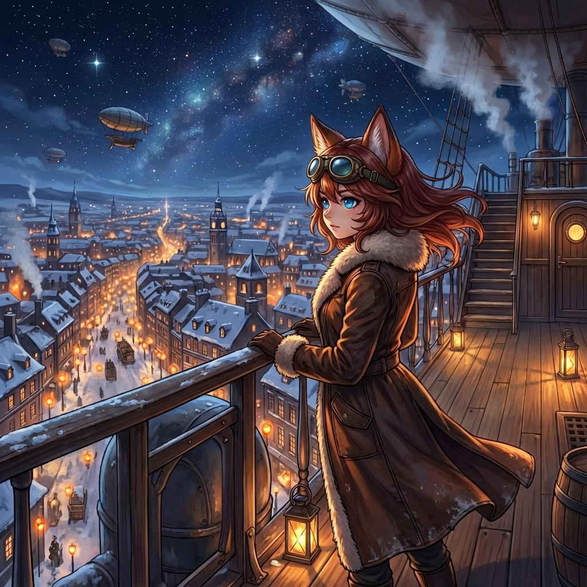

# Prológ

Plamienok v lampe sa náhle nepravidelne rozkmital, naposledy zažiaril v jasný plameň, aby o okamih nato pokojne vyhasol. Nastala tma. Spoza špinavých okien prenikalo do kajuty striebristé mesačné svetlo. Skoro dokonalé ticho v miestnosti narušovalo iba pravidelné odfukovanie parného motora v diaľke.

Muž sediaci v kresle si zťažka povzdychol, pozdvihol pohár pálenky k symbolickému prípitku a v tichosti do seba obsah vyprázdnil.

Dvere jemne zaškrípali. Do miestnosti sa vkradla mladá žena v leteckom kabáte. Dlhé gaštanové vlasy jej divoko vliali okolo tváre, pramenmi sa zachytávali o mosadzné letecké okuliare, ktoré mala odsunuté na čelo. Pod kožušinovým golierom blúdiace pramene zakrývali — až na okamih — špicaté líščie uši.

Jej oči boli Tyrkysovo-modré, jasné ako zamrznuté jazero v slnečnom svetle. 

Na hrubom opasku obnosených nohavíc jej viseli automatické pištole a rapier v čiernom puzdre — zbraň, ktorá vyzerala skôr ako dlhá ihla než meč.

Jej zrak spočinul na kresle za veľkým dreveným stolom. Pri pohľade na tmavú siluetu podnapitého muža pokrútila hlavou.

„Tami," ozval sa hlas spoza stola.

„Maks, lichotí mi, že ma v tvojom stave rozpoznáš od zvyšku posádky," poznamenala s úctihodnou dávkou irónie. „Sme na mieste. Daj sa dokopy," dodala pre zmenu so súcitom v hlase.

Chystala sa opustiť kajutu, ale on ju zastavil. „Ešte sa na mňa hneváš?"

Otázka ju zaskočila. Dvere sa hlasito zabuchli.

---

Tami sa presunula na provu lode. Nočná obloha bola čistá a krutá — tisíce hviezd svietili tak ostro, ako svietia len v mraze. Dolu pod nimi sa rozprestieralo mesto v snehu. Milióny oranžových bodiek — olejové kahance a plynové lampáše — sa mihotali v tmavej bielej krajine ako uhlíky rozfúkané vetrom. Rozpoznala paláce, katedrály, mosty, železnice, boli presne ako opisy z knihy, ktorú ako malá čítavala s otcom. A nad tým všetkým, na najvyššom kopci uprostred mesta, žiarila Ona. Kolosálna socha Matky, vytesaná z bieleho kameňa, s rukami roztiahnutými v ochrannom geste nad prístavom. Sneh jej ležal na ramenách ako biely plášť. Jej tvár bola v tieni, ale svätožiara z olejových kahancov okolo jej hlavy pretínala mrazivú noc ako maják.

Hodnú chvíľu sústredene sledovala všetky detaily. Dolu v uliciach sa to hemžilo aktivitou. Náhle sa prudko zvrtla, aby sa uistila, že **Felix** — ťažký kanón, jej pýcha, je zamaskovaný pod plachtou. Letmo pohľadom skontrolovala stav barometra a posádke vydala pokyn na začatie pristávacieho manévru.

*Makita* naberala rýchlosť. Mladá kapitánka si rituálne nasadila letecké okuliare. O pár sekúnd neskôr jej nárazový vietor odvial kapucňu z hlavy. Vyslobodené, neskrotné vlasy jej vôbec neprekážali. Obe ruky pevne zovreli oceľové zábradlie. Nedokázala potlačiť úžas nad krásami nočného mesta.

