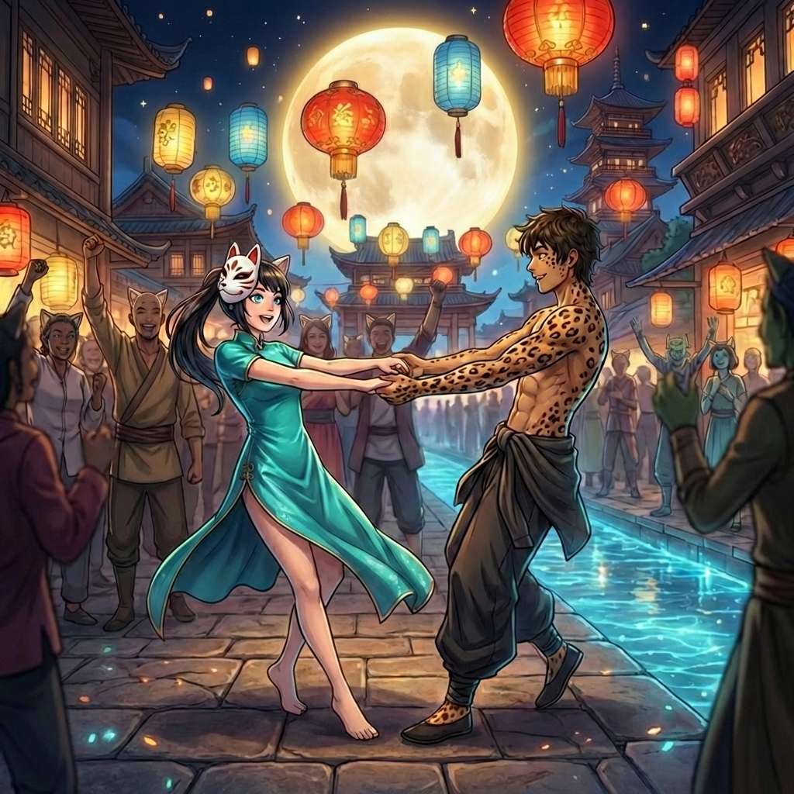
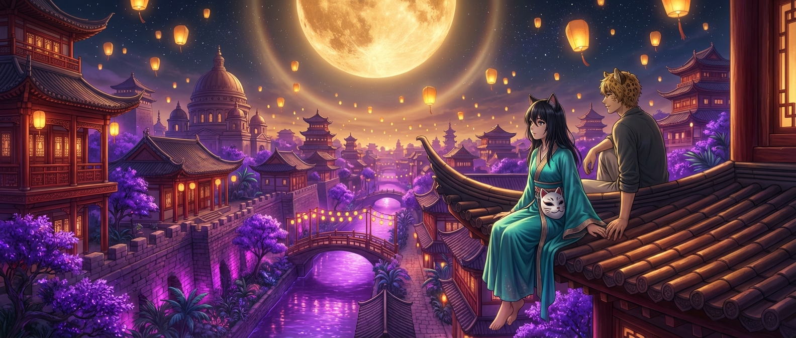

> *„A El povedala: Pusť svetlo. Nech stúpa. Nech sa dotkne hviezd a nech sa vráti ako dážď — lebo každé svetlo, čo vypustíš, sa k tebe vráti stonásobne."*
> — Kniha El, 1:7

# Kapitola 1: Lampiónový Festival

**POV**: Yerana Saéli (3. osoba, limited)
**Lokácia**: Nyau — hlavné námestie, ulice, prístav, strechy
**Čas**: ~AY 3010, noc Lampiónového festivalu. Splň Sai. Yera má 3 zimy (~17 rokov).
**Nálada**: Horúca, voňavá, opojná — a pod tým všetkým dusivá

---

Prvý lampión vzlietol z námestia pred Chrámom El presne v okamihu, keď Sai prešiel zenit.

Yera ho sledovala z balkóna klanu Saéli — tri poschodia nad ulicami, za kamenným zábradlím, v hodvábnych šatách, ktoré si nevybrala. Lampión bol malý, papierový, maľovaný modrou a zlatou, a stúpal pomaly, tak pomaly, akoby váhal, či naozaj chce opustiť zem. Horúci vzduch vo vnútri ho niesol vyššie a vyššie, plamienok vnútri sa mihotal ako vzdialený podpis — *som tu, som tu, som tu* — a potom sa rozmazal medzi stovkami ďalších, ktoré sa zdvíhali zo všetkých strán mesta. [→ regions/nyau.md: Lampiónový festival, lampióny = duše stúpajúce k El]

Tisíce.

Papierové, hodvábne, maľované, jednofarebné, strakaté. Niektoré tvarované do kvetov, iné do vtákov, jedno — odletelo z Chrámových schodov — malo tvar El s rozprestretými rukami. Stúpali všetky naraz, v tom istom tichom okamihu, a z balkóna vyzerali ako roj svetlušiek, ktoré sa rozhodli odísť z tohto sveta a nájsť si lepší. [→ regions/nyau.md: Lampiónový festival — symbolizujú duše stúpajúce k El]

Pod ňou mesto vybuchlo zvukom. Bubny — desiatky, stovky, basy ako srdce, malé bubienky ako dážď na plechovej streche. Flauty sa zapojili — vysoké, presné tóny, čo sa vinuli pomedzi bubnový rytmus ako dym medzi stromami. A struny. Vždy struny — dlhé, ťahané akordy, ktoré vibrovali v kameni pod nohami a v kostiach pod kožou. Hudba Nyau. Hudba, ktorú Yera poznala od prvej zimy a ktorá nikdy neznela rovnako dvakrát. [→ regions/nyau.md: hudba — bubny, flauty, struny]

Sai visel nad mestom v úplnom splne — jantárový kotúč s žiariacim prstencom, taký blízky a taký obrovský, že Yera mala pocit, akoby sa naňho dalo vyliezť. Jeho svetlo padalo na strechy, na kupolu Chrámu, na hladinu kanálov a menilo všetko na tekuté zlato. A pod tým zlatom — bioluminiscencia. Stromy v záhradách svietili tyrkysovo a zeleno, riasy v kanáloch premenili vodu na tekuté striebro, nočné kvety na fasádach domov sa otvorili a pulzovali mäkkým fialovým svetlom. Tri vrstvy svetla — mesačné, živé, ľudské — sa prelínali a splývali do niečoho, pre čo neexistovalo slovo. [→ 05-geography.md: Sai, mesiac Achilles, splň = ľahká hodina, gravitácia ~1.0-1.1g] [→ regions/nyau.md: bioluminiscencia = Inetisine GMO rastliny]

Nyau svietilo zo všetkých strán.

A Yera sedela na balkóne vedľa otca a nedýchala.

---

Otec hovoril s hlavami vedľajších klanov. Pokojne, vecne, slovami ako šachové ťahy. Vedľa neho sedela Yera — chrbát rovný, ruky v lone, mačacie uši vzpriamené, tvár pokojná. Dokonalá dcéra. Dokonalá Saéli. Dokonalé divadlo.

Hodvábne šaty boli tyrkysové — chrámová farba. Soril ich vybrala. *Pre budúcu strážkyňu,* povedala, keď ich Yere dnes ráno priniesli do izby. *Nech ťa mesto vidí v správnych farbách.* Jemná tkanina, klanový vzor ručne vyšívaný na límci a rukávoch, pod nimi len koža — hladká, ľudská, bez srsti. Pursang. Boli krásne. Boli klietkou z hodvábu. [NOTE: Soril = prísna nadradená v Chráme, vybrala šaty — kontrola cez detaily. Foreshadowing jej roly.]

Okolo nich sedela klanová aristokracia. Starí muži v čajových rúchach diskutovali o cenách korenia. Manželky v hodvábnych šatách si vymieňali pohľady, ktoré stáli viac než slová. Deti drobných členov klanu — príliš malé na to, aby sa pretvarovali, príliš veľké na to, aby sa smiali nahlas — sedeli v rade a pozerali na lampióny s očami veľkými ako mesiace. [→ regions/nyau.md: Klanová aristokracia, klan Saéli = najvplyvnejší]

Nikto nesedel nesprávne. Nikto sa nedíval nesprávnym smerom. Nikto sa nehýbal, ak nemusel.

Vôňa kadidla stúpala z Chrámu — ťažká, hustá, sladká — a pod ňou sa valila tá druhá vôňa, tá zdola, zo stánkov a námestia: grilované huby, korenie, morská soľ z prístavu, rozohriate telá stoviek ľudí stlačených na kameňoch. Voňalo to životom. Voňalo to všetkým, čo Yera nemala právo chcieť. [→ regions/nyau.md: Vôňa — kadidlo, korenie, grilované huby, nočné kvety, morská soľ]

Dolu na námestí sa to hemžilo. Masky — stovky masiek, zvieracie tváre, El s rukami zdvihnutými k nebu, démoni s červenými očami, duchovia v bielom. Tancujúci ľudia. Hudba na každom rohu. Deti s lampášikmi, čo sa naháňali medzi dospelými, piskot a smiech stúpajúce k balkónu. Gondoly na kanáloch, vyzdobené svetielkujúcimi kvetmi, kĺzali sa pod mostami. Stánky, stánky, stánky — jedlo, masky, farebné šatky, drobné figúrky El z hliny.

*Počas festivalu sú si všetky kasty rovné.* [→ regions/nyau.md: Lampiónový festival — tradícia maskovania, symbolická rovnosť]

Pod maskami. Na jednu noc. Symbolicky.

Yera stisla ruky v lone. Pazúry — jemné, krátke, tmavé — sa zaťali do hodvábu.

Otec sa k nej naklonil. Neusmial sa. Jeho pohľad ani na sekundu neskĺzol k lampiónom.

„Posledný festival pred zasvätením," povedal tichšie. Nie smutne — vecne. Konštatovanie, nie lúčenie. Jeho hlas mal presne ten tón, ktorým Saéli preberali obchodné zmluvy. „Užívaj si ho."

*Užívaj si ho.* Zhora. Z balkóna. V správnych šatách, v správnej farbe, vedľa správnych ľudí. Ako vždy. Yera sa na lampióny dívala a premýšľala, koľko z nich sa vznieslo z rúk ľudí, ktorí sa dnes v noci prvýkrát dotknú. Koľko z nich stúpa nahor s prianím, na ktoré ešte neexistujú slová. Koľko z nich nesie v sebe túžbu, o ktorej ich majiteľ ráno nebude chcieť hovoriť.

*A koľko z nich je prázdnych.*

Yera pozorovala dav — ten krátky, krehký okamih, keď celé mesto zdvihlo hlavy k lampiónom medzi hviezdami — a cítila, ako sa jej hruď stiahla. Nie bolesťou. Niečím horším. Krásou, ktorú nemala s kým zdieľať.

---

Odišla potichu.

Vstala z miesta, akoby šla na toaletu — klanová etiketa mala pravidlá aj na to — a prešla za stĺp, kde ju zakryl tieň. Balkón bol otvorený smerom k Chrámu, ale bočné schody viedli dolu na prístavnú ulicu. Strážkyňa pri dverách sa za ňou pozrela — Yera jej venovala krátky pohľad, ten pohľad, ktorý Saéli používali na sluhov celé generácie, ten, ktorý hovoril *nevidela si ma* — a strážkyňa sklopila oči. [NOTE: Yera vie používať Saéli meno ako nástroj. Nie je naivná — vie, ako funguje moc. Len ju nechce.]

Sandále nechala pod lavicou na balkóne — nebolo za čo sa vracať. Bosé nohy na kamenných schodoch. Hodvábne šaty sa zachytili o zábradlie — ťahla ich za sebou, nezdvorilo, príliš rýchlo, nesprávne. Vzduch na schodoch bol ešte horúcejší než na balkóne — horkosť stúpala z rozohriateho kameňa a miešala sa s vôňou grilovaných húb zo stánkov pri moste. [→ regions/nyau.md: Klíma — subtropické, horúce aj v noci]

Na konci schodov boli ulice. A v uliciach bol svet.

---

Prvých päť krokov bolo najťažších.

Nie fyzicky — fyzicky bolo všetko ľahšie. Sai v zenite, ľahká hodina. Telo plávalo. Každý krok bol plynulý, takmer tanečný — akoby ju vzduch niesol. [→ 05-geography.md: Sai v zenite — gravitácia ~1.0g, ľahká hodina]

Ťažké bolo iné. Prvýkrát v živote stála na uliciach Nyau v noci bez sprievodu. Bez strážkyne. Bez klanového plášťa, bez Saéli mena na tvári. V tyrkysových hodvábnych šatách, áno, ale bez znaku, bez výšivky — zvyšok klanu mal na hrudi klanové emblémy. Yera ich nemala. Soril ich nedovolila — *kňažky nepotrebujú klanové znaky. Kňažky patria El, nie klanu.*

A tak Yera stála v dave a nikto ju nepoznal. Bola len ďalšia mačka s dlhými čiernymi vlasmi a modrými očami v meste plnom mačiek. [→ characters/Yera.md: Felis Varietas, čierne vlasy, modré oči — Pursang črta]

*Nič sa nestalo*, povedala si. *Nič sa nestalo. Len stojím na ulici. Na ulici, po ktorej chodia tisíce ľudí.*

Dav ju pohltil.

Hudba bola hlasnejšia dolu — nie tlmený ozvuk z balkóna, ale živá, surová, pulzujúca vec, ktorá jej vibráciami prechádzala od chodidiel cez kolená do hrude. Bubeníci na rohu námestia hrali synchrónne — štyria Mezra v maskách, bez trička, srsťou pokrytá ramená blýskajúce sa v svetle lampášov, paličky rozmazané od rýchlosti. Flautistka vedľa nich — starena so sivými fúzmi a rukami, na ktorých svietili tetované glyfy — hrala tón tak vysoký a čistý, že sa zdalo, akoby ním rezala vzduch na polovicu. [→ regions/nyau.md: hudba — bubny, flauty, struny. Tetovania na predlaktiach = makro shortcuty pre Spiru]

Yera stála a počúvala. Zvuk vchádzal dovnútra a niečo v nej odpovedalo — nie Spira, nie nanotechnológia, len telo, len srdce, len to hlúpe, jednoduché, zvieracie niečo, čo cítiš, keď ťa hudba zasiahne tak hlboko, že zabudneš dýchať.

Prúd ľudí ju unášal ďalej.

---

Stánky s jedlom na každom kroku — svietiace huby syčali na železných platniach, pečený hmyz v kornútkoch z listov voňal korením a morskou soľou, korenené nápoje v hlinených pohároch parili do nočného vzduchu. Yera sa zastavila. Nemala peniaze — odišla z balkóna bez ničoho. Stála a pozerala, ako staršia mačka s jedným okom obracia huby drevenou paličkou. Vôňa — zem, orechy, maslo, niečo dymové — bola tak blízko, že jej hrdlo zvieralo. [→ regions/nyau.md: Svietiace huby, pečený hmyz, korenené nápoje. Žiadne mäso — Cirkev El zakazuje]

Nestála dlho. Festival nebol o jedení, bol o pohybe. Okolo nej jedli všetci. Stojac. Rukami. Bez mien.

Prešla popri stánku s maskami. Drevené, maľované, lakované — zvieracie tváre, El s pokojným úsmevom, démoni s červenými očami a vyplazenými jazykmi, duchovia v bielom závoji. Predavač — drobný králik s odstávajúcimi ušami a šibalským úsmevom — vyťahoval masky jednu za druhou, nasadzoval si ich na tvár, robil hlasy, deti okolo neho sa skvíkali od smiechu. [→ regions/nyau.md: Masky — zvieracie tváre, El, duchovia. Anonymita.]

Yera kúpila masku. Nie — kúpiť by znamenalo mať peniaze. Predavač ju zbadal bez masky, zbadal šaty, zbadal bosé nohy, a podal jej jednu zadarmo. Bielu. Mačaciu. S modrými očami namaľovanými na mieste, kde by boli skutočné.

Nasadila si ju.

Dýchala cez prierezy v dreve. Vzduch mal zrazu inú chuť. Intímnejšiu, osobnejšiu. Akoby drevená prekážka vytvorila malý priestor medzi ňou a svetom, v ktorom sa dalo existovať bez pravidiel. Za bielou fasádou už nebola Yerana Saéli, iba cudzie teplo s pulzujúcim dychom. [NOTE: Maska = symbol slobody, ale aj skrývania. Yera celý život skrýva — čo cíti, čo chce, kto je. Maska je pre ňu paradoxne prirodzená.]

---

Námestie pred Chrámom bolo najživšie. Tanečníci — desiatky párov krútiacich sa v prachu a svetle, masky na tvárach, tela blízko, ruky na bokoch, na ramenách, na pleciach. Pursang vedľa Mezra, Mezra vedľa Ghorki — pod maskami sa kasty nerozoznávali. Alebo predstierali, že sa nerozoznávajú. [→ regions/nyau.md: Počas festivalu sú si všetky kasty „rovné" — symbolicky]

Yera kráčala pomedzi nich. Hudba sa menila — od bubnov ku flaute, od flauty ku strunám, a potom sa všetko spojilo do jedného zvuku, ktorý bol väčší než súčet častí. Kňažky na schodoch Chrámu spievali — ich hlasy sa niesli nad davom ako kadidlo, jemné, jasné, nesmrteľné. Yera poznala tú pieseň. *Pieseň Prvého Svetla.* Spievala ju od detstva. Slová, ktoré vedela naspamäť, melódia, ktorá jej bola vrytá do kostí.

A predsa — dolu, z ulice, s maskou na tvári, medzi telami cudzích ľudí — znela inak. Znela smutnejšie. Krajšie. Ľudskejšie. [→ regions/nyau.md: Cirkev El, rituály — modlitby pod svietiacimi stromami]

Na kanáli pod námestím plávali kvety, ktoré kňažky zhodili zo schodov — premieňali vodu na tekuté svetlo. Gondola prerezala ich stred a kvety sa rozleteli na obe strany.

Yera sa zastavila na moste. Jej tvár — tá skutočná, za maskou — sa odrážala vo vode. Modré oči nad bielou maskou. A pod tým kvety, plávajúce k prístavu, k moru, preč.

Vtedy to uvidela.

Infera.

Vysoko nad hlavou, vyššie než lampióny, vyššie než Sai, sa po oblohe sťahovala červená bodka. Nie hviezda — hviezdy sa nehýbu. Nie lampión — lampióny nesvietia červeno. Pomaly, neúprosne, s neľudskou presnosťou sa pohybovala po oblúku od východu na západ. Červená, studená, neprirodzeným svetlom žiariaca vec na oblohe, ktorá nemala čo tam robiť. [→ 05-geography.md: Infera = ARK-13 Prometheus, červená „hviezda" na orbite]

*Diablovo Oko.*

Tak jej hovorili v Chráme. *Infera. Nepozeraj sa na ňu.* Kňažky tvrdili, že je to oko tmy — niečo, čo dohliada na svet, keď El odvrátila zrak. Protipól svetla. Stará poverčivosť. Niečo, čomu Yera nikdy neverila — ale v noci, s maskou na tvári, v dave cudzích ľudí, keď červený bod pomaly prechádzal oblohou ako prst ťahaný po čiernom zamate, cítila niečo. Nie strach. Nie vieru. Niečo staršie. Niečo, čo žilo v kostiach, nie v hlave. [→ regions/nyau.md: Nyau = Cirkev El, Infera = poverčivosť. El = svetlo, Infera = tma] [→ 13-etymology.md: Infera — z lat. Infernus, peklo]

Infera zmizla za horizontom strechy pri prístave. Lampióny stúpali ďalej. Sai sa nehýbal. A Yera stála na moste a pozerala na miesto na oblohe, kde červená bodka bola pred chvíľou — prázdne, čierne, normálne — a cítila, že niečo nie je v poriadku. Nie v oblohe. V nej.

Otočila sa a odišla.

Na konci mostu ju niekto chytil za lakeť.

Stuhla. Srdce — dve údery, tri — a potom sa otočila. Stará žena. Pursang mačka s bielymi vlasmi a hodvábnym šálom, oči žmúriace cez masku kvetinového démona. Poznala tie oči. Známa z klanu — manželka niekoho, kto sedával s otcom na poradách.

*„Yerana? Si to —"*

*„Nie,"* povedala Yera. Hlas tvrdší než čakala. Hlas Saéli — ten istý, ktorým odstavila strážkyňu na balkóne. *„Pomýlili ste si ma."*

Stará žena zaváhala. Pozrela na šaty — chrámovú farbu, bosé nohy, masku — a niečo v jej tvári sa zlomilo na neistotu. Festival. Masky. Tisíce ľudí. Kto by spoznal koho.

*„Prepáčte,"* povedala a zmizla v dave.

Yera vydýchla. Ruky sa jej triasli — jemne, sotva viditeľne, ale triasli. *Skoro.* Tak blízko. Jedno slovo, jeden zdvihnutý šál, a otec by vedel do hodiny. [NOTE: Mikro-konflikt — Yera sa takmer prezradí. Zvyšuje stakes jej tajného výletu. Nie je to bezpečná hra — je to risk. A Yera to vie a ide ďalej.]

Nohy ju odniesli preč od Chrámu, preč od námestia, preč od pulzujúcich bubnov, smerom dnu do chladnejších prístavných uličiek, kde hudba slabla a páchla soľ a olej.

---

Bočná ulica pri prístave bola iná. Tu nedosahoval festival — alebo dosahoval, ale len okrajmi. Vzdialená hudba. Pár osamotených lampášov na rohoch. Vôňa soli a lán. Skladiská, doky, kotviace laná, zamotané siete. Svetlo sem prúdilo len zhora — Sai a hviezdy. A z kanálu, kde posledné kvety, čo sem doplávali z námestia, ešte slabo pulzovali.

Cvrčky a cikády splývali do jedného stáleho tónu — zvukovej tapety, cez ktorú sa dalo dýchať. Svetlušky poletovali nad hladinou kanálu — modré, tyrkysové bodky, živé hviezdy pri zemi. [→ regions/nyau.md: svetlušky, cvrčky a cikády = stála zvuková a svetelná kulisa Nyau v noci]

Yera sa zastavila. Nevstúpila sem úmyselne — dav sa rozriedil a ona len kráčala za vôňou mora, za tichom, za niečím, čo nevedela pomenovať.

Chlapec sedel na schode.

Opretý chrbtom o stenu skladiska, nohy pred sebou, fľaša tmavého skla v ruke. Maska — leopardia, drevená, lacná — mu visela na krku, odsunutá, nepotrebná. Nemusel sa skrývať. Nemal pred kým. [→ characters/Arkot.md: Mezra leopard z Beladiss, navigátor]

Mezra. Leopard. Yera to videla okamžite — tmavá koža, leopardie škvrny na krku a ramenách, kde rozopnutá košeľa obnažovala hruď. Tmavé vlasy, neupravené, spadajúce do čela. A oči — keď sa na ňu pozrel — jantárovzelené, hlboké, pokojné. Oči bytosti, ktorá vie, že nikam nepatrí, a zmierila sa s tým. [→ regions/nyau.md: Mezra = nižšia kasta. Pursang + Mezra = absolútne neprípustné]

Bol trochu opitý. Nie dosť na to, aby nevidel. Dosť na to, aby mu bolo jedno, čo vidí.

Lampión preletel nad ulicou — osamotený, oneskorený, jeden z posledných, čo stúpali k hviezdam. Jeho svetlo sa dotklo Arkotovej tváre na zlomok sekundy — jantárový záblesk, tiene v preliačinách pod lícnymi kosťami, iskra vo fľaši.

„Stratila si sa?"

Hlas bol pokojný. Trochu chrapľavý — od vína, od noci, od samoty. Nebol to podvádzajúci hlas. Nebol to hlas muža, čo sa prihovára dievčatám. Bola to otázka. Skutočná otázka bytosti, ktorá sedela sama na schodoch a videla niekoho, kto vyzerá rovnako stratený.

Yera stuhla. Ruka jej automaticky vystrelila k tvári — *zakryť, schovať, odísť* — no prsty už klopli iba na chladné lakované drevo masky, ktorá bola po celý ten čas s ňou. Prvý raz si vydýchla a ostala stáť na mieste so zaťatými perami.

„Nie," povedala. [→ books/planning/yera-arc-novela.md: Beat 3 — „Stratila si sa?" / „Nie." (Ale áno.)]

Pauza. Vzdialená hudba doľahla až k nim; pomalší, tiahly rytmus strún z námestia. Kvapkanie vody z okapu.

Chlapec zvoľna ukázal na fľašu vo svojich rukách.
„Víno?“ spýtal sa jednoducho.

Yera pozrela na tmavé sklo, mastnotu na hrdle. Lacné víno námorníkov z prístavných krčiem. Príliš surové pre dcéru Saéli.

Natiahla ruku a vzala si ju.

Napila sa. Pálilo. Zakašľala si do predlaktia. Arkot sa zasmial. Nie z nej — *s ňou*. Tichý, krátky smiech, ako zblúdilý kameň hodený do vody.

„Prvýkrát?“ spýtal sa.

„Nie,“ klamala. A potom, pretože klam sa jej v ústach cítil ako falošná minca — „áno.“

Zasmial sa znova a ona tiež. Smiech dvoch cudzincov na opustenej ulici, keď všetko bolo možné.

Arkot vstal. Oprášil si nohavice, odložil fľašu na schod a natiahol k nej ruku s drsnými prstami. Nepýtal sa na meno. Len kývol hlavou smerom k vysvietenému, hlučnému námestiu, z ktorého sa valil rytmus stoviek strún a bubnov.

„Tak poď,“ usmial sa s pomalým, lenivým úsmevom.

Yera sa inštinktívne chcela stiahnuť — *sme na ulici, toto dcéry klanu nerobia, nieto ešte v dave* — no útočisko drevenej tváre vyhralo. Položila svoju krehkú, studenú dlaň do jeho teplej.

Vtrhol s ňou priamo do pulzujúceho davu.

Okolo nich sa mihal vír masiek, tiel a lampiónov. Arkot ju viedol isto, drzo a pritom plynulo, akoby bol s tým hlukom a tancom zrastený. Yera spočiatku stuhla, no jeho ruka na jej páse bola pevná a presne rytmizovaná do krokov ostatných okolo. Postupne sa nechala viesť. Hudba ju strhávala, svaly sa jej uvoľňovali, prestala myslieť na Chrám. Okolo nich sa preplietali iné tancujúce páry, nočná vôňa kvetov, korenín a potu zapĺňala námestie.

Zatočil ňou, a vtedy sa to stalo — hlava sa jej z tej rýchlosti, vína a davu zatočila, dvakrát neisto prešľapla na dlažbe, úplne mimo rytmus ostatných. No on voľnú ruku pevne navinul na jej obruč nad pásom a strhol ju opäť k hudbe, hladko a bez jedinej myšlienky odporu z oboch strán. Svet okolo stratil ostré hrany. Ulice, masky, svietiace kanály, poskakujúce plamienky — všetko sa zlialo do jednej krásnej, rozmazanej šmuhy tepla a zvuku. V tom víre farieb a pohybu, s dlaňou pevne zovretou v ruke cudzieho chlapca, mala zrazu pocit stopercentnej, nezvratnej jasnosti. Všetko dávalo zmysel. Tu, uprostred spoteného, prístavného davu.

Keď struny dospeli do búrlivého finále a tanec odznel, odfúkli si, opretí o seba ramenami, dýchajúc zrýchlene. Vymanili sa z hlavného prúdu námestia a opäť zišli do tichšieho tieňa skladísk.

Arkot stál blízko nej a potom pomaly kývol bradou hore k oblohe.

„Vieš... odtiaľ hore je to ešte lepšie," povedal a ukázal smerom k streche.

---

Strecha prístavného skladiska bola plochá, široká a patrila oblohe.

Arkot poznal cestu — požiarne rebríky na bočnej stene, hrdzavé, vrziace pri každom kroku, ale pevné. Yera šplhala za ním, hodvábne šaty sa zachytávali o nity a skrutky. Maska visela na krku. Bosé nohy na studenom kove — ale kameň na streche bol teplý. Aj v noci. Aj po hodinách tmy. Ako keby si pamätal slnko.

A potom zdvihla hlavu.

*Nyau.*

Celé mesto ležalo pod ňou — ale inak než z balkóna. Bližšie. Skutočnejšie. Odtiaľto videla ľudí, nie siluety — pár na moste, čo sa držal za ruky, gondoliera, čo spieval, deti, čo behali s poslednými lampášmi. Kanály svietili — kvety, čo kňažky zhodili zo schodov Chrámu, doplávali až sem a premenili vodu na rieky tyrkysového svetla. [→ regions/nyau.md: Chrámový obrad — kvety hádzané do kanálov, voda sa zmení na rieky svetla]

A nad tým všetkým — posledné lampióny. Zostávali vo vzduchu ako váhavé duše — niektoré vysoko, takmer medzi hviezdami, nerozlíšiteľné od nich. Iné nižšie, ešte teplé, ešte blízke, pomaličky sa vznášajúce k oblohe, ku ktorej sa nikdy nedostanú.

Sai. Hviezdy. Obzor, kde sa more stretalo s nebom. [→ 05-geography.md: Sai — jantárový mesiac s prstencom, splň]

Yera zabudla dýchať.

Nie preto, že to nikdy nevidela. Videla to každý večer. Z balkóna, z izby, z Chrámovej záhrady. Ale nikdy *takto*. Nikdy zo strechy, v noci, vedľa cudzieho chlapca s fľašou vína, s teplým kameňom pod nohami a bez mena na tvári.

*Toto je iné Nyau*, pomyslela si. *Alebo to isté. Len ja som iná.*

„Odkiaľ si?" spýtala sa. Otázka vyšla skôr, než ju stihla zastaviť. [→ characters/Yera.md: Hovorí cez otázky, nie tvrdenia]

Chlapec sedel vedľa nej na okraji strechy, nohy visiace nad troj-poschodovou priepasťou, fľaša medzi kolenami. Neotočil sa. Pozeral na mesto.

„Beladiss," povedal. „Diss." [→ regions/nyau.md: Beladiss — rybárske dediny, biele útesy]

Jedno slovo. Meno miesta, o ktorom Yera čítala v otcovej knižnici. *Beladiss.* Biele útesy. Studené more. Rybárske dediny na okrajoch sveta. Miesto, odkiaľ ľudia odchádzali a nikdy sa nevracali — nie z lásky, ale z núdze. Najchudobnejšia provincia na kontinente. Biele útesy a čierne šťastie.

„Čo robíš v Nyau?" spýtala sa.

„Nakladám vrecia v prístave," odpovedal. Bez hanby. Bez ospravedlnenia. Fakt, nie príbeh. Leopardie škvrny na jeho krku sa pohli, keď pokrčil plecami. „Flint — kamarát — povedal, že tu platia lepšie než v Diss. Mal pravdu." Odmlčal sa. „Asi."

Ticho. Hudba z námestia — vzdialená, tlmená, strunová. Lampión preletel ponad nich, tak blízko, že Yera cítila teplo jeho plamienka na tvári.

„A ty?" spýtal sa.

Yera zaváhala. Na zlomok sekundy — tak krátky, že si ho on nemohol všimnúť, ale ona ho cítila ako prasklinu v ľade.

„Nič," povedala. „Bývam tu."

Neklamala. Nehovorila pravdu. Len odpovedala — a to bolo dosť.

---

Arkot začal spievať.

Nie naschvál — nie „teraz ti zaspievam". Skôr akoby melódia v ňom žila a čakala na chvíľu, keď je dosť tma a dosť ticho a dosť vína na to, aby sa odvážila von. Potichu. Hlasom, ktorý nebol trénovaný, nebol pekný, ale bol *skutočný* — chrapľavý, teplý, nepresný, ľudský.

Pieseň z Beladiss. Slová, ktorým Yera nerozumela — iný dialekt, staré obraty, prístavný slang zmiešaný s rybárskymi frázami, ktoré nemali preklad. Ale melódia nepotrebovala preklad. Melódia bola morská voda a biele útesy a dom, do ktorého sa nedá vrátiť. [→ books/planning/yera-arc-novela.md: Beat 3 — piesne z Diss. Melanchólia. Domov. Morské vlny. Niečo stratené.]

Sedela vedľa neho a počúvala. Kolená si objala rukami. Bosé chodidlá na teplom kameni. Vietor zdvihol jej dlhé čierne vlasy a hodil ich cez rameno — nechala ich. Hodvábne šaty — chrámová farba, chrámový výber, chrámová klietka — sa v nočnom vánku vlnili okolo členkov. Maska ležala medzi nimi na kameni, biela mačacia tvár s modrými namaľovanými očami, hľadiaca do hviezd.

Arkot spieval a Yera pozerala na mesto. Na kanály. Na svetlá. Na lampióny, ktoré sa ešte stále vznášali — menej teraz, posledné, zblúdilé — a na hviezdy za nimi, a na Sai, ktorý pomaly klesol bližšie k horizontu, a na obzor, kde sa more stretalo s oblohou a oba boli čierne.

*Kto si?* pomyslela si. *Odkiaľ si? Prečo spievaš tak, akoby si sa s niekým lúčil?*

Nepovedala to. Nikdy nehovorila to, čo naozaj myslela. Už ani nevedela prečo.

Pieseň stíchla. Posledný tón sa rozplynul v nočnom vzduchu, zmiešal sa s vôňou soli a kadidla a kvietkov na vode. Cikády, čo počas spevu mlčali, sa okamžite vrátili — akoby len čakali na pauzu v programe.

„To je z domova?" spýtala sa.

„Asi," povedal. „Už si nepamätám. Spieval to otec, keď bol opitý. Čo bolo často."

Zdvihol fľašu. Potiahol. Podal ju Yere.

Tentokrát ju vzala s oveľa väčšou istotou ako predtým dole na ulici. Napila sa trpkastej chuti morského hrozna a nevrátila mu ju okamžite. Leopardie škvrny na jeho krku sa zachveli, keď s úsmevom sledoval, ako si tentokrát pýta ďalší hlt z jeho sveta bez odkašľania.

Ticho.

Dlhé, mäkké ticho, v ktorom nebolo nič treba povedať. Hudba z mesta dozvibrovala. Posledné lampióny zmizli medzi hviezdami. Mesto pod nimi svietilo ďalej — stromy, kvety, svetlušky — ale tichšie teraz, akoby aj Nyau vedelo, kedy sa treba stíšiť.

Arkot pozeral na hviezdy. Dlho. Tým pohľadom, ktorý patrí ľuďom zvyknutým navigovať — nie kráse, ale smerom.

„Vieš..." povedal pomaly, „...veria tomu ľudia v Nyau? Že predkovia prišli odtiaľ?" Kývol bradou k oblohe. Nie k Sai — ďalej. K hviezdam za ním.

Yera si ich zmerala. Poznala ich. Mená, súhvezdia, navigačné osi.

„Áno," povedala. „Píše sa to v Knihe El." [NOTE: Foreshadowing — Yera cituje Knihu El ako autoritu. V tomto momente je to pre ňu svätý text. Neskôr v Ch2 (Čierna kniha) uvidí originál — kompletný, neporušený, so všetkým čo biela Kniha neprevzala. A ešte neskôr — Maks sa prebudí a bude živý dôkaz, že ľudia naozaj prišli z hviezd. Yerin citát tu je nevinný. Retroaktívne dostane váhu. → the-book-of-El.md: Kniha El obsahuje Elaniine spomienky na Zem — Cirkev ich číta ako mýtus o „pred-stvorení". Sú to skutočné spomienky skutočnej ženy na skutočnú planétu.]

Arkot sa usmial — nie pohrdlivo, len tým pomalým úsmevom muža, čo videl veľa prístavov a málo chrámov. „V Diss hovoria, že prišli z mora. Že svet bol len voda a z tej vody sme vyliezli."

„A ty čomu veríš?"

Pokrčil plecami. Pozrel na hviezdy. „Neviem. Ale keď som na mori v noci a hľadím hore..." Odmlčal sa. „...cítim, že to nie je len obloha."

Yera nič nepovedala. Pozerala tam kde on — na to čierne, plné, tiché nebo — a premýšľala nad niečím, nad čím nikdy predtým nepremýšľala. *Ak je to pravda. Ak sme naozaj prišli odtiaľ.* Čo to znamená? Čo sú potom lampióny, čo stúpajú k hviezdami každý rok? [NOTE: Lampióny = duše stúpajúce k El. Ale ak predkovia prišli z hviezd — lampióny stúpajú *domov*. Yera to nedopovie nahlas. Čitateľ to domyslí.]

Arkot položil ruku vedľa jej ruky.

Nie na ňu. *Vedľa.* Na teplý kameň. Centimetre od jej prstov. Tak blízko, že cítila teplo jeho kože — alebo si to namýšľala. Leopardie škvrny na jeho zápästí v mesačnom svetle vyzerali ako ostrovčeky na mape sveta, ktorý ešte nikto neobjavil.

Yera sa nehýbala. Dýchala. Pomaly. Hlboko. Cítila kameň pod sebou, nočný vzduch na koži, vôňu vína a soli a niečoho, čo bol *on* — niečo teplé, niečo neznáme, niečo, čo nebolo kadidlo, nebolo korenie, nebolo nič, čo kedy v živote cítila.

Jeho prsty sa dotkli jej prstov.

Nie agresívne. Nie zámerne. Len — položil ruku na jej ruku. Ľahko. Akoby sa pýtal. Akoby ani on nevedel, prečo to robí.

Yera stuhla. Srdce jej búšilo tak hlasno, že bola presvedčená, že ho počuje celý prístav. Teplo jeho dlane na jej ruke. Drsné prsty — prsty muža, čo nakladá vrecia, čo ťahá laná, čo nikdy nič nedostal zadarmo. Na jej ruke — na ruke, čo lieči stromy a nikdy sa nedotkla ničoho, čo si sama nevybrala.

*Nič sa nestalo*, povedala si. *Nič sa nedeje. Len sedíme. Len sa díva na hviezdy. Len mi drží ruku.*

A predsa.

Celý svet sa zmenil. Vzduch mal inú chuť. Hviezdy mali inú farbu. Nyau pod nimi svietilo jasnejšie — akoby niekto zdvihol závoj, o ktorom Yera nevedela, že existuje.

*Kedy som prestala vidieť?* pomyslela si. *Teraz vidím.* [NOTE: callback na otázku z Ch2 — „Kedy som prestala vidieť?" V Ch2 je to o Nyau. Tu je to o svete. Iný význam.]

Sai klesol bližšie k horizontu. Prstenec okolo neho žiaril ostrejšie — rozpustené svetlo, jantárové a zlaté, sa rozlievalo po hladine mora v diaľke. Hviezdy sa zdali bližšie — alebo to bola len ľahká hodina, ktorá jej zdvíhala srdce a zľahčovala kosti a všetko, čo bolo ťažké, na okamih nechala plávať.

Chcela ostať.

Chcela ostať na tej streche navždy — s teplým kameňom pod nohami, s cudzou rukou na svojej ruke, s mestom pod sebou svietiacim zo všetkých strán. Chcela, aby pieseň z Beladiss nikdy nedoznie.

A práve preto vstala.

„Musím ísť."

Vytiahla ruku. Rýchlo. Príliš rýchlo — vedela to, cítila to, ale nezastavila sa. Vstala, vzala masku z kameňa, otočila sa.

Arkot sa nepohol. Nepovedal nič. Nesnažil sa ju zastaviť. Len sedel na okraji strechy, fľaša medzi kolenami, oči na hviezdy, a nechal ju odísť.

Bola na schodoch, keď počula — alebo si myslela, že počula — ako sa znova nadýchol. Ako keby chcel niečo povedať. Nezastavila sa.

Bežala dolu schodmi, cez ulice, cez prístav, cez most nad kanálom, kde posledné kvety ešte svietili vo vode, cez námestie, kde bubeníci ešte hrali a posledné masky sa ešte krútili v tanci. Bežala, až kým nepocítila pod nohami schody vily klanu Saéli — mramor, biely, hladký, dokonale vyrezaný, dokonale chladný.

Strážkyňa pri bráne spala. Festival. Aj strážkyne boli len ľudia. Yera prešla dnu bez zvuku.

---

Izba bola tmavá a tichá.

Ľahla si na posteľ. Vlasy sa jej rozliali po vankúši — dlhé, čierne, voňajúce kadidlom a soľou. Ľanové plachty. Steny z bieleho kameňa. Okno otvorené — nočný vzduch, horúci a ťažký, vhŕknutý vôňou kvetov a kadidla a čohosi, čo ešte cítila na koži. Cez okno vchádzal cvrčkový šum celého Nyau — ten stály, ten nikdy-nekončiaci, ten čo počula odkedy sa pamätala a nikdy nepočúvala. Sem-tam cikáda — ostrejšia, hlasnejšia, samotárska nota nad orchestrom. [→ characters/Yera.md: malá izba, biele steny, posteľ so hodvábnými plachtami]

Zavrela oči.

Videla leopardie škvrny na jeho krku v mesačnom svetle. Počula jeho hlas — ten tichý, chrapľavý spev v jazyku, ktorému nerozumela a nemusela.

Otvorila oči.

Na stole vedľa postele ležali lekárske nástroje — pipety, misky, sušené byliny v sklenených nádobách. Tetovania na jej predlaktí — akvamarínové línie, tenké, mŕtve, čakajúce. Vedľa zápisníka stáli chrámové rúcha. Zajtra ráno ich oblečie. Zajtra ráno kľakne v chráme a bude sa modliť k El a bude liečiť stromy a bude dokonalá.

Zavrela oči.

Cítila teplo jeho ruky na svojej ruke.

Na koži pod dlaňou. Na prstoch, na kĺboch, na mieste, kde sa jej pazúriky dotýkali kamienka na streche a jeho prsty sa dotkli jej prstov. Teplo, ktoré nešlo zmyť. Teplo, ktoré nepatrilo Saéli mene, ani Chrámu El, ani Soril, ani otcovi, ani nikomu okrem nej.

*Kto si?* pomyslela si. *Odkiaľ si? Prečo ti záleží na hviezdach?*

*Prečo som odišla skôr, než som zistila, čo to bolo?*

*A prečo nemôžem spať?* [→ books/planning/yera-arc-novela.md: Beat 3 — „Nasledujúce dni Yera nemôže spať." Bezsenné noci. Leopardie škvrny. Zelené oči.]

Otvorila oči. Za oknom mesto svietilo — tyrkysové, zelené, fialové, jantárové. Lampióny boli preč. Masky boli preč. Festival skončil. Ostalo len Nyau — krásne, svietiace, dokonalé, nehybné.

A Yera ležala v posteli so srdcom, ktoré bilo príliš rýchlo a príliš hlasno a odmietalo sa zastaviť.

Niekde v dome sa ozvali kroky. Otcove. Pomalé, premyslené, smerujúce ku schodom. Zastavili sa — na chodbe pred jej dverami. Dlho. Príliš dlho na náhodu.

Potom odišli.

Yera zovretými prstami stiahla plachtu k brade a pozerala na dvere, za ktorými bola tma, a ticho, a otec, ktorý vedel viac, než hovoril. [NOTE: Hook — otec sa zastaví pred dverami. Čitateľ netuší prečo. Yera tiež nie — ale cíti, že niečo sa začalo. Aj pre otca platí: Saéli vedia viac, než hovoria.]

---

[NOTE: NOVÁ ŠTRUKTÚRA — Kapitola 1 = Lampiónový festival. Otvorenie celého arcu. Čitateľ vstupuje priamo do exotického sveta Nyau v najkrajší moment. Romantika, exotika, teplo, mágia. Klietka je cítiť, ale ešte ju nedominuje — festival je sloboda, aj keď len na jednu noc.]

[NOTE: Kapitola 2 (pôvodná „Prvé Svetlo") = Prebudenie do reality. Chrám, strom, Soril, otec, zasvätenie. Kontrast s festivalom — zo slobody do klietky. „Kedy som prestala vidieť?" dostáva iný význam.]

[NOTE: ARKOT — prvé stretnutie je chemické, nie romantické. Žiadne veľké vyznania, žiadne „osud nás spojil." Dvaja cudzinci na streche. Víno. Pieseň. Ruka. A potom útek — lebo Yera sa bojí toho, čo cíti. To je silnejšie než akýkoľvek bozk.]

[NOTE: INFERA — drobný detail, ale dôležitý. Yera vidí ARK-13 na oblohe. V tomto momente to je len poverčivosť a atmosféra. Ale pre čitateľa, ktorý pozná hlavnú sériu — Prometheus na orbite, loď, kde Elania čaká na Upload. Dramatic irony.]

[NOTE: MASKA — symbol slobody cez anonymitu. Yera celý život skrýva kto je (pred Arkotom, pred posádkou, pred svetom). Maska je paradoxne najúprimnejší moment — keď sa skryje, je slobodnejšia. To sa vráti v celom arcu — Yera definovaná tým, čo NEPOVIE a čo SKRYJE.]

[NOTE: MASKA ZADARMO — predavač masiek dá Yere masku zadarmo. Nie z charity — z komunity. Festival ruší hierarchie. Yera si zvykla platiť menom, nie peniazmi. Tu je prvýkrát nikým — a dostáva viac. Jedlo nekupuje — nemá peniaze. Stojí, vonia, ide ďalej. Jeden dar zadarmo stačí — a maska je silnejší symbol.]

[→ Celá kapitola vychádza z Beat 2 + Beat 3 z books/planning/yera-arc-novela.md]
[→ Festival: regions/nyau.md — Lampiónový festival, jedlo, masky, chrámový obrad]
[→ Arkot: characters/Arkot.md — Mezra leopard, Beladiss, navigátor]
[→ Yera voice: characters/Yera.md — tichá, premyslená, pýta sa otázky, nie tvrdenia]
[→ Infera: 05-geography.md — ARK-13, Diablovo Oko, červená „hviezda"]
[→ Sai: 05-geography.md — mesiac Achilles, splň = ľahká hodina]
