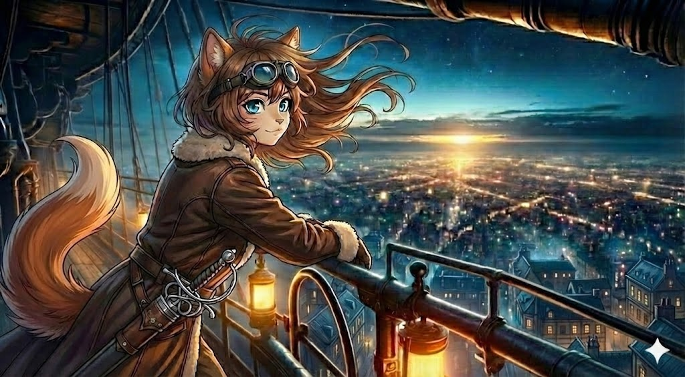

# Prológ

Plamienok v lampe sa náhle nepravidelne rozkmital, naposledy zažiaril v jasný plameň, aby o okamih nato pokojne vyhasol. Nastala tma. Spoza špinavých okien prenikalo do kajuty striebristé mesačné svetlo. Skoro dokonalé ticho v miestnosti narušovalo iba pravidelné odfukovanie parného motora v diaľke.

Muž sediaci v kresle si zťažka povzdychol, pozdvihol pohár pálenky k symbolickému prípitku a v tichosti do seba obsah vyprázdnil.

Dvere jemne zaškrípali. Do miestnosti sa vkradla mladá žena v leteckom kabáte. Jej štíhlu postavu zvýrazňoval šnurovací korzet zakrývajúci bielu košieľku. Na hrubom opasku obnosených nohavíc visel pár automatických pištolí a tenký rapier v čiernom puzdre — zbraň, ktorá vyzerala skôr ako dlhá ihla než meč. Dlhé gaštanové vlasy jej čiastočne zakrývala kapucňa, spod ktorej sa magicky, ako drahokamy, trblietali šibalské zafírové oči.

Jej zrak spočinul v kresle za veľkým dreveným stolom. Pri pohľade na tmavú siluetu podnapitého muža pokrútila hlavou.

"Tami," ozval sa hlas spoza stola.

"Max, lichotí mi, že ma v tvojom stave rozpoznáš od zvyšku posádky," poznamenala s úctihodnou dávkou irónie. "Sme na mieste. Daj sa dokopy," dodala pre zmenu so súcitom v hlase.

Chystala sa opustiť kajutu, ale on ju zastavil. „Ešte sa na mňa hneváš?"

Otázka ju zaskočila. Dvere sa hlasito zabuchli.

---

Tami sa presunula na provu lode. Pokojná nočná obloha posiata hviezdami beznádejne zanikala v žiare prichádzajúcej zdola. Nekonečná metropola sa rozprestierala až za horizont. Tami s úžasom hľadela na milióny farebných bodiek mihotajúcich sa v diaľke dolu na zemi. Rozpoznala paláce, katedrály, mosty, železnice, boli presne ako opisy z knihy, ktorú ako malá čítavala s otcom. A nad tým všetkým, na najvyššom kopci uprostred mesta, žiarila Ona. Kolosálna socha Matky, vytesaná z bieleho kameňa, s rukami roztiahnutými v ochranom geste nad prístavom. Jej tvár bola v tieni, ale svätožiara z reflektorov okolo jej hlavy pretínala smog ako maják.

Hodnú chvíľu sústredene sledovala všetky detaily. Dolu v uliciach sa to hemžilo aktivitou. Náhle sa prudko zvrtla, aby sa uistila, že **Felix** — jej pýcha, je zamaskovaný pod plachtou. Letmo pohľadom skontrolovala stav barometra a posádke vydala pokyn na zahájenie pristávacieho manévru.

*Makita* naberala rýchlosť. Mladá kapitánka si rituálne nasadila letecké okuliare. O pár sekúnd neskôr jej nárazový vietor odvial kapucňu z hlavy. Vyslobodené, neskrotné vlasy jej vôbec neprekážali. Obe ruky pevne zovreli oceľové zábradlie. Nedokázala potlačiť úžas nad krásami nočného mesta.

***

# Kapitola 1
## Karakuri

> *Krvavo červené lúče slnka sa predierali cez temný opar zahaľujúci mesto.*

---

Tami si pritiahla šatku cez nos a pokúsila sa nadýchnuť. Márne. Vzduch bol hustý, presiaknutý sladkastým zápachom kvasiacej kukurice a ťažkým výparom z etanolových rafinérií. Miestni destilovali tisíce ton kukurice na lieh, ktorý potom poháňal motory mesta. Z geotermálnych prieduchov v dlažbe stúpala sírna para. Bol to cyklus kvasenia a pary. Celé mesto dýchalo týmto technickým výparom ako obrovské, opité zviera.

*Nádhera*, pomyslela si s iróniou. Pred dvanástimi hodinami toto isté slovo úprimne zašeptala, keď v noci uvidela milióny svetiel pod sebou. V tme bolo Shoraven krásne. Za dňa bolo peklo.

Hluk bol neznesiteľný. Parné motory vŕzgali, žeriavy škrípali, robotníci a nakládači kričali a z mosadzných trúb rozmiestnených po dokoch dutý hlas vyvolával čísla lodí, kotvísk a nákladov — mužík v budke na konci móla kričal do lievikovej trúby napojenej na pneumatickú rúrkovú sieť, a jeho hlas sa ozýval z každého rohu prístavu. Medzi tým sa z chrámových veží ozýval monotónny spev kňažiek — ranná modlitba k Vševedúcej Matke. Ich hlasy zosilňovali obrovské mosadzné zvony a akustické dutiny vytesané priamo do kamenných veží.*„Sp'ira Matky prúdi v nás. Sp'ira Matky nás ochráni."* Opakovalo sa to každú hodinu. V to ráno bolo v prístave rušno aj nad miestne pomery. Celé Shoraven sa chystalo na vojnu.

Grawská armáda pochodovala z hôr. Zvedy už boli za priesmykmi — to vedela Tami z vlastnej skúsenosti, pretože šrapnel, čo im pred dvoma dňami roztrhol kondenzátor, nebol od banditov. Boli to Grawské prieskumné lietajúce stroje - malé, rýchle s dlhým dostrelom. Presne ten typ, čo letí vpredu a čistí oblohu pred hlavným vojskom.

Mesto to vedelo. A mesto sa pripravovalo.

Na doku o dvesto metrov od nich práve kotvila obrovská nákladná bárka. Žeriavy vyťahovali z jej útrob hrozivo vyzerajúce drevené debny — desiatky, stovky — a nosiči ich na vozíkoch odvážali do skladov. Zbrane. Poloautomatické karabíny, debny s delostreleckými granátmi, sudy s korditom, bojové nože z kvalitnej ocele. Tami cítila ten ostrý pach kovu a konzervačného oleja až sem hore.

Z inej bárky vykladali vrecia — obilie, sušené mäso, sudy s pitnou vodou. Zásoby na obliehanie. Celý prístav sa zmenil na vojenskú základňu. Vzducholode, riečne parníky a nákladné vlaky sa navzájom blokovali a vytvárali zápchy. Kolosálne žeriavy neustále prekladali náklad z miesta na miesto, snažiac sa vytvoriť koridor pre tisíce robotníkov pracujúcich v tomto pekle.

Pri jednom z väčších dokov stála skupina kňažiek v bielych rúchach. Žehnali zbrane pod menšou bronzovou sochou Matky, ktorej nohy boli obložené čerstvými kvetmi a... nábojnicami. Kňažky — jedna z nich stará Mezra s mačacími očami, no inak ľudskou tvárou — držala nad debnou s novými opakovacími puškami ruky a odriekavala modlitbu. Tami videla, ako sa vzduch okolo jej prstov jemne zachvel. *Sp'ira.* Stará kňažka požehnávala každú zbraň dotykom nanotechnológie, o ktorej verila, že je dych Matky.

Za ňou stáli agitátori s megafónmi — parné trúby zosilňujúce hlas — a kričali do davu: *„Matka vidí vaše obete! Každý meč pozdvihnutý za Nevriss je meč v ruke Matky! Sp'ira je s vami!"*

A medzi tým všetkým — žoldnieri. Tami ich spoznala na prvý pohľad. Prúdili do mesta z každej strany — z lodí, z brán, z ciest vedúcich na východ aj západ. Svalnatí muži a ženy v rozličných brneniach a uniformách, so zbraňami na chrbte a peniazmi na mysli. Najatí mečiari z pobrežných miest, veteráni z východných hraníc, skupina s guľometmi a krutými tvárami. Boli tu aj dobrodruzi — menšie skupinky s menej profesionálnym výrazom, ale s rovnako smrteľnými zbraňami. Prichádzali za zlatom, za slávou, alebo len za teplým jedlom a strechou nad hlavou.

Niektorí z nich mali okolo zápästí mystické tetovanie — Wa-Spira, dôkaz bojových magických schopností. Tami si všimla, že verbovací dôstojníci takých púšťali dopredu v rade a ponúkali im vyšší žold. Sp'ira bola v čase vojny mena drahšia než zlato.

Vojna bola pre obchodníkov tragédia a pre žoldnierov svadba.

Tami stála v podpalubí, po pás vnorená do útrob kompresnej komory. Ruky mala po lakte čierne od oleja. Tretí kondenzátor v rade tiekol ako deravé vedro. Kryt axiálneho čerpadla bol prerazený — šrapnel z Grawského prieskumného korába, ktorý ich pred dvoma dňami prepadol nad priesmykom Kel'morah, narobil viac škody, než si pôvodne myslela. Ušli len vďaka hmle a tomu, že Grawčania nemíňali muníciu na malé lode. Mali väčšie starosti.

*Kurva*, nadávala si v duchu, keď jej kľúč po tretíkrát skĺzol z matice. Olej jej stekal po predlaktí a kvapkal na podlahu.

Odtiahla sa od motora a oprela si chrbát o stenu. Zavrela oči. Len na chvíľu.

Za posledných 24 hodín nespala. Pristávací manéver v nočnom meste vyžadoval maximálne sústredenie — domy v Shoraven boli natlačené tesne vedľa seba a doky, kam sa zmestila loď ich veľkosti, boli na samom okraji prístavu. Dok sedemnásť. Posledný pred otvoreným morom.

Odtiaľ to bolo k Hlavnému chrámu šesť kilometrov cez celé mesto.

Šesť kilometrov cez najhustejšie obývané mesto na kontinente.

*Musí existovať jednoduchší spôsob, ako ukradnúť najstráženejší artefakt v krajine*, pomyslela si. Ale keby existoval, jej priatelia by ešte žili.

Spomienka na nich ju zasiahla nečakane, ako bodnutie. Videla ich tváre. Tri tváre. Arkot, Yera, Flint. Prvá posádka, s ktorou si vybudovala meno. Boli to hľadači pokladov. Dobré duše. Našli niečo — niečo, čo nemali nájsť.

A za to ich upálili na námestí v Shoraven. Verejne. Aby si každý zapamätal, čo sa stane, keď niekto znesvätí sväté relikvie Vševedúcej Matky.

Tami bola v tom čase na východe. Počula o tom až o tri týždne. Do prístavu sa vrátila príliš neskoro — zostal len prach a popol na námestí a meno "Spáč" šepkané v krčmách ako kliatba.

A teraz bola tu. V meste, kde ich zabili. S plánom ukradnúť vec, za ktorú zomreli.

S mužom, ktorému nedokázala odpustiť.

*A ani zabudnúť*, dodala si v duchu.

---

Vytreštila oči, keď počula hlasy zhora.

Rýchlo si utrela ruky do handry a vyšplhala sa len do polovice rebríka. Vystrčila hlavu z poklopu, tak aby ju nebolo vidieť, a nastražila uši. Oslnilo ju slnko — alebo to, čo z neho prenikalo cez dymovú clonu. Prižmúrila oči.

Max stál pri zábradlí. Stoicky. Pokojne. Ruky za chrbtom, akoby pozoroval krajinu na prechádzke a nie priemyselné peklo pod sebou. Mal na sebe dlhý, tmavý plášť s kapucňou — ten istý, v ktorom vyzeral ako kňaz na pohrebnej hostine. Na očiach tmavé okuliare, ktoré mu zakrývali polovicu tváre.

Oproti nemu stál oficier. Stredne vysoký Mezra v červenom kabáte s mosadznými gombíkmi. Na prvý pohľad vyzeral ako človek, až na mierne pretiahnuté špicaté uši, ktoré mu nervózne strihali pod trojrohým klobúkom. Vyzeral vyčerpaný — kruhy pod hnedými psími očami, neoholená ľudská tvár. Osoba, čo nespala niekoľko nocí. Za ním sa tiesnil tucet vojakov — Ghorki s hustou srsťou a zvieracími hlavami. Jeden z nich, obrovský hnedý medveď, mal na ramene bubienok. Vyzerali, akoby ich niekto vygumoval z učebnice dejepisu, ktorú Tami nikdy nečítala. A hlavne vyzerali nervózne. Každých pár sekúnd sa niekto z nich obzrel smerom na oblohe a chvosty sa im nepokojne vlnili.

„Dobré ráno, vitajte v Sho." Prihovoril sa oficier a Tami stuhla.

*Sho?*

Potlačila nutkanie sa nahlas zasmiať. *Otec by plakal.*
"Sho" v jazyku Líščieho národa znamenalo hovno. Presnejšie — sračku.
A v tomto meste to sedelo dokonale.

„S kým mám tú česť? Odkiaľ vedie vaša cesta a aký je dôvod vašej návštevy?" vyzvedal dostojník autoritatívnym tónom.

Tami pozorovala Maxa. Poznala ten jeho výraz — tú drobnú vrásku medzi obočím, ktorá sa objaví, keď ho niekto otravuje. Po ôsmich rokoch po jeho boku sa naučila čítať jeho tvár lepšie než mapy.

*Po piatich rokoch odlúčenia sa ju stále neodnaučila.*

Max sa rozhliadol naokolo, akoby hľadal osobu, ktorej bola otázka smerovaná. Nikto iný tam nebol. Posádka — osem aeronautov — sa už pravdepodobne rozpŕchla do mesta, ako vždy, keď zakotvili niekde, kde existovali krčmy.

„Moje meno je James Tiberius Kirk," povedal nakoniec s ťažko skrývanou otrávenosťou a hrozným prízvukom. „Prichádzam z východu a som tu-ri-sta."

Tami si zakryla ústa rukou, aby sa nezačala smiať. Poznala ten tón. Max sa bavil. Vo svojom zvláštnom, zúfalom, tragicky komickom štýle, o ktorom nikto na tejto planéte nevedel, že je vtipný. Aký to bol vtip — to nevedela ani ona. Ale poznala ten záblesk za jeho tmavými okuliarmi. Odlesk na šošovke umelých očí, ktoré mu nahrádzali zrak. Niečo z jeho starého sveta. Niečo, čo zomrelo so Zemou pred tromi tisícročiami.

*A samozrejme, bol to najhorší alias v histórii kriminality.*

Dostojník zostal zaskočený. „Pane, pri všetkej úcte, nepoznám význam slova *turista*. A musím priznať, že váš prízvuk mi vôbec nie je povedomý. Slúžil som dlhé roky na východnej hranici a prepáčte mi moju aroganciu, ale vy nie ste východniar."

*No samozrejme, že nie*, pomyslela si Tami. *Hovorí Starorečou. Jazykom, ktorý tu nik nepoužíva tri tisícročia. A aj po trinástich rokoch na tomto svete znie, ako keby sem nepatril.*

Oficier sa narovnal. „Pýtam sa teda naposledy. Odkiaľ prichádzate?"

„Z východu," zopakoval Max bez mihnutia oka. Krátka odmlka. „Zo slobodného mesta Kito."

„Kito je legenda!" protestoval dostojník.

„V tom prípade som asi spadol z neba," usmial sa Max.

*A to je presne ten okamih, kedy normálna osoba dostane strach*, pomyslela si Tami. *A presne ten okamih, kedy treba zasiahnuť.*

Vynorila sa z podpalubia s najnonchalantnejším výrazom, aký dokázala nasadiť s olejovými fľakmi na tvári. „Skontrolovala som kondenzátory, ale netesnia. Strácame veľa kvapaliny," konštatovala vecne, ignorujúc delegáciu červenokabátnikov.

Podišla k Maxovi a rafinovane sa naklonila cez zábradlie. Nechala si čas, aby si z kapsy vytiahla handru a pomaly si utrela ruky. Vedela, čo robí. Vedela to veľmi dobre.

Vojaci pri pohľade na ňu skameneli.

V krčmách na východe si už na ňu zvykli. Tu, v srdci Nevriss, kde Kult Vševedúcej Matky učil, že všetky deti Matky sú si rovné, bola pravdepodobne vítaná. Ale Líšky boli vzácne. Väčšina starých rodov vymrela počas prvej vojny o Sp'iru a stretnúť jednu naživo — navyše s modrými očami — bolo ako stretnúť ducha.

*Niet divu, že tak zízajú.*

Dostojník sa korektne poklonil a rozpačito odkašľal. „Hmm... kde sme to skončili? Ach áno, spadli ste z neba." Pozberal sa. „Pane, prepáčte, ale ja ani moji muži sme nepočuli, že by niekto niekedy priletel z Kitó. Preto, ak hovoríte pravdu — a pri pohľade na vašu zvláštnu vzducholoď o tom vôbec nepochybujem — buďte naším hosťom." Chvíľu váhal, potom dodal tichšie: „Musím vás ale upozorniť, že mesto je vo vojnovom stave. Grawská armáda pochoduje cez priesmyky. Odporúčam vám nevzďaľovať sa z dokovej zóny a vyhnúť sa vojenským okrskom. Pre vašu vlastnú bezpečnosť."

Oficier sa hlboko uklonil podľa miestnej etikety a neodpustil si pritom komické zamávanie klobúkom. „Moji muži tu ostanú, aby vám zaistili ochranu. Musím udalosť ohlásiť na veliteľstve — máme teraz plné ruky práce, ako si iste všimnete. Onedlho sa vrátim. Dovidenia."

Tami sledovala, ako červenokabátnici zaujímajú pozície pri doku. Dvaja pri rampe, dvaja na konci móla, ostatní roztrúsení s karabínami na pleciach. *Ochrana*. Pekné slovo pre *stráženie*.

Počkala, kým sa oficier vzdialil. Potom sa otočila k Maxovi.

„James Tiberius Kirk," zopakovala pomaly. „To vážne?"

„Čo je na tom zlé?"

„Všetko. *Kirk?* To znie ako zvuk, keď niekto zakopne." Pokrútila hlavou. „A *turista*? Max, oni nepoznajú to slovo. Nikto tu necestuje *pre zábavu*. Všetci tu cestujú, aby prežili, utiekli, alebo niekoho zabili."

Max sa oprel o zábradlie. Okuliare mu skrývali oči, ale Tami videla, ako sa mu kútiky pier mierne zdvihli.

„Ty si tiež cestovala pre zábavu. Päť rokov."

*A je to tu.*

Tami stisla zuby. *Neodpovedaj. Nedaj mu tú satisfakciu.* Ale slová jej už stúpali hrdlom.

„Ja som cestovala, lebo si mi nedal na výber."

Ticho. Parné motory v doku pod nimi syčali. Niekto niekde kričal mená. Žeriav zaškrípal.

„Tami—"

„Kondenzátory," prerušila ho. „Ten Grawský šrapnel nás nepekne trafil a spôsobil väčšie škody, ako som odhadovala. Axiálne čerpadlo je zničené a nemáme náhradné. Budem musieť nájsť špecialistu, ktorý zvládne tú zložitosť." Odvrátila sa od neho a namierila si to k rebríku. „A nepredstavuj sa ako turista. Povedz im, že si obchodník. Obchodníci sem chodia. Turisti nie. Zvlášť teraz, keď sa celé mesto opevňuje."

Max prikývol. „Obchodník s čím?"

Tami sa zastavila na rebríku. Pozrela na neho cez rameno. „S čímkoľvek, čo tu nemajú."

*S pravdou*, dodala si v duchu, keď zmizla pod palubou. *S pravdou tu obchoduje každý.*

---

Axiálne čerpadlo bol väčší problém, než pripúšťala.

Vnútorný mechanizmus bol rozbitý na kusy. Nie len prasknutý kryt — *doska cykliky* bola rozlomená a piesty zadreté. Typ poškodenia, ktorý sa nedá opraviť v teréne. Potrebovala hodinára, nie mechanika. Niekto, kto dokáže vyrobiť súčiastky z tvrdenej ocele a poskladať ich do funkčného celku s presnosťou na mikrometre. Na tomto svete, kde väčšina strojárov merala „od oka" a „na päsť", to bol takmer nemožný požiadavok.

*Takmer.*

Maki vedeli. Tí záhadní, tichý mechanici, ktorí boli najlepšími technológmi na kontinente. Ak v Shoraven existoval jediný mechanik schopný takej presnosti, bol to jeden z nich.

Vysušila si ruky, prehodila si cez hlavu čistý kabát a stiahla kapucňu hlboko do čela. Uši schovala pod šatkou — v Nevriss boli Varietas vítané, ale nepotrebovala zbytočnú pozornosť. Nie dnes.

Na opasok si pripla obe pištole. Desiatky zásobníkov po celom tele — v čižmách, za opaskom, v podšívke kabáta. Maxov výcvik. Trinásť rokov starý návyk, ktorý sa jej vryl do kostí.

*Jeho hlas, pokojný, trpezlivý, nekonečne trpezlivý. „Nie zápästím. Celým ramenom. Cíť váhu. Pištoľ je predĺženie tvojej vôle."*

*„Mala vtedy sedem.*

Zahnala spomienku a vyšla na palubu. Max tam už nebol. Vojaci áno. Dvaja pri rampe jej venovali krátky pohľad — záujem, nie nepriateľstvo. Jeden z nich — mladší, — hanblivo sklopil oči, keď sa naňho pozrela.

Tami prešla cez rampu na mólo. Pod nohami jej zachrastil kov a potom mokré drevo. Vzduch na zemi bol ešte horší než na palube — tu sa etanolový smog a sírna para miešali so zápachom ryšavej vody, stojatých kanálov a tisícov potiacich sa tiel.

Dok sedemnásť bol na samom konci prístavu, čo znamenalo, že musela prejsť cez celú dokovú zónu, aby sa dostala do mesta. Šla rýchlo, s hlavou sklopenou, rukami v vreckách. Prístav sa za posledných pár dní musel zmeniť na nepoznanie. Okolo nej sa hemžili robotníci — väčšinou Ghorki, nízka kasta bez Sp'iry. Boli to mohutné postavy s hrubou srsťou a výraznými zvieracími črtami, tí, čo nikdy neokúsili mágiu. Nosili náklad na chrbtoch, kopali zákopy holými rukami, stavali barikády z vriec s pieskom. Nikto im neplatil veľa. Nikto im neďakoval. Ale boli slobodní. V Nevriss, na rozdiel od Graw, na tom Cirkev trvala. *„Všetky deti Matky sú si rovné,"* hlásali kňažky.

*Rovné*, pomyslela si Tami s trpkosťou, keď videla Ghorki ženu s mačacími ušami vliecť vrece ťažšie než ona sama, kým vedľa nej biodieslový žeriav robil to isté bez námahy. *Rovné, ale niektoré sú rovnejšie.*

Dnes medzi robotníkmi pochodovali aj vojenskí inžinieri v zelených kabátoch, čo rozkazovali, kde stavať barikády. Na nábreží pribúdali valy z vriec s pieskom. Delostrelectvo. Ťažké kanóny na drevených lafetách, vytiahnuté z lodných podpalubí a namierené smerom k oblohe. Jeden z vojakov — dôstojník Mezra kasty, podľa zelenkastého žiarenia, čo mu občas prebehlo po prstoch — gestikuloval nad mapou a prskal rozkazy. Tami videla, ako ľahkým pohybom ruky nadzdvihol ťažkú debnu a posunul ju o meter. Telekinéza. Remeselná Sp'ira. Pre neho to bolo ako nadýchnuť sa.

Na každom treťom stĺpe visel čerstvý plagát. Tami sa pri jednom zastavila. Drsný drevoryt — postava v brnení s mečom, obklopená žiariacimi pentagramami — a pod ním text v miestnom písme: *„BOJOVNÍCI MATKY! SP'IRA MATKY ŤAŽÍ V TVOJICH ŽILÁCH! BRÁŇ SVOJ DOMOV! ZLATO A ČESŤ PRE KAŽDÚ ŠABĽU!"*

Verbovací plagát. Mesto platilo za meče. A ešte viac za meče v rukách niekoho so Sp'irou.

Na rohu stál agitátor Kultu — vychudnutá postava s kozími rohmi a očami plnými fanatického ohňa. Kričal do trúby, ktorá mu zosilňovala hlas na celú ulicu: *„Grom je falošný boh! Grom je mŕtvy! Matka žije! Matka vidí! Kto padne za Matku, vstane po jej boku v Záhrade Svetla!"* Okolo neho sa zhŕkol malý dav — väčšinou Ghorki - najnižšia kasta, ale mali vieru. Kývali hlavami. Niektorí plakali. Niektorí sa modlili, ruky zopäté, oči zatvorené.

Okolo nej prúdili davy — slobodní nosiči, vozokári s volskými záprahmi, skupiny námorníkov v rôznych štádiách opitosti a medzi nimi čoraz viac žoldnierov. Skupinka rozložitých vlkov v seversky strihnutých kožušinách — dezertéri z Graw? — sa tlačila okolo stánku so zbraňami. Dve čierne panterky (asi sestry pomyslela si Tami) preťažili voz s ťažkými guľometmi a teraz nadávali na vola, ktorý odmietal tiahnuť. Jeden z žeriavnikov v kabíne nad nimi sa zľutoval — spustil rameno, zachytil celý voz do siete a preložil ho na stranu.

Otcov hlas jej zaznel v hlave: *„Dieťa, mesto sa pozná podľa toho, ako zaobchádza s tými, čo sa nemôžu brániť."*

*Ak to bola pravda, Shoraven bolo mesto, ktoré aspoň predstieralo, že mu na tom záleží. Čo bolo viac, než mohol povedať Sever.*

---

Prístav prechádzal do Dolného mesta plynulo — nebola tu žiadna brána, len postupný prechod z dokov na dláždenú ulicu lemovanú skladmi, krčmami a obchodmi. Architektúra bola chaotická. Staré budovy z bieleho monolitického materiálu — *3D-tlačené ruiny z Éry prvého veku* — stáli vedľa drevených prístavkov, tehlových nadstavieb a hrdzavých plechových prístreškov. Vyzeralo to, akoby niekto postavil grécky chrám a potom naň nalepil pirátsku krčmu.

Po pravej strane sa črtala rozľahlá budova s mosadznou tabuľou: *Gilda Kupcov — Shobors*. Burza. Aj v čase vojny — alebo práve preto — sa tam tlačili desiatky obchodníkov. Tami videla cez otvorené dvere davový chaos vnútri: trhový sál plný kričiacich postáv s papiermi v rukách, kriedové tabule s cenami komodít, ktoré niekto horúčkovito prepisoval. Cena ocele sa od včera zdvojnásobila. Obilie šlo hore.
Sp'ira kryštály — sústredená esencia v minerálnej forme, vzácnejšia než zlato — stratili hodnotu, pretože nikto v čase vojny neinvestoval do "luxusu".

*Perfektné*, pomyslela si Tami. *Pre miestnych sú to len šperky alebo magické hračky pre bohatých. Pre Makitu je to život. Parné jadro s katalyzátorom z čistého striebra. Stačí kvapka "aktivátora" — špeciálnej priemyselnej kyseliny — a kryštál začne žeraviť. Voda sa mení na paru okamžite. Kým ostatné vzducholode spaľujú drahý biodiesel, Makite stačí voda z najbližšieho jazera a pár kryštálov za zlomok ceny. S plnou nádržou za túto cenu doletíme až na koniec sveta.*

*Vojna. Najlepší obchod na svete*, pomyslela si Tami. *Pre tých, čo nie sú na fronte.*

Ale aj tu bolo vidieť vojnu. Pred jedným skladom stál rad mužov a žien — čerstvo naverbovaní dobrovoľníci, podľa výzoru. Starý seržant v rozopätom červenom kabáte im rozdeľoval pušky z drevenej debny a kričal inštrukcie. Väčšina z nich vyzerala, akoby zbraň držala prvýkrát v živote. Farmári. Rybári. Remeselníci. Väčšinou Ghorki a nižšia Mezra — tí, čo mali dosť Sp'iry na to, aby ich telo vydržalo viac, ale nie dosť na to, aby mali na výber. Vojna zožierala najprv chudobných.

Medzi nimi stála kňažka Kultu a pomazávala ich čelá olejom. Pri každom dotyku zašepkala modlitbu. Niektorí dobrovoľníci jej bozkali ruky. Iní len stáli so sklopenými hlavami a čakali na pušku, ktorá ich pravdepodobne nezachráni.

Tami kráčala pomedzi stánky tržnice. Vzduch tu vonia korením, smažením a niečím sladkým, čo nevedela identifikovať. Všade bolo plno. Na jednom námestíčku videla niečo, čo ju prinútilo spomaliť. Pouličný mág — kováč, podľa zástery a popálenín na rukách — predvádzal skupinke detí ukážku Sp'iry. Dvíhal z dlane malé plamienky, tvaroval ich do zvieratiek, ktoré pobehovali po vzduchu. Deti pišťali od radosti. Jedno malé dievčatko s mačacími ušami, podľa toho, ako nechápavo zíralo, natiahlo ruku k ohnivej myške. Kováč ju zachytil: *„Len sa pozeraj, maličká. Matka ti dá Sp'iru, keď príde tvoj čas."* Nežne. Láskavo. Klamal.

*Matka jej nedá nič*, pomyslela si Tami. *Ghorki sa rodia bez Sp'iry a umierajú bez nej. Žiadna modlitba to nezmení.*

*Nevriss. Nikdy-Ľad. Zem, kde sa Varietas nemusia schovávať.*

Aspoň teoreticky. A aspoň kým grawská armáda nepríde cez hory.

V praxi bola rovnosť Kultu Matky krásna lož. Žiadne otroctvo — to áno, na tom Cirkev trvala. Ale kastový systém fungoval aj bez reťazí. Čistokrvní Pursang s najsilnejšou Sp'irou — tí sedeli v Rade Veľkňažiek, velili armádam, vlastnili gildy. Pod nimi Mezra — remeselníci, vojaci, obchodníci, tí so strednou Sp'irou, ktorí držali krajinu v chode. A na dne Ghorki — bez mágie, bez hlasu, bez vyhliadok. Slobodní. Ale sloboda bez Sp'iry bola v tomto svete len iné slovo pre bezmocnosť.

*Požehnané deti. Jasné.*

Pri Tretej Bráne sa zastavila. Bránu strážili dve sochy — Matka s mečom a Matka s váhami. Ich kamenné oči boli prázdne, slepé, presne ako spravodlivosť v tomto meste. Odtiaľ viedla úzka, kľukatá ulička dolu k Remeselnému okrsku. Tami vedela — z máp, ktoré kúpila ešte pred dvoma rokmi v prístavnom meste ďaleko na východe — že práve tu bývali kováči, hodinári a mechanici. Ak bol v meste Mako, nachádzal sa tu.

Schádzala po schodoch z mokrého kameňa. Ulička sa zužovala. Domy sa k sebe nakláňali, akoby sa šeptali. Bielenie padalo zo stien ako lupiny z chorej kože. Prádlo viselo medzi oknami na lanách a kvapkalo na chodcov.

A potom to začula.

Pravidelné, presné údery kladiva na kov. Nie hrubé dunenie miestnych kováčov. Toto bolo *iné*. Rytmické. Metronomicky presné. Každý úder rovnako silný, s rovnakým intervalom.

*Mako.*

Tami zastala pred dverami. Nad nimi visela starobylá biela vlajka s červeným plným kruhom uprostred.

*Felix ju varoval. „Vstup do dielne Maka nie je ako vstup do krčmy, maličká. Je to chrám. A ty si tam len hosť. Zabudni na všetko, čo vieš o tomto svete. Tam platia staré pravidlá ktoré boli staré ked ja som bol ešte dieťa."*

Zložila si letecké okuliare z čela a zavesila ich na krk. Rozopla ťažký kabát a zložila ho na úhľadnú kôpku vedľa vchodu do *genkanu*, hoci to znamenalo odhaliť zbrane na opasku. Pištole boli súčasťou jej duše, tie neodloží, ale prach ulice áno.

Jemne pootvorila dvere. „*Gomen kudasai!*" zvolala do ticha, hlasom pevným, no pokorným.

Vyzula si ťažké vojenské čižmy, položila ich k stene a otočila špičkami smerom von. Až potom, v hrubých vlnených ponožkách, prekročila prah do samotnej dielne. „*Shitsurei shimasu.*"

Priestor bol prekvapivo, až neprirodzene čistý. Žiadny typický chaos kováčskej dielne, žiadny popol na podlahe. Nástroje viseli na stenách v geometricky dokonalom poriadku. Čo však udrelo do očí, boli steny samotné. Boli popísané hiraganou — stovky riadkov drobného, precízneho písma.

Pre bežného smrteľníka v Nevriss to bolo *Písmo Matky*. Posvätné znaky, ktorými Vševedúca prepísala realitu, keď jej lode jej poslov zostúpili z nebies a ukončili éru Temna po príchode Ex Inferis. Kňazi tieto znaky uctievali ako Božie slovo.

Tami však vedela lepšie. Felix ju naučil čítať podstatu. Pre neho a jeho bratov to nebola modlitba, ale *logika*. Jazyk, ktorým sa dal popísať svet s matematickou presnosťou. Bolo to dedičstvo, ktoré Karakuri po páde Kitó rozniesli medzi ľudí nie ako náboženstvo, ale ako vedu – svetlo poznania, ktoré malo ukončiť dlhé zimy Doby Temna.

A to, čo bolo na stenách, boli to Haiku. Nekonečné stĺpce poézie o tichu, oceli a strate, ktorou si tento *Karakuri* krátil tisícročnú samotu.
Vzduch voňal inak. Nie kvasiacou kukuricou a sírou, ale čistým olejom a ozónom. Na pracovnom stole ležali rozložené súčiastky hodinového stroja so symetriou, ktorá bolela oči.

Za vyhňou stála postava pripomínajúca muža stredného veku. Čierne vlasy, zvláštne čierne oči, vyblednutá tvár, kožená zástera. Nič výnimočné. Až na tú absolútnu nehybnosť, keď nepracoval a tie oči. Oči Makov boli vždy *príliš pokojné*.

Tami zostala stáť. Ruky vystrela pozdĺž tela, prsty spojené, presne ako ju to učil Felix. *„Ako bojovník, Tami. Nie ako služobná,"* prízvukoval jej vždy. *„Ruky pri tele. Ukáž, že sa nebojíš, ale že preukazuješ úctu."*

Čakala. Prerušiť majstra pri práci bolo nemysliteľné.

Až keď postava odložila kladivo s plynulosťou hydraulického piestu presne na miesto, kde ležalo predtým, Tami sa pohla. Zohla sa v páse, chrbát držala rovný ako pravítko, pohľad zabodla do zeme. Ruky držala pevne pri bokoch — mužský postoj. Vydržala v úklone sekundu a pomaly sa narovnala.

„*Hajimemashite. Yoroshiku onegai shimasu*," povedala ticho.

Mako sa pomaly otočil. Jeho oči, čierne a bezodné ako studne, si ju premerali. Od topánok v genkane až po končeky uší pod šatkou. Potom sa uklonil — pohyb starý ako jeho séria, vykonaný s absolútnou precíznosťou.Potom sa uklonil.

Keď sa narovnal, jeho pohľad klesol na jej ruky pritlačené k bokom. Na zlomok sekundy spojil svoje dlane pred sebou v tradičnom ženskom geste, potom ich vrátil späť a kútiky očí sa mu takmer nebadateľne zvlnili. *Videl som to*, hovorilo to gesto. *A rozumiem.*

Tami cítila, ako sa jej nahrnula krv do tváre, ale nedala na sebe nič znať. *Felix... ty starý plechový idiot.*

„Potrebujem axiálne čerpadlo," prešla plynulo do obchodnej reči. „Deväť piestov, variabilný náklon, pracovný tlak štyristo barov."

Mako zostal nehybný. Potom pomaly pokrútil hlavou. *Nie.*

Podišiel k polici, vzal do ruky posuvné meradlo a nastavil ho. Ukázal na prázdny vzduch. *Nič také neexistuje.*

„Existuje," povedala Tami pevne.

Mako zastal. Pozrel sa na ňu s novým záujmom. Zdvihol ruku a vystrel tri prsty.

„Štyri," opravila ho Tami.

Mako prekvapene zdvihol obočie.

„Ten štvrtý mám na lodi."

Prastarý majster na ňu dlho hľadel bez žmurknutia. Ticho v miestnosti oťaželo, akoby vzduch zhustol pod váhou storočí. Potom sa jeho pery, ktoré vyzerali ako zapečatené, pomaly pohli a prvýkrát prelomil mlčanie. Jeho hlas znel ako škrípanie hrdzavých pántov brány, ktorá nebola otvorená tisíc rokov.

„Nový prototyp?"

„Áno," prikývla Tami, hoci cítila, ako jej z toho hlasu prebehol mráz po chrbte. „Postavený v Kitó. Z pozostatkov lode Hephaestus. Volá sa *Makita*."

Pri tom slove Mako stuhol. Ak bolo možné, aby sa socha stala ešte nehybnejšou, stalo sa to práve teraz. Hľadel na ňu, akoby sa pred ním zjavil duch jeho vlastnej minulosti. Potom sa hlboko, takmer až po pás, uklonil smerom k dverám, kde tušil loď.

„Potrebujem čerpadlo, aby mohla znova lietať," dodala Tami jemnejšie.

Mako sa narovnal. Ukázal dva prsty. *Dva dni.*

„Jeden," povedala Tami tvrdo.

Mako pokrútil hlavou. Rozpažil ruky — *nemožné*.

„Zaplatím trojnásobok."

Mako ju chvíľu pozoroval. Potom znova ukázal dva prsty, ale tentoraz jeden z nich pomaly, váhavo sklonil. *Skúsim to.* Natiahol ruku dlaňou hore.

Tami mu do nej vložila malé vrecko mincí. „Záloha. Pošlem niekoho z posádky s čerpadlom ešte dnes večer. Budete ho mať na stole do západu slnka." Otočila sa k odchodu, ale pri dverách sa zastavila.

Otočila sa späť k nemu. Spojila dlane tentoraz správne – mäkko, s lakťami pri tele, hlavu mierne sklonila. Žiadny "mužský" postoj bojovníka, ktorý jej vštipil Felix. Toto bola úcta k majstrovi.

Uklonila sa. Hlboko a s pokorou.

„*Arigatō gozaimashita.*"

Mako sa nepohol, ale Tami videla, ako sa jeho ruka s kladivom na zlomok sekundy zastavila vo vzduchu. To bolo viac než pozdrav. To bolo uznanie.

Keď vyšla na ulicu, slnko už bolo vysoko a smog sa zmenil z červeného na sivý. Mesto hučalo okolo nej ako obrovský parný stroj. Tisíce životov, tisíce príbehov, tisíce tajomstiev — a nad tým všetkým tieň blížiacej sa vojny.

Prešla okolo skupiny žoldnierov, ktorí si pred krčmou čistili zbrane. Jeden z nich — obrovský chlap s jazvou cez celú tvár — ju sledoval pohľadom. Tami ho ignorovala. Nebezpečnejší boli tí, čo sa nepozerali.

Niekde tam dole, pod dlažbou, pod kanálmi, pod základmi Hlavného Chrámu Vševedúcej Matky, ležal on. **Artefakt**. Vec, ktorá by nemala existovať.

*Šesť kilometrov*, pomyslela si. *Šesť kilometrov, jeden deň na opravu lode, a potom sa musíme dostať do kobiek, vziať to a zmiznúť skôr, než nás chytia, zabit pri tom co najmenej ludí.*

Vojna im hrala do karát. Celé mesto sa opevňovalo a Chrám Vševedúcej Matky mal teraz iné starosti než strážiť kobky. Stráže sa presúvali na hradby, kňažky organizovali evakuáciu cenností na juh a v uliciach vládol chaos, v ktorom sa dva tiene mohli stratiť.

*Jednoduché.*

Usmievala sa. Bol to úsmev, ktorý jej nezasiahol oči. Tie ostali chladné ako kov pištole pod jej kabátom.

---

*— koniec kapitoly 1 —*
