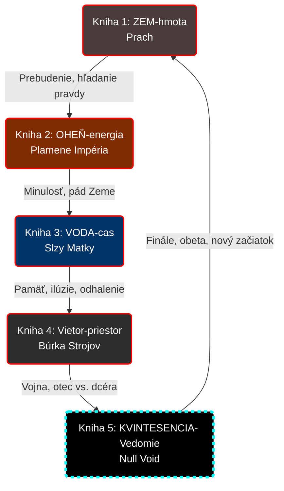

# Prehľad kníh (Pentalógia)

## Štruktúra

| Kniha | Element | Názov | Boss | Téma |
|-------|---------|-------|------|------|
| 1 | 🜃 ZEM-hmota | Prach Nevriss | **Grond** (nie boss fight — kataklizmus; + Samaell flashback) | Prebudenie, hľadanie pravdy |
| 2 | 🜂 OHEŇ-energia | Plamene Impéria | **Mormiel** | Minulosť, pád Zeme |
| 3 | 🜄 VODA-cas | Slzy Matky | **Zaya** | Pamäť, ilúzie, odhalenie |
| 4 | 🜁 Vietor-priestor | Búrka Strojov | **Sera** | Vojna, otec vs. dcéra |
| 5 | ✧ KVINTESENCIA- Vedomie | Null Void | **Elania + I_NET_IS** | Finále, obeta, nový začiatok |

### Vizuálny plán (Glyf Cycle)

---

## Kniha 1: ZEM-hmota – Prach Nevriss

### Dej
- Heist Arc: Tami a Maks v Shoravene — záchrana priateľov (Arkot, Yera) z kobiek pod Chrámom
- Maks Arc: Boj s Grawskou inváziou, obrana Shoravenu
- Flashback (Ch.7): Maksovo prebudenie z kryostázy (AY 3000), duel so **Samaellom** (AY 3001)

### Konflikt
- Boj s Grawskou armádou a Kultom Matky
- Maks vs. Grond (Archbés Vojny)

### Grond (Archbés Vojny) — nie boss fight, nie antagonista
- Čitateľ ho nepozná — Grond je sila prírody, kataklizmus, nie osobný nepriateľ
- Zabitý Maksom v Ch.5 Blood Ritual (nanodronový roj, 6 km, 7 sekúnd)
- **Možný Grond POV chapter** — dať mu hlas, ukázať vojnového boha zvnútra (paranoja, rozpadajúce sa telo, posledná noc)
- **Samaell** = flashback duel (Ch.7 Fáza 3, AY 3001) = **skutočné finále knihy**. Samaell = Smrť. Maks poráža Samaella vo flashbacku → poráža vlastnú smrť → prebúdza sa z kómy. Duel AY 3001 = reboot AY 3014.

### Finále (Ch.7 — štyri fázy)
- **Fáza 1**: Tami nájde Maksa v snehu, klinická smrť, odchádza s presvedčením, že je mŕtvy
- **Fáza 2**: Reboot — záložný survival protokol, NDE
- **Fáza 3 = CLIMAX**: Flashback — prebudenie z kryostázy, klietka s baby Tami, **duel so Samaellom** (Maks poráža Smrť)
- **Fáza 4**: Prebudenie v Kitsune (AY 3014), rok v kóme, Felix, svet sa pohol ďalej

---

## Kniha 2: OHEŇ-energia – Plamene Impéria
> Detailná osnova: [02-ohen.md](02-ohen.md)

### Dej (dvojitá línia)

**Flashbacky (Zem):**
- **ex inferis:** Maksovo uväznenie vo VR pekle Achilles.
- **Vojna s Marsom (2150):** Maks ako elitný zabijak Koordinátora.
- **Pád Zeme (2300):** Dramatický útek s Inetis na lodi Null-Void.

**Prítomnosť:**
- Tami v Nevriss City — vstup do srdca Kultu Matky
- **Nevriss City:** Požehnaná Matka (Mormiel) si vyberie Tami na Rituál Nástupníctva. Tami a Maks nevedia, že rituál je pohltenie. Mormiel chce Taminu Spiru — najsilnejšiu od čias Inetis.

### Boss: **Mormiel** (Požehnaná Matka / 4. Archbés)
- Odhalenie pravej identity — nie svätá matka, ale predátorka s 23 pohltenými identitami
- Rituál Nástupníctva ako centrálna hrozba

### Konflikt
- Maksov boj s vlastnou tieňovou minulosťou zabijaka.
- Tami vs. Mormiel — dôvera vs. zrada, materská láska vs. predátorstvo.

---

## Kniha 3: VODA-cas – Slzy Matky
> Detailná osnova: [03-voda.md](03-voda.md)

### Dej
- Cesta do Prístavu a Pobrežných miest.
- Infiltrácia na **Ostrov Ynetis**.
- Tami sa mení na nádobu pre Inetis (strach zo straty identity).

### Prostredie
- **Mesto Zrkadiel (Zayina doména):** Miesto ilúzií a neuro-hackingu.
- **Ynetis (Mesto Duchov):** Čiastočne zarastený ostrov plný rogue AI (Duchovia).

### Boss: **Zaya** (Archbés Pôžitku)
- Útok na Maksovu psychiku cez ilúziu dcéry/dokonalej rodiny
- Neutralizovaná Maksom, pohltená vlastnými otrokmi

### Konflikt
- **Zaya** a jej útok na Maksovu psychiku cez obraz dokonalej rodiny.
- Odhalenie pravdy o **Bit Rot Glitchi** (Elaniina zrada).

### Finále
- Archív v Ynetis odhalí Maksovi najväčšie tajomstvo: Elania je jeho dcéra.

---

## Kniha 4: Vietor-priestor – Búrka Strojov
> Detailná osnova: [04-vzduch.md](04-vzduch.md)

### Dej
- Otvorená konfrontácia Maks vs. Elania.
- Infiltrácia ku **Kráteru** (vykopávky lode Exodus).
- Súboj so **Starou Gardou** (Nesmrteľní) — pôvodnými kolonistami.

### Boss: **Sera** (Čepeľ Elanie)
- Duel s Maksom — Sera bráni Elaniu do posledného dychu
- Smrť Sery = Elaniin zlomový bod (strata "jej Heleny")

### Mechaniky
- **Signálové pole (The Breach Spike):** Maksova schopnosť neviditeľnosti/štítu, ktorá ho však odrezáva od dronov a robí z neho smrteľníka.
- **Vákuová Spira:** Tisícročné skúsenosti kolonistov umožňujú ohýbať vzduch a drony spôsobom, ktorý Maks neovláda.

### Konflikt
- **Otec vs. Dcéra:** Stret dvoch pohľadov na spásu (Biológia vs. Digitálna utópia).
- Maksova neochota zabiť dcéru vs. Elaniina chladná logika "spásy".

### Finále
- Elania aktivuje **Protokol Null** v Jadrue.
- **CLIFFHANGER:** Zastavenie Duchov po celom svete a desivé ticho pred búrkou.

---

## Kniha 5: KVINTESENCIA- Vedomie – Null Void

> Detaily v [05-kvintesencia.md](05-kvintesencia.md)

### Dej
- Protokol Null aktívny, svet sa rozpadá
- Maks a Tami vstupujú do Jadra lode Exodus
- Maks sa pripojí do virtuálnej reality

### Boss: **Elania + I_NET_IS**
- Elania = finálna konfrontácia otec vs. dcéra
- I_NET_IS = digitálna entita, posledná skúška

### Nový Achilles
- Elania vytvorila rekonštrukciu pôvodnej hry
- Ponúka Maksovi dokonalý raj + digitálnu Inetis

### Odhalenie
- Glitch Entities sa prebúdzajú
- Elania nevedomky buduje „kŕmidlo" pre digitálne parazity

### Finále
- **maXpowa & i_net_is** spolu naposledy
- Maks obetuje svoje vedomie ako „záplatu"
- Protokol sa zastaví

### Epilóg
- Maks = Duch v Stroji (strážca)
- Elania = smrteľná, zlomená
- Tami = vodkyňa novej éry
