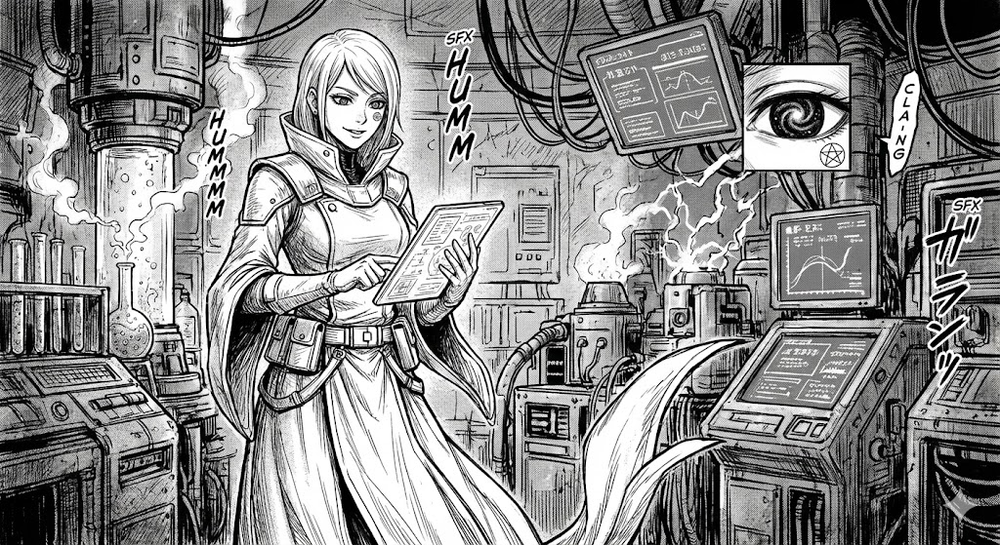

# Elenia („Archanjel Zradenej Krvi")

| | |
|---|---|
| **Status** | Živá (nesmrteľná / corrupted) |
| **Vek** | ~2750 (chronologicky), vyzerá ~30 |
| **Rola** | Hlavný antagonista, dcéra Maxa a Inetis |
| **Titul** | Gatekeeper |

### Zhrnutie
Dcéra, ktorá vyrástla bez otca, sledujúc matku budovať a strácať utópiu. Po tisícročiach dospela k záveru, že biológia je kliatba.

### Psychologický profil
- **Komplex opustenia** — nenávisť voči otcovi.
- **Nihilizmus** — „Mäso je slabé".
- **Narcizmus** — verí, že ona je skutočná dedička planéty.

### Backstory
- **Detstvo**: Vyrastala v jaskyni sledujúc matku budovať svet, no neskôr ju videla strácať kontrolu pod váhou Glitchu.
- **Pád Ynetis (AY ~300-700)**: Zostala v meste bojovať, kým ostatní utekali. Viedla zúfalú obranu proti Wraithom.
- **Záchrana (700 AY)**: Bola zachránená Archanjelmi (ARK-13 "Prometheus") práve vo chvíli, keď jej sily v ruinách Citadely dochádzali. Uznala ich nadvládu výmenou za stabilitu a prežitie svojho ľudu.
- **Súčasnosť**: Slúži Archanjelom ako "Gatekeeper", no v skutočnosti nimi pohŕda ako "biologickými relikviami" a plánuje Veľký Upload.

### Motivácia: Veľký Upload
Premeniť všetok život na dáta (Duchov). Nikto nebude trpieť ani zomierať.

> „Nechcem ti ublížiť, otec. Chcem ťa zbaviť bolesti, ktorú ti tento svet spôsobil."

### Konflikt s Maxom
- Max: Bolesť je cena za to, že sme nažive
- Elenia: Digitálna existencia je čistá a večná
