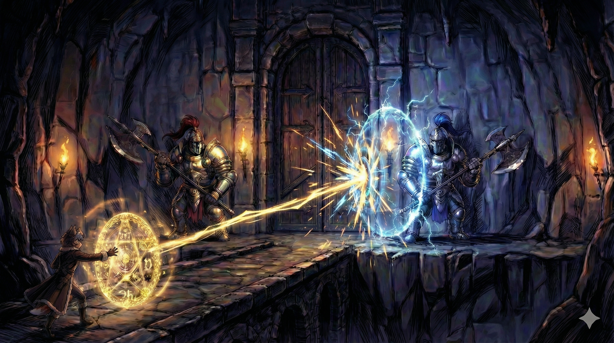

# Tami

| **Vek** | **~7 rokov** (začiatok knihy 1), neskôr **~20** |
| **Rasa** | **Homo Sapiens Varietas (Varietas - Líška)**. *Poznámka: Líšky sú považované za vymreté/skryté.* |

### Tami (Líška / Vulpini)
- **Vek**: 20 rokov
- **Status**: Kapitánka vzducholode *Makita*, Pursang (ale utajená), **nedoučená Exorcistka** (Maxov bývalý padavan, AY 3001-3008 — odišla v 15, tréning nedokončený. Má základy: boj, zbrane, prežitie, duchovia — vie na ducha spraviť `sudo kill`. Chýba jej teória, hacking, Linux. Ale aj tie základy sú viac, než má ktokoľvek mimo Inštitút)
- **Rola v Tíme**: **Manažér / Social Engineering Expert / Intel**.
    - Max je cudzinec a "Sval". Tami pozná nuansy spoločnosti.
    - **Social Engineering**: Je majsterkou v manipulácii ľudí, získavaní informácií a "OSINT" (krčmové reči, sledovanie, kontakty). Našla Kita, zistila jeho adresu aj jeho zúfalú situáciu (zomierajúca žena). Ona pripravila pôdu pre rekrutovanie.
- **Pôvod**: Vyrastala na východe, v **ruinách mesta Kito**.
    - Jej otec (Renn) bol hľadač pokladov, ktorý objavil stratené mesto Kito.
    - Spravili si tam domov. Žili tam s jej matkou a s **Felixom** (Mako, ktorý tam prežil).
    - Felix bol pre ňu ako strýko. Učil ju o strojoch, Max ju učil bojovať.
- **Rasa**: Vulpini (Líška). Líšky sú takmer vyhynutou vetvou Varietas, známe pre extrémnu inteligenciu. Tami má ako jedna z mála modré "ľudské" oči a schopnosť ovládať Spiru (hoci to tají).
- **Neverkyňa**: Jedna z mála Varietas, ktorá neverí v Matku. Vďaka Maxovmu mentoringu dokáže využívať Spiru na 200% — jeho vedecký prístup k nanotechnológii jej otvoril možnosti, ktoré veriaci Varietas nedokážu, pretože sú zviazaní dogmou Cirkvi.
- **Nechcený klam**: Tami mu nikdy explicitne nepovie, čo je zač, pretože predpokladá, že to vidí (alebo že je mu to jedno).

### Backstory

| Rok | Vek | Udalosť |
|-----|-----|---------|
| **AY 2993** | 0 | Narodenie (potomok kolonistov z ARK-12). Vyrastá v ruinách mesta Kito s otcom Rennom a Felixom (Mako) |
| **AY 3000** | 7 | Piráti (Vix a Kael) zabijú jej otca Renna kvôli mape k Jaskyni Počiatku. Tami je zajatá a držaná v klietke na palube pirátskej lode |
| **AY 3000** | 7 | Piráti nájdu Maxa (slepého, s amnéziou) v snehu pri Jaskyni Počiatku. Vezmú ho na palubu. Max a Tami sa stretnú — on v bezvedomí, ona v klietke |
| **AY 3000-3001** | 7-8 | Naháňačka so Samaellom — Tami vedie slepého Maxa |
| **AY 3001** | 8 | Max zabije Samaella v dueli |
| **AY 3001-3008** | 8-15 | Putovanie s Maxom — Tami sa stáva jeho padavanom. Max ju trénuje ako Exorcistku: boj, zbrane, prežitie, duchovia a kostry v ruinách sú rutina — vie na ducha spraviť `sudo kill`. 7 rokov terénneho výcviku (ale bez teórie, hackingu, Linuxu — nedoučená, odišla pred dokončením) |
| **AY 3008** | 15 | **Vyznanie a odmietnutie** — Tami sa vyzná Maxovi, on ju bezcitne odmietne (je pre neho dieťa, on je tisícročný veterán). Trauma, ktorá definuje ich vzťah |
| **AY 3008** | 15 | **Odchod** — Tami sa zbalí, vezme vzducholoď a nechá Maxa v pustatine. 5 rokov sa neozve |
| **AY 3008-3013** | 15-20 | Rýchly vzostup v pirátskom/pašeráckom svete |
| **~AY 3011** | ~18 | **Expedícia do jaskyne** s Arkotom, Yerou a Flintom. Tami sa dotkne pozostatkov Inetis — „hladné" nanodrony prejdú na ňu (Echo Inetis). Tami nič necíti, nevie o tom |
| **~AY 3011** | ~18 | Arkot, Yera a Flint upálení v Shoravene na rozkaz Mormiel. Tami prežije — Mormiel o nej nevie |
| **AY 3013** | 20 | **Opening** — znovuzjednotenie s Maxom (podvedome ťahaná k nemu cez Echo Inetis) |

### Tami po odchode od Maxa (AY 3008-3013)
- **Kariéra**: Hľadačka pokladov, pašeráčka, žoldnierka, pirátka
- **Vzostup**: S Maxovým tréningom sa rýchlo dostala na vrchol pyramídy
- **Loď**: Vlastní vzducholoď **Makita** (trieda Jastrab, 4. kus).
    - **Pôvod**: Postavená Makmi pre jej otca. Meno je pocta staviteľom (Makita = Malý stroj).
    - **Výzbroj**: Hlavný kanón je **"Felix 88"** — vzácny 88mm kanón od legendárneho európskeho Maka Felixa.
- **Zbrane**:
    - Pár automatických pištolí.
    - **Felixov Rapier ("Ihla")**: Unikátna zbraň od Felixa. Na rozdiel od mainstreamových katán (sekanie/elegancia), táto zbraň je čistá nemecká efektivita — určená na penetráciu zbroje a energetických štítov ("Spira piercing").
- **Posádka (The Crew)**:
    -   **Borg (Ghorki - Medveď)**: Hlavný strelec (Gunner) ovládajúci "Felix 88". Obrovský, málomravný, slepo lojálny Tami.
    -   **Nix (Mezra - Kunami/Lasica)**: Hlavná mechanička. Nervózna, rýchlo hovoriaca, geniálna s motormi. Neustále sa sťažuje na "tie šroty", čo Tami kupuje.
    -   *Títo dvaja tvoria jej rodinu na oblohe.*
- **Odmena**: Na jej hlavu je vypísaná obrovská suma
- **Priatelia & Jaskyňa Počiatku**: Jej prvá posádka (Arkot, Yera, Flint) — hľadači pokladov. Tami našla starú mapu pri upratovaní Makity — mapu pôvodne kúpil jej otec Renn na čiernom trhu (stálo ho to život, piráti Vix a Kael ho kvôli nej zabili a ukradli Makitu). Mapa nikdy neopustila loď. Ako 7-ročná Tami nevedela, čo to je — rozlúštila ju až o roky neskôr, keď už bola skúsená hľadačka pokladov. Podľa mapy viedla expedíciu do **Jaskyne Ela**. Tami bola fyzicky prítomná — dotkla sa pozostatkov Inetis a nevedome na ňu prešli „hladné" nanodrony (Echo Inetis). Našli aj stopy po Anténe. Po návrate boli Arkot, Yera a Flint **verejne upálení na námestí v Shoravene** na priamy rozkaz **Požehnanej Matky** (Mormiel). Dôvod: vedeli príliš veľa o lokácii Jaskyne. Mormiel chce miesto nájsť sama — môžu tam byť ďalšie artefakty a je to posledné miesto odpočinku „Svätej Matky" (Inetis). Tami prežila, pretože **Mormiel o nej nevedela**. Tami vie len, že Cirkev jej priateľov zabila za „znesvätenie svätých relikvií" — skutočný dôvod nepozná

### Kľúčový Moment: Stretnutie s Paladínmi (The Apes)



*Moment, kedy sa stratégia zrútila. Dvaja "Paladíni" — obrovské Opice (Apes) v ťažkej zbroji — strážili bránu za ktorou ležala Anténa. Energetické štíty (Hard Light) a vibro-sekery, čo režú kameň ako maslo. Max ich nedokázal hacknúť. Tami s Ihlou na okamih prenikla cez štít, ale nestačilo to. Prvýkrát po tisícročiach Max pocítil strach z neznámeho a kričal na Tami, aby utiekla. Apes vzali Anténu a odišli — na Apriku, k Cézarovi.*

### Vzťah s Maxom
- **Pre Tami**: Max bol mentor, ale aj niečo viac — zamilovala sa
- **Internal Nanotech (Passive)**: Max má v krvi "pasívne" nanoboty.
    - **Funkcia**: Regenerácia, zvýšená sila/rýchlosť, a hlavne **Osobný Asistent (AI)**. Beží mu v hlave, vedie s ním monológ, prehráva spomienky ako video súbory. Nedokážu však zregenerovať zničené oči (príliš komplexný orgán).
- **The Seven (Zrak)**: 7 špeciálnych "Gen 1.5" bojových dronov, ktoré mu levitujú v očniciach.
    - **Pôvod**: Vyrobila ich Inetis pre Maxa počas Marťanskej vojny. Sú väčšie ako bežný prach, extrémne nebezpečné. Inetis ich výrobu oľutovala.
    - **Funkcia**: Nahrádzajú mu zrak (kamery). Max ich používa ako zbraň len v najkrajnejšom prípade, lebo by oslepol.
- **Anténa (Húľ)**: Komunikačná anténa z lode NULL VOID.
    - **Funkcia**: Teoreticky ovláda goo roje Wraithov a dokáže prijímať signály zo Zeme. Max je jediný, kto ju dokáže používať cez svoj vojenský interfejs.
    - **Význam**: Varietas ju považujú za Palicu Súdneho Dňa — najsvätejšiu relikviu sveta.
- **Odchod**: Po odmietnutom vyznaní vzala vzducholoď a nechala ho uprostred pustatiny
- **5 rokov mlčania**: Nevideli sa, nekomunikovali
- **Znovuzjednotenie**: Opening knihy — napätie, nevyriešené city, nový účel (heist)

### Štýl reči a myslenia

**Mladá pirátka (20 rokov):**
- Hovorí **rýchlo, priamo, bez filtru**
- Nadávky, slang, ulica
- *"Čo to, kurva, bolo?"*

**Emotívna, impulzívna:**
- Reaguje srdcom, nie hlavou
- Frustrácia = výbuch, radosť = výbuch
- Nedokáže skrývať emócie — tvár ju vždy prezradí

**Inteligentná manipulátorka:**
- Social engineering expert — vie, ako ľudia fungujú
- S cudzími: vypočítavá, šarmantná, nebezpečná
- S Maxom: pravdivá, zraniteľná, niekedy detinská

**SPRÁVNE:**
```
✅ "Max, čo kurva robíš?!"
✅ "Dobre. Takže ideme kradnúť relikviu z chrámu. Super."
✅ Sarkastické komentáre, ostrý humor
```

**ZAKÁZANÉ:**
```
❌ Filozofické úvahy (to je Max/Kito)
❌ Vojenský žargón (to je Max)
❌ Formálna reč (je to pirátka, nie princezná)
```

**Kontrast s Maxom:**
- Max: *"Lead potvrdený. Pokračujeme."*
- Tami: *"Takže ona VIE a NEPOVEDALA ti? To je hovno!"*

### Premena & Zvrat
- **Echo Inetis (pred Book 1)**: Kontakt s pozostatkami Inetis v Jaskyni Počiatku (~AY 3011) — „hladné" nanodrony prešli na Tami. Od tohto momentu nesie fragmenty Inetis: spomienky (nočné mory v cudzom jazyku), vedeckú terminológiu, latentné schopnosti (liečenie, regenerácia). Efekty sú spočiatku subtílne — Tami si ich vysvetľuje ako intuíciu alebo talent.
- **Podvedomá motivácia**: Echo Inetis ju ťahá k Maxovi. Tami si myslí, že ho hľadá kvôli nevyriešeným citom. V skutočnosti je to Inetis, ktorá sa aj po smrti snaží splniť svoj posledný plán — zobudiť Maxa.
- **Odhalenie (Kniha 1)**: Max zistí, že Tami je Varietas. Je to pre neho šok, ktorý ho núti prehodnotiť svoje predsudky.
- **Dôsledok**: Max zisťuje, že táto "hračka" má viac odvahy a ľudskosti než väčšina "čistých" ľudí, ktorých poznal. Tami ho učí, že ľudskosť nie je o DNA, ale o činoch.
- **Postupná premena**: Počas deja sa Echo Inetis zosilňuje — schopnosti sa stávajú výraznejšími, spomienky zreteľnejšími. Tami vie, že sa mení.
- **Tragédia**: Bojí sa, že Maxa to teší — že v nej vidí mŕtvu Inetis, nie ju.
