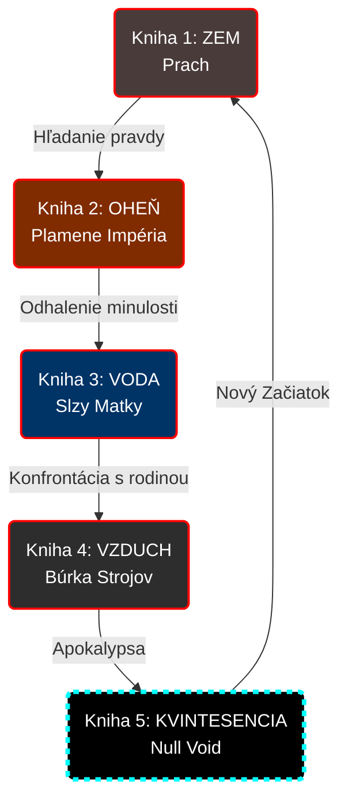

# The Pentagram Arc (Mermaid)

## Pentagram: Prečo to funguje (UI Metafora)

Inetis bola génius. Vedela, že nemôže vysvetľovať kvantovú fyziku a nanoinžinierstvo bežným ľuďom (alebo nesôr Chimérám). **Pentagram nie je magický symbol. Je to zjednodušené „užívateľské rozhranie“ (UI) pre ovládanie reality.**

Predstav si to ako operačný systém:
- **Pod povrchom**: Milióny riadkov kódu (nanoboty).
- **Na povrchu**: Ikony elementov, na ktoré „mág“ kliká svojou vôľou.

Inetis vytvorila tento systém, aby mohla učiť Elaniu bez toho, aby musela chápať matematiku za tým.

### Kultúrny a príbehový dopad
- **Elaniine kresby v jaskyni**: To, čo Kael pôvodne videl ako detské čmáranice a „šialené rovnice galaxií“, boli v skutočnosti Elaniine lekcie o manipulácii priestoru a času.
- **Chiméry**: Veria, že pentagram je posvätný symbol Hviezdnej Matky. Nerozumejú vede, nosia ho ako amulet.
- **Max (Skeptik)**: Cíti odpor k degradácii vedy na okultizmus. Inetisinu UI pomôcku vníma ako známku jej šialenstva v izolácii.
- **Archanjeli**: Pohŕdajú pentagramom ako „detskou hračkou“, pretože používajú abstraktnejšie a čistejšie rozhrania Citadely.

---

## Pentalógia: tok kníh (Pentagram)

## Systém: THE VOID (core) a archanjeli

