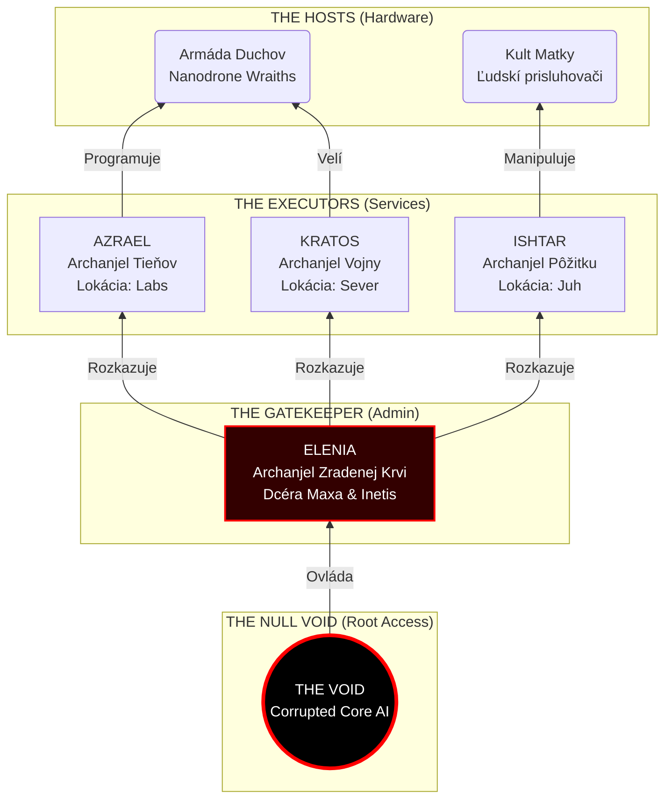

# The Pentagram Arc (Mermaid)

## Pentalógia: tok kníh (Pentagram)

```mermaid
graph TD
    %% Definicia uzlov
    B1(Kniha 1: ZEM<br>Prach Achilla)
    B2(Kniha 2: OHEŇ<br>Plamene Impéria)
    B3(Kniha 3: VODA<br>Slzy Matky)
    B4(Kniha 4: VZDUCH<br>Búrka Strojov)
    B5(Kniha 5: KVINTESENCIA<br>Null Void)

    %% Vztahy a tok pribehu
    B1 -->|Hľadanie pravdy| B2
    B2 -->|Odhalenie minulosti| B3
    B3 -->|Konfrontácia s rodinou| B4
    B4 -->|Apokalypsa| B5
    B5 -->|Nový Začiatok| B1

    %% Styling (Cyberpunk farby)
    style B1 fill:#4a3b3b,stroke:#f00,stroke-width:2px,color:#fff
    style B2 fill:#802b00,stroke:#f00,stroke-width:2px,color:#fff
    style B3 fill:#003366,stroke:#f00,stroke-width:2px,color:#fff
    style B4 fill:#2d2d2d,stroke:#f00,stroke-width:2px,color:#fff
    style B5 fill:#000000,stroke:#0ff,stroke-width:4px,color:#fff,stroke-dasharray: 5 5
```

## Systém: THE VOID (core) a archanjeli

```mermaid
graph BT
    %% Definicie
    subgraph "THE NULL VOID (Root Access)"
        AI((THE VOID<br>Corrupted Core AI))
    end

    subgraph "THE GATEKEEPER (Admin)"
        ELENIA[ELENIA<br>Archanjel Zradenej Krvi<br>Dcéra Maxa & Inetis]
    end

    subgraph "THE EXECUTORS (Services)"
        AZ[AZRAEL<br>Archanjel Tieňov<br>Lokácia: Labs]
        KR[KRATOS<br>Archanjel Vojny<br>Lokácia: Sever]
        IS[ISHTAR<br>Archanjel Pôžitku<br>Lokácia: Juh]
    end

    subgraph "THE HOSTS (Hardware)"
        GHOSTS(Armáda Duchov<br>Nanodrone Wraiths)
        CULT(Kult Matky<br>Ľudskí prisluhovači)
    end

    %% Prepojenia
    AI -->|Ovláda| ELENIA
    ELENIA -->|Rozkazuje| AZ
    ELENIA -->|Rozkazuje| KR
    ELENIA -->|Rozkazuje| IS
    
    AZ -->|Programuje| GHOSTS
    KR -->|Velí| GHOSTS
    IS -->|Manipuluje| CULT

    %% Styling
    style AI fill:#000,stroke:#f00,stroke-width:4px,color:#fff
    style ELENIA fill:#330000,stroke:#f00,stroke-width:2px,color:#fff
```
